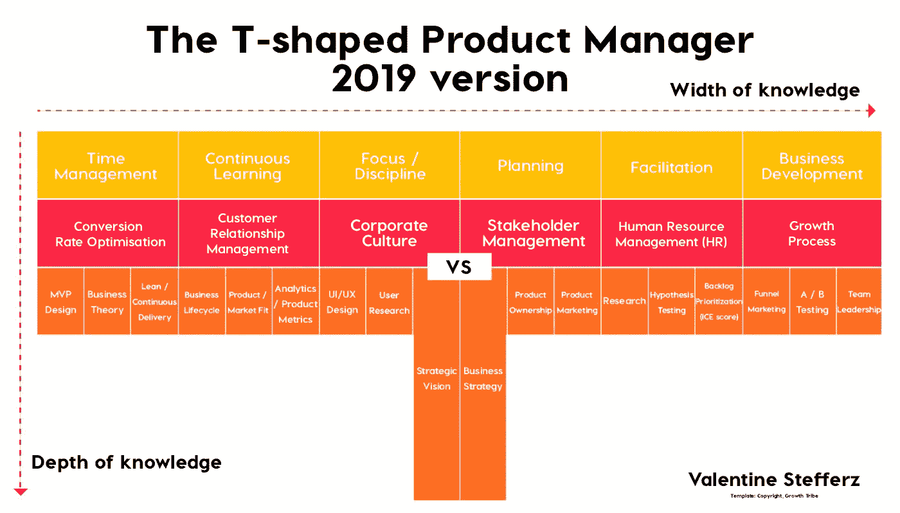

# T 型产品经理 2019(第一部分——核心竞争力)

> 原文：<https://medium.com/hackernoon/the-t-shaped-product-manager-2019-part-1-core-competencies-c1c65456c4d9>

That’s a lot of knowledge to have.

# 牢记不断发展的专业趋势，这个版本的 T 型产品管理技能集是利用主要贡献者的最新 PM 片段的新见解汇编而成的。

在[上一篇概述中，阅读更多关于这些贡献者和他们在 2019 年 1 月分享的事情的信息。](/@valentine_27308/the-state-of-product-management-blogs-january-2019-feae486426fd)

**T 型专业人员**是一个框架，用于可视化一组知识领域，在解决特定专业领域的问题时使用最有用的工具。

在视觉上，T 的垂直部分是一个狭窄的技能和知识集合，对解决产品管理问题非常重要。横向部分是一个广泛的领域，项目管理专家必须能够对其做出贡献并从中获取见解。

你可以在这里了解更多关于 T 型专家[的理论。](http://tsummit.org/t)

现在来看这张图表的特殊部分。

我将简短地描述每一个被认为重要的活动，解释它们为什么被放在这里，并添加更多关于它们的内容和见解的链接，供你自己阅读。

# 核心

核心能力(字面上)是产品经理的面包和黄油，是将项目经理与其他专业人士区分开来的工具。

## 战略愿景

公司的产品经理类似于一个小型的 CEO/创始人，因为他**制定高层决策并塑造产品战略**。战略的一个主要方面是定义**愿景**和**使命**。这是问你自己“我想用这个产品实现什么？”。

20 年后，你的产品会是什么样子？对亨利·福特来说，是“每个人都应该买得起车”。对于 Spotify，他们的愿景是“Spotify 成为音乐的操作系统”。

**你的产品需要一个生存的理由**。没有愿景和使命，项目经理做的任何事情、任何细微的调整、任何成长都是无用的，因为没有目标。对于初级项目经理来说，对于一个产品或产品特性来说，这是一个较小的目标。对于一个产品负责人来说，这可能是整个公司的目标。

要了解更多关于战略理论的知识，我推荐阅读名为《探索战略》的书(这是战略教授的全面科学评估)和战略案例，比如来自 Stratechery 的这本关于 Spotify 的新书。

## 商业策略

商业策略是你决定在市场上把目标推向哪里所需要的。虽然战略愿景是评估产品为什么存在的必要条件，但商业战略告诉我们是什么确保了它的持续存在，**产品如何保持活力(和/或保持增长)**。

拥有清晰的愿景固然很好，但是如果一个产品经理不知道如何**将愿景变为现实**，那么她就没有多大价值。这就是业务部分的切入点。

一个好的产品应该是自我可持续的，这意味着它应该产生足够的利润来推动它实现自己的愿景，而不需要外部资金的投入。为了实现这一目标，产品经理应该能够设定短期和长期的目标，并定义利用可用资源实现这些目标的方法。

知道如何**创造价值并利用它赚钱**并定期这样做朝着产品的愿景前进意味着作为项目经理定义业务战略。

你可以在这些产品博客中找到一些重要的商业思想。另外，这里有 24 个好的商业来源的列表。

# 主要技能组合

产品专家每天在实践中挖掘的方法和知识领域。

# 用户研究(客户开发)

**创造产品就是创造价值**，也就是——制造解决某人问题的产品。**对他人问题的假设**经前综合症提出的**需要检验**就像科学理论需要经验证据一样。测试这些假设需要客户开发或用户研究——与人合作的框架这基本上是应用于商业的社会学(+人类学)方法:**访谈、调查、问卷**等。

它的边缘——[社会学科学期刊](https://journals.sagepub.com/toc/smr/current)(或者[关于 CustDev 的文章](https://www.sciencedirect.com/science/article/pii/B9780128023082000023))。

# 产品所有权

这一点是关于能够让**使用管理产品工作的方法** (SCRUM 和其他)和技术。这是一个日复一日为你的团队决定“当前最重要的事情是什么”的过程。这也是一种为你的产品宣传的心态，代表它。

寻找关于产品负责人工作的特定子集的书籍，比如奥莱利的这本或者 T2 的这本关于价值主张设计的书。

# 用户界面/ UX 设计

设计能够与产品无缝交互的体验和界面是一门艺术，一个项目经理**应该和一个 UX 设计师一样好，至少在这门艺术的理论部分**去设想伟大的产品。产品经理应该**与设计师合作，确保产品目标得以实现**。

**UX 是用户与产品互动不可或缺的一部分**，不具备 UX 能力的产品专家将无法评估和设计用户旅程的这一(非常重要)部分。

这里有[一本书](https://www.amazon.com/Dont-Make-Think-Revisited-Usability/dp/0321965515/ref=sr_1_1?ie=UTF8&qid=1419266559&sr=8-1&keywords=don%27t+make+me+think?utm_source=CMblog&utm_medium=post&utm_campaign=blog_)，[另一本书](https://www.amazon.com/Usable-Usability-Simple-Making-Better/dp/1118185471/ref=sr_1_1?s=books&ie=UTF8&qid=1419267354&sr=1-1&keywords=usable+usability?utm_source=CMblog&utm_medium=post&utm_campaign=blog_)，[还有一本](https://www.amazon.com/Lean-UX-Designing-Great-Products/dp/1491953608)，[还有这本是给精益 UX 的](https://www.amazon.com/dp/1787123502/ref=sspa_dk_crr_aax_0?psc=1)。

# 产品营销

产品营销是产品工作中的市场光学。瞄准特定的市场，使用适合这些市场的方法，总体而言— **让你的产品有市场头脑。**产品营销的工具包括许多常规的**营销方法**(漏斗、定位/信息传递)，但也采用以用户为中心的方法，竞争对手策略和**是针对产品进行的。**

下面就[好好讲解一下](/we-are-product-marketing/what-is-product-marketing-anyone-406ccf136dea)的产品营销，以及[来自对讲机的 9 大核心功能](https://www.google.ru/url?sa=t&rct=j&q=&esrc=s&source=web&cd=5&cad=rja&uact=8&ved=2ahUKEwi9lZKjqrTgAhUJ4KYKHZKlAagQFjAEegQIBRAB&url=https%3A%2F%2Fwww.intercom.com%2Fblog%2Fhow-product-marketing-helps-build-product%2F&usg=AOvVaw1dyp-QObp-q4JN3dGuNosK)。

# 分析/产品指标

定量分析不是解决每个产品问题的神奇装置，但它可能非常有用(尤其是在谈论利润的时候)。**修补度量标准和使用量化的重要特性**为您的产品带来效率。它是关于抽象和理论化的，它是产生洞察力的**重要工具**。产品经理的主要“卖点”之一是她采用特定指标并提升它的**能力**。

一篇关于 SaaS 指标的[研究文章](https://www.researchgate.net/publication/327039419_PRESEnCE_Monitoring_and_Modelling_the_Performance_Metrics_of_Mobile_Cloud_SaaS_Web_Services?_sg=JQjvRPvc3pOLNuoG6e3pD_IZPjN4Zr1gRtLlMSQhFsyzOIAiBip5Isw8ck4vdwWqAFGx-241YT1o8qQ)，一篇关于 Salesforce 评估指标的[案例研究](https://www.researchgate.net/publication/328539236_CORPORATE_VALUATION_OF_SAAS_COMPANIES_A_CASE_STUDY_OF_SALESFORCECOM?_sg=rKx3u6rcdp9cskGA2TODpAEvVZVWSSHbAYOudxT8VwQR6zWYdYLopyVDisCozXBRSBfO-gsEdXzjuK0)

# 研究

每个专家都应该能够进行研究，但是在产品管理中，研究方法是在另一个层面上使用的。研究用户，研究市场，研究可能的产品解决方案。大多数时候，项目经理必须进行调查和研究，因为没有关于环境的完整信息，就不可能创造价值。

这些材料可能有助于掌握研究:[关于研究方法的维基百科](https://en.wikibooks.org/wiki/Research_Methods)，[方法论网站](https://research-methodology.net/research-methods/)，[关于研究案例的论文](https://www.google.ru/url?sa=t&rct=j&q=&esrc=s&source=web&cd=10&cad=rja&uact=8&ved=2ahUKEwig5YOlrLbgAhVLI5oKHWN8B_oQFjAJegQIABAB&url=http%3A%2F%2Fwww.qualitative-research.net%2Findex.php%2Ffqs%2Farticle%2Fview%2F2655%2F4079&usg=AOvVaw3QcmI9pB0XKfwfF96dbQzp)。

# 产品与市场的匹配

**寻找具有足够消费者需求的大市场并追踪该市场上未满足需求的过程**。可以说是项目经理需要精通的最有价值的知识领域，因为它决定了产品的成长。记住，公司总是需要调整和重新思考他们的产品与市场的契合度，产品专家经常这样做。

来自斯坦福大学讲师安迪·拉赫勒夫的一些基础知识，以及来自马克·安德森的[原创文章。](http://web.stanford.edu/class/ee204/ProductMarketFit.html)

# 假设检验

那是一个产品经理的科学方法。人们可以做出数百种看似现实的假设，但用实践来检验它们，才能证明它们是否能给任何人带来好处。在测试一个假设之后，项目经理继续测试其他假设，并在迭代过程中继续这样做。

[产品计划](https://www.productplan.com/product-manager-scientific-method/)案例分析，Udemy 统计假设检验[简单教程。](https://www.google.ru/url?sa=t&rct=j&q=&esrc=s&source=web&cd=1&ved=2ahUKEwikie2svLbgAhUE0aYKHfajB7cQFjAAegQIABAB&url=https%3A%2F%2Fwww.udemy.com%2Fsimplestats%2F&usg=AOvVaw3Nuffc109ANeNf0yjRgyxk)

# 业务生命周期

要知道一个项目经理是否有意浪费资源和潜力，就必须知道如何有效地引导一个产品通过其生命周期的每一个阶段。在商学院里，这是一个完整的实践领域，但在产品管理方面，它有其特定的方面。

有一个专门关于产品生命周期管理的网站，约翰·斯塔克 2018 年出版的书

# 积压优先级(ICE/RICE 评分)

评估任务的优先级建立在所有其他产品的能力之上，但是它的技术部分本身也是一个重要的领域。区分任务的优先次序——决定什么需要先做，什么需要后做——是产品经理在团队中要做的事情。ICE/RICE 评分是划分优先级的框架之一，有一些有用的方法可以量化这个过程。

[Paul Mcavinchey 的精彩总结](http://productcollective.com/prioritizing-find-the-right-model-or-cook-up-your-own/)，Scrum 也[推荐“排序”，而不是“优先化”](https://www.scrum.org/resources/ordered-not-prioritized)。

# 精益/连续交付

现代管理的主要方法论不是一个产品**经理**能避免的。两个原则——去掉没有附加值的东西，尝试在短周期内交付和改进。关键的一点是不要生产任何东西，除非你已经确认它是必需的。对精益方法有一个好的了解是一个产品专家有效管理的必要条件。

这里有一个关于[如何在你的团队中适应精益的播客](https://www.mindtheproduct.com/2018/07/product-warrior-podcast-tristan-kromer-on-how-to-help-the-team-embrace-lean/)，还有一本由曼加拉姆·南达库玛(Mangalam Nandakumar)撰写的关于产品管理中的精益的 [2018 书。](https://www.oreilly.com/library/view/lean-product-management/9781788831178/)

# 漏斗营销

漏斗通常被认为是一种营销工具，但项目经理几乎和营销人员一样经常使用它们。调整特定的步骤，并在指标偏离的漏斗上找到错误，有助于逐步改进产品，为用户创造更多价值。当在漏斗上使用高级数据分析时，一些产品专家获得了特别新颖的见解。进行销售人员培训也提供了重要的反馈。

使用 Google Analytics 的逐步技术指南可能对实践有用。还有一门来自 Udemy 的课程

# 商业理论

产品经理是公司的内部企业家。而且，像任何企业家一样，她开始了解商业的管理、经济、金融和法律方面。这听起来可能微不足道，但是没有这些领域的可靠基础(对业务和市场的隐性或显性知识)会让产品专家毫无头绪。

查看这个[结构精细的网站，其中包含案例研究和基础知识](https://businesscasestudies.co.uk)。EdX 上还有不列颠哥伦比亚大学的[商科课程(单独开就行了)](https://www.edx.org/micromasters/ubcx-business-fundamentals)[也有很多案例。](https://guides.library.ubc.ca/businesscases/free)关于经济学，我推荐保罗·克鲁格曼的学生用书。

# A/B 测试

A/B 测试经常被产品经理作为一种产品方法使用，当使用漏斗时。产品中的 A/B 测试允许测试产品假设并比较不同产品特性的影响。当使用漏斗时，同样的方法允许(像在市场营销中)测试漏斗的不同部分。这两种使用场景都有助于使产品更加完美。

这个指南非常简明并且是为经前综合症量身定做的，另外还有一本由 Siroker，Koomen 和 Harshman 写的书[。](https://onlinelibrary.wiley.com/doi/book/10.1002/9781119176459)

# MVP 设计

设计 MVP，地图，MUP 和其他最小产品是职业的另一个基本要素。项目经理不一定要开发产品来测试它，她可以从测试漏斗开始，然后，如果漏斗证明足够成功，就开始开发。制作 MVP 的关键是去掉所有与被测试的假设无关的特征。

有一门关于设计 MVP 的课程，还有一些福布斯的案例研究。

# 团队领导

产品管理大量涉及理论化和使用抽象思维，但最终项目经理必须与人合作并管理人。这需要重要的领导技能。很难(几乎不可能)通过阅读一本书来学习领导力，一个优秀的项目经理通常有很多在团队中解决问题的实践。领导力不仅关乎管理者的个人品质，还关乎她如何构建团队合作流程以及如何融入文化。

看看这篇关于当前领导理论的综述和一些关于组织文化的书籍。

## 这是第 1 部分，介绍了产品专家的核心能力和基本技能。在下一篇文章中，我们将介绍具有跨界能力的第二层和第三层知识领域，以及成功的产品经理采用的其他重要规则和系统。

## 现在，你觉得呢？我是不是忘了提一些关键技能？或者也许图表有不重要的技能？就在这个帖子下面评论吧。