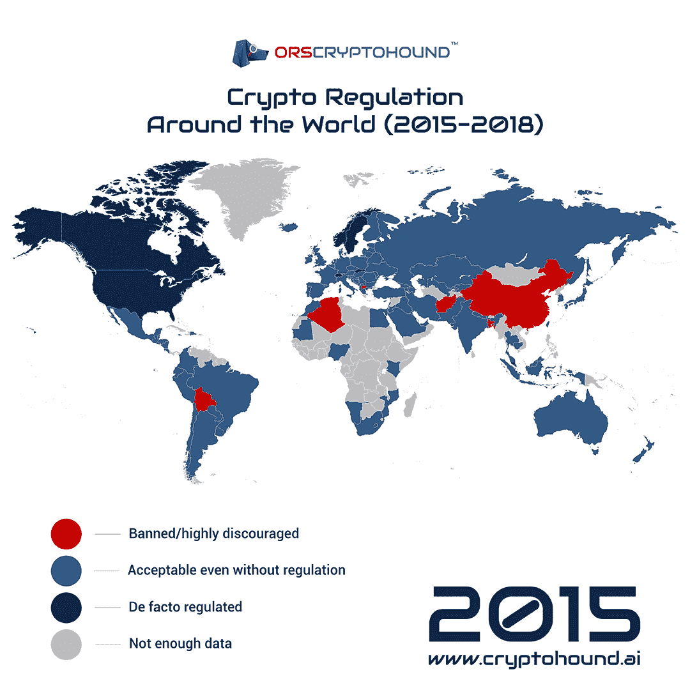

# 驯悍记:各国如何改变对加密的立场

> 原文：<https://medium.com/hackernoon/the-taming-of-the-shrew-how-countries-change-the-stance-on-crypto-e95e40d00c24>

加密货币的突然出现和迅速(有时是漫无目的)的发展给世界各国政府带来了严峻的挑战。无法控制资金流动、避税和为非法活动提供便利促使当局将加密货币作为重中之重。

各国政府采取的行动大相径庭。虽然一些州试图监管这一新现实的方方面面(想想瑞士的楚格市或新加坡有多先进)，但其他州只是实施严格的禁令。

> 令人惊讶的是，很多人选择了袖手旁观。事实上，他们是大多数。

由于加密货币的前所未有的性质，一些国家已经完全转向，因为他们发现他们的策略并不像最初希望的那样有效。下面你会发现一些奇怪的国家试图解决加密货币繁荣的案例。

# 案例 1:印度的伪禁令

2017 年 11 月，印度储备银行执行董事表示，不允许数字货币“在全国范围内合法使用”。后来，印度财政部长在他的预算演讲中承诺打击“涉及加密的非法活动”。

该国可能的反加密立场引起了媒体的广泛关注，BTC 的价格下跌了 800 美元。一份支持“撤销加密禁令”的 change.org 请愿书获得了广泛支持。

然而，这只是媒体的猜测，并不反映政府的真实立场和计划。实施的禁令针对的是印度央行控制的金融机构，而不是单一交易员或所有者。他们还提到了对 T2 非法秘密活动的打击，这被断章取义了。

事实上，印度官员已经表示有兴趣利用区块链的技术，引入新的法律并发行自己的货币。

# 案例 2:俄罗斯的融冰

起初，俄罗斯的加密货币被认为是负面的，并与犯罪活动相关联。解决这个问题的第一次尝试发生在 2014 年，当时财政部建议对加密操作进行罚款，并对发行和流通虚拟货币进行长达 2 年的社区服务。

然而，随着加密货币所有者的数量激增，除了软化立场，别无选择。炒作太大，不容忽视:在某个时候，“比特币”成为第二大搜索词汇。

从那时起，加密货币被正式承认为“其他财产”，并被接受进行交易，前提是遵守某些规则(例如，私人公民的初始投资不超过 750 美元)。此外，采矿被列为应纳税的企业活动，智能合同获得了与法律协议相同的地位。

# 案例#3:阿联酋的加密绿洲

2017 年初标志着阿联酋中央银行禁止加密货币交易。官方声明“禁止所有虚拟货币(及其交易)”被广泛解读为政府反对加密的强硬立场。

> 加上官员们的进一步警告，一切都表明了一种非常恶劣的秘密气氛，这种模式在中东并不罕见。

然而，所有这些迹象原来是一场沙尘暴，隐藏着一个秘密信徒的绿洲。在媒体炒作的同时，ico 和虚拟货币(分别作为证券和商品)得到了法律认可，国家区块链战略获得通过，一些大宗交易得以达成，包括区块链商业注册局和 IBM 之间的交易。

# 案例 4:委内瑞拉更名后的货币

面对金融动荡和国家货币的严重贬值，委内瑞拉在加密领域成为最受欢迎的采矿目的地。公用事业账单的成本“相当于一杯咖啡”，开采一个 BTC 的成本仅为 530 美元，加密货币很快就获得了比国家货币更高的可信度。

> 为了拯救玻利瓦尔，委内瑞拉政府禁止进口采矿设备，并发起了全国性的封存运动。

尽管有对外敌对的迹象，委内瑞拉政府实际上已经成为最先进的加密友好国家之一。它不仅推出了一个名为 Petro 的 ICO，与石油价格挂钩，而且还以极大的热情推动它在几乎所有地方的使用，包括工资支付、养老金、商品、服务、护照费……Petro 甚至在石油输出国组织被讨论作为一个新的石油交易单位。

# 案例 5:津巴布韦的大胆交易

2018 年 5 月，津巴布韦储备银行对从事加密货币交易和兑换的津巴布韦金融机构实施禁令。它还关闭了所有相关的银行账户。据信，这是为了应对全球对反洗钱/恐怖分子融资的日益担忧，以及当地加密货币交易所 Golix 建立第一台加密 ATM。

事实上的 禁令并非不战而降。Golix 起诉津巴布韦储备银行，声称只有议会有权实施金融禁令，并赢得了官司。

# 为什么立场变了？

这种现象的本质可以解释支持加密和反对加密立场的转变。

一方面，加密货币有巨大的潜力彻底改变全球金融市场，使其成为一个机会均等的地方。有了加密货币，任何人都可以打开钱包，挖掘一些初始令牌，成为投资者，在国际上转移资金，包括当前金融机构无法到达的地方。

> 另一方面，政府害怕失去控制。

加密货币不仅影响它们监督资金流动和在需要时进行干预的能力，也影响它们确保国家安全的能力。迄今为止，区块链交易的匿名性、快速性和无边界性使得人们几乎不可能追踪或收集非法活动的证据。

# 政府如何对加密货币变得更加开放？

由于安全和反洗钱是首要问题，政府至少可以做三件事，这将使他们软化对加密货币的立场。在这方面，新技术，尤其是自动化区块链分析可以发挥至关重要的作用。

首先，能够**跟踪资金**是很重要的。鉴于加密交易的绝对速度和规模，这应该通过应用智能人工智能算法来完成，这些算法能够分析历史数据，并提供关键的发现，例如特定货币的来源和与之相关的支出。这些信息可以在像 [ORS 密码猎犬](https://www.c-hound.ai/)这样的工具的帮助下进行检查。

第二步是**了解**不同钱包之间的**关系**，帮助定义交易是否来自随机来源，或者是否有规律的模式将特定地址与其他地址联系起来。在人工智能的帮助下，人们可以设置某些规则来跟踪钱包间的关系，并在事情似乎可疑时发出信号。

最后，为了让前面的信息有意义，重要的是**取消组织地址的匿名化**。这些可能包括官方密码交易所、公共场所(餐馆、电影院、杂货店)、自由市场、市政机构等等。

# 结束语

跟踪全球虚拟货币监管方法的演变相当困难。

> 作为一股如此强大的力量，加密要么被当局抵制，要么被政府容忍并保持警惕，要么被接受。

我们已经报道了几个有趣的案例，它们证明了强硬的官方立场可能只是一种防御性策略。孤注一掷，这很可能会软化加密货币的潮汐效应，或者通过应用先进技术来确保提高安全性。