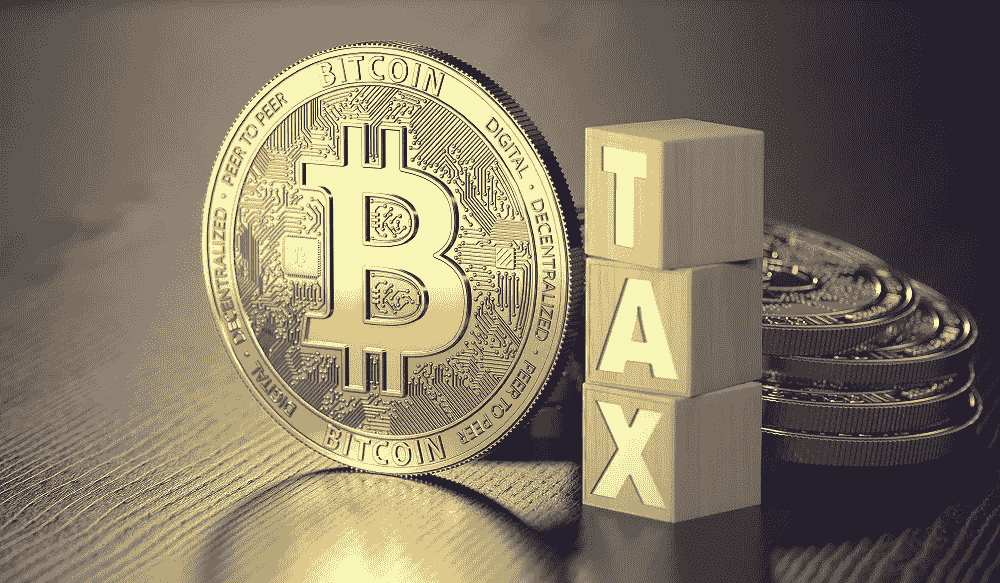
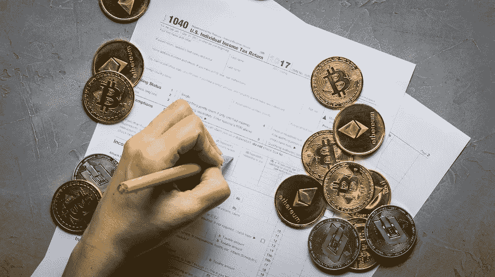

# 收税员来到了加密世界

> 原文：<https://medium.com/hackernoon/the-taxman-cometh-for-the-crypto-world-885bdb2ea3cd>

Photo: Natee Meepian / Adobe Stock

对于任何参与加密货币世界的人来说，这是有趣的几年。许多早期投资者看到他们选择的货币价值暴涨，然后很快暴跌。在整个过山车过程中，监管机构和政府机构都在努力弄清楚加密市场实际上是什么，如何监管，以及可能适用哪些现有的法律结构。

所有审查中出现的一个最大的灰色区域集中在如何以税收为目的对待加密资产，特别是在美国，因为那里有如此多的市场收益。到目前为止，美国还没有建立具体的法律框架来处理加密货币，但国税局已经发布了一项裁决，将它们指定为财产，而不是货币。这意味着它们像股票、债券和类似的金融工具一样要缴纳资本利得税。

在实践中，对于任何将加密货币用作货币而非投资工具的人来说，这已经变成了[的噩梦。这是因为美国国税局没有为加密交易设置小额门槛，这意味着每当任何人使用加密货币进行购买时都需要缴税——无论金额有多小。这一疏忽意味着，如果你频繁使用加密货币，很难(有些人会说不公平地)跟踪你的纳税义务。如果最近的报道是准确的，那么真正的结果是，许多加密货币的持有者沮丧地举起了手，](https://www.forbes.com/sites/greatspeculations/2018/06/04/spending-crypto-for-personal-use-can-be-a-tax-mistake/#1c64525367e2)[懒得向美国国税局报告任何关于他们持有加密货币的事情。](https://www.cnbc.com/2019/01/30/many-bitcoin-investors-dont-plan-on-reporting-their-losses-to-the-irs.html)

# 一场大赌博

Photo: mehaniq41 / Adobe Stock

可以预见的是，美国国税局似乎并没有屈服于纳税人的冷漠。相反，他们加入了许多其他政府税务机关的行列，开始努力抓住秘密藐视法律者，并要求分享市场产生的收入。对于今年 4 月美国无数没有向国税局报告其密码持有数据的个人来说，这可能意味着严重的麻烦。首先，美国国税局对低报加密货币资本利得的新关注可能会成为触发审计的危险信号，正如任何经历过审计的人可以告诉你的那样，这些对纳税人来说很少是好结果。

事实上，根据专门解决纳税人与国税局争议的税务辩护合伙人的说法，审计可能会给纳税人带来各种负面后果，包括资产扣押、税收留置权和工资扣发。他们指出留置权可能特别麻烦，称“留置权与你当前和未来的资产相关，如不动产。留置权也会影响你的信用度。在纳税人申请破产后，留置权通常会继续存在。这意味着国税局有权追踪债务人的加密资产，而且很难阻止他们。唯一真正的解决办法是首先通过正确的方式报告这些资产的资本收益来避免这个问题——现在纳税人有技术手段来做到这一点。

# 秘密税收业务的兴起

Photo: Wit / Adobe Stock

围绕加密货币销售的税务责任缺乏明确性，这一点没有被试图将一个重大难题转化为商机的企业家所忽视。事实上，创造工具让加密货币持有者和投资者跟踪他们的交易并完成复杂的资本收益计算(基于资产在出售时的美元价值)的需求如此明显，以至于催生了旨在垄断加密税市场的家庭手工业。

当领先的加密交易平台比特币基地宣布与 TurboTax 合作，允许客户[将他们的加密交易](https://blog.turbotax.intuit.com/turbotax-news/turbotax-makes-it-easier-for-coinbase-customers-to-report-their-cryptocurrency-transactions-42740/)导出到流行的税务准备软件中，以简化报告时，这是该行业认识到它面临税务清算的第一个迹象。第二个迹象是[比特币税](https://bitcoin.tax/)的复兴，这是最早进入加密税业务的公司之一。然后，似乎是标志着“无所不为”的税收环境的结束，全球会计巨头安永今年 3 月宣布，他们推出了一种新的加密税收工具[，称为 CAAT](https://www.prnewswire.com/news-releases/new-ey-caat-technology-facilitates-cryptocurrency-reporting-and-compliance-300806080.html) ，旨在使机构和其他大型投资者更容易进行加密报告。这里的底线是，越来越明显的是，那些逃避报告今年加密货币收益(或损失)义务的人正在如履薄冰。

# 是时候做正确的事了

Photo: Aboltin / Adobe Stock

如果你已经做到了这一步，并且你是许多没有自愿遵守国税局对加密货币的报告要求的人之一，你可能会想:“我已经这样做了很多年了…他们永远不会注意到。”如果是这样，你的运气可能就要用完了。如果你没有听说，前面提到的[比特币基地在 2018 年 3 月向美国国税局移交交易记录的旷日持久的斗争中失败了。从那时起，他们和其他每一个有信誉的交易所都配合国税局的信息要求。这意味着，庞大的税务机构处理他们已经获得的积压数据，并出现在纳税人的门前寻找他们应得的东西，只是时间问题。](https://www.journalofaccountancy.com/issues/2018/mar/irs-summons-of-coinbase-records.html)

简而言之，这意味着时间已经紧迫，每个有潜在加密货币税收问题风险的人都应该开始努力在国税局为他们解决这些问题之前自己解决这些问题。这意味着追溯历史记录，并根据需要提交多年的修订纳税申报表。这不是一件容易的事情，但等待不会带来任何好处——事实上，国税局将继续对任何欠税收取利息，直到余额付清。这意味着密码爱好者面临着非常现实的风险，他们很快就会失去政府的一大块收益。没有人知道什么时候会发生，但有一件事是肯定的——国税局从来不会忘记债务，和他们作对从来都不是个好主意。