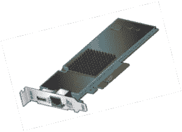
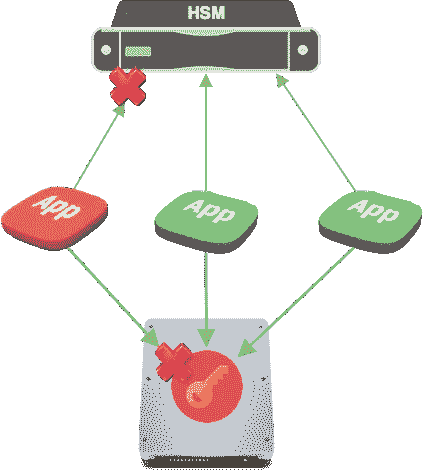

# 关于硬件安全模块

> 原文：<https://medium.com/hackernoon/the-thing-about-hardware-security-modules-6f2cc38b5319>

硬件安全模块(HSM)不容易维护，并且它们并不总是提供您所希望的安全性。如果你正在检查你的 FIPS 140–2 复选框，那么是的，去得到那个 X 级 HSM。但是，如果您真的关心保护您的基础设施，您可能需要考虑几个额外的要点。

# 什么是 HSM，什么不是

HSM 安全地生成和存储加密密钥，并执行加密操作，如签名、签名验证、加密、解密和散列。HSM 是一种加密神谕，人们可以要求它执行某些操作。差不多就是这样。但通常，更重要的问题是谁(或什么)可以查询这个神谕。例如，想象你把你的比特币钱包的私钥保存在一个 HSM 里。攻击者可能无法窃取密钥，但如果她可以要求 HSM 用它签署数据，她就可以批准非预期的交易并窃取比特币。关键是，您需要正确地指定和实施访问控制，并限制谁可以操作 HSM。您还需要考虑保护访问 HSM 的凭证。

我们在与客户的合作中注意到，虽然用户会在其他地方打开安全罐，并通过使用 HSM 来获得 FIPS 合规性，但他们可能无法正确保护支持 HSM 认证的 PIN 码。一个例子是使用存储在 HSM 中的密钥对机器上的数据进行加密，但是将 PIN 码与加密数据一起放在 HSM 中。打个比方，你不会锁上门，然后把钥匙放在门前，对吧？也许你会请你的邻居保管你的钥匙。但是你不会把邻居家的钥匙放在你的门前，是吗？关于这个问题的真实例子，请看这篇博文。

# 网络与 USB/PCI 连接的 HSM

Illustration of a PCI connected Hardware Security Module

网络 HSM 是带有网络(以太网)端口的设备，可以通过加密的通信通道处理请求。建立从客户端软件到 HSM 的加密且经过身份验证的连接对于阻止中间人攻击和防止未经授权的客户端从 HSM 请求服务至关重要。

USB 和 PCI 连接的 HSM 安装在主机上(例如 Linux 服务器)。虽然 HSM 生成和存储的密钥可能受到保护，但是端到端的安全性变得依赖于主机的安全性。您真正的安全边界不是 HSM 本身，而是它所连接的主机。干得好，您刚刚将您的密钥暴露给了网络漏洞、操作系统中的零日漏洞或主机上运行的特权软件中的错误。如果您对该主机的安全性感觉良好，那么为什么首先要附加一个 HSM，而不只是将密钥放在 Linux 机器上呢？

公平地说，如果不在 HSM 连接的主机上运行，攻击者将无法窃取密钥，并使用它们离线解密或签名数据。但我们可能想争取更好的安全性。

# 保护工作流，而不仅仅是密钥

Applications connecting to an HSM should only have access to authentication PIN or other credentials if they are trusted. An attacker that can authenticate and request service from the HSM would be able to sign maliciously crafted certificates, approve illegal transactions, get unauthorized access to encrypted data, etc.

我们必须考虑哪些用户或应用程序正在访问 HSM，以及如何控制这种访问。理想情况下，我们希望将访问密钥或存储密钥的 HSM 的权限限制在可信应用程序。
如果我们能够将访问密钥或访问 HSM 的身份验证凭据的权限限制在特定的应用程序身份，我们就可以端到端地保护整个工作流。

# 运行时安全性

Anjuna 提供了一种独特的方法，使用*运行时安全性*来保护整个工作流、绑定数据和可信应用的密钥。它利用基于英特尔软件防护扩展(SGX)和 AMD Secure Encrypted virtual ization(SEV)等技术的安全飞地来加密敏感数据，如用于向 HSM 进行身份验证的凭据，或加密密钥本身，以便数据只能由授权应用程序访问。这使得能够端到端地保护工作流、连接到密钥管理解决方案或 HSM 的应用以及它向密钥管理解决方案本身认证自身所需的凭证(如果使用软件密钥管理系统)。你可以在安茹娜的网站上了解更多。