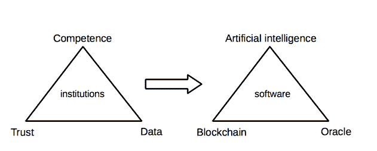
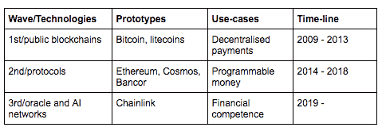

# 分散金融的第三次创新浪潮

> 原文：<https://medium.com/hackernoon/the-third-innovation-wave-for-decentralised-finance-defi-2ca7cc416712>

在这篇文章中，我将描述我对分散化金融的金融领域技术发展的观点。 *DeFi* 通过使用基于公共区块链构建的软件提供金融服务，彻底改造金融业。

**重塑信任、能力和数据的视角**

我对 *DeFi* 的技术观点是基于这样一个概念，即任何金融服务都是围绕三大支柱——信任、能力和数据——建立的，而如今它们被重新改造成了软件产品。基于这一观点， *DeFi* 服务将通过重塑信任层、能力层和数据层来创建。

**图一。金融转型**

信任层被改造成公共区块链和在其上运行的协议。现在，我们不再信任金融机构，而是可以信任维护编码规则和交易分类账的分散式节点网络。看起来，能力层将被重塑为由机器创建和维护的、公开可用的分散式金融情报网络。

但是数据层被改造成分散的神谕，收集和验证来自外部来源的数据，并将它们输入公共区块链和分散的人工智能网络。我相信，在未来，几乎所有的金融服务都会以软件产品的形式被创建、维护和提供，这些软件产品可以在公共区块链、分散式甲骨文和人工智能网络之间进行互操作。

从这个角度来看，我将关注 *DeFi* 技术的技术发展。

**第一次创新浪潮是大众区块链**

区块链作为分散支付网络的兴起，是分散金融的第一波创新浪潮。在这一浪潮中，法定货币被改造成加密硬币，这是由区块链技术授权。基本用例是支付和价值存储。这一浪潮主要发生在 2009 年至 2013 年。最突出的例子是比特币(2009 年发布)和莱特币(2011 年发布)。

**图二。分散金融的创新浪潮**

**第二次创新浪潮是协议**

第二次创新浪潮继续重塑对分散协议概念的信任。在公共区块链上运行的是基于规则的系统。这一浪潮给我们带来了分散的可编程货币，主要是公共区块链与智能合约(基于编码规则的系统)的结合。它带来了 1)创建协议的平台，例如以太坊(2015 年发布)、Stellar (2014 年)和 EOS (2018 年)；2)连接不同区块链(例如 Cosmos 和 Polkadot)的协议。)、3)稳定硬币(例如 trueUSD)、借贷(MakerDAO、Compound、Dharma)、衍生品(dYdX、Index 协议)、去中心化交易所(0x、Bancor)的用例协议。这一波主要是从 2014 年到 2018 年。

**第三次创新浪潮是去中心化的甲骨文和人工智能**

我相信下一波浪潮将是重塑去中心化的数据和能力。这些都是构建完全自动化、可互操作、去中心化的产品(如贷款、基金管理、衍生品)所缺少的元素。例如，贷款不仅是贷方和借方之间的过渡，还需要借方的数据和对借方进行评分的能力。因此，我预计第三次创新浪潮将带来分散的神谕和机器智能网络，为其他生态系统参与者创造金融竞争力。我们已经看到了去中心化神谕的好例子，例如 chainlink(发布于。2019).

***关于作者***

Sandris Murins 是 Murin 的创业工作室的联合创始人。我们帮助投资者和创业者从零开始建立加密创业公司。我的任务是将团队和投资者置于最佳位置，以利用加密、去中心化金融和人工智能之间交叉出现的机会。