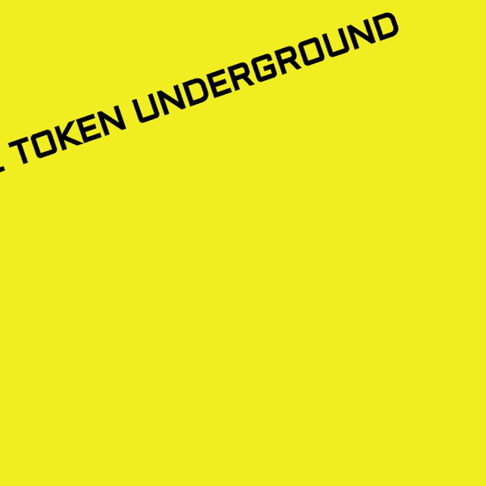

# 地下令牌 0x0:大脑大迷雾和重新开始

> 原文：<https://medium.com/hackernoon/the-token-underground-0x0-the-great-brain-fog-and-the-fresh-start-c960d8dba5d8>

# 大脑大迷雾

这一切都要追溯到 2017 年，当时数字世界对加密令牌变得疯狂。然而，可悲的是，这不是为了潜在的创新，而是为了投机收益。嗯，不奇怪。随着数以千计的 ico 运行和数以吨计的用于白皮书的实际白皮书在软帽提出后的第一秒就被扔进垃圾桶，相当多的人实际上可以给出这个令人发痒的问题的清晰答案。你能猜出来吗？这里有一个提示—它与令牌实用程序有关。

> 如何在项目的生态系统中使用令牌？

事实上，答案并不像乍看上去那么简单。每当我们问创业者一个问题，比如“好吧，那么你的代币在系统中是如何工作的，它背后的经济逻辑是什么？”，答案应该是“我们的令牌将在我们的生态系统中的任何地方使用，它是我们系统的核心部分。还有…嗯…还可以用它来打折！".好吧，伙计们，别说了，拜托，因为那都是废话。你不要再把大象藏在房间里了——事实是你的令牌毫无用处。我们不要再把我们的合作伙伴/顾问/社区当成试图出售数字空间的乡村白痴，如何？

这可能是推动日益成熟的密码产业的唯一合理的方式。为协议或 dApp 设计经济模型对于成功构建令牌生态系统至关重要，因为是经济定义了治理，而不是相反。看看现代世界的历史，以及一个国家的经济体系如何决定一个国家的政治进程。代币的世界也不例外，而#Web3 项目的成功故事是建立在它们潜在的经济价值、有意义的激励和互动之上的。

我们开始互相教育，解释秘密经济概念是如何工作的，并想出改进无用代币的方法，如何？

# WTF 是 TOKEN 地下？

我们鼓起勇气开始*地下令牌*分析一些现有的 dApps 和协议，以具体的例子进行教育。Token Underground 是一个专门收集代币经济和系统设计基础知识的系列，每周与社区分享。在第一期，我们将涵盖一些核心概念，为理解分散经济系统奠定基础。由于我们强烈主张深刻理解生态系统/项目的经济性，将其作为令牌工程的关键点，我们将从经济基础开始。听起来已经很无聊了吗？让我们证明你是错的。

**重新开始**

经济学可能看起来像一门关于数字的无聊科学，然而它的真正范围和潜力被大大低估了。 ***经济学*** *基本上是一门关于分配有限资源的科学。*现在，让我们从经济学的这个定义的角度来考虑一个令牌，以了解它对于去中心化生态系统的价值。 ***令牌*** *是一个单元，用于获得对某些有限资源的访问。*在这里，一个更精明的读者可能会想‘嘿，但这就是钱！金钱是有限经济资源的关键，比如商品和服务，不是吗？不完全是。货币只是这种单位的一个例子，或者说是经济单位集合的一个基本元素。当然，还存在更多的经济单位，例如:

*   **股份** —用于获取有限的资源，如公司利润和投票权。
*   **选项** —用于获取有限资源，如发行人以指定价格购买或出售资产的义务。
*   **一把** **钥匙**——用于访问有限的资源，比如你的房子、汽车或邮箱。在这个列表中，这个可能看起来很奇怪，但是它符合有限资源概念的逻辑。另一个发现是，token 的定义是全面的，可以涵盖几乎所有用于访问有限资源的经济单位的情况。

现在，如果我们将经济学和代币的定义结合起来，我们会发现,**代币经济**是一个系统(或者一个有规则集的游戏，如果你愿意的话),它根据这个系统定义的目标来调节对一些有限资源的访问，使用本机代币来调节这种访问。考虑到这一点，我们如何分析一个秘密经济系统呢？首先，我们必须了解这个系统是如何工作的，以及主要目标和经济限制是什么。我们必须问自己这三个问题:

1.  哪些资源是有限的？
2.  其中哪些是最重要的，对它们的访问如何影响整个系统的运行？
3.  对系统的访问如何以正确的方式导致系统目标的实现？

如果我们把这些点联系起来——目的、限制和访问机制——我们就会明白我们的令牌应该被赋予什么功能。

以比特币和以太坊经济系统为例。有限资源工作原理如何应用于 in crypto？这两个系统大多被视为设计用于无中间人转移资金的系统。这部分是正确的，因为 BTC 和瑞士联邦理工学院确实在他们的网络中执行**价值转移功能**(就像任何加密经济系统的任何其他数字原生资产一样)。但这只是冰山一角。注意，块是有限的(否则不可能存储事务的完整备份副本)，并且*向块中添加事务是使用有限资源的行为。*块大小以字节为单位。如果大量用户想要添加他们的交易，由于大小限制，他们将无法这样做。这是如何实现的？由于一个令牌:您必须用这个特定的令牌支付佣金，因此只有佣金最高的交易才包含在一个块中，而其余的则不包含在内。这个简单的逻辑就像一个经济屏障，也防止了垃圾邮件问题——如果你真的想在网络上发送垃圾邮件，你就必须支付佣金，而且每次交易都会赔钱。

然而，有一个问题我们还没有考虑:谁有权利组成一个新的区块？这是由挖掘者(在 PoW 中)、确认者(在 PoS 中)和其他共识算法中的各种方法的共识决定的。形成块的权利无疑是一种有限的资源访问，可以通过令牌(PoS)或其他方式(PoW)对其进行管理。这里看起来真的不需要代币吗？表面上看确实如此，但是，如果你深究下去，你会发现有必要激励作为共识一部分的代理人诚实行事，并对他们的工作给予报酬。于是，一个**经济激励**诞生了。在某些特殊情况下，如 PoA(授权证明),这并不是真正必要的，但更广泛地说，经济激励是启动任何网络的关键部分。所以，不要放弃激励，当你开始自己的时候。

好了，该结束了。在一个典型的区块链协议中，一个令牌至少有三个功能，其中每一个都可以被分解为访问一些有限的资源:

1.  调节访问以将信息包含到块中。可以以交易佣金或持有令牌的形式执行，以接收网络的部分功能。
2.  参与理事会和支持网络的经济激励。
3.  价值转移。

我们选择什么共识机制并不重要。对于电源和 PoS，令牌将经济地需要这三种功能。

*构建代币经济/分析现有代币经济的基本算法是什么？*

1.  了解系统。下至最小的细节:它为什么被创造？参与者是谁？商业模式是什么？它是如何工作的？
2.  理解目标。想想这些目标是否符合客户需求。这个目标的实现能促进系统的使用或增强系统的性能吗？
3.  发现经济局限。简单来说，*系统中有哪些*有价值的资源，*为什么*它们有价值？

4.将目标的实现与获取有限资源的情景联系起来。

恭喜你，你成功了！不，只是开玩笑。这是本质的开始。数学建模，以证明这种令牌功能在大多数可预测的情况下实现了系统目标。

现在一个伟大的旅程开始了。您将需要在测试网上部署您的 dApp，并开始在社区中绘图。

理解经济学并不容易，但把它看作是一门资源有限的科学可以大大简化这项任务。**这种算法“系统→有限资源→目标和目标通路对齐”可以用来分析任何代币经济和区块链系统。**

好了，就这样吧，伙计们。接下来是根据上面概述的工作流程对该空间的热门加密项目之一进行分析。

*免责声明:我们将根据我们的选择展示这些项目，这些选择仅源于它们的令牌设计的相关性，我们承诺不会有任何废话。如果你愿意以任何方式做出贡献，请联系*[*technomadnotes@gmail.com*](mailto:technomadnotes@gmail.com)*。*