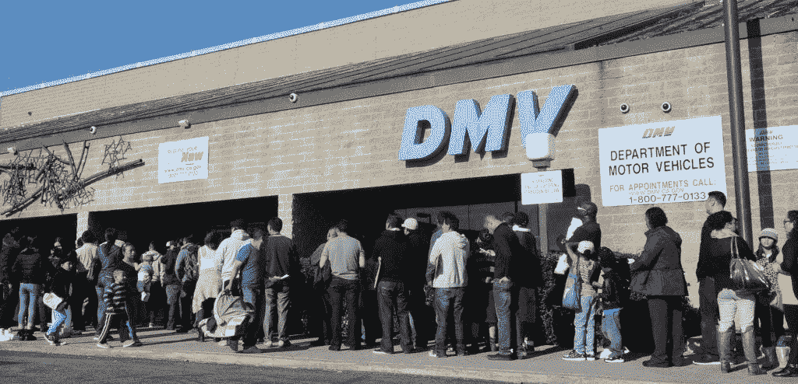

# 信任机器

> 原文：<https://medium.com/hackernoon/the-trust-machine-5e382e569d96>

## 开放区块链系统的架构以一种在比特币出现之前不可能的方式实现了信任。但是它会把我们带到哪里呢？

生锈是人际关系的根源。它是一种粘合剂，允许个人合作，一起完成个人难以理解的目标。非常简单地说，信任可以被视为一个复杂交易系统的支柱之一，这一系统使我们的物种从分散的游牧群体成为一个全球性的、相互联系的太空文明。

# **信任的问题**

虽然社会只不过是几十个人通过家庭纽带联系在一起，但在交易中信任另一方没什么大不了的。但是在农业革命之后，第一个城市和商业文明的出现，关系超越了部落范围，因此开始了信任的问题。

*Can I REALLY trust this guy?*

商业打开了一个可能性的聚宝盆，释放了以前无法获得的价值，催生了市场。然而，这些社会发展的最大障碍之一(也是一个随着规模扩大而不断增加的头痛问题)是*如何组织一群彼此不认识的人——因此没有理由相互信任。*

如何确保每一方都遵守协议？如何证明对方就是他自称的那个人？比如说，如何保证今天属于你的一块土地明天不会被别人侵占？这种风险不仅会给两国关系带来摩擦，还会阻碍经济发展和各种社会合作。

# 定义技术

幸运的是，我们是富有创造力和多才多艺的类人猿，擅长创造和使用技术来解决我们的问题。

为了理解技术和信任之间的关系，我们应该在更广泛的意义上分析技术的概念，超越小工具和电子设备，而是作为“[在实现目标](https://en.wikipedia.org/wiki/Technology)的过程中使用的工具、技术、方法、技能和过程的集合”，并认识到这些工具的使用与人类经验密不可分。

也就是说:它不仅仅是冰箱、火箭或 iPhones，还包括程序和社会创新，如语言、会计、一般制度(政府、法律体系、公证人、银行等)，每一项创造最终都会扩大人类文明的范围，使以前无法实现的目标成为可能。

*Painful as it is, even the DMV queue can be regarded as technology*

# **工艺循环**

现有的每一项技术都被迭代、组合和优化到精疲力竭，同时新技术也在不断发展。创新运动往往会反馈到自身，并以指数形式加速。

一旦一项成熟的技术达到其生产极限，一系列新技术就会取而代之，生产力就会恢复增长。那些提供竞争优势的被采用，而效率最低的被抛弃，这种机制类似于自然选择。

蒸汽机让位给了内燃机，如今内燃机似乎在与可再生能源的竞争中失去了动力。VHS 被 DVD 取代，DVD 的霸主地位被互联网流媒体和 SSD 存储取代。城邦被帝国吞并；封建君主政体被代议制民主政体所取代——在每个领域，人类都应用新技术来实现共同目标和拓展视野。在罕见的时刻，一组新技术对当前的生活方式带来了如此广泛的破坏，以至于[撕裂了社会结构本身。](https://www.history.com/topics/industrial-revolution)

这些转变没有一个是快速或无痛的；当新思想取代旧思想时，经济和文化的冲击波会持续很长时间。已建立的系统几乎没有动力去放弃旧的实践，而且在转变过程中的摩擦有时可能会引起[更多的不满。](https://www.britannica.com/event/French-Revolution)

# **信任的集中化**

但是让我们回到信任上来。

在历史上的大部分时间里，降低交易双方之间不确定性的解决方案必然涉及第三方，而第三方的唯一作用就是支持参与者，并确保每一方都信守承诺。发放身份证的国家、执行合同的法院或保证交易所需资金确实存在的银行——所有这些都是“信托机器”中的齿轮，各方选择将风险(有时是强制性的)委托给该机器，并作为交换获得不同程度的确定性。

长期以来，这些机构——这些*技术*——已经履行了它们的职责，并作为一个基础，在这个基础上，逐步扩大和更加雄心勃勃的努力可以加速全球社会的发展。尽管存在一定程度的摩擦、低效率和巨大的成本，但与缺乏信任的选择相比，中介无疑更受欢迎。

但是没有一个系统是一成不变的，今天这个信任机器开始出现磨损的迹象。第一代数字技术极大地加快了交易流程，但是，尽管做出了值得称道的努力，却未能提供一种值得信赖的替代方案来克服集中式中介的瓶颈。由此产生的权力极度集中加剧了腐败和低效率的影响，扭曲了保持各方利益一致的激励体系，最讽刺的是，在该体系的使用者中传播了不信任，并最终疏远了他们。

一些机构，如银行，已经达到了深不可测的规模，变得“太大而不能倒”，而没有更新他们的服务以适应用户的新需求。其他人，如政府，根本跟不上变化的节奏，导致官僚膨胀，无法处理新的和不断增长的需求。在某些情况下，证明自己的存在似乎成了他们唯一的目标。银行和政府成为公众舆论最不信任的机构，而且这种信任度在过去几十年中普遍下降，这并非偶然。

这种损耗的一些症状是显而易见的，比如 2008 年的全球金融危机和对政府信任的持续、全球性侵蚀。进入新千年已近 20 年，一些机构根本无法为社会的真正问题提供令人满意的解决方案。[用社会科学家 Pia Mancini](https://www.ted.com/talks/pia_mancini_how_to_upgrade_democracy_for_the_internet_era) ，*的话说，“我们是 21 世纪的公民，尽最大努力与 19 世纪发展起来的机构互动，这些机构基于 14 世纪的信息技术。*”

这个数学显然没有那么好。

# 区块链和去中心化

问题是，把我们的信任委托给谁呢？直到不久前，还没有可行的替代方案。然而，在 2008 年末，[一篇描述](https://bitcoin.org/bitcoin.pdf)一种无需中央中介就能安全交易的电子货币的晦涩论文改变了这一点。

[于是比特币诞生了](https://bitcoin.org/en/faq#what-is-bitcoin)，这是一种革命性的技术组合，首次允许双方在不需要可信第三方(而不是银行)的情况下进行数字价值交换，一种算法确保了资金的存在和交易的有效性，并由网络中的所有参与者同时进行适当的验证和注册。

比特币最大的创新之一是其簿记和验证层的架构，称为区块链:一种由所有用户同时维护并可自由审计的分类账，所有交易都在不断增长的区块链中注册。尽管具有这种透明性，但加密技术赋予了当事人相对的匿名性，同时在数学上保证了记录的安全性和不变性。

然而，从根本上说，区块链最大的承诺或许是信任的去中心化及其潜力:优化和减少与更直接的 P2P 交易的摩擦；健壮网络的安全性；赋予个人拥有和控制自己数据的机会——而这还只是皮毛。

它所有可能的应用的完整列表超出了本文的范围，但是值得注意的是，区块链只是一系列技术中的第一个，这些技术可能同时允许去中心化和过程自动化，直到现在这些都只属于中介的领域(不完全是[透明](https://qz.com/1079253/the-complete-guide-to-the-equifax-breach/)或[诚实](https://www.economist.com/news/schoolsbrief/21584534-effects-financial-crisis-are-still-being-felt-five-years-article)的最终堡垒)——并且即使它永远不会被完全实现，它的开创性潜力也将极大地影响从现在开始组织信任的方式。

*Yeah, and the bubble was bitcoin*

# 去中心化的未来？

这并不意味着区块链是解决世界所有问题的灵丹妙药，也不意味着我们应该立即分散所有的权力。纵观历史，中央集权和地方分权之间的平衡似乎是交替变化的。一些过程以集中的方式运作得更好，而另一些过程可以通过分散的方式获得很多。没有确定的公式——一切都取决于社会背景、激励系统和可用的技术平台。

如果今天的人们感到与社会进程格格不入，并被应该为他们服务的机构所敌视，那么也许是时候重新审视后者在社会中的作用了。任何机构都不应该太大而不能倒闭，也没有理由维持效率低下的系统，因为这些系统吸收的价值超过了它们提供给用户的价值。

技术本质上是不可知论的，可以被用作赋权和自由的工具，也可以被用作胁迫和控制的工具。像任何羽翼未丰的创新一样，区块链既有巨大的潜力，也有现实的挑战和相关的风险。尽管如此，光是区块链的承诺就足以让信托业向 21 世纪更近一步——即使像所有承诺一样，这一承诺也将取决于用户的选择，以便这种信任是合理的。

*最初于 2018 年 5 月发布在作者现已停业的网站 Blockzen.io*