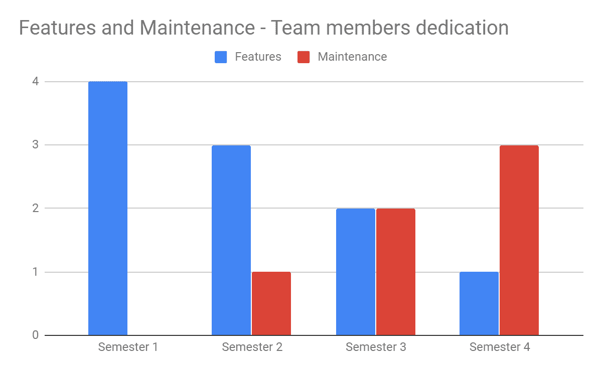
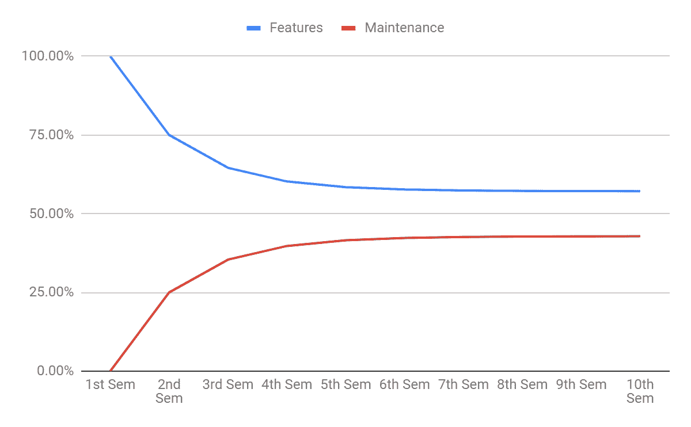
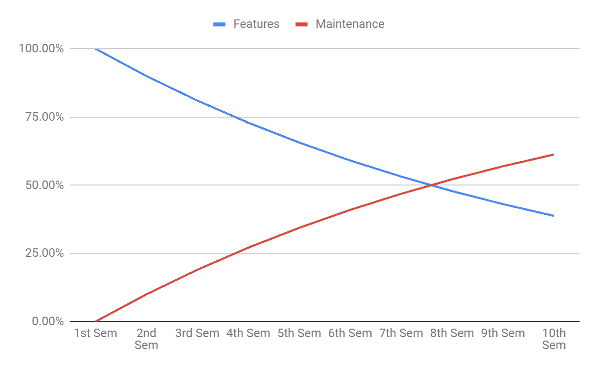
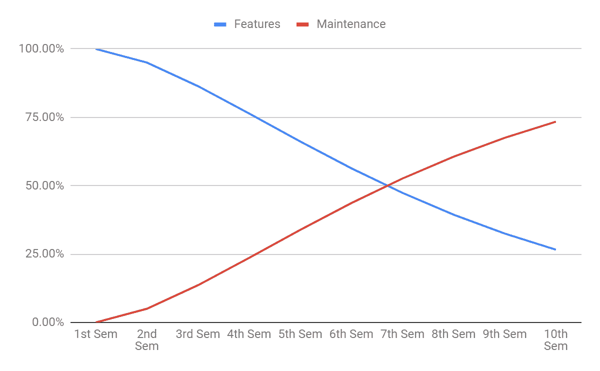

# 为什么你的产品开发团队如此缓慢的丑陋事实

> 原文：<https://medium.com/hackernoon/the-ugly-truth-about-why-your-product-development-team-is-so-slow-4cc9f4ace83c>

大多数公司都面临一个特殊的问题:随着时间的推移，产品开发团队似乎变得越来越慢。

为什么？为什么那些伟大的开发人员起初看起来交付了巨大的价值，现在却花这么长时间来做小的改变？

我们可以列举许多原因:

*   **依赖关系**:随着团队的成长，我们分割产品并给每个部分分配子团队。最终要完成某件事，团队需要相互协作，而协作的努力会让我们慢下来。
*   **回归**:随着产品的增长，为了增加新的东西，我们需要更多的时间来测试我们没有影响其他现有的功能。
*   **WIP**增加:随着产品和公司的成长，我们想要做更多的事情，大多数团队最终增加了在制品(WIP)，这使得我们的周期和交付时间变得更慢。

这些只是我们可以考虑的许多非常合理的理由中的几个。但是有一点我们通常会忽略，而且可能是最大的生产力和创新盗窃之一: ***产品维护*** 。

## 什么是 ***产品维护***

许多利益相关者以面向项目的心态考虑产品开发:产品有特性 A、B、C，你现在和 5 个开发人员团队一起开发 D，一旦他们完成了，你将有 5 个空闲的开发人员来开发新的特性 e。

令人难过的事实是，如果你已经在生产任何东西，你无疑需要投入时间来保持它的预期性能。

可能需要另一篇文章来描述维护活动所涵盖的内容，但简单地说，就是一个产品需要持续带来预期商业价值的所有努力。这可能包括:

*   *修复 bug 的纠正性维护*
*   *适应外部修改的纠正性维护*
*   *性能改进*
*   *改进维护(现有功能上的小功能变化)*
*   *进一步改善系统可维护性*

事实是，这可能会占用您团队的大部分时间，您需要考虑和计算准备和管理利益相关者(以及您的！)期望。

好消息是什么？我们有计算和解释的方法。

> 注意:这篇文章的第二部分介绍了如何改善这种成本

# 如何计算您将在维护和“新功能”上花费多少精力

# 过去——面向项目的成本

为了得出更好的结论，我们需要一些背景知识。在一个由项目统治的世界里，当开发和发布阶段完成后，一个“支持阶段”就会开始，包含所有我称之为维护的工作。

多年后，一些作者研究了与开发阶段相比，最后一个阶段有多“昂贵”。当然，由于没有一个项目是相同的，所以会有很多差异，但是我们可以看到所有项目都在 60%以上，并且可以平均为大约 75%。

*   丹尼尔·d·加洛拉特
*   斯蒂芬·r·沙奇——67%
*   [托马斯·m·皮戈斯基](https://en.wikipedia.org/wiki/Software_maintenance#cite_note-2) — > 80%
*   罗伯特·格拉斯 — 40% — 80%
*   尤西科斯基宁——>90%

*来源:* [*杰夫·汉比在 Lookfar 博客*](http://blog.lookfar.com/blog/2016/10/21/software-maintenance-understanding-and-estimating-costs/)

# 产品开发世界中的维护—版本 1 —添加新功能

在任何情况下，这种计算都与产品开发领域不兼容。

当开发产品时，直到我们决定终止产品，开发阶段才真正结束。我们不断增加新功能。

但是维护成本仍然存在，同一个团队将负责添加新功能以及维护已经编码的功能，这两项工作都将包含在同一个 backlog 中。

为了计算维护系统的工作量，我们需要计算团队发布的所有特性的维护成本。由于这种计算是不切实际的，您可以估计，对于团队开发新功能的每个时间段，您将在未来的时间段内花费 75%的“工时”作为维护成本。

## 示例场景

一个团队有 4 名成员。在第一学期，他们把所有的精力都花在新功能上。在第二学期，他们将开始工作的第二套功能，但他们也将开始维护以前的工作。任意考虑我们在接下来的 3 个学期中分配 75%的维护成本，团队将在接下来的 3 个学期中花费 25%的能力(一个团队成员)专门用于维护。

因此，在第二学期，一名团队成员专门负责维护，而其他三名成员则负责第二个功能集。这就产生了一套全新的功能来维护！

在第三学期，一个团队成员仍在维护第一学期的功能，第二个成员在维护第二学期的功能，只有两个成员可用于新的工作。

*Table 1 — Hypothetical team members assignation*

Distribution of efforts in maintenance vs new features over time

## 一个概念性的(数学？)模型

我们可以进一步推广上面的例子，并从长远来看它的含义。

概括地说，假设每个学期你都从上个学期开始做所有的“未完成的维护”,并处理其中的三分之一。

Semester by semester view of new features, maintenance, and pending maintenance

在第二学期，你将第一学期工作的 75%待维护成本(0.75“团队单位”)分成三份，在本学期完成“0.25 团队单位”。在第三个学期，现在你有了初始特性的 0.5 个未完成的维护工作，并且增加了团队在这个学期已经建立的“0.75 个团队单位的工作”的 75%(0.56 个团队单位的维护工作)。在第四学期，你承担了三分之一的维护工作，将团队维护工作量提高到 0.34 个团队单位。

随着学期的推移，团队在新功能上的工作越来越少，在维护上的工作越来越多，直到达到平衡，因为新增加的工作量增加了未完成的维护工作，增加的速度与团队在维护上花费的工作量相等。

考虑到维护工作是每个功能的 75%,系统将平衡大约 57%的功能工作和 43%的维护工作。

所以总的来说， ***如果你有一个 5 年的老产品，你可能会花费团队 43%的时间在维护上*** 。

如果随着时间的推移，我们将所需的维护量从 75%增加到 100%，那么新功能与维护工作的比例将达到 50%/50%。

# 产品开发世界中的维护—版本 2 —产品范围的不断扩大

以前的方法仍然是采用项目视图，并将其应用于产品开发。为什么这是不够的？因为大多数时候我们在产品中做的维护不能被认为是孤立在单个功能中的一些额外的努力，而是在产品的整体中。

让我们回顾更多的维护概念，它们将获得更好的维护工作的“产品思维”计算。

## 维护“事件”时间范围

维护工作永远不会结束。

当项目被分析以得到 75%的估计维护成本时，这是考虑到在某一点上你决定不在那个系统中做任何进一步的改变。

在产品上，情况并非如此。只要产品还活着，你就想继续做必要的维护工作来保持它的运行。例如，如果您有一个脸书登录的产品，而脸书决定更改连接器 API，那么您将希望更新您的产品，而不管您是否已经花费了该特性的 75%的维护成本。

随着产品的增长，维护活动的成本也随之增长。如果运行我们产品的操作系统发生了变化，需要我们的团队修改代码，我们可以假设，如果产品有 2000 行代码，那么升级它需要的时间是升级 1000 行代码的两倍。

特性维护不仅永远不会结束，而且会随着产品范围的扩大而不断积累。

## 关于复杂性的一句话

当然，任何维护成本的计算都会有很大的不同，这取决于产品的类型、基线架构、技术栈以及软件的更多特性。这个等式中一个非常重要的因素是复杂性。*计算每个特性的维护的方法认为系统的复杂性随着范围的增长而线性增长，但实际情况几乎不是这样*。

我们举个例子说明一下。假设您有一个系统，允许用户用他们的电子邮件地址注册。一个新的功能是希望与脸书帐户登录。范围被很好地定义，并且可能很容易确定构建它的努力。

当您考虑结合两者的用例时，问题就出现了:如果用户已经创建了一个电子邮件帐户，然后选择了脸书登录，该怎么办？你应该考虑合并信息的过程吗？如果用户取消了 facebook 访问权限，但希望稍后使用其电子邮件帐户访问信息，该怎么办？你应该提供一个“创建密码”的过程吗？

如果你单独考虑“电子邮件登录”和“脸书登录”特性的工作，它可能会有一个团队迭代的成本。但是，当你已经有一个，添加另一个可能需要更长的时间，由于这种“组合”的情况。

这也适用于维护。具有两个功能(每个功能需要 500 行代码)的系统的维护成本比具有 1000 行代码的单一功能系统的维护成本高很多。

**随着产品范围的增长，其复杂性通常会呈指数增长，因此维护成本不会呈线性增长，它也会呈指数增长。**

## 知识库中的一个词

影响大型系统维护成本的另一个因素是对系统如何工作的实际了解。这听起来很傻，但是在 3 或 4 年后，很可能团队的许多成员已经轮换了(要么去其他公司，要么去公司的其他部门)，所以即使文档存在(很少)，也没有人真正读过它，并且每次需要处理“过去”的东西时，首先需要分析它。有时候，这种分析比团队第一次分析如何实现特性要花费更多的时间！甚至更进一步，有时分析工作比分析后所需的开发工作更大(知道做什么比做它更难)。

随着产品的老化和范围的扩大，分析所需维护的时间呈指数增长。

## 组合因素

这些因素是如何改变之前“面向特征”的分析的？

做一个类似的计算，不考虑每个特性的累计维护成本，我们会考虑“维护事件”。

为了保持相似，让我们随意地说这些事件每 6 个月发生一次，并占用团队 10%的时间。但是它不会应用于单个特性，而是应用于团队在特性上花费的累计时间，以考虑范围和系统增长。这是什么意思？第一学期的维护工作将花费团队 10%的时间，但是第二学期如果团队只致力于特性，将花费 20%(累积的特性集相当于“两个团队学期”的工作量)。

那么这在 10 个学期的时间框架内会是什么样的呢？

*Maintenance work considering a linear accumulated scope*

正如您所看到的，我们现在有一个“累积功能”指标，它说明了系统的增长，我们基于它计算每学期的维护工作量。在最后一行，我们可以看到维护工作随着时间的推移而增长，增长率为该学期引入的新功能的 10%。这意味着一个准线性的增长，最终变得高于功能工作。

Quasi-linear maintenance growth vs features work decrease

更糟糕的是，正如我们所说的 ***的老化和规模的增长使得*** 系统成倍地复杂和难以维护。

为了考虑这个因素，我们可以在表中创建一个新的“累积复杂性”行，它结合了新的特性，但速度却是指数级的。

在这种情况下，我们考虑了一个 1.5 的指数因子(复杂性的计算方法是将功能的数量加到 1.5 的幂上)，以及每个维护事件 5%的维护成本。即使有这些小的考虑，我们也可以看到维护工作是如何不可思议地快速增长，直到它超过特性工作并最终消耗大部分资源。

总之，**随着系统的老化和增长，团队变得越来越慢，直到它几乎完全在维护上工作**。

# 结论

这些情景都不现实。如前所述，每个软件和团队中的维护工作会千差万别。

但是您必须考虑维护工作是如何随着时间的推移而增长的，这对您的产品开发速度和成本是一个严重的威胁。

*注:如果你喜欢它，你可能想看看第二部分，如何降低维护成本！*

 [## 大大加快产品开发速度的 5 种方法

### 通过降低维护成本

medium.com](/@nachobassino/5-ways-to-dramatically-accelerate-your-product-development-speed-c1141d532460) 

> 就是这样！我很想听听你们对车队的维护成本和速度影响的想法。
> 
> 如果你喜欢它，并想获得更多的工具和技巧来改进你的产品，你可以 [**在这里**](https://www.getdrip.com/forms/245370375/submissions/new) 订阅，并加入我的[精益实验](http://leanexperimentation.com/)博客的数百名读者！