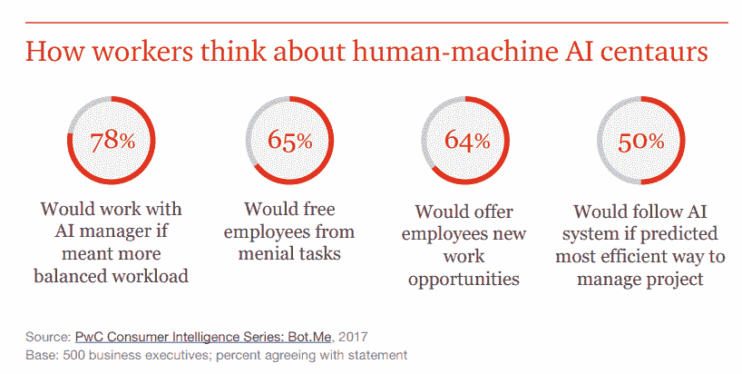
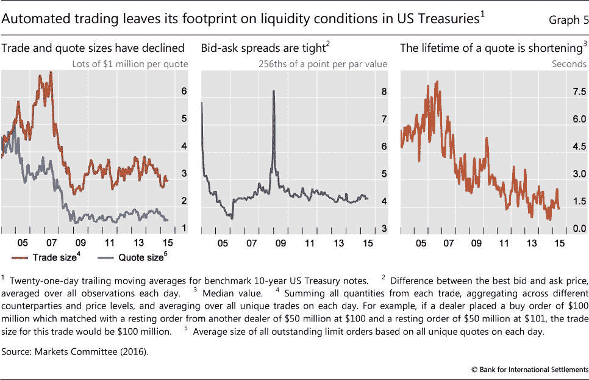
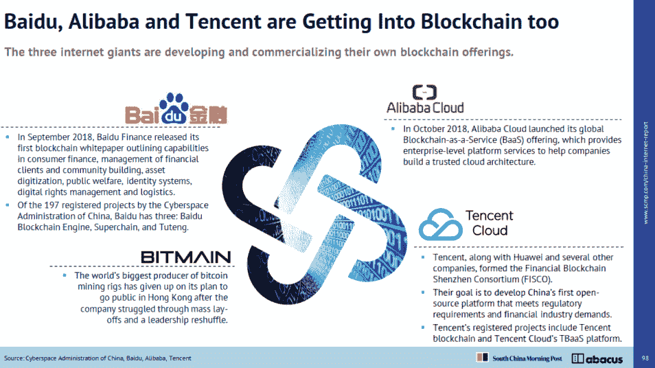
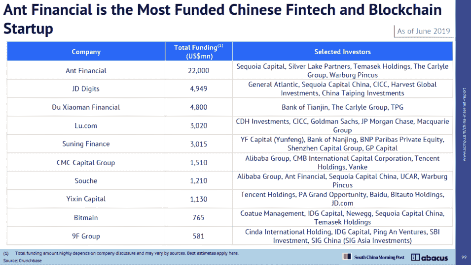

# 金融与科技的愿景。德意志银行解雇 1.8 万名员工，亚马逊重新培训 10 万名员工

> 原文：<https://medium.com/hackernoon/the-vision-of-finance-vs-tech-deutsche-firing-18-000-workers-amazon-re-training-100-000-edfbca85e34b>

现在的人类是什么？当然还有人类动物，有着不同的生物、家庭和文化根源。这些根源必须产生社会果实:每个被推入我们世界的人都应享有基本人权，其中工作尊严和精神健康正成为日益增长的要求。然后是技术自我，其软件节点分散在数千个网站、机器人服务和自动化代理上。你的数据和登录激活了生命工程系统和人工环境。每个动作、点击和命令都是科技公司的财富。然后是[半人马座](https://jods.mitpress.mit.edu/pub/issue3-case)——这是一种科幻的说法，称之为人/机混合体——增强的人超过并超过了那些不插电的、未连接的和未开通银行的人。

今天的公司和政府正致力于确定我们参与社会和经济的这些方面的平衡。关于什么造就了一个人(或一个雇员)以及经济是如何建立的(切馅饼，还是做大馅饼)的不同属性的不变性的信念决定了你自上而下的决策。作为本周的核心例子，就拿德意志银行来说吧。面对定价压力和几项业务的逆风，[德意志银行做出回应，计划到 2022 年解雇 18，000 名员工，并宣布到 2022 年投资 130 亿€用于技术和创新](https://www.crowdfundinsider.com/2019/07/149315-deutsche-banks-restructuring-includes-e13-billion-for-tech-innovation/)。他们甚至编造了一个[潮人色的新银行](https://goodbanque.com/index.php/2019/07/03/fyrst-deutsche-bank-attacks-fintech-with-a-digital-bank/13230/?utm_source=Fintech+Ecosytem+Insights&utm_campaign=fb08ef384a-EMAIL_CAMPAIGN_2019_07_06_05_29&utm_medium=email&utm_term=0_ede4cf6fd3-fb08ef384a-87356251&mc_cid=fb08ef384a&mc_eid=4e99fc0601)作为证据。华尔街[并不买账](https://www.bloomberg.com/news/articles/2019-07-08/here-s-what-analysts-are-saying-about-deutsche-bank-s-overhaul)。

我要说点题外话，请原谅。金融科技领域的许多人嘲笑地将大型银行在初创领域的现有活动称为“创新剧场”——首席创新官被雇来做这件事，是为了让公司的故事对公众投资者来说听起来更有前途，但实际上这与管理损益表的预算或运营高管几乎没有关系。这是一种夸张；在现实中，加速器(如 Barclays Techstars)和企业风险基金(如高盛投资 Kensho、Circle)可以发挥很大作用。然而，漫画也讲事实。我相信我们现在看到的实际上比创新剧场更糟糕。这是一个货物崇拜。

第二次世界大战期间，飞机向驻扎在美拉尼西亚岛上的军队空投补给。当地居民认为这是一个宗教事件，并试图通过复制表面症状来召唤飞机和物资。他们建造了木制飞机、虚拟跑道和竹制控制塔。当然，通过复制调用飞机的步骤，补给就会到来！当然，通过复制新金融的症状——新银行、机器人、比特币、酷酷的办公室、“数据”这个词——我们可以扭转这种局面！圣歌从“创新”开始。

我住在玻璃房子里，我并不是在取笑美拉尼西亚人——他们和我们一样。我不是在嘲笑传统金融——我在那里工作过，并且和这个领域的许多好公司有合作关系。但我要指出的是，我们所有人的大脑中都有一个缺陷，这个缺陷让我们认为症状是原因。或者过去的技术堆栈与未来的技术堆栈是相同的。或者说，打破你的商业模式，在新的领域从头开始，没有结构性的竞争优势。这是德意志银行需要吸取的存在主义教训。

如果你从结构上看资本市场和资产管理，过去十年的一些趋势会很快变得清晰。电子交易的增长缩小了买卖价差，增加了透明度。MiFIDII 等相关监管机构禁止神秘的定价模式，这种模式允许投资研究与交易捆绑在一起[，因此定价过高](https://blogs.deloitte.co.uk/financialservices/2018/07/paying-for-research-post-mifid-ii-are-investment-managers-ready-for-the-fcas-review.html)。为 ETF 提供动力的包装技术已经催化了从[主动选股工具](https://www.bis.org/publ/qtrpdf/r_qt1603h.htm) [到被动指数工具](https://www.morningstar.com/blog/2018/05/11/fund-fee-study.html)的巨大转变，结果[相关定价崩溃](https://www.morningstar.com/blog/2018/05/11/fund-fee-study.html)。众所周知，roboadvisors 进一步推动了这种商业模式，使财富管理成本从 150 个基点降至 25 个基点。欧洲的新银行对零售银行业务也做了同样的事情，现在即将进入美洲。

这种趋势是德意志银行放弃股票部门的原因，专注于上游人力主导的咨询，这是它仍然具有优势的领域，并承诺€130 亿英镑的“创新”作为生存挑战的答案。对他们来说，摩根大通很可能是一个积极向上的榜样，[它也为金融科技](https://tearsheet.co/modern-banking-experience/what-jpmorgan-is-doing-with-that-9-5-billion-tech-spend/)划拨了 100 亿美元。他们一直执行得相当好！当受到罗宾汉的攻击时，JPM 推出了自己的[自由交易应用](https://www.cnbc.com/2018/08/21/jp-morgan-to-unveil-new-investing-app-with-an-eye-catching-disruptive-price-free.html)。受到 Wealthfront 的攻击，它现在用一个 [35 个基点的价格点机器人](https://www.cnbc.com/2019/07/10/jpmorgan-creates-robo-adviser-you-invest-portfolios-with-free-etfs.html)来回应，分发自己的资产管理产品。受到比特币的威胁，该银行推出了自己的加密资产。当被 Chime 盯上后， [JPM 创建了一个新银行](https://www.fnlondon.com/articles/jpmorgan-closes-down-its-digital-bank-finn-20190606)。哦，等等——它关闭了 neobank，或许是明白了数字是一种转变，而不是一个千年频道。

另一个进步的例子是施瓦布，它是数字财富市场的快速追随者。作为资产管理产品和现金转移工具的制造商，以及经纪公司和托管公司，它有多条金融服务盈利途径。但今年 3 月，该公司在技术平台上实施了一项商业模式创新。超级简单——它将定价改为订阅模式。你通过订阅获得音乐和电影。你可以通过订阅完成购物和送货。你甚至通过订阅购买微软 Office 和 Adobe Photoshop。金融没有什么特别的，尤其是当它越来越多地由软件代理和增强半人马(看，我把我们带回家了！).[作为回报，自价格变化以来，它已经获得了 10 亿美元的新资产](https://citywireusa.com/professional-buyer/news/weve-struck-a-chord-schwabs-subscription-pricing-helps-brings-in-1bn/a1249627)。

但是说实话。相对于前沿技术可以在短时间内释放的真正价值创造，这些东西都是微不足道的。就拿自动驾驶技术平台 Argo AI 来说，它成立于 2016 年，距今不过 3 年。[上周，福特和大众汽车向 Argo(投资和实物公司资产)出资 42 亿美元，估值超过 70 亿美元](https://www.zdnet.com/article/volkswagen-and-ford-join-forces-in-7b-argo-ai-alliance-deal/)。这相当于每年产生约 20 亿美元的企业价值。这就是你如何在核心技术优势上与谷歌、优步和特斯拉竞争。把房子交给知道自己在做什么的人。

也许你认为这个自动化的例子是人为的。或者，也许你认为金融机构今天正在利用共同的区块链基础设施这样做(他们是这样做的，但是[5000 万美元进入金融机构并不是 40 亿美元](https://www.theblockcrypto.com/tiny/fnality-receives-50-million-series-a-funding-to-develop-the-utility-settlement-coin/))。因此，让我们来看看全球金融服务的真正竞争——不是脸书或亚马逊，而是中国的超级应用[。如果你还没有，看看这篇 110 页的市场深度剖析](https://www.scmp.com/china-internet-report)。我大量引用了下面的内容，这样你就能感受到我们正在见证的规模和速度。

也许我们已经变得自满于把一个国家的人口生产力提升到科技时代意味着什么。德意志银行可以为了财务回报优化自己，选择软件而不是人体和银行分支机构。他们可以把自己打扮得很时髦。但是人工智能和自动化有两个潜在的结果。你可以(1)通过削减你的团队来减少 10 亿美元的成本，或者(2)让你的团队提高 10 亿美元的生产力。如果你做到了前者，你就不仅仅是丢掉了笨重的金融工厂中不必要的齿轮。您正在丢失网络中的节点；它的倡导者、大使和创造者。

随着技术提高了每个人的生产基线，而不管他们的角色如何——通过本文开头松散提到的人工智能服务和代理——领导者对他们的员工负有责任。问题不是人不能做什么，而是在半人马世界里能做什么？亚马逊正在采取正确的方法。随着企业的机器人/软件方面变得越来越自给自足，10 万名员工对这家电子商务产品工厂的功能性作用越来越小。作为回应，该公司计划花费 7 亿美元来提高这些工人的技能(除了 15 美元/小时的最低工资，美国整体的最低工资为 7.25 美元/小时)。尽管每人 7000 美元的培训费用不会打破亚马逊的银行账户，但这是对人类潜力期权价值的投资。这甚至可能将他们从卢德革命中解救出来。

# 想要更多吗？

*   新鲜的[网站在这里](http://www.lexsokolin.com/)，还有 [LinkedIn 在这里](https://www.linkedin.com/in/alexeysokolin/?lipi=urn%3Ali%3Apage%3Ad_flagship3_pulse_read%3BMp7QS6yrRf2YbVdWYyq6iw%3D%3D&licu=urn%3Ali%3Acontrol%3Ad_flagship3_pulse_read-nav.settings_view_profile)。
*   在 Twitter 上找到我[这里是金融科技](https://twitter.com/lexsokolin)和[这里是数字艺术](https://twitter.com/uaesthete)。
*   想给我发个短信吗？[随时联系这里](https://www.lexsokolin.com/contact)。