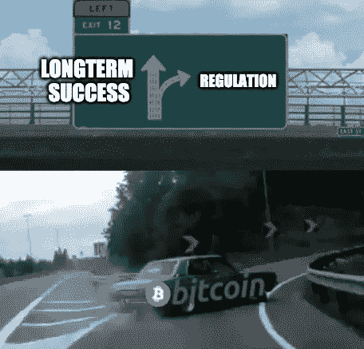
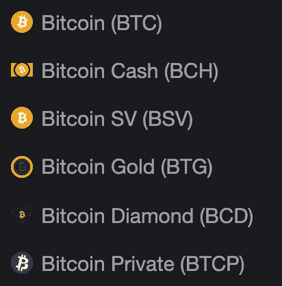

# 加密货币的灵魂之战

> 原文：<https://medium.com/hackernoon/the-war-for-bitcoins-soul-b81d5c87aa3c>

## 在“保护消费者”的幌子下，秘密监管可能会毁掉一切有益的东西

想象一下，如果我们拥抱[加密货币](https://hackernoon.com/tagged/cryptocurrency)热潮——尽管有各种骗局和贪婪——它到底是什么？如果我们不去监管它，而是让它不受约束地运行，如果我们不去关注它的缺点，而是赞美它的成就，那会怎么样？因为，今天，我们迫切需要一个范式的转变。自崩盘以来，我们现在面临着迄今为止最大的挑战，而意识形态正处于其最脆弱的地方。美国证券交易委员会和其他政府法规正在严厉打击，人们正转向简单、短期的解决方案，而分散技术的思想正受到攻击。我们需要重新调整我们的愿景**，抵制今天被兜售的故事**。

# 概述

首先，快速回顾一下。过去的 11 年——没有政府干预和监管，没有边界，对所有 T4 人开放，竞争激烈——向我们展示了什么是真正可能的。我们看到一个模糊的互联网概念变成了全球现实。我们看到创新者和自由思想者涌向数字去中心化运动。我们看到金融市场向那些以前从未接触过的人开放。我们第一次看到人们认识到数字世界中分散技术的全部潜力*。*

我们也遇到了黑暗的一面——盗窃、诈骗、无节制的贪婪。我们看到一个巨大的泡沫出现了，这个泡沫是由那些对意识形态没有理解，对已经取得的成就没有欣赏的人的涌入所推动的。他们是为了赚钱而不惜牺牲一切。当一贫如洗的机会从他们手中溜走时，他们心灰意冷，一点也不富裕，愤怒地四处寻找机会。

你能责怪他们吗？我们都陷入了贪婪，即使是那些保持意识形态立场的人。我们都被烧伤了。结果是，今天，我们看到去中心化的技术正走向一条老路。我们看到加密货币有可能从曾经著名的分散技术概念转向金融监管的现状。

今天我们站在一个岔路口。我们可以重新调整自己，实现分散化技术的最初目标，也可以为了追求简单的方法而摧毁它，这种方法不需要个人承担多少责任。

# 愿景

愿景丢失的一个原因是它从来没有很好地向公众阐明。大局是 4 个世纪前的想法的延续。*自由市场的概念，*自由的理想*。从集体主义到个人主义，现代性被定义为一种去中心化的运动。首先，这是新教改革的平衡力量对天主教会中央集权结构的破坏——一件血腥的事情。然后是帝国向民族国家的演变，以及国家主权和个人自决权。接下来是我们政治和经济体系的分权:资本主义和民主取代了阶级推动的君主制。*

*中央集权的最后遗迹存在于今天的货币和数字系统中。**比特币是一个突破。这并非巧合，它是在 2008 年美国房地产市场崩溃几个月后推出的。***

> *我们需要的是一个基于密码证明而不是信任的电子支付系统，允许任何两个愿意的当事人直接相互交易，而不需要可信的第三方——比特币白皮书*

*别忘了这些系统的中心化对人类造成了多大的伤害。货币操纵导致了历史上一些最严重的经济灾难。人为操纵经济几乎总是会导致灾难。与此同时，联邦政府一直牢牢控制着市场。他们限制那些有钱人，那些符合“合格投资者”定义的人投资和从股票、房地产或证券中获取财富。这是有史以来最大的球拍，打着“保护消费者”的幌子出售*

**

*Venezuelans pour bills onto the streets*

*加密货币和区块链承诺实现自由主义愿景——它们是伟大的均衡器。这项技术实现了经济自由的终极愿景:两个人——卖方和买方——应该完全自由地以双方同意的价格交换商品。区块链是在日益数字化的世界中提供平等机会的理想方式。加密消除了个人和金融资产之间的障碍，为创新企业家提供了前所未有的投资渠道(比众包好得多)，并从本质上瓦解了数字垄断的力量。*

*基于以太坊的互联网只是一个开始。它将企业家和投资者从现代的束缚中解放出来。有了以太坊，企业家可以从世界任何地方筹集资金。唯一的限制是他们的想法是否有价值。投资者可以以一种全新的方式进入市场和接触公司。他们不必符合“合格投资者的定义”它让任何有创新想法的人都有能力筹集资金和发展，与全球社区互动。它让任何人都有能力成为自己的风投，成为企业家。房地产的虚拟化和众包的潜力将以前所未有的方式为数百万人提供金融机会。我认为加密货币创造了比以往任何时候都多的白手起家的百万富翁；这不是巧合。*

***区块链从来不是“炒作”ico 或“快速致富”计划。这是关于分散金融和数字系统。它是将个人从政府对其经济活动的约束和限制中解放出来。它关乎机遇和创新。资本主义和民主给数十亿人带来了平等和机会。分散的技术将会把它带给数十亿人。***

# *威胁*

*在今天的辩论中，坏事盖过了好事。坠机事件向我们展示了我们的弱点和失败，我们没有修复它们并继续——更好地准备——我们的道路，而是转向那些以牺牲自由为代价向我们承诺安全的控制者。我们今天看到，那些曾经颂扬分散技术概念的人正在转向监管，转向*集权。* **我们在集中连锁的推广中看到了这一点(有时被轻轻隐藏在诸如*企业*区块链、*许可*连锁或*无令牌*连锁等术语后面)。我们从要求监管保护我们免受增长之苦的呼声中看到了这一点。我们忘记了区块链是关于分散技术的。我们忘记了这种发展是艰巨而富有挑战性的。***

*比喻是打破记录在这一点上。反对分散化技术和分散化金钱的论点，与反对民主、资本主义和民族主义的论点是一样的。"人们没有能力自己做决定。"“政府需要保护人民——保护他们免受掠夺者的侵害，免受他们不了解的事物的侵害，免受他们自己不负责任的行为的侵害。”美国证券交易委员会三部分使命声明的第一部分是“保护投资者”。“一点也不含糊。*

*但事实是，这从来都不是反对自由的有效论据。有时买家的行为违背了自身利益，这并不意味着比特币和加密的自由原则被打破。有些人赢了，有些人输了，这并不意味着 SEC(和其他监管机构)必须突然扮演上帝的角色。这只是需要我们所有人承担更多的责任。*

# *为什么不是集权？*

*集权的危险在于它伤害了个人，扼杀了创新。对于*分散的*技术来说，集中化只会阻碍进步，破坏长期目标。**这真的很明显。**加密货币走到了今天的位置(尽管经历了巨大的崩溃，但其目前的地位仍然是一项巨大的成就)，因为市场中的每一方都可以在不受任何胁迫的情况下做出自己的决定。创新者被留下来创新，教育家被留下来教育，程序员被留下来编程，是的，甚至骗子也被留下来诈骗。但我们取得了进步，因为每个人都愿意冒险，无论是出于贪婪、意识形态还是同辈人的压力，并为一个前所未有的想法提供资金。人们很容易把我们取得的进步视为理所当然。但是，如果我们错误地使用短期解决方案来抑制短期问题(监管来解决腐败和贪婪)，那么我们将阻碍我们实现长期进步的能力。*

> *如果我们认为今天的加密市场的负面成本太高，我们必须问自己，过度监管市场和将区块链限制在仅集中/可控的应用会有什么后果。它们肯定要高得多。*

***我们必须继续反对监管，而不是拥抱监管。我们必须抵制这种技术，即使许多以前的技术支持者已经将自己置身于“我们需要监管”的争论中。他们之所以得出这一结论，是因为他们认为市场已经崩溃(腐败、崩溃或诈骗就是明证)，解决这个问题的唯一途径是政府干预。但他们真正想要的是“可预测的”区块链。“可控的”区块链。符合我们当前的金融、经济和社会框架的区块链。他们想要“安全”的创新。**但考虑到区块链正在实现数字去中心化，可控和可预测将是致命的打击。我们必须承认创新是困难的。**成功和失败是同一枚硬币的两面，崩溃并不意味着系统崩溃，而是意味着系统还活着。***

> *什么是贪婪？当然，我们谁也不贪婪，只是另一个人贪婪。世界是靠追求个人利益的个人来运转的。文明的伟大成就并不是来自政府部门。爱因斯坦不是在官僚的命令下建立他的理论的。亨利·福特并没有以这种方式革新汽车工业。—米尔顿·弗里德曼*

*今天在立法机构、推特和文章中表达的不利因素和风险并不是虚构的。Crypto 确实吸引了第一批*中最差的*。但这些非常不利的方面是一个系统的后果，该系统将最终推动加密和区块链技术的进步，并为我们的数字景观提供分散的替代方案。它们是一种制度的结果，这种制度将责任转移给每一个人，让他们不受限制地自由行动——投资于他们认为有价值的任何东西。如果我们认为不利方面的成本太高，我们必须问自己:**过度管制市场和将区块链局限于集中应用的后果是什么？它们肯定要高得多。***

*我们已经看到了走向中央集权的后果。联邦法规已经让创办分权公司的人成了噩梦。找到一个可行的分散解决方案并不容易。由于不断考虑试图绕过安全法，这是不可能的。如果我们被迫在预先设定的框框中工作，创新是不可能的。*

**

**“更一般地说，欧盟委员会对法定标准的解释和应用发出了一个强烈的信号，即创新在我们的市场不受欢迎，这个信号的影响可能远远超出比特币 etp 的命运。我将依次讨论这些问题*。— **赫斯特·皮尔斯对美国证券交易委员会关于比特币交易所交易基金的** [**裁决提出异议。**](https://www.sec.gov/news/public-statement/peirce-dissent-34-83723)*

# *现在怎么办？*

*批评当前的局限性很容易。提供解决方案是困难的。正如戴尔·卡内基曾经说过的，“任何傻瓜都可以批评、抱怨和谴责——大多数傻瓜都这样做了。”因此，让我试着提供一条前进的道路。*

*集权的形式可以达到重要的目的。解决这个问题的方法应该是问监管在我们的现代经济中有什么积极的作用，以及这个理想如何适用于区块链。我认为政府监管在私营企业中的作用可以应用于四个目标:*

1.  *合同法— 法规是用来保护和执行双方当事人之间的合同法的。*
2.  *私有制——监管是为了保护私有制的权利。*
3.  ***竞争**——监管是为了确保公平竞争，主要是通过执行反垄断法和打破垄断。*
4.  ***公地悲剧**——监管是为了保护“公共物品”免受剥削(也就是说，防止“公地悲剧”*

*这就是区块链打破传统监管角色的原因。区块链内置了监管。分散技术能够自我调节上述所有内容:*

1.  ***合同法—** 这在很大程度上是不必要的。智能合同在没有中介的情况下执行合同法。*
2.  ***私有制—** 数字资产几乎是防篡改的，如果管理得当，不需要外部干预来保护私有制。*
3.  ***竞争** —该技术的开源、分散特性有效地防止了垄断。以太坊可能在很大程度上垄断了 ICO 热潮，但任何人都可以(有些人做到了！)叉以太坊，把不开心的用户引诱到新平台。基于区块链的社交平台不会有脸书的问题，在那里，转移到一个新的网络意味着留下所有有价值的数据。通过分散的社交网络，用户可以保持对其数据的控制，并可以无缝地跳转到竞争对手的网络。它实际上是防垄断的。*
4.  ***公地的悲剧—** 最后，当前的“公共利益”法律并不适用于数字资产。在他们提出申请的地方，他们将继续拥有法律权力(也就是说，没有联邦政府的许可，你不能标记和出售一个公园)。*

**

*No monopolies here — source [CMC](https://coinmarketcap.com/)*

*因此，容易提出的论点是，分散技术应该不受监管，因为它们不需要监管。*

*在更大的范围内，证券交易委员会今天过度扩展了他们的权力，远远超出了上述范畴。他们会发现不可能对分散的资产甚至分散的证券实施这种监管。人们将继续使用分散的资产来避税。人们会跳到不同的司法管辖区，以避免特定州的监管。这是一场必败的战斗，我预计这场战斗将迫使出台新的宽松政策。*

# *输掉战斗，赢得战争*

*过去 15 年来，在委内瑞拉，外汇交易是非法的。在苏联，这是可判死刑的罪行。本着真正的自由市场精神，加密将削弱政府恶意和人为控制公民经济生活的能力。加密技术最大的成就很可能是它迫使当今经济中的监管机构发生变化的非凡方式。但最重要的是，我们需要为这种经济自由做好准备。我们需要接受明智地管理我们的钱是我们的责任，而且仅仅是我们的责任。*

*加密货币展示了自由市场的所有坏处，也展示了所有好处。虽然监管和控制的倾向会很强烈，但如果我们允许加密技术自然发展，我们可能会实现分散货币和数字系统的梦想。随着加密技术的发展，它会失败和成功，成功和失败，作为颠覆者和创新者开拓它的应用和目的。公司会失败，公司会成功。人会赢，人会输。但很明显，如果我们没有足够的勇气面对前方的危险，我们将永远不会收获回报。*

*我们可以输掉每一场战斗，但仍能赢得战争。但是让我们继续打正确的战争。*

*在推特上关注我:[**@ noamlevinson**](https://twitter.com/noamlevenson)*

**我喜欢得到问题或建议，所以请评论吧！我尽我所能回应所有深思熟虑的评论。**

****免责声明:这不是投资建议，仅仅是我对这个话题的看法。自己做研究。****