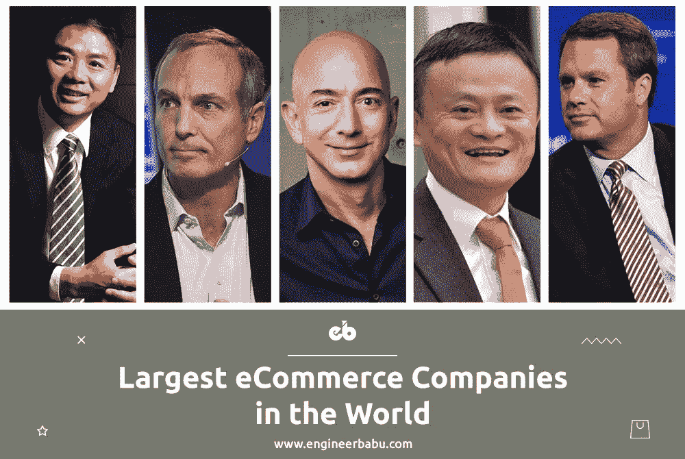
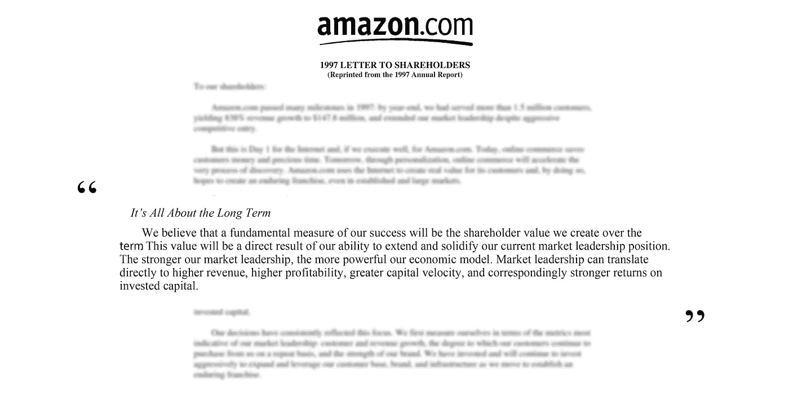
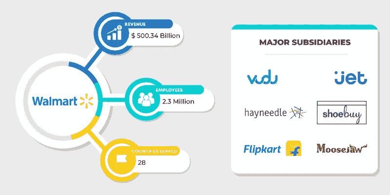
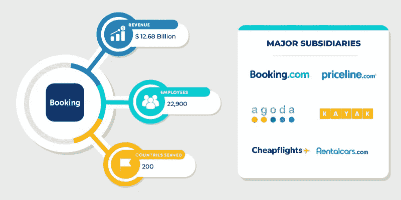
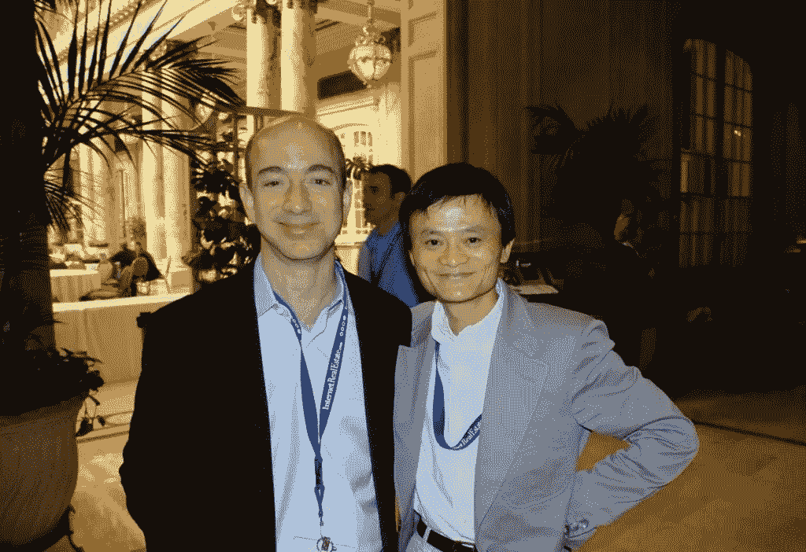

# 世界五大电子商务公司

> 原文：<https://medium.com/hackernoon/the-worlds-five-largest-ecommerce-companies-8dd94dc22614>

过去 20 年，整个贸易格局发生了变化。很久以前，它已经从勉强的线下体验转移到更容易和舒适的电子商务体验——通过点击按钮，一切都可以被购买或出售。

我确信我们大多数人都非常清楚这一点。同样可以肯定的是，几乎我们每个人都可能听说过或使用过这个列表中提到的公司的一些服务。

电子商务领域被世界精英所主导——像马云、杰夫·贝索斯和其他人这样的亿万富翁商人，正在无情地争夺电子商务领域的主导权。

毕竟，电子商务行业无疑是 21 世纪最赚钱的行业。

现在，有人可能会认为他或她对下面列出的公司了如指掌，但我很确定你可能不知道这些公司如此有影响力的秘诀。让我们稍微改变一下我们的范式，从一个全新而古怪的角度来揭示这些公司。

这份名单不全是西方的；不，阿里巴巴不是唯一的中国成功故事:

# 1.亚马孙

只有当你生活在岩石下或者处于美国队长式的昏迷状态一段时间，你才可能没有听说过这种巨大的小鸟。

**这家总部位于西雅图的公司(而不是一个国家)现在是全球最有价值的企业。**

但这并不是亚马逊唯一的头条新闻。现在不朽的亚马逊首席执行官同样出现在新闻中，如果不是更多的话。2018 年，贝佐斯成为世界上第一个亿万富翁。他的净资产估计高达 1371 亿美元(哼！)截至 2019 年。

**那么，这位先生的脑子里到底在想什么？**

通读这幅亚马逊 1997 年致股东信的图片，你会对这位先生的想法有所了解。

Amazon has been a constant with their purpose since its inception. In their annual letter to shareholders, they have always boasted the view of long term and valuing their customers more than anything.

亚马逊公司 1997 年写给股东的信让我们很好地了解了杰夫·贝索斯的运作方式。这封信告诉我们这位著名的创始人多年来坚持不懈的关注，以及对所有追求组织卓越的人的一些宝贵教训。

**这里有几个亮点:**

*   **专注于传递价值:**
    如今有太多的公司专注于维持微薄的利润率，而牺牲了让客户满意的代价。然而，亚马逊一直专注于为客户提供价值。“自成立以来，我们一直专注于为客户提供极具吸引力的价值。我们为顾客带来了比实体店更多的选择(我们的商店现在将占据六个足球场)，并在一个一年 365 天、一天 24 小时营业的商店中以一种有价值、易于浏览、易于搜索的形式展示。”，贝索斯解释道。25 年后，我们可以清楚地看到这种坚定心态的成果。
*   **顾客至上。一直都是。不管怎样。** 作为一家公司，亚马逊一直努力让客户掌控他们的业务。亚马逊对长期的重视，如上图所示，是根据长期的市场领导地位考虑而不是短期的盈利能力考虑或短期的华尔街反应来做出投资决定的。有很多人不同意这种方法。不过话说回来，并不是每个人都能像亚马逊一样创业。
*   永不停止学习亚马逊崛起的另一个重要原因是他们愿意从错误中学习。在一次采访中，贝佐斯承认了未来的道路，“我们现在对在线商务的了解比 Amazon.com 成立时多得多，但我们仍有很多要学习的。虽然我们很乐观，但我们必须保持敏锐和紧迫感。”每个企业家和商人都应该在他们的生意中尝试和灌输这一点。
*   **想象更大的图景**
    贝佐斯总是试图专注于长期收益，而不是着眼于短期盈利。他们拒绝妥协给了公司目的和方向——并使亚马逊从一个在线书商转变为一个全球零售帝国。

# 2.沃尔玛

沃尔玛不仅是世界上最大的零售商(但亚马逊正在逼近)，它还是世界上领先的私人雇主。沃尔玛的产品在 70 多个国家生产。在任何给定时间，沃尔玛在 28 个国家运营的 11，695 家商店平均管理着 461.8 亿美元的库存(2018 年 10 月)。

最重要的是，他们已经进行了几次重大收购(Flipkart 是最著名的一次)，在印度等新兴市场与亚马逊竞争。

沃尔玛的影响力如此巨大，以至于它对社区和整个社会的影响一直是许多领域学术兴趣的话题。

当沃尔玛庆祝成功时，其他主要零售商却在苦苦挣扎。

美国第二大百货公司梅西百货的股价暴跌。对于 2017 财年，该零售商预计销售额将下降 3.2%至 4.3%。

J.C. Penney 在发布疲软的收益报告后，股价下跌了 15.3%。

以客户服务著称的诺德斯特龙公司(Nordstrom)股价下跌 11.3 %，而美国柯尔百货公司公司在令人失望的财务状况后股价下跌近 8%。

那么，为什么在大多数零售市场陷入困境的时候，沃尔玛却在赢呢？

**两个原因:**

*   **忠于你的目标:** 萨姆·沃尔顿于 1962 年创立沃尔玛，只有一个简单的目标:帮助人们省钱，让他们生活得更好。尽管这个组织规模庞大，但它从未忘记自己的目标。即使在今天，帮助顾客省钱也是沃尔玛一切工作的核心。他们坚定不移、激光般锐利的专注让他们脱颖而出。
*   **实现你的目标:** 沃尔玛的每一位员工都坚持已故创始人萨姆·沃尔顿的愿景，他认为，“每一家沃尔玛商店都必须反映消费者的价值观，并支持他们对社区的愿景。”沃尔玛的每个人都认同这一愿景。沃尔玛在组织的每一层采取的每一项行动都是为了支持零售商的宗旨。从简朴的公司办公室到要求所有员工，甚至是高管，清空自己的垃圾箱，每个员工都重视降低成本，这样就能以更低的价格销售产品。这种纯粹的弹性和执行目标的能力是沃尔玛的独特之处，即使在现在也是如此。

# 3.阿里巴巴

阿里巴巴被誉为“中国的亚马逊”，因为它在世界上人口最多的国家占据主导地位。就像亚马逊一样，阿里巴巴的创始人兼首席执行官拥有庞大的粉丝群，并被吹捧为全球企业家和梦想家。

自 21 世纪初以来，阿里巴巴一直在扼杀它，并正在超越沃尔玛、亚马逊和易贝等美国巨头。在公共云收入增长等关键领域，它已经超越了亚马逊、谷歌和微软。

实体几乎无处不在(电影制作、音乐和电影流媒体、在线学习、微博、在线地图、旅游预订、移动应用等等)，阿里巴巴集团向世界展示了中国是一支不可忽视的力量。

那么，是什么因素导致了如此短时间内如此惊人的增长呢？让我们看一看**，**

**未知因素:**

*   忠实的客户群
    阿里巴巴不收一分钱入场费，只收营销和技术支持服务的费用。
    这有助于获得由忠诚客户构成的巨大而稳固的市场份额。阿里巴巴的利润主要来自关键词竞价和广告，这两项占其总利润的 55%。第二个最重要的利润来源(几乎达到 25%)来自基于消费者行为大数据的技术服务。通过取消中间费用和允许卖家免费注册，阿里巴巴已经能够在客户中培养在线交易习惯。
*   **天时地利人和**
    马云把及时行乐看得太重了。阿里巴巴一直擅长识别和抓住独特的商业机会，从而巧妙地将自己定位为培养客户忠诚度的领导者。例如，11 月 11 日是双 11 节，在圣诞节和中国国庆节之间。大多数消费者最初避免在那段时间购物，但淘宝(阿里巴巴的子公司)已经成功地将那一天变成了一个真正的购物节。

# 4.JD.com

如果这个世界上有人能与阿里巴巴这样的电子商务巨头相抗衡，那就是这个电子商务巨头——**JD.com**通过引入先进技术和无人机送货系统，已经开始给阿里巴巴制造麻烦。他们还宣布，他们计划建立 150 多个无人机发射中心，以提高农村地区消费者的送货能力。

**此外，京东还与沃尔玛建立了战略合作伙伴关系，这一关系在今年得到了扩展，以进一步整合他们在中国的资源、平台和供应链。**

最初的失败让刘强东·董强变得坚强，他承担的风险获得了丰厚的回报，使他的初创公司 JD.com 跻身中国电子商务巨头的行列。

“五年内，我百分之百确定我们将成为中国最大的 B2C(企业对消费者)平台——我们将超过任何竞争对手，”刘在给英国《金融时报》的一份声明中表示。

**未知因素:**

*   专注:创始人刘 2009 年在宾夕法尼亚大学演讲时说:“(京东)成功的关键是专注。”。“对我们来说，电子商务就是一切。”
*   JD.com 已经确立了自己在最新科技创新领域的领导地位。刘甚至预测他的公司将不需要任何人，并说:“我希望有一天我的公司将是 100%自动化的…不再有人类，100%由人工智能和机器人操作。”

# 5.记账持有量

Booking Holdings 是唯一一家由零售巨头主导的旅行费用聚合网站。但是有足够的理由在这里提到它们。

据消息人士称，Booking Holdings 在大约 40 种语言和 200 个国家运营网站。2017 年，消费者使用 Booking Holdings 旗下的网站预订了 6.731 亿间住宿客房、7300 万辆租车日和 690 万张机票。

Booking Holdings 股票在 2018 年第一季度触及每股 2229 美元的历史高点。

**这就是我们认为 Booking Holdings 每股价值 2229 美元的原因，**

**未知因素:**

*   **市场覆盖范围:**
    Booking.com 在 200 个国家运营着大约 40 种语言的网站，考虑到他们运营的市场，这是一个不小的成就。Booking.com 总共有大约 2900 万个报告的列表，其中 2300 万个是酒店、汽车旅馆和度假村的列表，近 600 万个是住宅、公寓和其他独特住宿场所的列表。他们的计划是不断增加其报告的房源，扩大其在线住宿和预订网站上的房地产，并提高其技术能力，这有助于他们引领潮流。
*   从我个人和其他人的经验来看，Booking Holdings 可靠的客户服务和具有竞争力的价格以及易于使用的用户界面吸引了重复购买。他们的商业模式依赖于重复购买。他们的目标是为客户提供更好的整体旅行体验，这再次证明了它的市场价值。

# 结论性观点

Source: acommerce.asia

我们在准备这份分析报告时，有几个有趣的时刻，其中最让我们吃惊的是零售业正在经历的整合程度。主要收购活动包括私人股本和零售商收购互联网公司和其他电子商务公司。

就像沃尔玛最近收购 Flipkart 一样，沃尔玛出价高于亚马逊，收购了这家印度电子商务巨头的控股权**(160 亿美元，77%】**。该收购被吹捧为近期最大的电子商务交易。这进一步表明，大型零售商正在关注印度等新兴市场，以加强他们在全球的立足点，同时获得对竞争对手的优势。焦点从美国、加拿大和英国等市场的突然转移是由于发达市场正在经历的停滞。