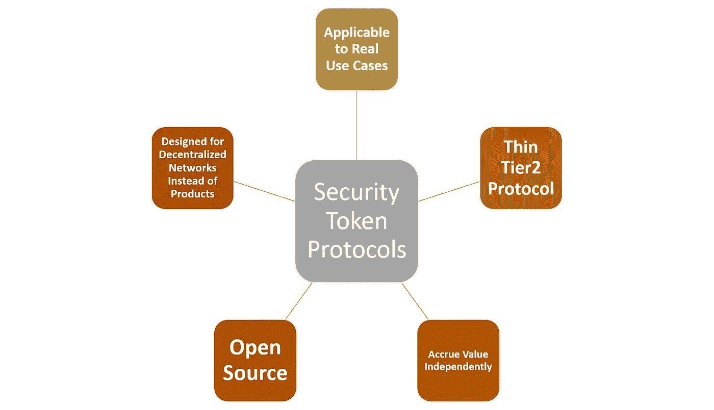

# 瘦安全令牌协议:一种分类法

> 原文：<https://medium.com/hackernoon/thin-security-token-protocols-a-taxonomy-172c0c6c734b>

安全令牌提供了一张空白的画布，让我们以一等公民的身份，用可编程性重新想象金融生态系统。可能性是巨大的，但是从哪里开始呢？为了建立一个开放的、可编程的金融系统，安全令牌将需要新一轮的区块链协议。然而，如今的安全令牌用例已经足够基本，除了合规性堆栈之外，不需要太多协议。同时，如果没有相应的区块链协议，很难想象复杂的金融用例。从这个角度来看，你可以说安全令牌正在经历技术市场中基础设施和应用程序之间的一种非常积极的传统摩擦形式。

在我看来，确定哪些区块链协议将在不久的将来与安全令牌相关是安全令牌市场面临的最重要的挑战之一。虽然新的可编程加密安全的可能性是巨大的，但构建与任何现实世界的安全令牌场景都不相关的协议的风险也是巨大的。如果你读了这篇博客，你可能已经看到了我关于安全令牌协议的一些开放的想法，这些想法不太可能很快实现。我喜欢探索这些想法，因为我认为这有助于我们在一个我认为技术上过于狭窄的空间中扩展我们的思维。然而，我会是第一个反对在当前市场中实施这些概念的人。在我的分析中，有五个关键点可以帮助我们决定特定安全令牌协议的可行性。

1) **适用于真实使用案例:**为了推动安全令牌行业的发展，技术实用主义至关重要。在安全令牌市场的当前状态下，我们应该专注于构建与现实世界用例相关的协议。举一个有争议的例子，我相信市场上对债务用例有足够的需求，这些用例需要一个针对安全令牌的债务协议。然而，目前为衍生品和保证金交易建立协议似乎还为时过早。

2) **瘦第二层协议:**安全令牌市场的当前动态有利于创建在现有区块链上运行的第二层安全令牌协议。支持由第 2 层新安全令牌协议支持的日益复杂的加密金融场景，可以说比解决第 1 层协议(如共识或治理)更重要。

3) **独立获取价值:**决定一个安全令牌协议可行性最困难的标准是决定这个安全令牌协议是否可以独立获取特定产品之外的价值。例如，如果合规性智能合约旨在仅用作特定发行平台的一部分，那么我们谈论的是智能合约功能，而不是协议。

4) **开源:**我觉得安全令牌行业忽视了开源的价值，矛盾的是，开源是区块链运动的基本精神之一。开源分发模型应该是新的安全令牌协议的关键元素。安全令牌的主要目标是构建一个开放的、可编程的证券生态系统。在这个目标中，开放意味着开源，可编程意味着对开发者友好。

5) **为分散式网络而非产品设计:**区块链协议的目的是在分散式网络中协调行动。然而，当前一代的安全令牌平台作为孤立的产品运行，对网络的影响几乎为零。在这种情况下，安全令牌协议的价值大大降低。构建网络或孤立产品之间的平衡不是一个可以用任何想象力解决的小问题，但肯定是安全令牌行业的一个基本论点。

# 安全令牌协议分类

几个月前，我发表了一篇名为[“安全令牌 2.0 堆栈”](https://hackernoon.com/the-security-token-2-0-stack-206b305f5dcd)的文章，其中我讨论了下一代安全令牌平台的一组雄心勃勃的功能。那篇文章中包括的许多协议都不符合上一节中概述的标准，因此，我认为这在不久的将来与安全令牌没有太大关系。然而，按照我们的五点标准作为指导方针，我们可以确定几个非常适合全新安全令牌协议的关键领域。这里有一个可能的分类法，可以作为一个起点。

让我们更详细地讨论一些具体的协议。

## 服从

合规性一直是当前安全令牌平台浪潮的重点关注领域。DS 或 ST-20 等协议抽象了安全令牌传输的一些基本遵从机制。目前，这些合规机制大多局限于验证，如了解客户、反洗钱或投资者认证。扩展法规遵从性检查点集并以第三方应用程序可以无缝使用的方式开放协议应该是安全令牌平台的主要目标。

## 股权

股权支持证券令牌是当前市场中数字证券的主要形式。我认为这个领域足够广泛，应该有一个独立的协议。诸如股票回购、投票权、股票分割等功能应该在协议层进行抽象。

## 债务

作为安全令牌中的一个新兴用例，令牌化债务足够大，应该有自己的协议。股息支付、风险管理、评级或违约解决应该是该协议的关键功能。股权和债务协议的组合应涵盖市场下一阶段的绝大多数安全令牌方案。

## 发行后披露

解决信息不对称是安全令牌行业面临的另一个关键挑战。提供公开材料信息的密码不变证明对于评估密码证券的公平价格是必不可少的。虽然有一些正在进行的努力，将披露纳入发行平台的交易所，我相信这种能力更好地作为一个独立的协议。

## 隐私

数字证券行业需要更高级别的隐私。全球性的公共分类账远非存储证券交易细节的理想之选。在这个新世界中，不同的行业、司法管辖区和金融工具都受到非常严格的隐私要求的约束，需要解决这些问题。一系列基于 zk-SNARKS、zk-STARKS 或 BulletProofs 等想法的隐私协议可能需要推动新一波的安全令牌。

## 监护

在安全令牌领域，托管是我觉得非常令人沮丧的领域之一。一方面，在我们有可行的托管模式之前，很难看到大型机构投资者进入这个领域。另一方面，令人沮丧的是，看到一个行业试图用保管贵金属的相同方法来解决字母数字字符的保管问题。我相信并希望我们将看到专门为安全令牌行业设计的新托管协议的出现。

## 多资产抵押

市场上越来越多的场景聚焦于由动态基础资产池担保的安全令牌。想象一个代表房地产租赁或市政债券池的安全令牌。这种新型的担保模式非常适合新的协议。好消息是，我们可以从稳定硬币运动中借鉴很多想法。

## 令牌持有者管理

随着安全令牌的发展，需要新的令牌持有者管理功能，如限额表管理、投票、红利分配等。变得越来越重要。我喜欢将这些功能作为独立的、分散的协议来处理的想法。

这些是我认为在不久的将来将在安全令牌中扮演重要角色的一些协议。随着行业的发展，许多其他协议也会变得相关，但我们仍然需要更复杂的应用和用例。在新令牌和协议之间找到正确的平衡是当前安全令牌市场的一个关键挑战。然而，我们都应该同意，一个新的、开放的、可编程的证券行业应该有自己的协议。