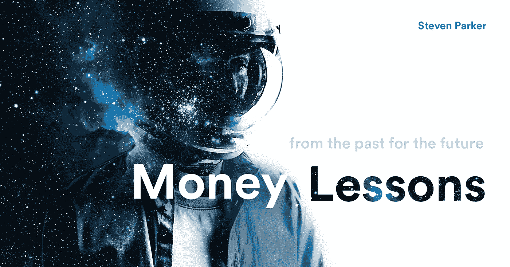
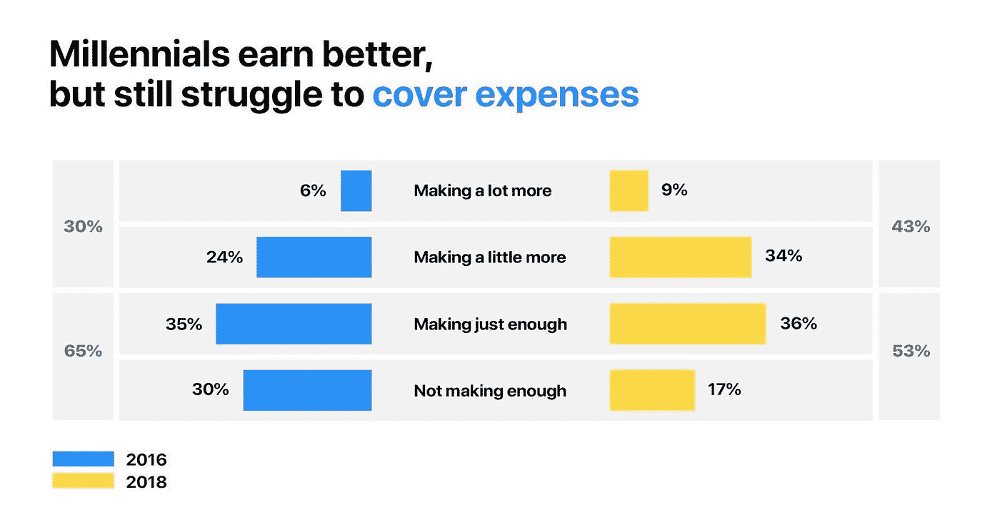
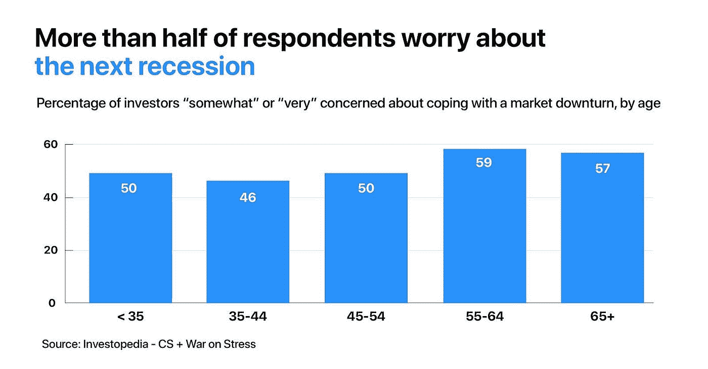
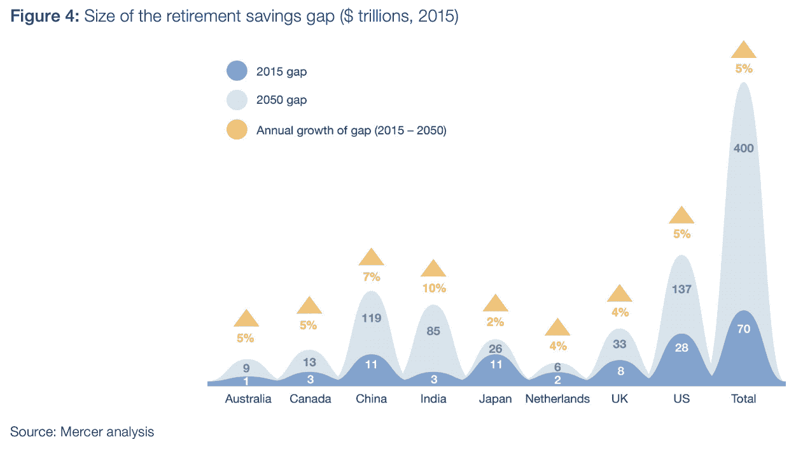
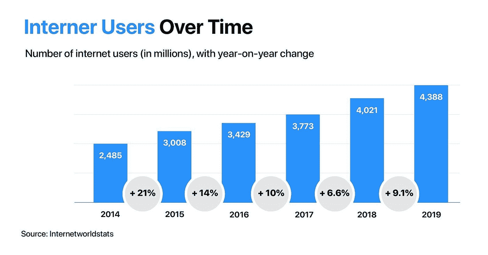

# 钱:我希望在 20 岁时就知道并拥有的东西

> 原文：<https://medium.com/hackernoon/things-i-wish-i-knew-about-money-when-i-was-20-3a4e73dc9bff>

这是清晨，阳光透过咖啡店的窗户。新煮咖啡的味道，背景中令人愉快的爵士音乐，早起的上班族叙旧，分享最新的八卦。这个地方平静、无压力的氛围让我每天早上都回来。只是这次有些事情不太对劲。

一对年轻夫妇坐在附近的桌子旁。他们正在进行所有夫妇都有的那种“严肃”的谈话…好吧，可能不是在早上 7:30。你可以从标题中猜到，他们谈话的主题是…钱！

“我要到月底才能拿到工资，”她阴沉着脸对他说。“我只是没想到会发生这种事。我没准备好。我需要申请贷款”他紧张地回答。

听到这些话并不一定让我感到惊讶，直到我打开平板电脑，首先看到的是一项研究显示，62%的美国人对金钱感到压力*。三分之一的人承认财务问题让他们晚上失眠。作为一个在金融行业工作超过 35 年的人，我很自然地被这个发现震惊了。

资金管理还像“旧时代”那样困难吗？自从我自己还是一名年轻学生以来，我们与金钱的关系是如何演变的？金融机构变好了吗？因为后知后觉，对我的过去进行一次简短的旅行可能有助于回答这些问题。

# 我希望我知道…

## 银行不是你爸爸

去上大学对我来说是一段激动人心的时光。这意味着从我父母的房子里搬出去——自由是要付出一定代价的。除了深入研究现代哲学(我的学位)，我还必须学会如何准备一顿“体面”的饭，避免过量饮用咖啡，当然，还要管理我的财务。

我的第一个重大举措是开立一个银行账户。为此，我不得不去一家银行分行，排队等候，与一名客户专员进行一对一的谈话，签署一大堆文件，然后才能收到我“宝贵”的银行账号。

当时，我也对储蓄的想法感到兴奋。我所有假期都在酒吧和餐馆工作。作为一个从小就对金融感兴趣的人，我知道把钱藏在床垫下不是一个选择。

“你们有什么拯救产品给我？”我问银行职员，希望能找到各种各样的选择。那没有发生。"先生，储蓄账户可以吗？"他回答道。

但是缺乏选择并不是唯一困扰我的事情。每次我想存钱或取钱，我都得去银行。这感觉很像是银行是我每周都要去拜访的某种亲戚。我甚至不得不请求许可，如果我想撤回资金！

如今，我不仅拥有多个银行账户和数字钱包，而且可以通过智能手机访问它们。此外，自动取款机和银行卡的广泛使用削弱了银行管理我们财务自由的权力。是的，仍然有提款和支出限制。像 [Crypterium 卡](https://preorder.crypterium.com/)这样的预付卡解决方案现在提供惊人的每日和每月限额。

## 复利是一生的朋友

尽管很难找到一个好的储蓄账户，但我一直认为复利是随着时间推移积累财富的最可靠方式之一。我并不孤单。就连阿尔伯特·爱因斯坦也曾说过:“复利是世界第八大奇迹。谁理解它，谁就赢得它。谁没有，谁付钱。”

复利本质上是在利息之上产生利息。也就是说，很明显，你开始得越早，未来的回报就越高。咨询巨头安永会计师事务所(Ernst & Young)最近的一项研究显示，超过 65%的千禧一代的收入仅够或不足以维持生活**，这让他们几乎没有空间考虑复杂的投资机会。

在这种情况下，复利变得非常有用，因为它允许你以非常低的初始投资开始，随着时间的推移，它会变成一笔小财富。

我们举一个简单的，非常保守的例子。今天，你将 100 美元存入一个利率为 5%的储蓄账户，每月等额投资。如果你不做任何改变，让账户运行 50 年，你最终会得到 25 万美元。明白重点了吗？

## 保守主义对你的口袋没有帮助

我们大多数人在一生中都会经历多次经济衰退。当我有幸进入牛津大学时，英国正在与滞胀作斗争，英国传统产业出现了强劲的衰退。当我毕业时，经济形势一点也不乐观——很难找到工作。英国 20 世纪 80 年代以收入大幅下降和失业率上升开始。

不幸的是，经济危机似乎确实会在我们的头脑中产生共鸣，并影响我们对金钱的态度。Investopedia 的一项调查发现，35 岁以下的受访者中有一半对面临市场低迷感到“有点”或“非常担忧”。

这可能解释了为什么今天 20 多岁的人投资过于保守，正如乔治亚南方大学助理教授林赛·拉森在 2016 年的一项研究中指出的那样。显然，年轻一代正在通过传统的存款或债券储蓄——最适合接近退休的人。

广义的投资组合通常包括各种金融工具，如货币市场基金、存单(CDs)、债券、共同基金和股票。投资组合应该与你的储蓄能力、风险偏好和目标相一致。

但事实是:20 多岁可能是从事高风险投资的最佳时期。两个原因:在退休到来之前，你还有很长的路要走，你有能力安然度过潜在的低迷期。

投资管理公司 Vanguard 分析了从 1926 年到 2015 年投资组合保守、平衡和激进的人的年回报率***。该研究显示，高风险投资组合的平均回报率为 10.1%，而最保守的投资组合的平均回报率为 5.4%。换句话说，对投资畏首畏尾可能是一个代价高昂的长期错误。

## 政府养老金救不了你

财务需求与我们的人生阶段密切相关。当我们第一次从父母家搬出时，我们成为学生，我们希望能够不时地轻松地支付东西和借少量的钱(就像我咖啡馆里的那对夫妇)。然后，当我们开始建立一个家庭，有一份稳定的高薪工作，我们想省钱，同时，我们承诺大笔开支，如汽车或抵押贷款。当我们还清债务并开始存更多的钱时，我们终于开始考虑退休了。这些金融周期并没有真正改变。但是他们现在不得不这么做，尤其是到了退休的时候。

今天不行。十年内不会。50 年后也不会。但是公共养老金正在减少和消失。医学的进步正在帮助我们活得更长——100 岁的寿命现在对许多千禧一代来说是可能的。对政府来说，这意味着支付养老金的年限超过了系统最初设计的年限。

世界经济论坛的一份报告甚至将美国、英国、日本、荷兰、加拿大和澳大利亚的养老金体系称为“全球定时炸弹”，因为公共养老基金预计到 2050 年将短缺 224 万亿美元。根据该文件，这可能是“历史上最大的养老金危机”。如果你把中国和印度也算上，缺口将达到 400 万亿美元。这是全球经济货币规模的五倍！

各国政府充分意识到这一危险局势，他们没有浪费时间。尽管政治后果巨大，但世界各地的公共行政部门都在提高男女退休年龄。与此同时，养老金的走势相反。

世界经济论坛(World Economic Forum)金融和基础设施系统负责人迈克尔德雷克斯勒(Michael Drexler)解释说:“预期寿命延长和由此导致的人口老龄化，在金融上相当于气候变化。”。

考虑到这一现实，每个人都必须认真考虑退休储蓄，而不考虑政府在以后的生活中可能提供或不提供什么。从有息账户到房地产，有很多选择可以在未来“确保”稳定的收入。

## 预算是一种必要的罪恶

与此同时——无聊、耗时、复杂且难以理解。是的，我说的是预算。回到大学，我知道如果我想生存，我必须坚持一定的预算。但是真正坐下来数数这个简单的想法令人厌倦。

预算可以帮助你削减不必要的开支，让钱得到更好的利用。无论你是一张接一张地生活，还是收入丰厚，跟踪你的资金是确保长期财务繁荣的重要一步。

与流行的看法相反，预算不是关于限制你花钱的事，而是关于了解你真正有多少钱和花在哪里。

当卡和数字支付还没有广泛使用时，人们不得不坐下来，试图弄清楚他们每天花了多少钱。现在，你需要做的就是进入你的口袋，打开你的银行应用程序或钱包，查看交易历史。如今，很多数字钱包都包含了简单的预算和跟踪工具。

# 我希望我有…

## 以客户为中心的银行业务

不久前，我还在依赖我的主要银行来满足我几乎所有的需求。贷款、信用卡、储蓄等。这就是过去的工作方式。不是为我，而是为我们大多数人。

数字化让初创企业能够开发创新服务，这些服务往往比传统银行能够提供的服务更具吸引力。鉴于这些新的服务，人们(包括我在内)开始分散投资？凯西，肉豆蔻。往国外汇款？[隐窝](http://crypterium.com)。快速拿到工资？钟声，N26。迄今为止，我已经在手机上安装了十几个银行和钱包应用程序。

当然，银行并没有忽视这一趋势。他们明白，以客户为中心对于确保他们在数字时代的生存至关重要。

全球咨询公司 Strategy&(前身为 Booz & Co .)将以客户为中心的银行描述为“在每个客户经历婚姻、房屋所有权、为人父母和其他转型生活经历的过程中，对其不断变化的生命周期需求保持整体和持续的看法。”

以客户为中心的银行不太可能向所有人推销相同的产品，而是调整这些产品，以有效地满足不同客户的需求。换句话说，他们与客户合作，帮助他们解决问题。

这似乎很有效。根据 Collinson Group 的一项研究，47%的美国中产阶级客户对了解他们并区别对待他们的银行更加忠诚，而 49%的人希望银行主动提供符合他们特定需求的服务。

## 资金管理工具

预算可能是一件必要的事情，但是让我们面对它:不是每个人都擅长它。令人欣慰的是，科技让我们所有人轻松理财。

在美国，像 Mint 这样的服务可以让你连接所有的信用卡、银行账户，在某些情况下，甚至可以连接退休账户，从一个平台上跟踪你的财务状况。账单提醒、预算跟进、信用评分计算器、分类支出、预算建议——一切顺利且自动完成。

随着最近的法规——支付服务指令 2 (PSD2 ),欧洲也朝着实施“开放银行业务”的方向发展，要求银行通过开放的 API 与受监管的企业共享财务信息。在英国，这打开了资金跟踪解决方案的大门，如资金仪表板。

像汇丰银行这样的创新型大银行已经在使用开放式银行来留住他们自己的客户。汇丰英国客户现在可以将他们的非汇丰账户连接到银行的移动应用程序，并跟踪他们的所有支出。

但即使监管机构营造更友好的环境来支持创新，EY 的开放银行机会指数*****概述了金融数据整合商在赢得客户信任方面仍有很长的路要走，客户信任是他们成功的关键。

## 不同的省钱方法

人们倾向于把储蓄想象成“罐子”。退休基金，度假基金，教育基金。一些像 Monzo 这样的银行现在允许你设置不同的储蓄罐，所以你可以很容易地看到你的储蓄进度。

如果你以前想开始存钱，你就要负责把钱存起来。现在不再是这样了。我个人非常喜欢自动储蓄功能。你可以把它设置成把你的开销凑整，然后“留着零钱”存起来，或者让系统每月从你的工资中扣除一定的金额。

还有更多。例如，凯西通过将股票象征化并允许每个人购买少量股票，实现了股票投资的民主化。这是真正的变革，因为过去对大多数人来说，获得这些类型的资产是遥不可及的。你必须开一个证券账户，而且你需要很多钱来这样做。

## 知识的民主化

除了金融服务的民主化，我们也正在走向知识的民主化。虽然互联网的全球普及率目前为 57%，这意味着仍有超过 40 亿人无法使用互联网，但互联网用户的数量正在持续增长。

如果我想在 20 多岁的时候找到复利的细节，我必须花时间在计算尺或早期的计算器上。现在，我可以在 Investopedia 等网站上获取最新信息，或者通过社交媒体平台询问我的朋友。

## 适合我的投资

投资是关于你的风险偏好和长期目标。你能承受多久没有钱？如果你需要在一两年内收回资金，那么你自然会选择风险更低的替代产品。如果时间不是问题，你愿意让这笔钱运行十年，而不需要接触它，那么你可以投资的范围会更广。

与过去僵化和有限的投资选择不同，今天我们有灵活的解决方案，允许我们在需要时随时提取资金，并自动投资于预先打包的投资组合，而无需打电话给经纪人。

必须事先通过风险预测了解你的风险偏好，以了解你是否有心态和储蓄能力来承受亏损。在许多国家，这是任何投资 app 或开户的强制流程。

# 底线

那么，20 岁的我会怎么想呢？他会对我们现在在消费、储蓄和借贷方面的选择和灵活性感到惊讶。从银行和自动取款机，到信用卡，再到现在的数字应用程序，如 Crypterium，整个转变都是革命性的。

尽管我们不同的需求没有改变，但我们管理金钱的方式已经发生了不可估量的变化。当我们经历人生的各个阶段时，我们会在人生的不同时期经历相似的财务需求。花时间了解我们与金钱的关系，与让以客户为中心的组织随时准备帮助我们一样重要。幸运的是，由于数字化，今天我们不仅可以花更少的时间为自己设计可持续的财务计划，而且我们还可以通过几次点击获得一些最佳解决方案。有人要咖啡吗？

**参考文献**

*来源:【https://bit.ly/2wnLatJ 

* *来源:【https://go.ey.com/2PGLpfL 

* * *来源:[https://vgi.vg/2M3bsM7](https://vgi.vg/2M3bsM7)

* * * *来源:[https://bit.ly/2s5nUO3](https://bit.ly/2s5nUO3)

* * * * *资料来源:[https://go.ey.com/2CWoia3](https://go.ey.com/2CWoia3)

*免责声明:本文旨在提供一般信息，不应被视为财务建议。本文中提到的一些服务可能在您所在的地区不可用。*