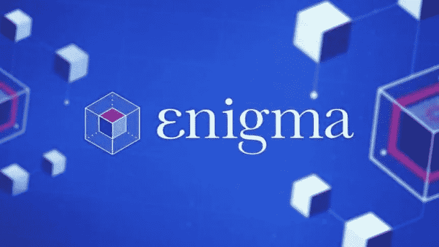
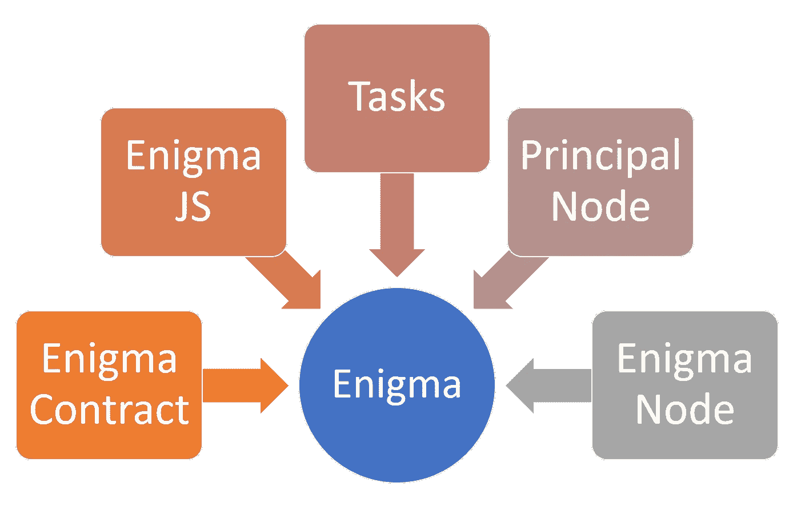

# 重塑区块链的隐私:麻省理工学院孵化的解决方案

> 原文：<https://medium.com/hackernoon/this-mit-incubated-project-is-reimagining-privacy-in-blockchains-4888569cf202>

*昨天，* [*区块链隐私初创公司 Enigma 宣布其第二个 testnet*](https://www.coindesk.com/enigma-launches-second-testnet-designed-for-secret-contract-development) *面世。Enigma 诞生于麻省理工学院(MIT)媒体实验室，它从一个非常独特的角度来解决区块链应用程序中的隐私和可伸缩性问题。为了配合新版本，我更新了一篇我发表的关于 Enigma 的文章。*

区块链可能是几代人中最具突破性的技术，但与其他技术趋势相比，其主流采用仍然相对有限。区块链群体非常清楚，为了简化区块链技术的采用，需要解决几个挑战。在这些挑战中，没有两个比隐私和可伸缩性更重要。

区块链社区内部正在努力解决这些问题，但大多数都依赖于创建全新的区块链基础设施。几年前，麻省理工学院(MIT)媒体实验室的安全研究人员发表了一篇论文[，概述了一种不同的计算模型，可以解决任何区块链的这两个问题。他们称这项技术为“谜”,大概是为了纪念二战期间德国用于加密信息的密码机，它在计算机工业的发展中发挥了重要作用。几个月后，麻省理工学院团队决定超越学院，推出 Enigma，以便为任何区块链带来隐私和可扩展性。](https://www.media.mit.edu/projects/enigma/overview/)

**英格玛是如何解决隐私的？**

从概念的角度来看，Enigma 被设计成可以连接到任何区块链，并将私人的和密集的计算卸载到一个离线网络上。所有交易都由区块链促成，该系统基于数字签名和可编程权限实施访问控制。

Enigma 带来的关键思想是能够在不访问数据本身的情况下对数据进行计算。更具体地说，Enigma 关注的计算类型是智能契约，在 Enigma 的上下文中，这种契约被称为秘密契约，因为它通过堆栈实现了额外的隐私级别。当使用 Enigma 时，秘密合同在区块链上执行它们的公开版本，而对于私有或计算密集型部分则依赖于 Enigma。

秘密合同背后的魔力是通过利用一种被称为安全多方计算(sMPC 或 MPC)的新技术实现的。在这个计算模型中，数据查询是以分布式方式计算的，没有可信的第三方。数据在不同的节点之间分割，它们一起计算功能，而不会将信息泄露给其他节点。具体来说，没有哪一方能够访问全部数据；相反，每个政党都有一个随机的片段。MPC 可以被视为计算机科学中著名的*百万富翁问题*的解决方案，该问题描述了两个百万富翁对知道他们中谁更富有感兴趣，而不透露他们的实际净资产。

**Enigma 是如何解决可扩展性的？**

确保可伸缩性的 Enigma 体系结构中的关键构件是链外存储模型。Enigma 包括一个分散的离链分布式哈希表(或 DHT ),可通过相邻的区块链访问。在该模型中，区块链存储对数据的引用，而不是数据本身。在将存储和访问控制协议编程到区块链之前，应该在客户端对私有数据进行加密。

从存储的角度来看，Enigma 可以被认为是分布式节点的集合。每个节点都有不同的份额和加密数据视图，因此计算过程保证了隐私保护和容错。

**谜一般的建筑**

当前版本的 Enigma 包括几个关键组件，致力于在分散应用中实现隐私和可伸缩性。

Enigma 合同:Enigma 合同主要包含保护网络安全的逻辑。为此，它有一个已注册工作节点的列表。它接收来自 Dapps 的计算任务请求，并将它们广播到 Enigma 网络。

**Enigma JS 库:**Enigma 客户端库，Enigma-js 是一个与 Enigma 协议接口的 javascript 库。这个库的 API 描述了 dApp 与 Enigma 交互所需的任务，比如加密和验证。

**任务:** Enigma 表示使用任务结构的计算。每个活动任务项包含由 Dapp 用户支付的计算费用。

**主节点:**主节点是一个临时集中节点，执行两个关键功能:

1)生成随机种子供工人选择；

2)将加密密钥传播到加入网络的其他节点。

**英格玛节点:**每个英格玛节点基于两个主要组件:表面和核心。表面是一个 Enigma 节点的不可信组件，其主要功能是协调 Enigma 契约和核心之间的计算任务。Surface 参与工人选择和计算任务。核心是 Enigma 网络的可信组件，执行计算任务。

智能架构中的上述组件确保了以太坊智能合约的隐私性和可伸缩性。在功能上，英格玛从以太坊区块链卸载了计算任务。。使用 Enigma-JS 客户端库，以太坊开发人员既可以安全地加密内存中的敏感数据以供立即使用或存储，也可以在发送数据和支付费用之前，获得目标工作人员正在安全运行可信硬件(SGX)的权威证明。计算任务被传递给 Enigma 合同，然后在 Enigma 网络中广播该任务。在这一点上，注册的工人执行随机抽样彩票算法，以确定他们是否应该执行该任务。选定的工作线程利用其可信硬件来解包任务，解密其参数，并将执行委托给其内部 EVM。执行后，任务属性(例如:输入、代码和输出)的散列用仅存在于可信硬件中的私钥进行签名。然后，该数据被提交到链上，其出处和完整性被加密验证。

当前版本的 Enigma 作为一个自容器 docker 网络运行，它包括多个容器，这些容器具有平台的不同组件以及一些补充技术。

Enigma 并不是唯一一个试图解决区块链应用中的隐私和可伸缩性挑战的平台(我最近发表了一篇关于该领域中一些最有前途的技术的概述)。不管是否处于竞争空间，Enigma 都提供了一个独特的角度，确保与以太坊兼容，并提供了过去几十年中一些最先进的密码学研究的第一个实际实现。