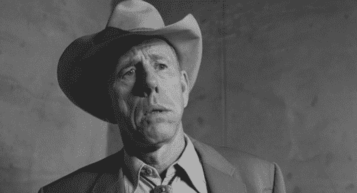

# 关于故事如何运作的三个被误解的概念

> 原文：<https://medium.com/hackernoon/three-misunderstood-notions-about-how-stories-work-aada6189cdb>

## **如何在不实际讲故事的情况下利用故事的力量**

过去几年围绕讲故事的大肆宣传有点像海啸，尤其是在科技领域。身处这场风暴的中心，我目睹了我的战略叙事实践从被视为新鲜和有点冒险的转变为陈旧和琐碎。

如今，随着尘埃落定，很明显，那些原本要带给商业世界的革命故事已经失败。是的，大量的内容/文案将自己重新定位为故事讲述者。是的，许多传统习俗获得了与故事相关的名字(现在一切都是“我们的故事”，不是吗？).但是开发战略信息的方法基本保持不变。

看看新任命的公司讲故事负责人专注于什么，他们痴迷地与我们分享[他们的](https://youtu.be/qLBs2AW2X64)或[客户的](https://youtu.be/gBMK3qPn3CQ)故事。伙计们，那些都是老一套的“推荐”和“创始人的故事”。“很多时候他们很烂，他们没有能力突破你观众的冷漠。

当故事被正确使用时，它们可以为企业带来无与伦比的结果。然而，在核心业务层面，对故事以及“故事”的真正含义的正确理解仍然很少。

## **关于故事的普遍误解**

我邀请您更深入地了解这些故事，并了解这些故事的三个关键方面，它们将帮助您真正利用这一神奇工具的全部功能:

# **1。故事不仅仅是我们讲述的，也是大脑创造的**

大多数研究故事影响的神经科学家(是的，现在是一件事)都同意迈克尔·加扎尼加教授在 70 年代做出的核心发现:我们的大脑总是试图创造关于所有外部刺激的故事，以便理解它。

当我们遇到新事物时，比如说一个脖子上有纹身的人，我们试图通过在大脑中编造一个故事来理解它。现在，这个关于他的故事将基于先前的经历和信仰；因此，人们可能会认为他是前科犯或帮派成员。

现在，这里重要的是我们的大脑一直在编造这些故事，而且是在信息到达意识之前。

不信？只要试着理解以下六个被认为是经典短篇小说的词:

> **待售:婴儿鞋，从未穿过。**

你脑子里刚刚发生了什么？它是否试图有意识地一条一条地分析这句话中的信息，以便得出有意义的结论？还是一个故事突然出现在你的脑海里？这个故事是关于什么的？你的大脑刚刚给你讲了一个有死婴的贫困家庭的故事吗？为什么？？？

没关系，你不是一个人在这里。我认识的大多数人都杀了这个孩子。(事实上，我认识的所有人…除了我妈妈，她认为这些鞋子是因为不合季节的天气而出售的。宝宝死了，妈妈，让它去吧！)

编造这些故事并不是我们有意为之，而只是我们大脑工作和储存信息的一部分。这是它试图理解我们这个通常毫无意义的世界的方式。(这里我可以引用相当多的支持性研究数据，但这会让文本非常难以阅读。下次吧。感兴趣就跟着来！)

这意味着，不管你想不想，你的客户都会告诉自己一个关于你的产品或服务的故事。此外，这个故事很容易成为一个障碍，因为在许多情况下，人们告诉自己关于公司及其产品的负面故事。

# **2。** **这些内部叙述很主观**

回顾一下我妈妈对“婴儿鞋”故事的看法会帮助你理解这一点

我们的内部故事是非常主观的。如果时尚界的某个人遇到了同一个脖子上有纹身的人，他们可能会认为他是时装模特(这也是现在的事情)。

此外，想想人们对同一新闻事件的不同看法。来自不同背景的人，男人和女人，共和党人和民主党人……我们都告诉自己关于同样情况的不同故事。

这也意味着，**与直觉相反，以最纯粹的形式分享信息会带来被他人误解的最高风险**。不同的人会对相同的信息讲述不同的故事。

将信息转化为故事，可以在你和你的目标人群之间建立联系。当我说对齐时，我实际上指的是讲述者和各种听众之间脑电波的真正对齐:

*高效的战略叙事*要求在客户调查期间更深入地理解内部叙事。此外，它还会产生针对不同观点的子群体定制的战略故事。

# **3。** **你不需要故事本身**

说了这么多，我们告诉自己的故事和别人告诉我们的故事并不完全一样。我的大脑不走:*从前在一个很远很远的星系里* …

我们大脑的故事不一定是口头的；这是对现实的一种主观和直观的表现。基本上，这只是一群神经元在试图理解他们以某种方式接触的令人困惑的世界时发出的剧烈的放电。他们只是试图填补他们迫切需要的缺失信息，比如主角的动机(无论是卖鞋的还是脖子上有纹身的家伙)。

对我来说，这意味着*一个有说服力的沟通者的角色不一定是讲故事，而是要确保一个听众拥有所有正确的片段来完成一个故事拼图。*

## **关注故事情节**

对于那些已经觉得自己缺乏讲故事所需的创造力的人来说，故事的复杂性和艺术天赋可能会令人沮丧和不知所措。但我告诉那些人的是，这种观点实际上应该鼓励他们。

你不需要像马克·吐温那样的直觉天才来创作有影响力的故事，也不需要艾迪·墨菲那样的舞台表现力。根据我的故事方法，善于分析的人可以成为最好的战略故事讲述者。(这些人也是报告从我的咨询和研讨会中获得最大价值的人。)

精心制作一个故事的基本模块，并允许观众将这些点连接起来，这对于以相对理性的决策为特征的领域来说是完美的。它也允许人们在讲故事听起来不专业的地方使用故事的力量。任何一条信息，从最无聊的金融数据到研究结论，都可以被构建成引人入胜和有影响力的故事。

以这篇文章为例:它包含了所有基本的故事块，以确保我们是同步的，而不是听起来像一个寓言。我会在以后的帖子中写更多关于这些区块的内容…顺便说一下，这是你为续集留位置的方式…

_____

朋友们，如果这听起来很有趣，请跟我来，并考虑给我一些掌声或者——上帝保佑——分享一下。这些产生了我继续写作所急需的多巴胺，因为我自己远不是马克·吐温。谢谢！