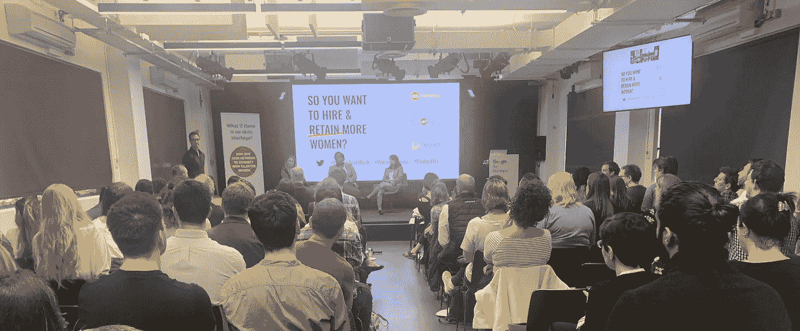
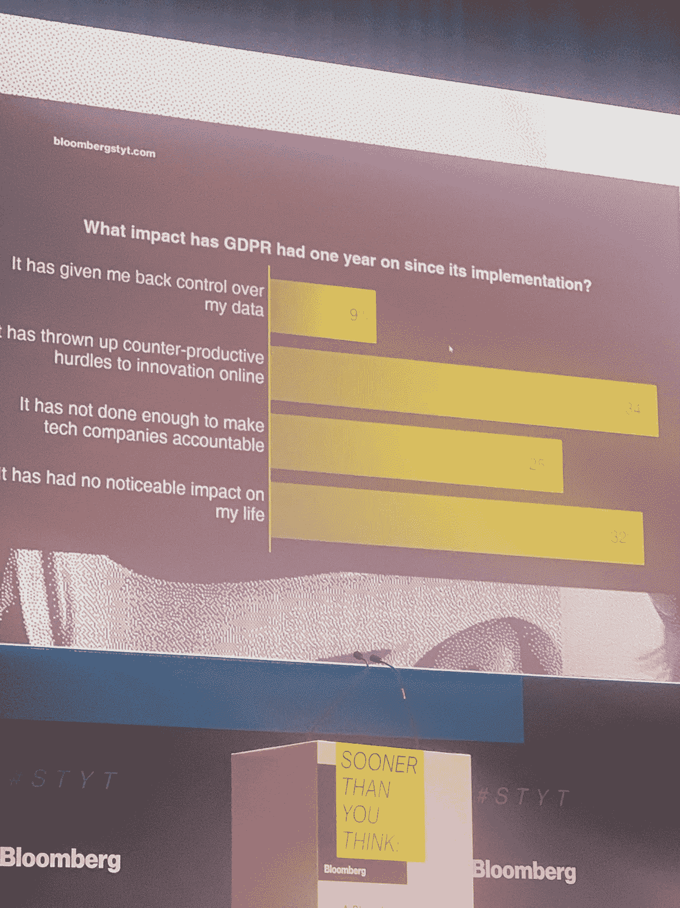

# 伦敦科技周初创企业的三大趋势

> 原文：<https://medium.com/hackernoon/three-trends-for-start-ups-from-london-tech-week-301e8ca3f5c6>

伦敦科技周由七天的密集活动、会议、峰会、研讨会、见面会和足以让整个国家升温的炉边聊天组成。主题范围很广，从企业和规模公司到政府和媒体机构，所有类型的组织都参与进来。虽然主题本身差异很大，但伦敦科技周的所有活动都有一个共同的主线——他们分享知识来帮助我们创新。

随着“数字化”的速度，这是一个非常有价值的练习，可以深入到一周所能提供的一切，吸收各种想法。作为澳大利亚政府贸易代表团的一部分，Hassl 团队从墨尔本到伦敦旅行了 16，893 公里，因此对于那些未能参加的人来说，这里有一个可操作趋势的总结，这将使我们忙碌到下一个技术周:

# **利用技术雇佣多样化的员工**

Google Startups, So you want to hire & retain more women?

多元化是企业的人力资源目标，对于扩大科技业务来说，这是我们增长战略的必要组成部分。我们需要多样化的思维，以便有效地解决问题，并找到进入市场的创造性方法。当谈到性别时，虽然在英国平均有 18%的薪酬差距，但在技术领域，这一差距高达 25%。

以下是几家利用技术解决这些问题的全球大公司:

*   [*Work180*](https://uk.work180.co/) 是一个预先筛选雇主以确保他们支持女性的平台，事实证明，承诺在以下情况下招聘更多员工的公司的员工保留率提高了 28%。
*   [Applied](https://www.beapplied.com/) ，一套使用行为科学来消除招聘过程中的偏见的招聘工具，提倡在招聘过程中加入预测效度。

最终，多元化的工作场所是自上而下的。当你在培养你的高管时，想想看——他们看起来都像我吗？

# **是时候真正为人工智能做好准备了**

虽然 25%的彭博现场观众认为人工智能永远不会达到人类水平的能力，但谷歌人工智能负责人 Scot Penberthy 认为，在我们的有生之年，他们将成为人类水平的人工智能，他的整个职业生涯都在研究机器学习。陪审团已经出来，人工智能将对所有类似于互联网的行业产生颠覆性影响，所以是时候开始认真对待它了。

最好的起点是清楚地了解它是什么。人工智能是一种可以展示我们称为人类的认知功能的技术。一个很好的例子是机器学习，算法模型允许计算机像人类一样学习。这里有一个没有算法这个词的定义:

> “75 年来，我们一直在告诉计算机做什么，现在算法可以告诉我们做什么。”
> 
> 奈杰尔·图恩，Graphcore 的联合创始人

实际上，这意味着像图像处理这样的任务，过去需要一个人花三天时间才能完成，现在计算机可以在一个小时内完成。

QuantumBlack 首席执行官海伦·梅休(Helen Mayhew)描述了人工智能中人的作用。我们必须首先接受并理解。对于初创公司，我们需要花时间了解人工智能可以做什么，并创造一种文化，让它成为我们团队的工具。其次，我们必须学会解释输出，特别是机器学习可以读取我们的数据，并告诉我们一些有趣的见解，但(在这个阶段！)实现这些见解取决于你的团队。

> 人工智能是一种通用的预测器和创造者。斯科特·彭博思，谷歌人工智能

作为一个成长中的企业，我们也应该意识到当前人工智能主流使用的障碍。当前人工智能的碳足迹太高，谷歌的斯科特呼吁建立新的架构，可以匹配人脑，而不像计算机，我们的大脑需要 25 瓦来计算数学方程。

那么 AI 可以用来做什么，初创企业如何参与进来？虽然较大的公司正在寻找人工智能可以自动化任务的方法，但初创公司有机会使用市场上的人工智能工具来模拟客户和流程，以提供比人类更好的用户体验。这方面的一个例子是 Hassl brain，这是一个我们使用简单的机器学习构建的业务功能，可以接管您的 web 应用程序中任何重复的项目管理任务。

在可以为初创企业赋能的工具方面，最好的起点是谷歌的 Tensorflow 和 Python 教程或亚马逊网络服务的 Sagemaker。人工智能可以让人们和企业家在世界任何地方将创意转化为产品。

# **认真对待网络安全**

在数百名彭博直播观众中，只有 9%的人认为 GDPR 让他们控制了自己的数据，而 34%的人认为这对在线创新设置了适得其反的障碍。虽然企业家和技术专家观众可能对新的欧洲数据法规不太感兴趣，但法规肯定不会有任何进展。老好人马克·扎克伯格目前正因 11 次违反 GDPR 而接受调查，尽管这似乎没有对他的业务造成太大损害，但现在是时候让企业为灾难做好预案了。

鉴于云计算技术业务的庞大规模，爱尔兰 GDPR 的负责人海伦·迪克森(Helen Dixon)呼吁在可能的情况下对数据安全进行自我监管。当我们考虑到确保客户数据安全的压力越来越大以及网络安全威胁越来越大时，创建和实施可靠的策略来应对任何数据或隐私泄露变得比以往任何时候都更加重要。

那么我们如何自我调节呢？最好的起点是来自可靠来源的免费在线建议。许多政府部门提供网络安全资源和清单。然后选择一家能够以很低的成本提供企业级安全措施的提供商。在 Hassl，我们使用亚马逊网络服务托管和安全产品。

#伦敦科技周#趋势#创业

由劳伦·克里斯托，[哈塞尔](http://hassl.co)