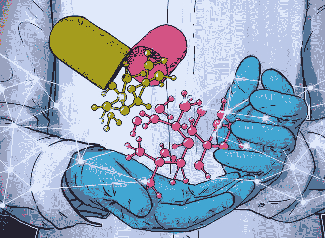

# 肿瘤学将从区块链中受益的三种方式

> 原文：<https://medium.com/hackernoon/three-ways-oncology-will-benefit-from-blockchain-34056709f8da>

Oncology Blockchain

> 有了区块链作为资源，医疗保健高管可以帮助肿瘤学家在诊断和治疗患者的方式上取得重大进展

大约五分之四的医院拥有基本的电子健康记录(EHR)系统，这应该引起人们的警惕，原因只有一个:五分之一的医院没有使用它。这意味着 20%的医疗服务提供者仍然依赖手工备案程序，这种程序在洛克希德公司在 20 世纪 60 年代中期开发电子系统时就已经过时了。这不应该让人感到震惊。因为在快速采用技术方面，医疗保健机构处于落后地位。

以区块链为例。尽管区块链十年前就已经成为主流，但它现在才开始引起一些前沿医疗保健提供商的注意。仍处于起步阶段，医疗保健提供商大多使用区块链来帮助促进 EHR 管理或简化供应链和物流功能。例如，德国公司 Camelot ITLab 依靠区块链在体外细胞治疗过程中仔细地[监控细胞运输](https://www.ledgerinsights.com/blockchain-cancer-treatment/)，这只是区块链与许多卫生专业无缝结合的几种方式之一。

由于加速采用，预计到 2025 年，区块链将对医疗保健产生 56.1 亿美元的影响，其用途预计将超出供应链，进入癌症研究和治疗等领域。有了区块链作为资源，医疗保健高管可以帮助肿瘤学家在诊断和治疗患者的方式上取得重大进展。

# 采用区块链的好处

采用技术并不容易。大型 EHR 企业忙于管理其当前的基础架构，缺乏资源和专业知识来监控一些高级或复杂的健康问题，如癌症。通过区块链，医疗服务提供者为他们的肿瘤团队提供了深入了解疾病复杂性的机会，以便更好地制定行动方案。

在产前水平，区块链可以分析胚胎的任何遗传倾向。通过对胚胎的基因组测序，研究人员可以确定它是否包含癌症和其他疾病的高风险，这使得医生可以采取预防措施。

当然，基因组可能是所有数据中最个人化的，历史告诉我们，像谷歌和脸书这样的公司不能信任它。然而，有了区块链，就有可能删除个人身份信息并自由共享这些记录。区块链允许医疗保健信息的自由流动，这可能导致许多新兴医学进步的突破。

# 构建更好的解决方案

区块链为其集成的任何流程注入了透明度。这里有三种方法可以促进肿瘤学家的研究和治疗工作。

## 1.信息共享将更加无缝。

医疗保健领域的一个长期问题集中在不同的数据系统上。患者通常从他们拜访的每个医疗保健提供者的空白医疗记录开始，这意味着每个新的提供者都浪费时间和金钱来收集相同的冗余信息。

借助 SaaS 支持的区块链，非受保护的健康信息可以跨设施和网络无缝传输。有了基于区块链的医疗记录，医疗保健提供者(和患者自己)可以从世界任何地方访问这些信息，使他们能够更快地提供更好的护理。

## 2.患者匹配将会改善。

根据一项研究，只有 16%的癌症患者[在考虑治疗方案时知道可用的试验](https://www.dataart.com.ar/news/blockchain-in-healthcare-complex-challenges-overshadowed-by-the-hype-need-to-be-overcome/)。借助区块链，共享信息可以将患者与相关的临床治疗方案相匹配。

有了这个潜在的选项，医疗服务提供者可以取消对 EHR 的识别，并将其添加到一个公共可用的分类帐中，该分类帐会通知癌症患者有关他们理想匹配的治疗选项。病人不会是这种系统的唯一受益者。通过用最理想的患者填补空缺，临床试验可以提高准确性，并刺激更可靠的治疗方法的产生。

## 3.研究将变得更有效率。

公开的医疗记录分类账也可以为有史以来最彻底的医学研究提供信息。人类基因组测序的第一次尝试花费了[37 亿美元](https://ark-invest.com/research/genome-sequencing)，并且需要 13 年的计算能力。目前，这一过程的费用约为 1000 美元，而且不到三天就能完成；按照这种速度，未来五年内油价将跌破 100 美元。

有了这么多可用的遗传和医学信息，肿瘤学家可以为迄今为止无法治愈的疾病开发出突破性的治疗方法。通过一个匿名的基因组数据库，[模式匹配过程](https://www.ozy.com/pov/an-apple-a-day-and-a-digitized-genome/81125)比较评估具有相似基因组的癌症患者(一个年长的和一个年轻的),并观察饮食、锻炼和其他无形因素如何影响整体健康。这些信息使肿瘤团队能够识别患者的模式，从而更好地为随后的治疗和研究提供信息。

区块链远远超越了比特币。虽然加密货币的受欢迎程度时好时坏，但区块链是一种灵活的技术，有许多应用，包括肿瘤学。随着持续的研究和开发，癌症专家可以挖掘疾病的根源，以改善提供者的流程和患者的结果。