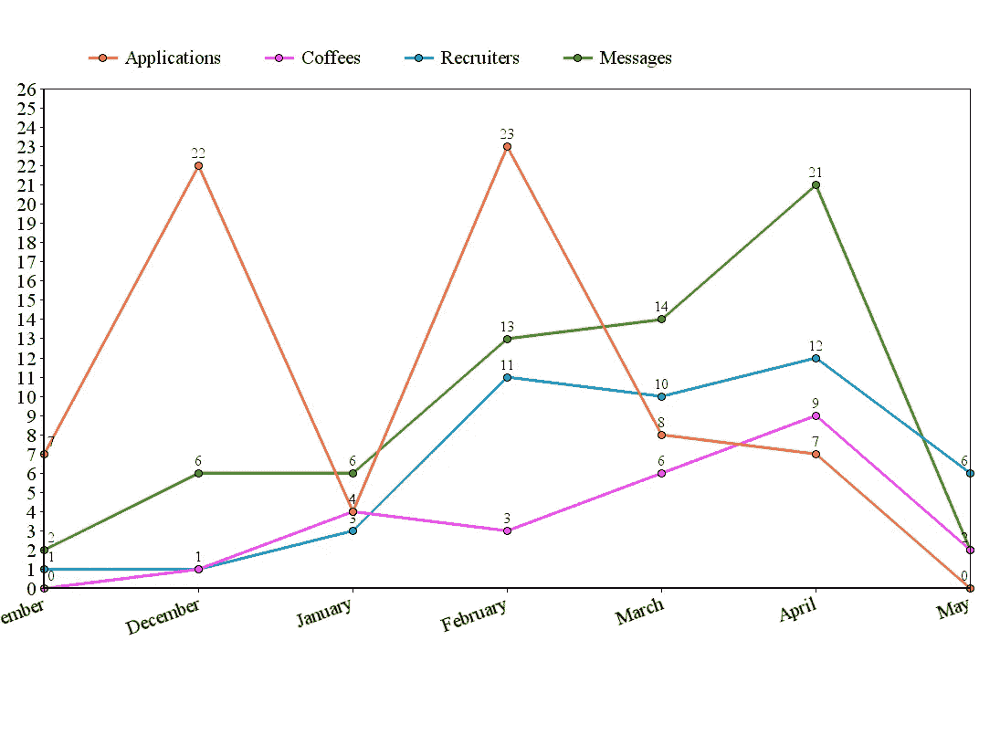
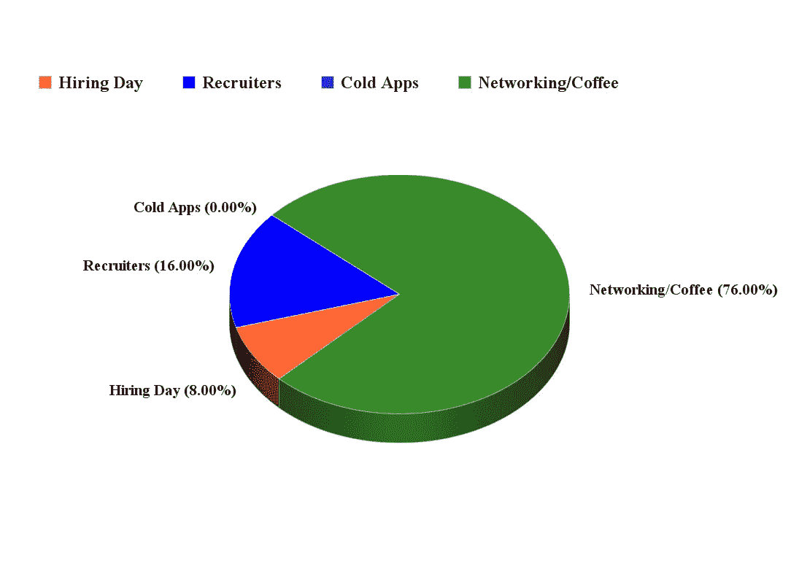

# 训练营结束后获得软件工程工作的技巧

> 原文：<https://medium.com/hackernoon/tips-on-landing-a-software-engineering-job-post-bootcamp-fac8778e3fc7>

Photo by [Max Nelson](https://unsplash.com/@maxcodes?utm_source=medium&utm_medium=referral) on [Unsplash](https://unsplash.com?utm_source=medium&utm_medium=referral)

我于 2018 年 12 月在富斯塔克学院(Fullstack Academy)毕业，毕业后踏上了一段奇特的旅程。我参加了兼职沉浸式项目，这意味着我在全职工作，我的项目持续了大约七个月。毕业前三个月，我得到了一个机会，与一家金融科技初创公司签订了一份为期三个月的合同，成为谷歌 G 套件的开发人员。虽然有风险，但我想要的只是继续作为一名开发人员学习，并获得更多的行业经验，使我在毕业后更有市场。所以我就一头扎了进去。我签了三个月的合同，2018 年 12 月，我失业了。

在漫长的训练营之后，大多数学生会认为最困难的部分终于结束了。你刚刚花了一生中大量的时间来学习如何编码。你从 0 到 100。你从不知道 Shell、CLI 和文本编辑器之间到底有什么区别，到知道 Node、数据库管理、React、Redux 和 Javascript 中的一种全新语言。如果最难的部分还没结束，那现在就杀了我吧。

就像学习如何编码一样，寻找那份永远难以捉摸的第一份工作是一场马拉松，而不是短跑。在训练营最终结束后，这将只是训练营的下一阶段。除了这一次，你不能确定你什么时候会越过终点线。经过五个月的求职，我收到了两份工作邀请，我最终决定与 LivePerson 签约。**请记住，这篇文章不是一个月的公式。尽管如此，如果这些建议能让你在一个月内得到一份工作，我也不会感到惊讶。以下是我在这个过程中学到的一些东西。**

# **喘口气。**

你已经经历了一个漫长、密集、高度集中的学习时期。你把大量的信息塞进你的大脑，并成功地把它实施到从构思到部署的项目中，而且大部分功能都在工作。如果你和我一样，你需要有人允许你放松和充电——尤其是在 12 月份，没有人会看你的申请——因为你不仅需要，你绝对值得。你需要在搜索中定期这样做，因为不是每个人都可以成为一台机器。**每个人都按自己的节奏走，你也需要按你的节奏走。**

# 不要孤立地去做。

这是不言自明的，但是有两个层次。首先，我个人认为最好的代码是在社区中编写的，最好的学习是从不同的角度进行的。继续在社区中写代码。如果你正在做项目，和朋友在咖啡店一起做。如果你在做算法，和某人搭档，像在面试中一样用白板演示。如果你对一个项目有一个绝妙的想法，那就和人们一起去实现它。你不必总是完成。互相庆祝。第二层是**继续让关心你、信任你的人围绕在你身边。**这些人可能是技术人员，也可能是非技术人员。如果没有这些重要的人帮我克服道路上的每一个障碍，我永远也不可能通过学习编码的任何阶段。你以前听过这句非洲谚语，但是—

> *如果你想走得快，就一个人走。想走远，就一起走。*

# 创建一个 Scrum 框架蓝图。

一旦你重新钻研代码，你将会不知所措。在微调你已经知道的知识、完善你的项目、更新项目、开始新项目、创建投资组合、练习算法、发展求职节奏、学习新技术和建立关系网之间，很难确定起点。我从一开始就没有这样做，但是一旦我在一个现实的游戏计划上创建了一个个人 Scrum 框架(使用 [Trello](https://trello.com/) ),并且**将它组织在一个管道中**，**我就能够屏蔽掉我直接权限之外的内容。**

# 你不了解你的项目。

直到我进入面试过程，我才发现我的项目如此无能，尤其是团队项目。很有可能，你被分配在项目中的某些功能上工作，而很少花时间去接触其他部分。如果你没有被指派构建套接字技术或前端数据流逻辑，你可能不知道它是如何工作的。花些时间重新审视你的项目。我所做的是**写出一份概述，介绍我的团队遇到的主要特性、困境、问题和障碍**，以及业务逻辑最终是如何解决的。我概述了我具体在做什么，以及为什么我选择用我的方式来设计它。 **问一些基本问题**为什么每项技术都与你试图解决的问题相关。

你对项目架构的理解越流利，你就越容易针对面试官的问题随机应变。你会遇到——*所以，跟我说说你的项目*或者*跟我说说 X 项目*——经常。我的第一反应是，对于问题 A，先跳到我最喜欢的项目，或者对于问题 b，跳到我最擅长的功能。虽然这不是一个可怕的选择，因为它比简单地无言以对要好，但你也是**默认**而不是**动态思考**。你的面试官向你抛出一些宽泛的问题，让你展示你有能力完成工作描述中可能要求的任务。了解你的项目可能与 X 公司的工程期望有什么交集会给你留下最深刻的印象。了解你的项目超出了你具体负责的范围，这将会给你和面试官带来更多的话题。

# 找到一个你觉得舒服的样板文件，或者创建一个。

在我的第二次技术评估中，我得到了这个教训。在两位高级工程师连珠炮似的技术和行为问题之后，我得到了一个提示和 2.5 个小时来构建一个完整的应用程序，包含提示所要求的所有特性。我习惯性地认为设置你的服务器、数据库、路由和前端配置——我们在 FSA 使用了 Webpack、Babel 和 React 是很好的实践。在那一点上，我对样板文件只有微弱的熟悉。我默认花费接下来的 45 分钟来编写我的设置，因为我无法承担调试一个我不熟悉的样板文件的费用，当然，有东西坏了。我花了不到两个小时才终于在浏览器上看到了一些东西。这令人沮丧。**准备好使用样板文件，以便在技术培训中获得最高效率**。

我离开这里，寻找一个我觉得舒服的样板，花了几分钟为我的下一个技术设计了一个[**create-react-app**](https://reactjs.org/docs/create-a-new-react-app.html)。可能你的训练营已经为你准备了一些不同的现成的样板文件，这取决于你的栈，但是如果你想要一个非常简单的，你绝对可以创建你自己的。否则，如果你不介意 create-react-app 给你的所有额外功能，它是相当容易使用的。

# 让你的简历和 LinkedIn 易于访问。

当谈到你的简历和 Linkedin 个人资料时，那些浏览它们的人，尤其是招聘人员，并不是在寻找冗长的内容。他们很少寻找你的故事。这并不是说他们不想知道你的故事。这只是意味着他们没有在你的专业档案中寻找它。像 Github 和作品集网站(如果你有的话)这样的相关链接需要放在第一位。您使用的技术需要从最熟练到最不熟练都可以使用。你的项目需要尽可能简洁地描述，每个项目使用的堆栈和技术需要列出来。如果你进入了面试过程，所有关于如何使用它们的额外描述都可以在以后解决。**当涉及到你的公共资料时，可访问性是最重要的**。

**一旦我遵循了这些步骤，我就收到了 4 倍多的招聘信息。**我从一位 FSA 校友那里得到了一些校对方面的帮助。其他简历技巧包括突出你的专业项目而不是个人项目(如果适用)，包括每个项目的任何相关量化，如果项目已经部署并且目前正在使用，则链接客户。你可以在这里找到我的简历[作为例子。](https://pkvinhu.github.io/kevinhu/Software_Engineer_CV.pdf)

# **不再有冷冰冰的 app**。

前几个月，我冷淡地申请了我能找到的任何有趣的 LinkedIn 招聘信息。简单的申请非常诱人，因为它似乎根本不需要时间，但它往往是一个糟糕的投资。我不会说你永远不会收到这些冷冰冰的应用程序的面试，但我会告诉你，我没有。随着时间的推移，我花了一些时间来规划我的策略是如何变化的，以及当我慢慢停止发送冷冰冰的应用程序时，它产生的收益。

**Job Search 2018–2019**

我主要是在 12 月份冷申请，并发出了数量有限的信息，但结果几乎为零。你在下面看到的少量面试结果来自于 12 月初 Fullstack 的招聘日。因为我在海外，所以我在 1 月份下跌，但在 2 月份上涨。这就是我的战略发生转折的地方。本月初，我仍然发送了相当数量的冷应用程序，但通过共同的朋友、母校关系、FSA 校友或 LinkedIn 冷消息，我转向了社交网络。到 3 月份的时候，我的申请和我的咖啡在数量上几乎没有区别，因为我主要是向我推荐的公司发出申请。

**Number of Interviews**

正如你所看到的，从二月到四月，咖啡聊天的数量稳步上升，我收到的电话屏幕、技术和网站的数量也随着网络的发展而相应增加。我在 4 月底收到了两份报价，这个时候数字开始变小。

**Source of Interviews**

虽然面试也随着招聘人员的增加而增加——在我修改简历、LinkedIn 和作品集后，我接触到了更多的招聘人员——如你所见，**我收到的大多数面试(76%，总共 19 次)都是从人际关系网开始的**。尽管我总共发出了大约 64 份申请，但 **0%的面试都是以冷敷**开始的。我的转诊申请有时需要多次跟进才能被查看，所以我对我的非转诊申请能被正确处理不抱什么希望。简而言之，入门级软件工程师角色是一个竞争激烈的市场，尤其是当一个角色公开发布时。通常情况下，300 多名申请人会争夺一个职位。与没有内部推荐的申请相比，有内部推荐的申请总是胜出。

# **建立节奏。**

现实点吧，训练营并不会在你毕业时就结束。找工作只是下一阶段。这个阶段往往是最严格的，因为它是最自我驱动的。几乎没有任何促进作用。**确定什么节奏最适合自己。你是否在早上喝咖啡前工作得一团糟？你是编码神童却在面试中发现自己完全不称职吗？你的一些项目需要大修吗？**

以下是我的节奏的一部分。我花了一天的第一个小时去做一些前几天没有完成的事情，或者建立关系网。我给那些有职位空缺或我感兴趣的公司的工程人员发了信息。这些信息通常看起来像—

> 你好，我是一名软件工程师(或 FSA 毕业生),正在纽约寻找新的工作机会，我对 X 公司很感兴趣。【说出你为什么对他们公司感兴趣的简明神器】如果你感兴趣，我很乐意一起喝杯咖啡(或者打个电话)多聊几句。

建立关系网后，如果我安排了喝咖啡、打电话或面试，我会去做的。 **不然，我就码了。**

我是否有一个即将到来的面试决定了我如何/写什么代码。如果我有一个包括算法的现场或电话面试，我会练习白板或安排一个 Pramp。如果是一个[黑客等级](https://www.hackerrank.com/)，我会在 [Leetcode](https://leetcode.com/) 、 [AlgoExpert](https://www.algoexpert.io/) 或者 [CTCI](http://www.crackingthecodinginterview.com/) 上练习。如果是行为上的，我会回顾我的项目。如果这是一个构建，我会致力于我此刻正在构建的任何编码项目。**始终根据您现有的资源做好准备**。虽然我们所有人都喜欢做每件事，但是如果没有可预见的技术细节，那么练习白板是没有意义的。或者研究数据库交互的常见问题，如果你面试的是前端开发人员的话。

如果我没有任何面试，我会默认使用我最初的 Scrum 框架。我的许多周二和周四晚上都是为聚会预留的。创造完美的节奏没有确切的公式——你的节奏取决于你的旅程。

# **洗，涮，重复，直到签合同。**

当一家公司的势头开始增强时，尤其是如果这是你第一次涉足最深的公司，很容易指望它会成为你的重大突破。有可能。如果是的话，对你有好处。但有可能不是。在你的最后一轮中，你会觉得自己是一个非凡的代码，你甚至可能通过解决迄今为止你完成的最难的算法而击败了首席执行官，但仍然…什么都不能保证(相信我)。我一心想要一家我感觉非常好的公司，但当公司在最后一刻决定放弃我时，我没有为接下来的一周安排任何咖啡或电话。我从那次经历中吸取了教训，当我最终在 4 月底接受一份工作时，我的日程表上仍然安排了 3 个电话屏幕和 2 杯咖啡。

继续接电话，安排面试，按照你设定的节奏，直到你在虚线上签名。你不会想呆在一个公司食言、什么都没有的地方。最坏的情况，你继续面试。最好的情况是，你同时得到多个报价，让你的报价公司一决雌雄。

# 当该说的都说了，该做的都做了…

这些是我旅途中的一些主要收获。我犯了错误，我尽力从中吸取教训。我知道这个列表**并不全面**，但它确实提供了**总体数据点**和**我所采取的成功的支点**。

我选择省略的其他部分是因为它们本身可能是更大的博客文章，它们是*如何有效地建立网络和人际关系*、*如何准备面试*、*如何就薪水进行谈判*和*哪里适合聚会。*如果你想了解这些话题，请在下面留言！

与我读过的大多数帖子更喜欢推销这种旅程相反，**我最大的收获是，通过软件工程训练营的道路说起来容易做起来难。我知道许多非常有才华的软件工程师花了超过 5 个月的时间才找到他们的第一份工作。最终，冒名顶替综合症将会渗透进来，因为我们作为人倾向于通过量化我们的旅程来证明自己。没事的。不要让综合症生根发芽。如果你正在读这篇文章，你可能已经毕业了。你已经取得了一些惊人的进步。建造了一些神奇的东西。保持下去。到达终点需要很多努力，至少需要一点激情，一点运气，但最重要的是毅力和坚持。**你会到的，结局会像樱桃派一样甜。

** *如果你喜欢这篇文章，请点击“鼓掌”按钮或分享，这样其他人可能会受益！你可以在*[*Github*](https://github.com/pkvinhu)*上找到我的代码，在*[*LinkedIn*](https://www.linkedin.com/in/kevin-hu-82673529/)*上联系我，或者在我的* [*作品集*](https://kevinhu.dev) *或* [*中*](/@kvinhu) *页面上找到我过去发表过的其他项目或写作。在我找工作时对我有帮助的其他帖子包括索菲亚·乔卡的* [*篇*](https://hackernoon.com/how-i-landed-my-post-bootcamp-software-developer-job-in-just-seven-weeks-7b213c1bb867) *和米切尔·科索夫斯基的* [*篇*](https://hackernoon.com/the-junior-engineers-job-search-strategy-guide-69c98e396483) *，这两篇文章都是在 2017 年写的。*