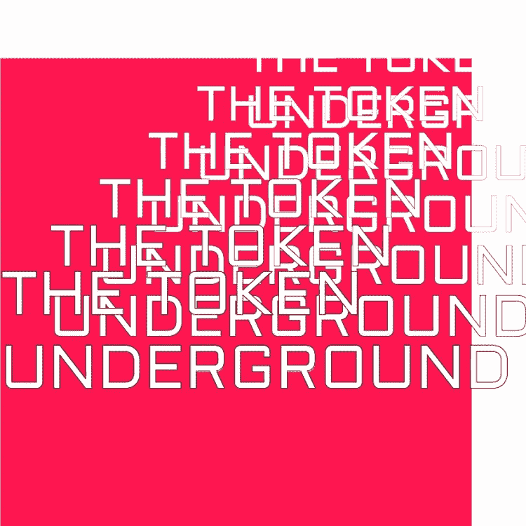

# 令牌地下 0x2: WTF 是秘银的‘社会采矿’？

> 原文：<https://medium.com/hackernoon/token-underground-0x2-wtf-is-mithrils-social-mining-753df728804a>

我们对#Mithril Token 进行了深入研究，目的只有一个:为 Mithril 团队和整个区块链社区找出现有 Token 模型的一些难点，并引发进一步的讨论和反馈。

> Token Underground 回到了我们“token bullsh*t filter”旅程的下一章。

这一次我们回顾 MITH 的经济模式——一个 [Mithril](https://mith.io/en-US) 分散式社交媒体平台的本土标志。我们的选择受到了最近围绕脸书和 Telegram [推出](https://www.nytimes.com/2019/02/28/technology/cryptocurrency-facebook-telegram.html)加密令牌的谣言的影响，以及关于将令牌引入各种社交媒体平台的影响的更普遍的想法。我们还从一个奇怪的观察中发现，Mithril 长期以来一直在 CMC top-100 中，迄今为止没有对该项目进行任何全面的分析。好吧，我们会解决的。

引起我们注意的第一件事是几乎没有任何关于代币及其工作机制的英文数据，这可能是因为秘银起源于中国，所以它周围的社区可能主要是中国人。

由于没有太多的信息来建立我们的分析，我们从[白皮书](https://mith.io/img/en-US/whitepaper.pdf)、 [Mithril 的媒体博客](https://medium.com/mithriltoken)和一些更有趣的 Reddit 帖子中提取了一些信息，在这些帖子中，精明的用户就代币价值提出了非常直接的问题[【1】、](https://www.reddit.com/r/CryptoCurrency/comments/9y8f3p/mithril_is_a_terrible_fucking_idea/)[【2】](https://www.reddit.com/r/MithrilToken/comments/94ayd5/mithril_token/)、[【3】](https://www.reddit.com/r/MithrilToken/comments/a4ih6w/why_should_we_buy_mithril/)，甚至试图掩盖与币安上市相关的可能的[欺诈](https://www.reddit.com/r/MithrilToken/comments/923j0v/mithril_caught_cheating_in_the_binance_vote/)计划。我们不会深入讨论这个问题，我们的结论是建立在事实和数据的基础上的。

WP 的第 1 页有 Mithril 网络的定义:

*< < Mithril 是以太坊区块链上的去中心化社交媒体平台。Mithril 将整合到新的和现有的社交媒体网络中，以奖励内容创作者对网络的贡献——我们称之为社交挖掘。> >【引文结束】*

这里也给出了秘银令牌设计的摘要:

*< <使用 MITH 代币，用户将能够在整个 MITH 应用生态系统中消费，如约会服务、优质内容频道和直播应用。Mithril 商业网络旨在允许零售接受 MITH 作为一种支付方式，首先在台湾和香港的零售商推出。拥有社交影响力用户群的 MITH 网络将成为非常受欢迎的客户群，Mithril Merchant Network 合作伙伴将通过深度 MITH 整合从中受益。> >【引用结束】*

看起来像一个很好的旧价值转移令牌，不是吗？那么，谁是生态系统的关键利益相关者呢？有一个设计精美的利益相关者互动方案:

我们不知何故发现，实际上有更多的参与者被添加到这六个之中——至少是外部社交网络和平台。因此，据推测，Mithril 提出这些作为外部应用程序的经济层。请注意，所有这些参与者(内容所有者除外，他们可以下注代币来增加他们的奖励)只将代币用于支付功能。

自然，是内容所有者参与了 Mithril Network 的核心机制，称为“社交挖掘”。正如 WP 中所述，想法很简单:“当用户在网络上产生有价值的、用户生成的内容时，他们将通过社交挖掘获得 MITH。他们的采矿奖励将直接与他们作为网络贡献者的影响力和成功挂钩。他们给平台带来的网络价值越多，他们赚的 MITH 就越多。”【引文结束】。

纸面上看起来很棒:这是对内容创作者的应得奖励。当然，细节决定成败。我们来看看这两种机制——评估内容和分配奖励——如何在现实生活中发挥作用？

## *社会采矿力学*

有一种 Orei 被定义为某种分数的原始挖掘数，它可以被交换为真实的代币。Orei 用于计算创作者在一定时间段内对网络的贡献。除了 Orei 之外，还有 Purityi，它将创作者的贡献份额与定义的时间段内的所有其他贡献区分开来，MSM 是在该时间段期间在内容创作者之间分发的所有令牌的数量，最后 mi 是由 I 内容创作者接收的令牌的数量。下面是原始 WP 的快照和相应的等式:

这里的方法看起来非常简单。选择了生成内容的三个主要“价值指标”:浏览量、点赞量和观看量。由于这些指标中的每一个在评估内容的流行度中具有不同的作用，所以将特殊的权重函数添加到定义 orei 的函数中。显然，每个权函数可以取范围 0 内的值；1 且 WVIEW+WLIKE+WWATCH=1。

我们可能是错的，但是按照社会挖掘机制的逻辑，在定义 orei 的函数中可能有一个打字错误。缺少括号，因为对该函数的所有三个分量求和是合乎逻辑的，而不仅仅是对第一个分量求和:

除了 WP 信息之外，我们还使用了这篇[文章](/mithriltoken/user-says-staking-really-works-f75ea83a2fff)中的数据，这篇文章发布在描述社会挖掘扩展的媒体上。这个延伸就是“赌注”——我们把这个术语用引号括起来，因为在我们看来，这不是赌注本身，很像仅仅是持有。

当用户面临丢失其代币的风险时,“押记”是适用的，因为当他为网络执行某种工作时，代币被押记为有风险的存款。显然，这必须提供对某种有限资源的访问。

> 我们详细考察了[令牌地下 0x0](https://www.technomads.wtf/blog/the-token-underground-0x0-the-great-brain-fog-and-the-fresh-start) 中“令牌访问网络中有限资源”的概念。

对于秘银，我们没有发现任何证据表明托肯授权使用任何有限的资源。内容创建者可以在没有任何代币的情况下为她或他的内容赚取奖励，而“下注”他们的代币只会增加奖励金额。因此，赌注只能作为对一种“有限”资源的访问，即尚未被开采的令牌。

补充说明:引入这种“赌注模式”可能只是为了在市场下跌时支撑象征性价格，仅此而已。但是，如果用户长期持有大量代币，他将比“赌注”较低的竞争对手获得更多奖励

因此，他将更快地收集代币，这是一个合乎逻辑的飞跃，表明一个普通的内容创作者宁愿选择有一天兑现。因此，在短期内，这种“跑马圈地”可能会支撑价格水平。但从长期来看，当所有这些“赌注”都将兑现时，象征性价格会发生什么变化？不用动脑筋。

## *从这个提议的社会挖掘机制中得到的启示*

首先，“社交挖掘”是一种在用户社群中进行代币分发的算法。这不是一个永久的奖励算法(因为它是临时的，将持续 8 年)，因为随机创作者的真实奖励金额取决于至少两个因素:

1.  “标桩”级别
2.  权函数的精确值。

需要指出的是，没有任何关于谁以及如何管理这些变量的信息。你们是在集中治理模式下处理这个问题吗？我们很想学。

考虑到 MITH 是一个价值转移令牌，具有专门设计的算法，用于在内容创作者社区中分发总排放量的 35%,我们有一个关键问题:Sybil 网络对这个分发系统的攻击如何？

我们都知道 Sybil 攻击者创建了许多欺诈节点(或用户帐户),目的是利用它们从网络中获利，或破坏网络的运行。现在想象一下，在分发的最初几年里，坏人为了赚取代币而攻击秘银网络。这很容易做到。您注册了多个帐户，并开始为属于这组攻击者的内容帖子创建人工喜欢和视图。如果这种欺诈账户的份额很大，分配给“社交挖掘”的大量令牌将被攻击者收集。我们仔细分析了所有提交的材料，但没有找到任何解决这个问题的方法。如果茜玻正在攻击网络呢？当心，托肯·霍德勒。

## **我们的判决**

秘银的原生令牌显然是一个价值转移令牌，没有任何进一步的效用。这种类型的令牌只有在交易中使用时才能获取价值，这就引出了[速度问题](https://www.coindesk.com/blockchain-token-velocity-problem)。MITH 代币的交易量必须巨大，才能提供有机需求和价格。可以使用费希尔方程(这是最简单的方法，但也是最受批评的方法)或一些更复杂的框架对此类令牌进行估值。无论我们使用何种估值方法，我们在这里讨论的是网络内至少数十亿美元的年营业额，以实现几亿美元的有机资本(这里我们讨论的是至少增长到过去 Mithril 的峰值资本约 4 亿美元)。这就引出了一个问题——为什么不在任何一种社会分散网络中使用 DAI 或 ETH 进行支付呢？相信我，有很多其他机制来激励内容创作者，而不是让他们成为代币流通的一部分。

事实证明,“社会挖掘”机制只是社区之间令牌分配的另一种方式。这里也没什么新鲜的。算法不透明，可以随时被创始团队的决定改变。该系统不包括任何保护社交挖掘免受 Sybil 攻击的严肃机制，因此关于“在创造有价值内容的内容生产者之间诚实分发”的说法听起来并不特别有说服力。

除了象征性的价格支持之外，通过参与“社会采矿”来增加回报的赌注没有任何经济意义。当用户在其他网络或协议中“下注”一个令牌时，他基本上是将它作为一种风险存款来证明某种行为或信息，如果他的行为违反了规则，他的赌注将部分或全部受到惩罚。在这种情况下，用户下注代币仅仅是为了下注代币和增加他的奖励。显然，这种“赌注”在 Mithril 中的实现只有一个目的——冻结新分发的令牌，防止用户在交易所出售它们。

我们现在可以得出结论，这个模型与 2017 年 ICO 狂潮的很多价值转移模型没有明显区别。挺难过的。

## **秘银团队的一些想法**

首先，我们建议回顾基本的价值转移模式，然后建立有助于集体维持社会网络的治理机制。它将把 Mithril 的政策集中在用户需求上。例如，如果用户管理奖励公式的更新和网络运营的其他重要问题，它可能会变得更加可信，而不是像常规应用那样，所有关键参数都由团队设定。我们还认为“社会挖掘”的概念必须重新设想，首先要证明对 Sybil 攻击的安全性。归根结底，这是一个非常复杂的问题——监控网络中善意和虚假用户的行为。你如何区分这两者？脸书和推特一直在全天候工作，但运气不佳。

通过实施这两种方法，我们认为 Mithril 社交网络可以证明在市场上更加可行和成功，并成长为一个有机驱动的资本化。顺便说一句，现在 MITH 代币表现很差，甚至下注也无济于事:根据[官网](https://mith.io/en-US/)的统计，超过 5 亿的发行量中只有约 760 万 MITH 被下注。这也是一个非常可悲的统计数据。