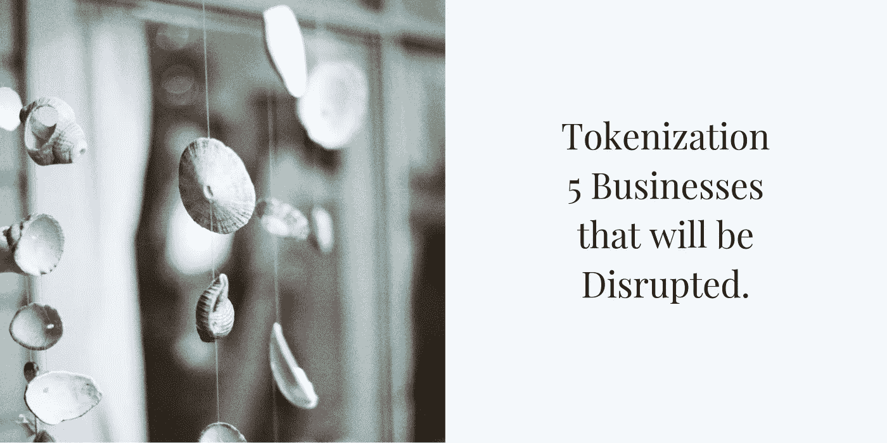

# 令牌化——将被中断的 5 项业务

> 原文：<https://medium.com/hackernoon/tokenization-5-businesses-that-will-be-disrupted-6c51e47d7b83>

令牌化是在区块链上将资产权利转换为数字令牌的过程。每一种现有的资产类别都将变得数字化，因为它更高效、更安全、更透明。好处包括降低交易成本、共享所有权模式和提高流动性。

以下是令牌化将扰乱业务和金融的 5 种方式。

# 艺术:

苏富比拍卖行最近举办了一次[艺术&技术峰会](https://www.christies.com/exhibitions/2018/art-and-tech-summit-exploring-blockchain)来探索区块链在艺术市场的潜在应用。“区块链的分散记录可以创造一个“更受欢迎的艺术生态系统”，在这个生态系统中，收藏家和专业人士可以在安全位于云端的全行业登记处定期验证艺术品的真实性、出处和所有权。”

# 资产管理:

在技术监管环境下运营的基金将不得不使用代币等数字资产。区块链上的数字代币是为经济活动以及提高效率、流动性和透明度而设计的。加拿大皇家银行资产管理公司(RBC Asset Management)[的首席执行官最近表示,](https://www.ft.com/content/4fbb78d4-bf1d-11e7-9836-b25f8adaa111?utm_content=buffer186f3&utm_medium=social&utm_source=twitter.com&utm_campaign=buffer)区块链的令牌化“有可能从根本上改变资产管理的整个概念”,并将“让投资者能够更容易地接触到比上市股票和债券更广泛的资产类别”。

# 名人和体育明星:

以区块链分类账的形式创建一个安全、可核实的所有权记录，将允许球迷或投资者持有运动员和体育名人的股份。这也将为球员、经纪人、俱乐部、球迷和官方带来更大程度的信任和透明度。

# 房地产:

代币将允许人们拥有房产的“部分所有权”，并赋予房产所有者分割房屋和出售股权的能力。2018 年底，曼哈顿一套价值 3650 万美元的共管公寓被分割成数字股份，这不会是最后一次！

# 零售:

Apple Pay 是当今零售业中令牌化的一个例子。随着越来越多的人通过借记卡或非接触式支付支付，令牌化为零售商和消费者带来了许多好处。支付令牌化通过从交易的支付方移除账号来防止欺诈。

列举的例子只是令牌化可以带来巨大成本效益、使交易更安全、资产更具流动性的一些行业。

**关于作者:**保罗·亨德森是一名内容战略家，拥有为包括彭博和微软在内的公司以及当地政府卫生部门开发数字内容项目的背景。他是**的创始人，这是一家咨询公司，为区块链和金融科技初创公司的内容战略和社交媒体营销提供建议。**