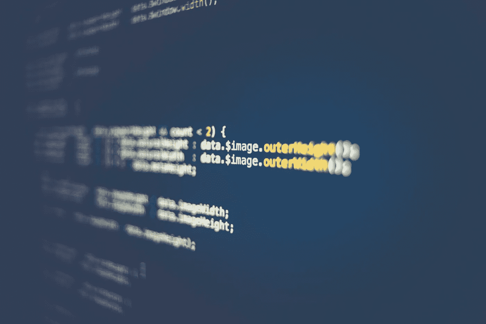
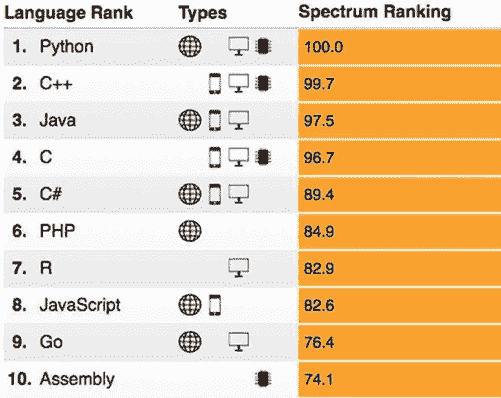

# 2019 年开发者十大技能

> 原文：<https://medium.com/hackernoon/top-10-skills-of-developers-in-2019-c98dc487d462>

一个像样的开发者是非常罕见的。问题甚至不在于编程语言知识贫乏，而在于集成方法。现代开发人员不仅应该理解，而且应该将现代技术集成到他们的工作中，并意识到创新和对计算机软件的高需求之间的相关性。只有这个开发者才会是任何公司最抢手的，不管他/她懂多少编程语言。

今天有 50 多种编程语言正在被积极地使用，但是最重要的语言屈指可数。它们构成了市场的大部分，给程序员带来了收入。在这个介绍之后，我们将探讨任何开发人员的第一个也是最重要的技能。

# 技能 1 —编程语言

为了成为一名受欢迎的、有前途的、月薪不错的开发人员，只需要精通下面列出的两三种通用编程语言就足够了:

The Ranking is based on the polling data among programmers from spectrum.ieee.org

下表显示了编程语言、它们的流行程度以及使用它们的平台。如果你要学习第一种或新的编程语言，值得的不是从它的流行程度开始，而是从你追求的目标和你感兴趣的领域开始。让我们来谈谈前 5 种编程语言。

# 计算机编程语言

这种语言在发展的各个领域都很常见，但它在以下几个方面是其他语言的强劲对手:

网络开发。近年来，基于客户机-服务器模型结构的网站和应用程序的开发者广泛使用流行的 Python 框架:Django(具有管理员栏和界面的完整版本，速度和对技能的最低要求是其优势)和 Flask(一种可针对特定程序员需求定制的外壳，它是创建 REST API 的最佳选择——用于构建可扩展的分布式网站系统和应用程序的客户机-服务器架构风格，例如社交网络 API)

**机器学习。** Python 有两个流行和常用的库:Scikit-learn(用于更原始的解决方案)和 TensorFlow(用于主要和高性能的解决方案)，可用于神经网络创建、深度机器学习以及分析和预测。解决学习任务的最原始的方式之一是社交网络中的“智能”新闻源。

# с++，C，C#

C 语言是 C #和 C ++的祖先。这种编程语言，像它的后继者一样，被用来创建软件。这些语言的主要用途是系统软件的开发。它的主要优势是高处理速度，允许您用 C ++和 C #创建现代的、资源密集型的游戏和应用程序。

如果你计划开发软件或游戏(像虚幻引擎，冻伤，统一这样的游戏引擎)，那么这种编程语言应该首先学习，因为在未来的几年里，它肯定不会在这一领域失去阵地。积极的评级动态证明了这一点:在过去的 10 年中，这些编程语言没有一个离开前 7 名。然而，令人不安的是，这种语言最近暂停发展。除了最小的调整和接口的改进，代码和算法的改进已经很久没有突破性的创新了。

# Java 语言(一种计算机语言，尤用于创建网站)

直到 2006 年，没有人能够想象 Java 语言将不仅用于家用设备编程。如今，它是创建支持旧代码版本的跨平台软件的最流行的语言。它用于创建应用程序、游戏、同步设备、开发网络服务、银行和金融系统。

缺点之一是缺乏灵活性，因此它目前提醒乐高。所有你能用 Java 创建或编写的东西已经分散在互联网上了。要创建一个中级 Java 应用程序，您只需要对编程原则和基本的引擎搜索技能有一点了解，就可以在 web 上找到已完成项目的模式。这就是 Java 成为最受初学者欢迎的编程语言之一的原因。

正如您所看到的，每种语言都是为它自己的领域设计的，在那里它看起来更有前途，也更方便。尽管从现代现实来看，程序员只懂一种语言是不够的，但掌握额外的技能来提高专家的需求水平更为重要。

# 技能 2 —客户端-服务器架构

请记住，最近的开发在 80 %的情况下是基于客户机-服务器模型的，对它的理解是强制性的，而不是开发人员所希望的。设计不良的架构可能会导致许多与 http 请求的处理和分发相关的典型问题。所以，对这种模式的不了解可能是用人单位否定的原因。

客户机-服务器体系结构是用户设备和服务器主机之间的交互系统。该设备是一个连接到服务器并通过互联网发送 POST 请求的客户端。反过来，服务器参与数据处理，并将完成的解决方案发送回设备。因此，它最大限度地降低了客户端软件被黑客攻击的风险，也降低了设备的紧张程度，因为主要计算是在服务器的能力范围内进行的。此外，如果旧设备出现故障或被格式化，客户端-服务器架构允许在新设备上保存和恢复客户端数据。

首先，对于开发人员来说，理解 REST 哲学是至关重要的，REST 哲学最初被认为是服务器和客户端之间交互的请求管理系统:使用数据相关性处理程序的 Get、Post、Put、Delete。

客户端-服务器架构用于:

*   业务自动化；
*   网络游戏；
*   商业应用；
*   网站开发；
*   云计算。

# 技能 3 —系统工程

如果没有实现系统工程的基础，程序员就很难创造出独特的、有竞争力的产品。系统工程是一门很大的课程，不幸的是，大多数教育机构都是以一种极其压缩的形式来教授这门课程，他们只是以一种肤浅的方式来处理接下来的要点:

**市场分析**。在这一领域的能力将帮助你分析和检查市场的波动性，其走向技术(现代技术的集成，发展前景)，社会(愿望，用户的兴趣，对消费者的价值)，功能(最大的可能性，不牺牲用户界面的便利性)方面。这种开发最终产品的方法会让你看到这个想法的缺陷和不足，这个想法在初始阶段总是不完美的，需要更准确的建模和清晰的策略。

**策划。**这意味着对任务绩效有很强的优先级和时间控制。这是一个直接影响开发期限的条件。中断或延迟可能导致与市场无关的产品发布。项目经理经常不完全理解要完成的任务的范围，并根据他们自己的想法设定最后期限。这导致了计划的最后期限和实际时间框架之间的差异。因此，开发人员应该参与计划时间安排，而不仅仅是管理人员。

**生命周期。**生命周期是一个连续的过程，从决定开发产品的那一刻开始，到产品完全退役的那一刻结束。开发人员需要了解产品生命周期的所有阶段，以及每个阶段的典型任务和需求。它将帮助开发人员创建一个高质量的产品，这将是一个非常长的时间相关。

这三个关键点是密切相关的。忽视其中一个，就可能把其余的都拉进深渊，反之亦然。然而，如果发布了一个带有大量 bug 的未经测试的产品，即使是一门掌握得很好的系统工程课程也不会有成效。

# 技能 4 —软件测试的基础

一个完整的软件不应该在没有预先测试的情况下发布。目前，产品测试有 10 种方法和种类，但程序员可能只掌握其中的三种:

**单元测试。**这种类型意味着测试每个单元(模块、类)的正常运行。使用 TDD 方法(测试驱动开发)是恰当和正确的。在一些语言中，有不同的测试框架。比如有 NUnit，Rhino Mocks 等。在 Visual Studio。

**集成测试。**最困难的测试类型，包括测试块(模块、类)之间的交互。这种方法很费时间，但是可以让你排除私人对数据的不正确处理。

**系统测试。**该测试方法涉及对已完成产品的研究。小项目的测试可以自己完成，但是大的和资源密集型的项目需要使用自动化工具。

# 技能 5 —数据库

如果不实现一个存储所有数据的数据库，创建任何软件都是不可能的。它是一组包含模板结构中的记录的文件。如果一个普通的客户机程序有一个简单的数据库连接系统就足够了，那么云或客户机-服务器应用程序就需要一个更严肃的远程数据库访问方案。

对于开发人员来说，理解使用数据库的原则和在客户机-服务器解决方案中建立连接的基础知识，以及安全原则的知识，是一项有前途且极其重要的技能，尤其是如果程序员计划从事严肃的业务项目。

# 技能 6 —加密和密码术

许多紧跟现代技术和网络安全的程序员已经接触到了密码学的概念，换句话说，就是数据加密。今天，使用两种加密方法:

**私钥**。这种方法甚至在朱利叶斯·凯撒的时代也是相关的，当时字母在字母表中被移动了一定的位置。但是随着时间的推移，加密技术变得越来越复杂，并且消除了在没有特定密钥的情况下解密字符集的能力。方法现在也在用，但几乎无关紧要。

**公钥。这种方法最早发明于 1975 年，然而，直到 2009 年，当流行的比特币加密货币建立在它的基础上时，它才获得了最大的传播和普及。从那时起，加密已经被积极地引入到任何软件中，并经历了许多修改。**

如今，密码学中有 4 种密码原语:

*   对称密钥；
*   非对称密钥；
*   哈希；
*   数字签名。

每个原语都有自己的设备和使用功能。因此，如果你决心开发商业应用程序，处理个人数据或计划在个人或法律实体之间传输语音/文本/视频消息，请务必学习密码学的原理。如果你打算使用现代技术——区块链，这方面的知识将尤为重要，在区块链上已经有许多有趣的项目。

# 技能 7——区块链

区块链技术用于对用户的交易和个人数据以及钱包和整个系统的可靠性保持高水平的保护。

区块链工作的原理可以比作 torrent trackerss，在 torrent tracker 中，正在运行的客户端的文件或事务日志与其他客户端进行比较，并复制到新的客户端，从而将日志数据复制到新的设备。所有设备(发射器和接收器)都是匿名点，不传输任何识别数据，而只交换块(事实组)。

区块链在现代世界中的主要优势是不可能取代已经发生的事件。而这也是目前其广泛实现的主要优势，因为不可能欺骗这个系统。因此，如果你考虑到自己的未来，想成为一名受欢迎的程序员，我们建议你探索这项有前途的技术。

# 技能 8——人工智能

像区块链一样，人工智能是一项快速发展的技术，我们将在未来观察它的巨大潜力。根据安德烈亚斯·卡普兰(Andreas Kaplan)和迈克尔·亨莱因(Michael Henlein)给出的定义，人工智能是“系统正确解读外部数据，并从这些数据中学习，并利用这种学习通过灵活的适应来实现特定目标和任务的能力。”

在全球范围内，人工智能模仿了人类的思维模式。如果程序只是简单地按照一定的规则从数据库中检索值，那么它就没有被赋予 AI。如果经过训练的系统创建了解决某些任务的程序、方法和文档，它就拥有了人工智能。

无论是现在还是不久的将来，在这个领域有能力的开发人员肯定会受到欢迎。

# 技能 9 —跨平台软件

跨平台应用程序允许您生成一个最终产品，以一种“通用”的形式为几个操作系统编写。这对于分发和增加软件的受欢迎程度是一个很大的好处。几乎所有用高级编程语言创建项目的开发环境都是跨平台的，可以轻松地将代码编译到不同的设备上，而无需重新编译。

因此，你可以使你的软件的客户数量增加一倍甚至两倍。许多人目前放弃使用个人电脑，转而使用移动设备:智能手机、笔记本电脑、平板电脑。因此，在发布之前使开发的软件适应最大数量的系统是很重要的。这里唯一的缺点是跨平台应用程序对于特定的单个操作系统来说永远不会是“完美的”。

# 技能 10 —操作系统

这就是为什么不仅要构建跨平台的应用程序，还要考虑到交互特性，针对特定系统进一步优化它，这一点至关重要。了解操作系统的新功能，分析如何在完整的软件中应用这些功能，以改善与消费者的互动，提高可用性和数据处理速度等。

总之，应该补充的是，拥有上面列出的 10 项技能并不是必须的。拥有某方面的全部知识比什么都能做一点要好。选择你想做的，你感兴趣的，设定一个目标并坚持下去。不要忘记您所在领域的趋势和新的解决方案，它们将提高专业技能，并使开发人员在许多年内都处于高需求状态。