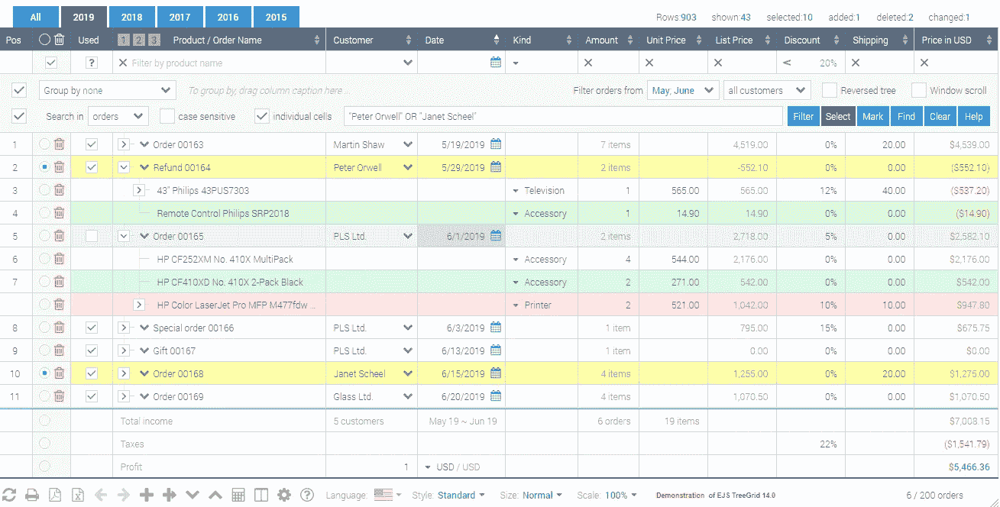

# 前 5 名 JavaScript TreeGrid (TreeTable)组件

> 原文：<https://medium.com/hackernoon/top-5-javascript-treegrid-treetable-components-20f03f4b46c8>

JavaScript 树组件是一个非常流行和方便的控件，有助于创建数据丰富的应用程序。数据组织的分层方法为最终用户提供了许多好处。你可以在各种应用程序中找到树形列表。

UI 树的主要优点是有机会简洁地显示大量信息。但是缺点之一是很难处理大树。来自这些树的信息不适合界面的可视区域，因此有必要组织水平和垂直滚动(例如，编辑 MS Windows 注册表的过程)。

TreeTable 组件似乎是处理 UI 树的复杂性的合理答案。一方面，TreeTable 是一个经典的数据网格，能够以表格形式方便地显示信息。另一方面，它像树小部件一样对表格数据进行类似树的分层分组。

不要将 TreeTable 组件与 DataGrid 行和列分组等功能相混淆。尽管一些高级电子表格 JS 小部件可能有一个分层数据分组工具(类似于 Excel)，但 TreeTable 是一个更复杂的解决方案，因为它不仅对单个数据进行分组，还对整个信息数组进行分组。

在这篇文章中，我们想回顾一下目前可供开发者使用的前 5 个树表 web 部件。如您所知，使用现成的 JavaScript 组件显著加快了前端 web 开发。现在程序员只需要选择合适的组件。本概述旨在促进这一选择。我们将考虑 Webix.com、Treegrid.com、jQuery.com、DHTMLX.com 和 Sencha.com 等 JavaScript UI 库和框架的 TreeGrid 组件。

# **Webix TreeTable 小工具**

webix[JavaScript tree table](https://webix.com/widget/treetable/)基于 DataGrid 组件，这就是为什么拥有它所有的功能和特性，包括迷你图、剪贴板支持、高级过滤器等等。Webix TreeTable 组件将其功能与 DataGrid 中可用的不同信息分组相结合，例如 rowspan、colspan 和 Grid 分组。该小部件可以夸耀其对行和列分别拖放的彻底阐述，改变所有边距的宽度和创建垂直标题的可能性。你可以在[这篇概述](https://www.pixelstech.net/article/1547210281-The-Art-of-JavaScript---DataTable-Web-Widget-Overview)中找到更多信息。

# **树形网格**

[可编辑 JavaScript TreeGrid](http://www.treegrid.com/Grid) 是一个 DHTML 组件，允许在 HTML 页面上显示和编辑网格、表格、树网格、树视图或条形图中的数据。这是一个快速的 AJAX 网格，具有许多先进的功能，如先进的单元格公式和计算；多级数据透视表；甘特图的创建；显示和更新自定义 JavaScript 对象和外部对象，如 Adobe Flash、Microsoft SilverLight 不同的编辑遮罩；日历组件；大量细胞变化；导出到 MS Excel 或其他处理 XLS、XLSX、CSV 文件或 HTML 表格的电子表格程序；任何语言的本地化；和许多其他功能。TreeGrid 组件允许加载 XML 和 JSON 格式的数据。该小部件在基本、个人、标准和大许可下可用。

# **jQuery 树表**

[jQuery TreeTable](http://ludo.cubicphuse.nl/jquery-treetable/) 是 jQuery JavaScript 库的一个插件。该组件以 HTML 表格的形式显示一棵树。该小部件允许创建多个列来显示除树之外的附加信息。树深度可以是无限的。jQuery TreeTable 由 Ludo van den Boom 发布，可以在 GPLv2 和 MIT 许可下获得。总的来说，jQuery JS 库是非常快速和轻量级的，这使得 web 开发过程更加容易。它包含易于使用的 API，支持许多浏览器。

# **DHTMLX TreeGrid 组件**

[TreeGrid by DHTMLX](https://dhtmlx.com/docs/products/dhtmlxTreeGrid/) 是 dhtmlxGrid 组件的扩展，它补充了强大的数据网格的功能，具有可扩展的行、智能 XML 解析、智能呈现和分页支持。作为一个动态加载的基于 AJAX 的 JavaScript treegrid，该组件能够显示无限数量的行并动态处理大量数据。它为最终用户提供了方便的内嵌编辑、行和列的高级拖放、拆分模式、列的排序和着色以及一系列数学公式。此外，dhtmlxTreeGrid 通过 CSS 和预定义的皮肤具有简单的样式。它可以作为 [dhtmlxSuite](https://dhtmlx.com/docs/products/dhtmlxSuite/) 的 JavaScript UI 框架的一部分，或者作为专业版下的一个独立组件。

# **Sencha TreeGrid 小工具**

Sencha 有一个 JavaScript 框架，为构建数据密集型、跨平台的 web 应用提供了许多现成的 UI 组件。这个库的突出组件之一是它的高性能 TreeGrid 小部件。该组件具有排序、过滤、多标题、键盘导航、单个 AJAX 请求的节点预加载、标题隐藏/显示/重新排序/调整大小、自定义图标等功能。Sencha Ext JS 可以在 GNU GPLv3 和商业许可下获得。

让我们比较一下上面提到的 JavaScript TreeTable 小部件的主要特性。

# **结论**

JavaScript TreeGrid 组件的主要目的是将树和表的功能结合在一个小部件中。在本文中，我们回顾了排名前五的 JavaScript TreeGrid 小部件。它们都有自己显著的特点和功能。从比较图表来看，DXTMLX 和 Webix JS 库提供了功能最丰富的 TreeGrid 小部件，可以帮助将树集成到可编辑的网格中，从而有助于处理大量数据。