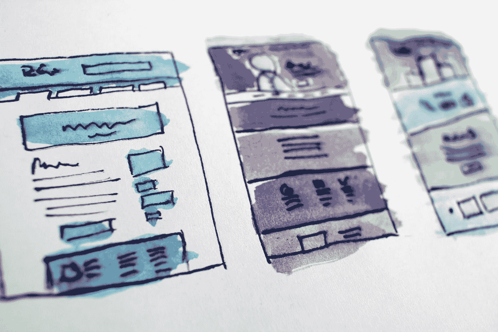
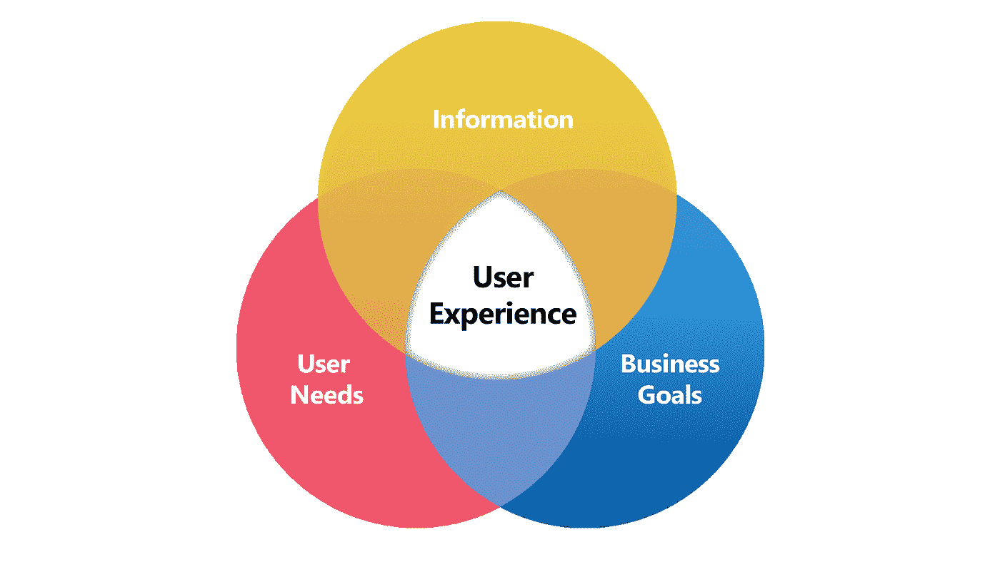

# 设计高转化率登录页面的 7 大 UX 原则

> 原文：<https://medium.com/hackernoon/top-7-ux-principles-for-designing-high-converting-landing-pages-3e4cb951c8e2>

(Photo by Hal Gatewood on Unsplash)

你在寻找如何设计高转化率登陆页面的技巧吗？如果是这样，你来对地方了。在这份简短但内容丰富的指南中，你将学习到 7 条你需要知道的用户体验原则，来设计能够转换并具有高转换率的登陆页面。

在我们开始之前，让我们再次提醒自己什么是登陆页面，它的目标是什么。登陆页面是一个专门的在线页面，专为实现一个或多个[营销](https://hackernoon.com/tagged/marketing)目标而构建，如产生销售线索或获得点击。如果设计和推广得当，这样的网页可以成为有价值的营销工具。构建高转化率的登录页面需要消费者心理学、市场营销、文案、设计等领域的广泛知识，最重要的是 UX——用户体验。

一些读者可能不熟悉用户体验科学。因此，我们也必须提醒自己这门科学是关于什么的。所谓用户体验，我们指的是一系列与使用某种产品或服务相关的情感和体验。用户体验作为一门科学，旨在确定创建特定用户体验的关键原则和因素，并基于这些发现发现构建理想 UX 的方法。

(来源:[https://upload . wikimedia . org/Wikipedia/commons/8/80/User-experience-diagram . png)](https://upload.wikimedia.org/wikipedia/commons/8/80/User-experience-diagram.png))

因此， [UX 设计服务](https://cybercraftinc.com/our-service/design/ui-ux-design)可以成功应用于设计登陆页面，提高其有效性，即转化率等重要指标。因此，考虑到这一点，让我们详细回顾一下在未来[设计你的登陆页面时你应该应用的确切的 UX 原则。](https://hackernoon.com/tagged/future)

# 原则 1:不要分心(不要导航)

(斯蒂芬·科斯马在 Unsplash 上拍摄)

分心是高度转化的敌人。你不希望你的读者被网页上不相关的内容分散注意力。你希望他或她只关注一件事——你的页面内容说服他采取想要的行动。因此，你必须确保网页上完全没有任何分散注意力和无关的元素，比如导航。

是的，你没听错，导航栏必须出现在登录页面上。因此，这是一个无关的元素，会分散用户对登录页面的注意力。因此，必须将其删除。不要给你页面的访问者任何分心的机会。除了导航栏之外，可能还会出现一些其他干扰性元素，如弹出表单等。仔细浏览你的登陆页面，找出任何可能分散访问者注意力的东西，并去掉它们。

# 原则 2:极简主义

(托马斯·夸里奇在 Unsplash 上的照片)

即使在那些看似相关和必要的元素中，也可能有一些非必要的元素是你的登录页面不需要的。例如，不必要的链接会把访问者带离页面，无关的无用内容等。再次，仔细浏览一个登录页面，看看是否有任何非重要的元素，你可以摆脱。

这将有助于进一步提高访问者的关注度，从而相应地提高你的转化率。极简主义是真正的交易。想想苹果的成功。[极简主义](https://en.wikipedia.org/wiki/Minimalism)是[品牌哲学](https://www.applegazette.com/ipod/steve-jobs-and-minimalism/)的基石，这也是其成功的主要原因。如果苹果总是追求极简主义，你也这样做不是很有意义吗？

# #原则 3:一个目标，一个 CTA(行动号召)

(照片由 Smart 在 Unsplash 上拍摄)

这个原则再次证明了清晰的焦点在登陆页面设计中的重要性。没有干扰，极简主义和一个目标——这是一个高转化率的登陆页面。一些登录页面经常有一个以上的 CTA。这使访问者感到困惑，并会降低转化率。一个登陆页面必须只有一个目标，而不是两个或更多。在整个页面中，您必须只有一个行动号召。如果您想要添加多个 CTA，您需要为每个 CTA 创建单独的页面。

# 原则 4:不要在表单中使用太多的字段

许多登录页面都有要求访问者提供个人信息的表格。一个逻辑问题出现了:是什么影响了一个表单的转化率，以及相应的你的登陆页面的转化率？答案很简单——你需要什么样的信息。

我们经常可以看到有一百万个字段的表单，从你的地址开始，到你的宠物的名字结束。不用说，这样的形式通常不会享受高转化率。你必须努力只要求最基本的信息，你不能没有。使用的字段越少越好。

# 原则 5:使用正确的配色方案

(斯科特·韦伯在 Unsplash 上拍摄)

永远记住，颜色就是一切。你使用什么颜色会影响你的访问者的行为，他们的心情和情绪，即整个用户体验。因此，为您的登录页面选择正确的配色方案非常重要。现在，你该怎么做呢？理想情况下，你应该有一个 UX 专家/设计师，他/她可以利用他/她的色彩理论知识选择正确的调色板。否则，你可能想自己深入主题或者找到现成的颜色模板，例如[这个](https://www.dtelepathy.com/blog/inspiration/beautiful-color-palettes-for-your-next-web-project)。

# 原则 6:使用正确的字体

(由库普先生/杨奇煜·巴拉勒在 Unsplash 上拍摄)

你使用什么样的字体会极大地影响用户对文本的理解。你可能拥有世界上最好的内容，但是如果它是以可怕的字体放置的，那么什么都不会有帮助。因此，仅仅拥有正确的副本是不够的。那份稿子必须用正确的字体排版。在 UX 的科学中有一个单独的部门处理字体——印刷术。

学习一些基本的 UX 排版原理是个好主意。可用性极客已经为[准备了一篇关于这个主题的好文章](https://usabilitygeek.com/12-typography-guidelines-for-good-website-usability/)。底线是，确保你使用正确的字体，与你的登陆页面的其他元素完全一致。

# 原则 7:使用列表和要点

(格伦·卡斯滕斯-彼得斯在 Unsplash 上拍摄)

使用项目符号和列表是突出你想让读者看到的关键点的好方法。此外，它可以作为一个伟大的方式来抓住和集中用户的注意力。以项目符号和列表形式呈现的信息更容易理解。因此，请始终以这种形式列出关键要点。以这种方式列出主要优势是个好主意。无论何时何地你都可以使用它们。

# 最后的想法

我们希望这个简短的概述对您有所帮助。用户体验才是真正的科学。如果你学会了有效 UX 的基本原则，并将其应用到登陆页面设计中，你应该会有更高的转化率和整体商业成功。我们祝你一路顺风:)