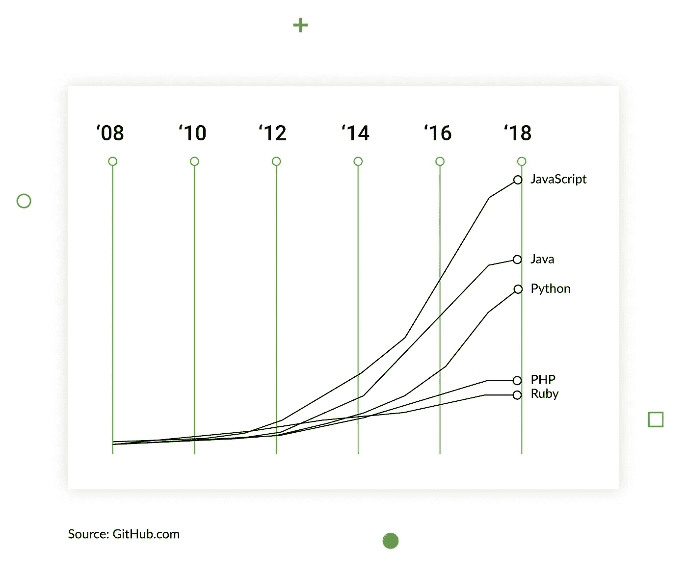
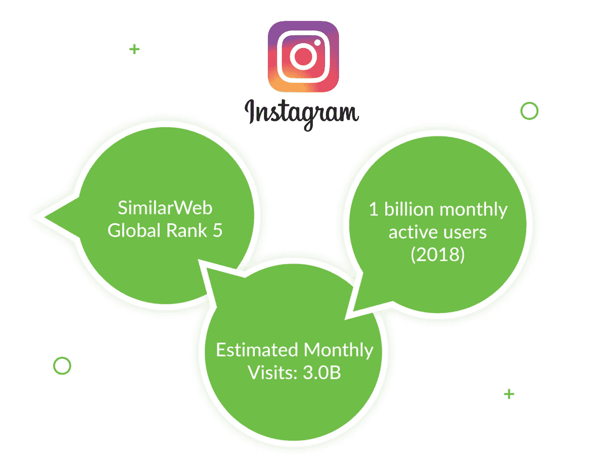
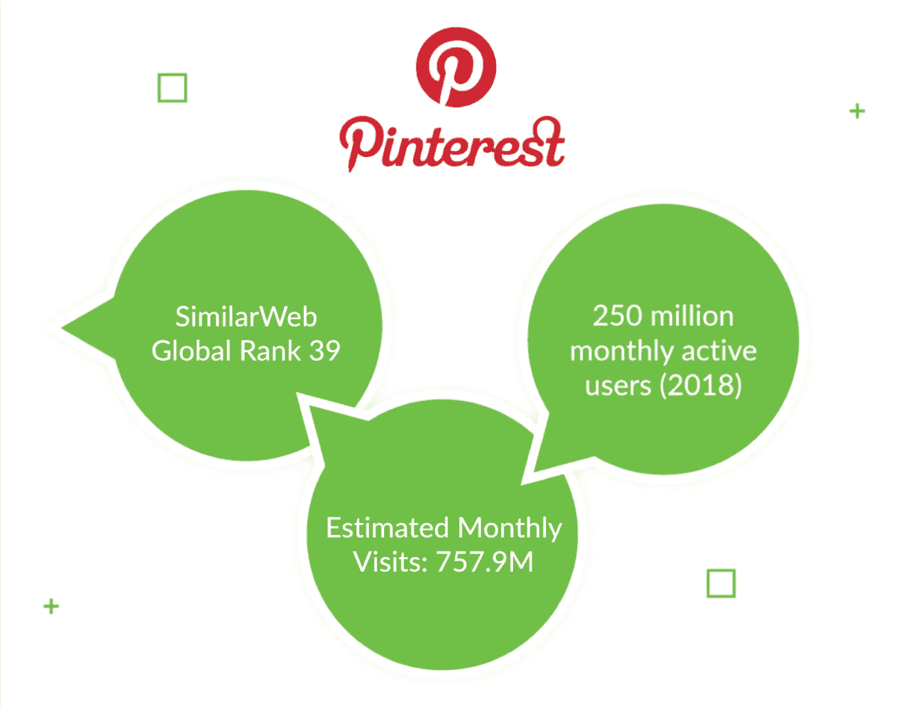
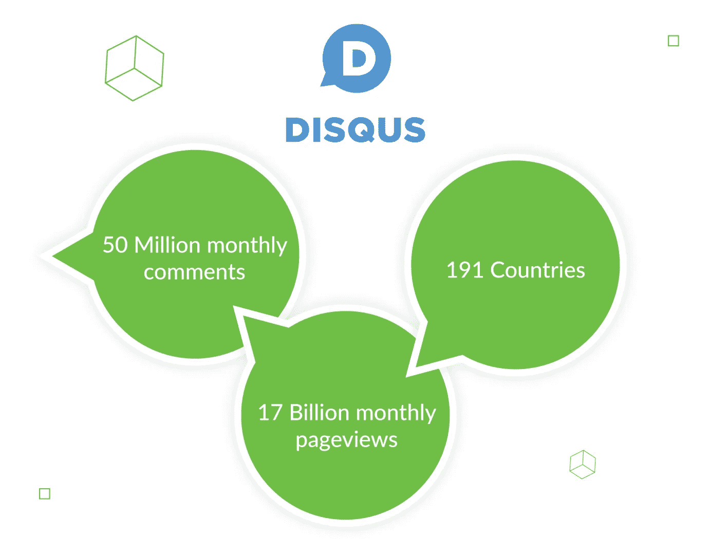
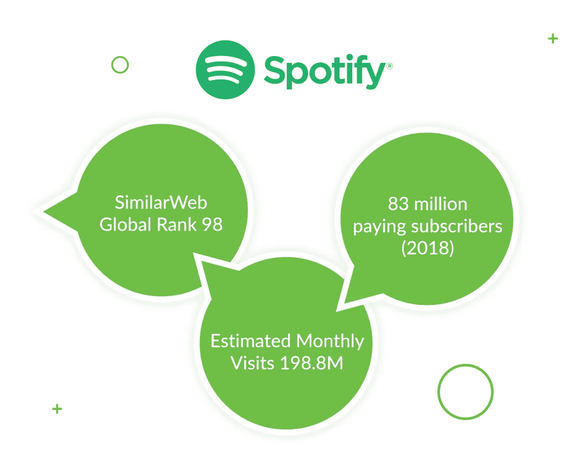
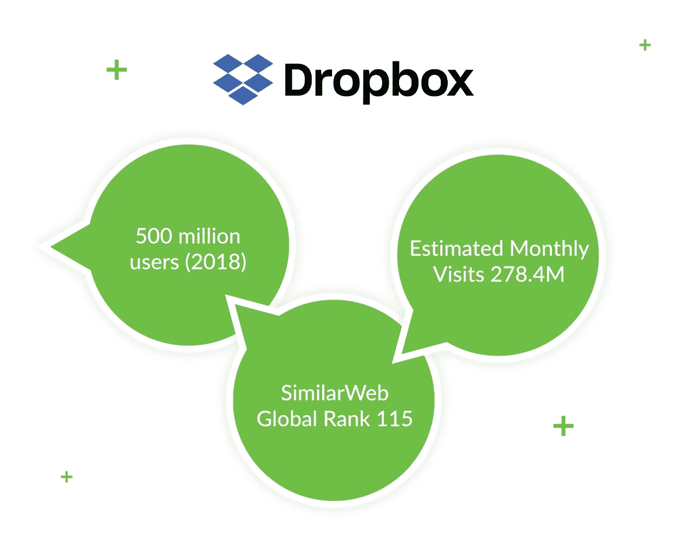
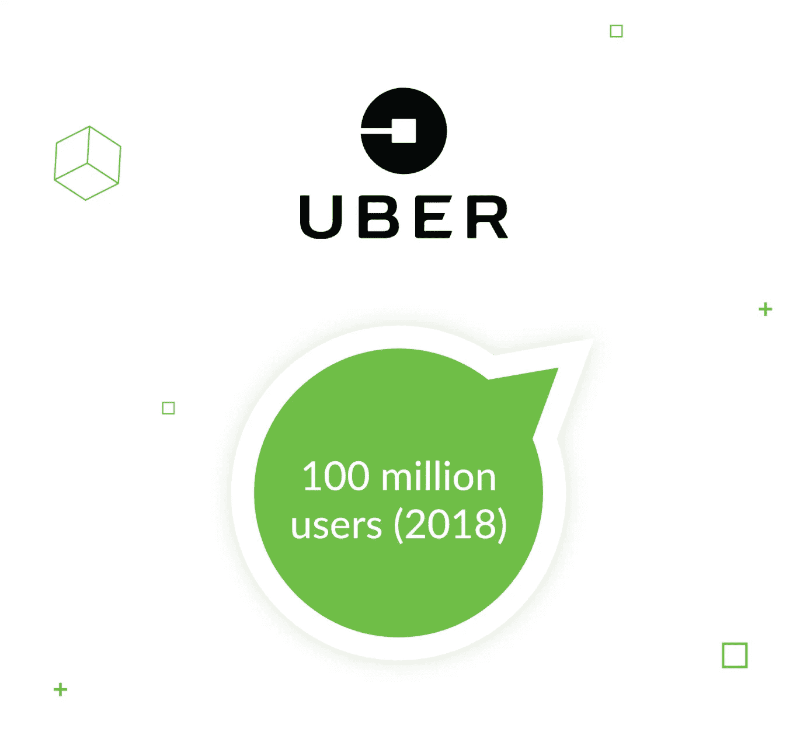

# 用 Python 构建的顶级应用程序

> 原文：<https://medium.com/hackernoon/top-seven-apps-built-with-python-2cd8dfd3c00a>

**继续阅读这篇关于** [**用 Python 构建的应用**](https://djangostars.com/blog/top-seven-apps-built-python/?utm_source=medium&utm_medium=hackernoon.com&utm_campaign=7appspython&utm_content=appsbuiltwithpython)**[**Django Stars 博客**](https://djangostars.com/blog/?utm_source=medium&utm_medium=hackernoon.com&utm_campaign=7appspython&utm_content=djangostarsblog) **。****

**经过近 30 年的发展，Python 已经成为最流行的编程语言之一。但是，如果说大多数初创公司曾经因为它的简单和低成本而使用它，那么 Instagram 或 Spotify 等现代巨头则使用 Python 和 [Django](https://www.djangoproject.com/) 框架来创建流畅的工作体验。众所周知，Django 提供了快速的工作流程、简洁的设计和透明的功能，以及许多其他的优势。它允许所有级别的开发人员专注于编写他们的应用程序，而不是重新发明轮子(或修复它)。最重要的是，它是免费的、开源的，多年来已经聚集了一个强大的开发者社区。大公司欣赏这一点。举个例子，我们来看看一些你可能不知道的用 Python 写的[app。](https://djangostars.com/blog/top-seven-apps-built-python/?utm_source=medium&utm_medium=hackernoon.com&utm_campaign=7appspython&utm_content=appswritteninpython)**

****

## **你可能也喜欢**

** [## 用 Django 构建的 10 个流行网站

### 不管你在哪个领域工作，你最重要的任务之一就是创建一个快速、好看的网站…

djangostars.com](https://djangostars.com/blog/10-popular-sites-made-on-django/?utm_source=medium&utm_medium=hackernoon.com&utm_campaign=7appspython&utm_content=youmayalsolike) 

# 1.照片墙

如你所知，这款应用改变了数码摄影的世界，让数码摄影变得即时、更容易获得、更广泛，拓展了创意领域，并定义了营销的新规则。它允许用户使用像智能手机一样简单的相机拍照、编辑和在线分享。每天有 4 亿活跃用户，这显然否定了任何用 Python 构建的应用程序没有真正可伸缩性的观点。根据 Instagram 工程师丁辉的说法，Instagram 的工程格言是“[先做简单的事情”](https://thenewstack.io/instagram-makes-smooth-move-python-3/)——这就是 Python 允许开发者做的事情。对他们来说，这是用户友好的，简单，干净，并主张纯粹的实用主义。既然它如此受欢迎，发展一个工程团队就容易多了。

# 2.拼趣

Pinterest 排名第三，仅次于脸书和推特，是一个允许用户收藏图片、收集图片并与其他用户分享的社交网络。作为网络上最常用的应用之一，Pinterest 依靠 Python 和 Django 来快速处理大量内容。事实上，这个网站从第一天开始就使用 Python。

# 3.迪斯克斯

这个评论插件是一种简单而有效的方式，可以吸引观众并激发讨论，同时通过有效地调节评论来控制传入的内容。该应用程序允许多种登录选项和跨站点通知，为各种偏好的受众提供服务。在这种情况下，Python 充分利用了 Django 的安全特性和常规的安全补丁。

# 4.Spotify

Spotify 是世界上最大的流媒体服务，年收入超过[€40 亿](https://www.statista.com/topics/2075/spotify/)。这使它成为一个主要的市场参与者，也是企业中 Python 的顶级用户之一。该公司选择使用 Python 是因为这种语言提供的开发速度和高级数据分析。这使得 Spotify 能够管理收音机和 Discover 等功能，这些功能基于用户的个人音乐偏好。

# 5.Dropbox

Python 内置的另一个顶级应用是 Dropbox。流行的文件托管服务最近从 Python 2.7 迁移到 Python 3，这是有史以来最大的 Python 3 迁移之一。Dropbox 是世界上最受欢迎的桌面应用之一，可以安装在 Windows、macOS 和某些版本的 Linux 上。好在 Python 是可移植的，可以在很多平台上工作，从 PC 和 Linux 到 PlayStation。

# 6.优步

作为一家还提供送餐、点对点拼车和自行车共享(以及其他服务)的叫车服务，优步有很多计算要做。想想看:该公司在全球 785 个大都市地区运营，估计拥有 1 亿用户。这需要大量的数学运算。但是，Python 处理大量数据，并且易于学习和使用，这是 Python 如此受欢迎的两个原因。这些优势使它成为那些应用程序需要可靠、安全并依赖全球开发者来维护的公司的显而易见的选择。

# 7.Reddit

美国社交新闻聚合和讨论网站 Reddit 也运行在 Python 上，尽管它最初是用 Common Lisp 编写的。在寻求更广泛的代码库访问和更大的开发灵活性后，Reddit 做出了改变。如果你仔细看，这个网站有点像一个蚁丘。截至 2018 年 2 月，Reddit 的月访问量约为[5.42 亿](https://redditblog.com/2018/12/04/reddit-year-in-review-2018/)，是最令人印象深刻的 Python 应用之一。注册用户在数千个类别中发布文本、视频或图像等内容，并对其进行投票。使用本地化管理平台，用户可以帮助将 Reddit 翻译成 89 种不同的语言。同样，Python 可以管理工作负载和复杂的功能，这要归功于它的“包含电池”方法。

我们能说什么呢？这是一个强大的投资组合！正如我们前面提到的，Python 曾经是一种用于粗略草稿和启动开发的语言，因为它简单而廉价。但是通常，最简单的解决方案是最可靠的。一个机械装置有越多的部件，就越有可能出现故障或有人搞砸——许多大公司都有过惨痛的教训。这就是他们选择使用 Python 的原因，也是为什么这么多世界上最流行的应用程序都是用 Python 开发的。Python 已经证明，你可以用简单的、历史悠久的工具来构建一个令人惊叹的产品——只要你为用户创建它，而不必钻研过于复杂的代码。(当然，除非你想。)

> 这篇关于用 Python 构建的 [**应用的文章最初发表在**](https://djangostars.com/blog/top-seven-apps-built-python/?utm_source=medium&utm_medium=hackernoon.com&utm_campaign=7appspython&utm_content=appsbuiltwithpython) **[**Django Stars 的博客上。**](https://djangostars.com/blog/?utm_source=medium&utm_medium=hackernoon.com&utm_campaign=7appspython&utm_content=djangostarsblog)****