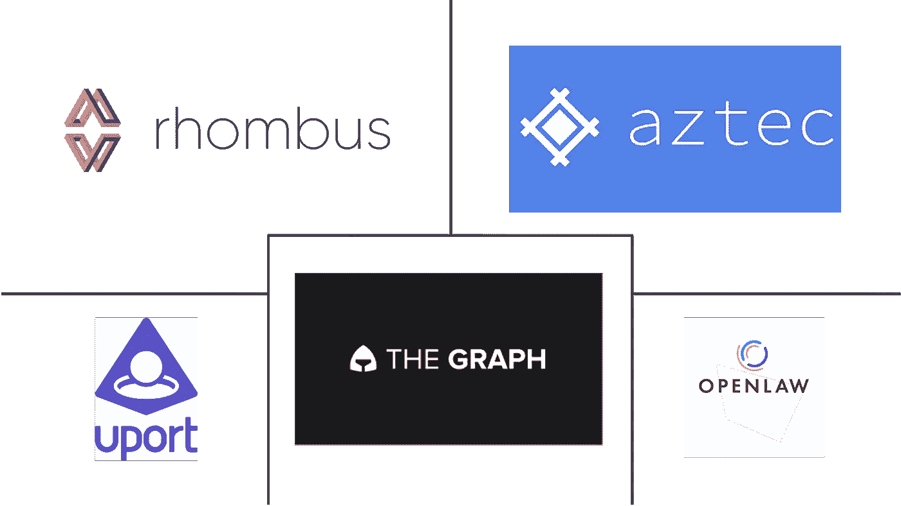
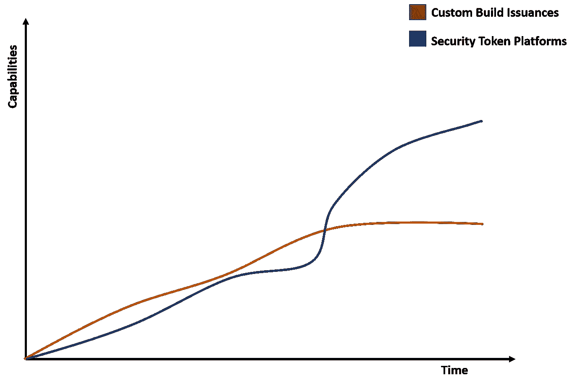

# 走向更可编程和更健壮的安全令牌

> 原文：<https://medium.com/hackernoon/towards-more-programmable-and-robust-security-tokens-five-protocols-that-should-be-part-of-a02093bcb190>

# —应成为安全令牌平台一部分的五种协议

安全令牌平台市场似乎每周都在变得更加拥挤。在一个只有少量活跃交易的安全令牌的市场中，我们已经有超过 50 个平台，它们有望成为加密证券的未来。理论上，这些平台中的大多数看起来极其相似，这导致了市场中的噪音。为了区分信号和噪声，安全令牌平台必须发展其技术能力，以支持更复杂的产品。而且我们不需要从零开始；以太坊生态系统提供了丰富的协议集，可以轻松改进下一代安全令牌平台的功能集。今天，我想探讨一些关键协议，我认为它们非常适合构建安全令牌基础架构的一些关键模块。

*本文的目标不是关注超未来的能力，而是关注已经出现在当前这一代用例中的特性，以及已经达到有意义的吸引力和成熟度的协议。*

到目前为止，安全令牌平台一直专注于解决两个基本问题:合规性和发行后管理。虽然这些功能非常重要，但还远远不足以实现复杂的安全令牌产品(sto)。新的 sto 已经在要求新的基础设施功能，这些功能是当前安全令牌平台生态系统中所缺少的。

# 安全令牌平台的最大竞争对手

加密证券市场的当前状态呈现出一种奇怪的动态，在这种动态中，安全令牌平台实际上不是在与自己竞争，而是与更复杂的供应商的定制发行竞争。最近，我们已经看到了[出处](https://www.prnewswire.com/news-releases/provenanceio-blockchain-raises-20-million-in-security-token-offering-300829674.html)和 [Blockstack 的 sto](https://coincodex.com/article/3403/blockstack-aims-to-raise-50-million-in-sec-qualified-token-sale/)的公告，这两个版本都有可能在内部构建，而不是依赖于现有的平台。你当然可以说这些是孤立的例子，但我相信它们是早期应用驱动的技术市场中常见动态的表现。

技术市场可以分为两大类:基础设施驱动型和应用驱动型。在基础设施驱动的市场中(例如:软件定义的网络、量子计算……)，空间的发展从根本上取决于基础设施层的突破。另一方面，应用驱动的市场(移动应用、网络应用……)不仅基于基础设施的突破，还基于特定领域用例的发展。当支持这些用例的基础设施发展不够快时，它会刺激市场的某些部分提供定制的解决方案，以解决更主流的平台无法支持的用例。在一个健康、竞争激烈的应用驱动型技术市场中，平台的价值主张最终应该会赶上并超过早期的定制平台，但这条道路在早期并不总是清晰的。

应用驱动的技术市场的另一个有趣的动态是，在大多数情况下，应用往往会推动基础设施的改进(我在大多数情况下提出警告，因为这种动态极其复杂)

在安全令牌的上下文中，当前一代平台提供的基础设施仍然相对简单，您可以尝试用与现实世界场景没有关联的开放用例来煮沸海洋。然而，在加密证券市场的当前状态下，我们已经看到了一些重大挑战，这些挑战可以转化为下一波安全令牌平台的即时功能。以下是我最喜欢的一些:

**隐私:**以太坊区块链当前的安全令牌模型缺乏某些安全产品所需的访问控制和隐私级别。

**身份:**安全令牌迫切需要可互操作的、更健壮的方式来代表投资者和发行者的身份。

**数据访问:**查询和访问关于加密证券的运行时数据对于报告和合规性需求是必不可少的。

**披露:**发布和访问与安全令牌相关的重要信息的能力是实现安全令牌市场公平的关键。

**链上法律协议:**实施链上安全令牌协议。

# **短期内有助于改进安全令牌平台的五个协议**

为了避免混淆，我为每个功能列出了一个协议。这并不意味着这些是解决特定挑战的唯一协议，而是说它们是最容易适应安全令牌平台的协议之一。

## 身份

安全令牌平台中的身份概念需要从了解您的客户(KYC)检查点的简单输出演变为支持强大的身份验证和访问控制策略的协议。区块链身份是以太坊社区的新兴研究领域，但已经有一些有趣的协议可以轻松适应安全令牌平台:

[**uPort**](https://www.uport.me/)**:**uPort 一直在稳步构建一系列在分散化应用中管理身份的协议和解决方案。当前堆栈与以太坊智能合约兼容，可以在许可的区块链应用中使用

## 隐私

基于法规约束，安全令牌受到各种隐私要求的约束。在某种程度上，隐私可以被认为是主流采用安全令牌的主要障碍之一。在当前的以太坊生态系统中，有一些协议正在应对这一挑战:

[**AZTEC:**](https://www.aztecprotocol.com/) Aztec 实现了以太坊交易的零知识隐私模型。Aztec 结合了诸如同态加密和范围证明之类的技术，以便能够在加密事务的基础上进行计算。

## 数据存取

访问安全令牌生成的数据对于实现特定行业的报告和法规遵从性功能至关重要。然而，查询智能合同数据仍然是区块链生态系统中最大的挑战之一。以下是一些可能有帮助的协议:

[**图表**](https://thegraph.com/) **:** 图表提供了使用 GraphQL 查询智能合同信息的模型。此功能允许任何第三方应用程序以编程方式与智能合约生成的数据进行交互，而无需构建任何特定于区块链的构件。

## 神谕

安全令牌需要离线数据，以确保其正确的行为以及公平的交易交互。Oracles 是区块链平台的组件，它连接了链上和链下数据源。有几个协议致力于在以太坊区块链中实现 Oracles:

[**菱体**](https://rhombus.network/) **:** 菱体协议为以太坊神谕的实现提供了一种最友好、最灵活的编程模型。Rhombus 支持基于计划或按需执行 Oracles。

## 连锁法律合同

在链外执行安全令牌契约的前提仍然是该领域最大的挑战之一。链外、链内二分法仍然是主流采用安全令牌的最大障碍之一。以太坊社区为应对这一挑战做出了一些有趣的努力:

[**open law**](https://www.openlaw.io/):open law 协议为使用灵活的可编程模型构建法律上可执行的智能合同提供了基础。OpenLaw 的许多构件都可以直接应用于安全令牌。

这些是我认为可以给安全令牌平台带来直接价值的一些主要协议。这些协议提供的功能可以解决当前一代安全令牌平台中的一些主要挑战，并提高其价值定位，以支持更复杂的产品。