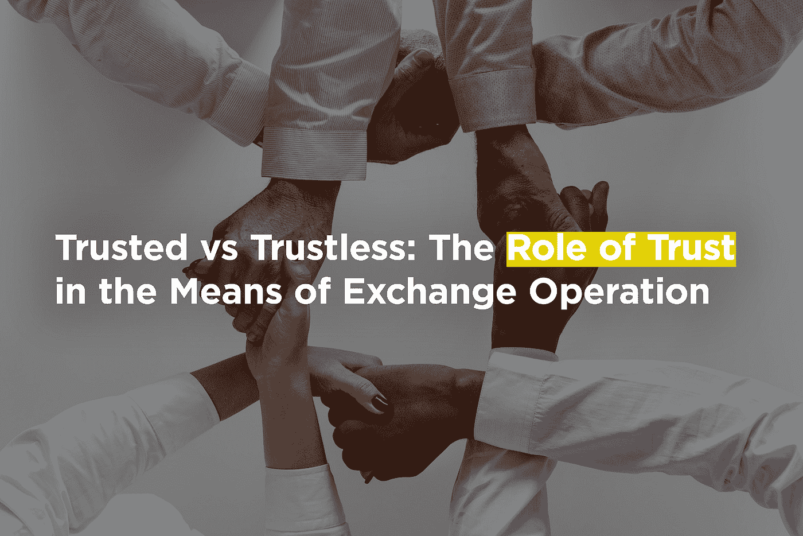

# 信任与不信任:信任在交易操作方式中的作用

> 原文：<https://medium.com/hackernoon/trusted-vs-trustless-the-role-of-trust-in-the-operation-of-means-of-exchange-2215ea9ba383>

“不可信”已经成为比特币鼓吹者的战斗口号，将公众的注意力集中在比特币能够在没有可信第三方作为中介参与的情况下实现 P2P 交易这一事实上。

比特币使得在没有中介的情况下进行资金转移成为可能。中间人，否则他们可以控制交易中的资金，审查交易或充当故障点。这是否为断言比特币和其他加密货币是一种不需要信任的货币形式提供了依据？从货币关系中完全消除信任有可能吗，甚至有必要吗？本文致力于研究信任在货币交易(包括加密货币)中的作用，其主要结论是这一作用难以高估。

文章分为四个部分。首先，我们分析了信任在货币关系中的作用，包括信任在比特币运行中的作用，并表明信任对任何货币都是必要的。接下来，我们继续证明信用和信用货币的必要性，没有信任就没有信用。之后，我们将看看基于加密货币的离线交易的无信任解决方案的局限性。最后，我们将提出一种方法来克服这些限制，主要是通过扩大在链外交易中使用的交换手段的范围。

**信任在货币运行中的作用**

在《*暴力与信任之间的金钱*》一书中，Michel Aglietta 和 Andre Orlean 阐述了与金钱运作相关的三种信任形式[1]。

**有条不紊的信任。货币不同于普通商品的特点是直接交换。个人愿意用他们的商品换钱，只是因为他们相信这种货币形式可以换成市场上的任何其他产品。这就是为什么货币的功能可以通过相对无用的东西来体现，如纸片或数据库中的记录:一个人不在乎货币是由什么组成的，如果他们确信可以用它来交换任何产品或服务。**

这种信念主要来自于许多个人成功的以物易物的经验。这种交换的高频率增强了支付社区的信心，这种信心由货币的使用而团结起来，即这种不成文的交换规则将在未来得到遵守。

如果个人不相信他们可以随时用比特币兑换任何产品或服务，或者至少兑换其他货币，比特币还能发挥货币功能吗？不会。在开始买卖比特币从而增强公众对其与货币相对稳定的可交换性的信心的做市商出现之前，比特币只不过是一小撮赛博朋克的玩物。如果由于某种原因，这种信念丧失了，比特币将只保留数字收藏品的适度角色。

**等级信任。**有条不紊的自信本身就相当脆弱。为了追求利润，这种形式的信任所基于的货币交换规则可能会被违反。例如，坏演员可能会制造假币或突然拒绝接受货币作为支付手段，要求其他东西作为回报。因此，一个有能力执行货币规则的机构必须支持支付社区的诚实成员。等级信任是个人对这种权威维持既定货币规则的能力的信念，包括对违反者可能的惩罚。

通常，这一职能由国家履行。例如，国家有能力惩罚造假者。造假者给经济带来的危害不仅限于那些收到假币以换取商品或偿还贷款的人的损失。伪造者破坏了支付社区所有成员的系统性信心:对交易规则以及交易对手的信心。以及对支付社区本身的信心，没有这些，正常的经济关系是不可能的。

国家有合法的手段强迫个人使用具有法定货币地位的货币。债务人可以确信他/她将能够用这笔钱偿还债务，而不管债权人的突发奇想或诡计。货物的卖方可以确信他/她将能够将收到的货物的钱用于他或她的未来购买。因此，层次信任加强了系统信任。

比特币传道者的口号之一是“代码即法律”的公式。在他们看来，如果这些规则被硬编码到比特币中，那么政府强制执行货币规则就没有必要。然而，经验表明，代码经常被证明是不完美的，这可能被入侵者用来“非法”发射加密货币[2]。*“区块链所做的是将对人和机构的信任转移到对技术的信任上。”*【3】

如果我们忽略各种错误被滥用的可能性，那么，例如，有 51%的攻击允许一个坏演员执行比特币的双重消费。这种攻击也可以比作伪造法定货币。

与国家货币不同，比特币不具备法定货币的地位。没有人有义务将商品或货币兑换成比特币，也没有义务接受比特币作为偿还债务的手段。

如果国家惩罚任何试图通过破坏这个支付社区的规则来获利的人，比特币有条不紊的信任会得到加强吗？在一个或多个国家宣布比特币为法定货币后，对比特币的系统性信任会得到加强吗？要回答这些问题，你不需要成为专业的经济学家或社会学家。

**伦理信任。国家加强了对金钱的有条不紊的信心，但是还有第三种更基本的信任形式来限制政治权力对金钱的支配。这是个人对政府提供的社会体系的信任。如果个人对当局提出的社会项目失去信心，或者当局违反了这个社会的价值观，那么个人就可以开始引入新的交换规则，尽管政府努力挽救他们现有的货币体系。**

在社会动荡时期，尤其是在战争时期，信任的伦理形式的重要性尤其明显。每一个交战方都可以发行自己的货币，个人可以接受一方或另一方的货币，这不仅是基于胁迫，也是基于他们所支持的社会项目。道德信心在货币中的作用的一个不那么悲惨的例子是黄金和法定货币支持者之间的对抗。如果黄金货币受到自由市场倡导者的支持，那么法定货币则受到那些认为政府应该干预经济的人的支持。

比特币是作为一种由国家当局决定的社会项目的替代品而出现的。这种另类的意识形态，诞生比特币的社会的另一个项目，被称为[秘密无政府主义](https://en.wikipedia.org/wiki/Crypto-anarchism)。在这个体系中,(根据定义)没有一个中央权威可以赢得或失去个人的信任。但这并不意味着比特币不容易受到潜在的道德信任危机的影响。

即使在比特币短暂的历史中，也有过类似“内战”的例子，在那期间，支付社区因意识形态而分裂。这种分裂的实质结果是分叉。最突出的“内战”是关于街区大小的争论。秘密无政府主义者党赞成限制街区大小，以保护网络免受中央集权，而商业导向型政党出于商业原因支持增加街区大小。由于 chain analysis[4]等服务的发展，对比特币交易的隐私性失去信心的加密无政府主义者已经转向隐私性更高的比特币叉子，或使用环签名或零知识证明的替代加密货币。

在比特币的历史中，还有另一个道德信任的例子[5]。在经济和社会危机时期，当国家权力及其提供的资金失去了个人的信任时，比特币成了救星——正是因为它的无国籍性质。

**信贷和信贷货币在经济运行中的作用**

比特币被视为数字现金，允许在没有中介的情况下进行交易。如今，比特币网络中的交易事实上是通过中介进行的:矿池和存储用户私钥的第三方钱包服务。但这并不能改变比特币作为数字现金的本质。你仍然可以运行一个完整的节点，自己存储密钥，并尝试将自己的比特币交易添加到[区块链](https://hackernoon.com/tagged/blockchain)中。

不管某种货币的形式是什么——黄金、纸币还是电子货币——它都不能单独为经济服务。几个世纪以来，现金一直与信用货币步调一致；或者也叫做非现金货币。

[信用货币](https://en.wikipedia.org/wiki/Credit_theory_of_money)，顾名思义，是以信用为基础的。所以，在说信用钱之前，有必要说几句关于信用本身的话。

对信贷的需求源于这样一个事实，即不同的制造商和不同的产品有不同的生产和销售条件。因此，一方面，经济总是包含拥有暂时自由资源的个人；另一方面，个人暂时需要额外的资源。前者把自己的资源提供给后者暂时使用，从而维持了资本主义再生产过程的连续性。没有信用，资本主义就不能正常运转和发展。没有信用，现代经济简直不可想象。

从信用关系中诞生的第一种交换媒介是期票。赊购货物的买方向卖方开出一张期票，这是买方在规定期限内支付固定金额现金的义务。卖方可以将该票据转让给第三方，以换取货物或现金，这种做法的蔓延导致了本票与现金一起被用作交换媒介的事实。

与现金相比，本票的优势在于(现金的功能是由贵金属来实现的)，本票在储存和运输方面更方便、更便宜。本票的缺点是其有效期有限，并且没有固定的面值范围(这将允许任何给定的金额通过这种交换手段进行支付)。

一种纸币克服了这些缺点:纸币，代表银行发行的信用货币。纸币是一种没有固定有效期限的债务工具(即没有到期日)，可以随时兑换成金属货币。此外，银行发行固定面值的钞票。

银行以商业期票为担保，用银行的钞票发放贷款，从而将商人的票据“重新铸造”成他们自己的债务。这使得信用货币的流通发展到一个新的水平成为可能，因为纸币比商业本票更好地发挥了“交换手段”的作用。

通常，经典钞票是完全由贵金属支撑的钞票；但实际上，纸币的完全安全是个例外。当市场急需现金时，发行超过抵押品的钞票满足了需求。有限的黄金供应是增加交换手段供应的天然障碍，而日益增长的资本主义经济已经表现出对交换手段的日益增长的需求。信用货币允许经济超越这个自然极限。

在经济危机时期，发行超过抵押品的钞票的需要尤其明显，因为此时现金迅速退出流通，而倾向于储蓄，从而造成支付手段的短缺。

试图禁止发行没有完全安全保障的纸币的一个例子是 1844 年的罗伯特皮尔银行法。该法案赋予了英格兰银行发行纸币的垄断权，但同时也限制了其发行活动，要求 100%的纸币为黄金[6]。三年后，随着经济危机的爆发，政府行使其权利中止了这一法案。在 1857 年和 1866 年的经济危机期间，它也是如此。英格兰银行能够发行超过可用抵押品的钞票，以应对支付手段的短缺，而不加剧危机。在全面提供纸币和拯救经济之间做出选择，英国政府明智地选择了后者。

美国美联储拒绝削减赤字加剧了经济危机，导致了大萧条。大萧条时期充满了这样的例子:没有充分安全保障的私人信贷资金如何能够拯救经济危机和现金短缺。在此期间，美国、加拿大和西欧的数以千计的当地社区创建了他们自己的信用货币系统，包括没有完全现金支持的例子。一般来说，这些地方交换手段运行得很成功，直到政府禁止了它们，(把它们看作是对它们垄断货币发行的威胁[7])。

尽管直到今天政府仍保持着垄断地位，但现代经济仍被商业银行发行的私人信用货币所主导。和以前一样，银行发行信用货币，将借款人的债务“重新铸造”成自己的债务。现金在发达国家货币供应量中的份额不到 10%。商业银行在没有完全提供国家货币的情况下发行信用货币，但政府并不认为这是对其发行垄断的威胁。相反，政府支持走向无现金经济[9]。

代金券也是债务凭证，但与纸币不同的是，代金券是以商品而非货币来兑现的。这些债务工具可以解决各种问题。礼品卡和其他凭证的销售允许卖方获得免费贷款，该贷款将在未来用卖方的货物偿还。可以兑换商品的积分可以增加客户忠诚度。注销买方账户上的小额零钱，这些零钱可以用于未来的购买，这使得卖方可以在小额现金短缺时继续交易。像商业本票一样，可以将凭证转让给第三方，这使得凭证可以用作交换手段。

尽管无信任原则在加密货币生态系统中很受欢迎，但信用货币仍有一席之地。比特币的主要交易对(截至 2018 年 12 月)是 stablecoin Tether (USDT) [10]。USDT 是由美元担保的电子货币。与经典钞票一样，USDT 抵押品不是存储在智能合约中，而是存储在银行里。USDT 的使用者信任这种稳定货币的发行者和存放抵押品的银行:他/她相信，如果有必要，他们能够将他们的 USDT 按面值兑换成美元。

尽管有传言说没有完全的担保[11]，缺乏透明度，没有任何面值偿还的保证，USDT 在稳定的硬币市场上保持着无可争议的领导地位。USDT 和四种类似的货币(TUSD、USDC、GUSD、PAX)，它们也是以美元为支持的电子货币，占 stablecoins 总资本化和汇兑成交额的 90%以上。

信用货币在加密货币生态系统中的作用不仅限于在区块链上“复制”国家货币。事实上，它们在不增加块大小的情况下解决了比特币的可扩展性问题。

**支付渠道:在不可信范围内的可扩展性**

纸币成功地取代了黄金作为交换媒介，因为使用纸币进行交换更快更便宜。纸币成为交换领域中黄金的代表。黄金一动不动地躺在银行的金库里；但同时它又以纸币为代表服务于商品交换。

如果比特币是数字黄金，那么某种“数字钞票”就可以像普通钞票对普通黄金那样发挥作用。为了让基于比特币的交易更快更便宜，它们必须在不推进区块链的情况下进行。如果没有实际现金流动的交易被称为无现金交易，那么在比特币区块链上没有比特币流动的交易被称为链外交易。

人们可以在一个特殊的地址冻结比特币，并用这些比特币作为抵押品，在侧链或其他区块链中发行“数字钞票”；但是，严格地说，这不是一个链外解决方案。尽管这些纸币所用的比特币是静态的，但纸币本身会以侧链或其他区块链的形式移动。

但支付渠道(或者更确切地说，一个双边支付渠道的网络)是比特币网络可扩展性问题的真正的链外解决方案。支付通道的各方将比特币存放在多签名地址上，之后他们可以将他们的存款转移到通道的另一端，而无需沿着原始的比特币区块链移动比特币。通过支付通道连接到一个以上节点的节点形成支付通道网络。通过将支付渠道组合成一个网络，链外交易不仅可以在一个渠道内进行，还可以沿着一个渠道链(跳)进行。

*a)付款前的节点余额 b)付款后的节点余额*

*图一。只有一个中介的多跳支付。*

通过支付通道链的多跳支付允许没有直接连接的节点之间的链外交易。图 1 显示了最简单的支付方案。节点 A 在与节点 B 的通道中有 0.1 BTC 存款，节点 B 在与节点 C 的通道中有 0.05 BTC 存款。中介(以节点 B 的形式)的存在允许节点 A 通过 A-B-C 链向节点 C 进行 0.05 BTS 的链外支付，尽管 A 和 C 彼此没有直接支付通道。这种情况下的节点 B 不是可以非法夺取 A 的比特币的可信方。它只有在向 c 支付后才能访问这些比特币。多跳支付的这种属性被称为原子性:支付链要么完全实现，要么根本不执行。

相关支付可能通过一个有不止一个中间人的链条发生。理论上，人们可以建立一个双边支付渠道的网络拓扑结构，在其中任何两个节点之间铺设相关支付链成为可能。

最著名和最发达的比特币双边支付渠道网络是闪电网络[15]。尽管 Lightning 网络基础设施的发展取得了重大进展[16]，网络节点和支付通道的数量以及这些通道中存放的比特币数量都有了显著增加[17]，但该网络的功能仍有许多局限性。这些限制中的一些与闪电网络基于无信任原则运行的事实有关，该原则要求链外交易的完全安全性。让我们更详细地考虑闪电网络的限制，以及当前关于减轻这些限制的提议。

*支付渠道链的资金吞吐量。*让我们回到上面讨论的多跳支付的例子。如果节点 A 在 A-B 信道中存放了 0.1 BTC，而节点 B 在 B-C 信道中只存放了 0.05 BTC，那么节点 A 将只能向节点 C 支付 0.05 BTC。支付渠道链的货币吞吐量由该链中最小的存款来衡量。

为了克服这一限制，原子多路径支付的概念正在开发中[18]。外链交易可以分为几个链。例如，如果除了吞吐量为 0.05 BTC 的 A-B-C 链之外，还有一个吞吐量为 0.07 BTC 的 A-D-C 链，那么从节点 A 到节点 C 支付 0.1 就成为可能。为此，付款被分成两部分:一部分通过 A-B 链，另一部分通过 A-D 链。

*冻结中间人存款。*在多跳支付 A-B-C 中，参与者 B 作为 A 和 C 之间的中介，只有在 C 确认收到 B 的付款后，才能管理从 A 收到的比特币。如果 C 在一段时间内没有确认收到(例如，它可能离线)，那么 B 必须等到确认等待时间到期。只有到那时，B 才能启动比特币的返还。多跳支付的链条越长，越多的中介冻结他们的比特币，直到最终接收者确认收到或多跳支付被取消。

这对网络性能有什么影响？虽然中介的存款被冻结，但不能用于其他支付。存款冻结的时间越长，中介利润损失的成本就越大。存款的平均冻结时间越长，保证其节点单位时间内的指定货币吞吐量所需的存款就越大:

IмB = ID/ATF

其中 IMB 是中介单位时间的货币吞吐量，D 是中介存款(存款)，ATF 是中介存款的平均冻结时间(平均冻结时间)。维持给定节点容量所需的存款越高，能够存入这一金额的参与者数量就越少；因此，网络的集中化程度越高。

长期冻结中间存款的可能性是对网络攻击的潜在媒介。为了在网络中造成中断，攻击者将寻求在最长时间内冻结最大数量的信道中的最大数量的存款。

Sprites [19]离链网络项目的作者提出了一种组织多跳支付的方法，这种方法缩短了冻结存款的最大时间。这降低了中介利润损失的成本，减轻了网络集中化的趋势以及上述场景中攻击的后果。然而，这一决定“……需要以太坊式智能合约的灵活性……因此无法(我们推测)在比特币中实现。”[20]

*从支付渠道补充和部分回笼资金。*如果渠道参与者耗尽了其存款，并且其在渠道中的当前余额为零，那么其有两种选择来进一步使用该渠道。第一:等待来自另一个渠道成员的付款，由于这种付款，其余额将被补充。第二:关闭通道，并打开一个新的通道，在其中进行新的存款。这两种选择都不太方便。此外，只有关闭通道，才能从通道中取出比特币。除了通道参与者的额外成本之外，通道的永久关闭和打开还会导致网络节点的暂时损失，并使相关支付变得困难。

拼接[21]将允许链上交易补充支付渠道，以及无需关闭和重新打开通道即可提取比特币。据推测，该解决方案的开发和实施将使闪电网络上的链外余额的链上支付和链外余额的链上支付成为可能。

*支付渠道重新平衡。*支付渠道的平衡可能会出现扭曲，这使得它们在链上支付网络中的使用变得复杂。

*图二。国际收支渠道的不平衡。*

图 2 显示了一个平衡偏差的例子，当一个参与者向另一个参与者的支付在一个方向上循环移动:A 只支付 B，B 只支付 C，C 只支付 A。这样的支付模式导致付款方的余额在各个渠道被耗尽，收款方的余额不断累积。

在这种情况下，参与者有两种选择继续使用支付渠道。第一种是使用多跳支付，而不是直接渠道，如果中介为此收取佣金，成本可能会更高。第二:借助线上交易来补充渠道，这也需要额外的成本。

严格来说，在只有一个用户的最简单的情况下，有第三种选择，不需要额外的成本。用户可以通过对自己进行循环的离链支付来将余额从一个渠道转移到另一个渠道[22]。“然而，在不同用户、不同支付渠道、不同目标和不同支付金额的更广泛背景下，不清楚如何创建一套重新平衡交易。”[23]

Revive 协议[24]在上述“更广泛的背景”中缓解了支付渠道中的平衡偏差问题。该协议允许通道中状态的部分重新平衡，而不需要链上事务。我们说“部分”是因为 Revive 不允许将一个渠道开通时的存款转移到另一个渠道。相反，它允许清算支付渠道形成循环的网络参与者的链外余额。换句话说，“这意味着，当将参与者建模为节点，将他们之间的支付渠道建模为边时，任何不包含循环的图都是不可再平衡的。”[25].使用 Revive 进行再平衡不会自动发生:为了实现这一点，链外支付网络的参与者需要被组合到特殊的子网中，并在每一轮再平衡中积极参与[26]。

*中介机构准入门槛高。*网络集中化的趋势已经在上文提及冻结中介存款的最长期限时提及。决定这种趋势的一个更重要的因素是中介本身的商业模式，它包括对离线交易收取费用。

如果多跳支付链中的每个中介都收取费用，那么链中中介数量的减少会导致用户为发送链外交易而支付的佣金减少。中介开通的支付通道越多，用户就越能在最小中介数等于 1 的情况下进行多跳支付。更多的渠道需要更多的存款。存款数额越大，能够存入这一数额的参与者人数就越少，因此，网络的集中程度就越高。

不形成循环的单向支付的优势要求中介在存款管理上花费额外的时间和金钱。如果这需要买家向大卖家支付数万或数十万笔小额款项，那么存款管理的成本可能会很高。

为了降低中介成本，流动性网络项目[27]提出了双向支付渠道的替代方案——多方非托管支付中心。该解决方案降低了作为网络中心运营商的中介的存款要求。由于流动性网络不使用双向支付渠道，中介不需要将加密货币存放在网络中心的每个用户的通道中。为了进行无信任的链外交易，中介只需在智能合同中交存相当于“交易诉讼期间的交易量”的质押。[28]用户余额每 36 小时更新一次，另外 36 小时用于执行交易。因此，中介必须将资金存入 72 小时内等待最终确认的链外交易金额。

可以加入 hub 的用户数量是无限的。如果用户只想加入中心来接收链外支付，而不进行存款，那么他/她不需要为此发送链上交易。相反，他/她可以做的链外。如果用户想要进行存款，那么他/她必须通过链上交易将存款发送到 hub 的智能合同地址。

流动性网络在以太坊的基础上运行，在比特币网络上直接实现这种解决方案是有问题的。据该项目的作者称，“我们的方案还需要一个执行智能合约的环境，类似于以太坊提供的环境”。[30]比特币不能直接存入流动性网络智能合约，但 [WBTC(包裹比特币)](https://www.wbtc.network/)等可以存入[31]。

与流动性网络支付中心不同，通道工厂[32]可以在比特币网络中实现，其功能不需要中间运营商存放抵押品来确保无信任交易。

渠道工厂旨在降低开通支付渠道和在渠道间转移存款的成本。该解决方案作为区块链和支付通道之间的中间层，将使用户在想要开通新的双向支付通道时不必发送链上交易。相反，用户将能够在他们以离线模式创建的群内打开无限数量的支付通道。创建一个群组需要每个参与者进行一次链上交易，将比特币存入一个多签名地址。创建群组后，参与者可以将他们的余额从一个群组成员的渠道转移到另一个群组成员的渠道，而无需链上交易，并且处于无信任模式。

渠道工厂和流动性网络中心之间的另一个区别是，工厂参与者的数量不能增加，因为它是在创建 multisig 地址时设置的。

目前还不知道比特币网络何时推出渠道工厂。渠道工厂的概念正处于发展的初级阶段，它在比特币网络中的实施将需要一个软分叉。

因此，我们着眼于旨在以各种方式克服闪电网络的货币吞吐量限制，并降低使用和维护离线网络的成本的解决方案。然而，所有这些解决方案都有一个普遍的限制，(这给它们强加了一个不可信的原则)。这种限制可以表述为:“只有在发送人和所有中间人都有足够的存款价值的情况下，才能进行支付”。

无信任+信任>无信任

在信道链中金额为 x 的多跳支付要求链中每个中介的存款不小于 x。因此，用于多跳支付的中介存款的总最小量为:

TMID = x * n

其中 TMID 是进行 x 的相关支付所需的中介的总最小存款(总最小中介存款)，x 是支付金额，n 是参与多跳支付的中介的数量。

在中介存款总量不变的情况下，多跳支付的平均中介数量的减少增加了网络单位时间的现金流量。从直接支付中抽象出来，我们可以给出货币网络吞吐量的最简单公式如下:

NMB = TID / (ATF * n)

其中 NMB 是网络的货币吞吐量，TID 是中间人存款总额，ATF 是冻结中间人存款的平均时间，n 是服务于多跳支付的中间人的平均数量。

可以通过最小化 ATF、将网络中的中介机构数量减少到一个以及优化中介机构的存款管理实践来改善 NMB。但除此之外，NMB 只能通过增加 TID 来改善。TID 增长的极限是中介的自有资本。只有一种方法可以超越中介自有资本的限制，这是任何企业家都会使用的方法——信贷。面对经常性的资本短缺，信贷提供了持续商业活动的可能性。

让我们考虑一个例子。节点 A(中间节点 B 的客户端)想要向其对应节点 C(节点 B 的另一个客户端)进行金额为 0.1 BTC 的链外支付。但是 B 仅在 B-C 通道中沉积了 0.05 BTC。如果 B 目前在其其他渠道中没有可用资金来补充 B-C 渠道，则它将不能处理该支付。如果节点 C 同意接受来自中间节点 B 的 0.05 BTC 作为不可信任的“钞票”，并且另外接受由 B 发行的 0.05 BTC 作为可信任的钞票，则可以进行支付。反过来，C 将能够使用可信钞票通过 B 进行支付，或者在需要“现金”比特币的情况下偿还 B。

这是一个最简单的例子。相关支付链可能更长，包含各种不可信和可信链接的组合。特别是，信用不仅可以被中间人使用，也可以被付款的发送者使用。

通过可信工具，扩大双边支付渠道的链外网络中使用的交换工具的范围，使我们能够增加其现金流能力，并降低存款管理中介的成本。降低成本，反过来，允许中介机构减少外链交易的费用。

[GEO 协议](https://geoprotocol.io) [33]使得不仅可以借助无信任票据(iou)而且可以借助基于信任的各种交换手段来执行链外交易。就证券而言，GEO 协议支持的交易手段可分为三种类型:

1.*不可信*。交易方式，完全由存放在支付渠道中的加密资产保护。

2.*被完全担保*。交换手段，完全由链外非数字资产担保。例如，由国家货币或贵金属担保的电子货币。

3.*无全额担保的信托*。这种交换手段主要包括各种价值单位的本票和凭证。

电子货币、期票和凭单等交换手段在世界各地成功运作已有很长的历史，管理其使用的规则也已制定出来并经过详细测试。在此基础上，可以认为这些交换手段比加密货币更值得方法、等级和道德上的信任。

GEO 节点可以以任何组合方式使用列出的任何介质进行相互间的事务处理。如果他们希望彼此进行无信任交易，那么他们可以通过存放加密货币来打开通道。如果他们想要使用基于信任的交换手段，那么他们可以在不存放加密资产的情况下打开一个通道(信任线),并以任何方便的记账单位来命名他们的债务。同时，GEO 网络的每个节点独立地为其每个交易对手设置信用限额，在该信用限额内，该节点同意接受一种或其他交换媒介。

GEO 协议中的多跳支付可以发生在包含任何可用的不可信和可信渠道组合的链中。

如上所述，增加 GEO 网络上的吞吐量不仅通过“不可信+可信”的原理来实现。原子多路径支付[34]和自动循环清算[35]已经在 GEO 协议中实现。

比特币的固定供应限制了作为比特币网络上层建筑的闪电网络的吞吐量。将闪电网络扩展到其他区块链将会克服这个限制。然而，闪电网络将只能支持区块链与兼容哈希算法之间的跨链离链支付。在 GEO 网络中，对跨链交易没有此类限制；因此，货币流通量实际上没有任何限制。

此外，Lightning 网络在网络可扩展性方面存在技术限制。GEO 协议中没有。

最终，GEO 协议不仅允许创建支付通道，还允许创建通用状态通道。这扩展了 GEO 协议的功能，远远超出了链外网络节点之间加密货币的简单移动。

**结论**

没有信任，金钱就无法存在，比特币也不例外。即使是 P2P 交易中使用的传统现金，其正常运作也需要有条不紊、分等级和道德上的信任。

信用和信用货币的产生不是偶然的，而是必然的。资本主义需要信用，现金需要信用货币。经济史提供了许多信贷资金(包括没有完全抵押品的信贷资金)如何帮助经济运转、发展和减轻危机影响的例子。

纸币使得以前用贵金属进行交易的成本降低和速度加快成为可能。由于区块链境外流通的数字纸币，数字黄金交易也可以加速和降低成本。双边支付渠道网络中的链外交易允许比特币在区块链不移动地存储，但同时通过数字纸币维持经济周转。

无信任原则限制了链外网络(NMB)的现金吞吐量。这种限制可以表述如下:只有在发送者和支付的所有中介具有足够的存款值的条件下，才可以进行支付。这种限制可以通过将不可信事务与可信事务相结合来克服。

双边支付渠道网络从无信任到无信任+信任的演变背后的驱动力是货币吞吐量的增加(即使加密货币的供应有限)。

这种演变的逻辑是这样的:NMB 通过增加节点数量、支付渠道数量和存款金额而崛起。当这种类型的增长达到极限时，由于网络的集中化，在 NMB 会出现增长。网络集中化后，由于中间存款的增加，在 NMB 的进一步增长是可能的。这一阶段增长的限制因素是中介加密货币的存量。中介可以使用各种存款管理方法，通过渠道更有效地分配他们的存款，但这些解决方案仍然有一个上限，即中介存款的价值。

只有通过信用，也就是通过基于信任的交易，才有可能进一步增加双边支付渠道网络的货币吞吐量[36]。

在 GEO 网络中，节点可以使用三种类型的交换:无信任的(用存放在支付通道中的加密资产完全保护)，有完全担保的信任的(完全保护的链外非数字资产)，没有完全担保的信任的(本票和凭证)。

GEO 协议既可以被那些支持秘密无政府主义思想的人使用，也可以被那些坚持更传统的社会项目的人使用。此外，在同一个链外网络中使用无信任和基于信任的工具的能力简化了前者与后者的交互。

基于信用的交换手段的引入使得链外网络的货币吞吐量仅仅在理论上是无限的。在实践中，每个网络参与者为他或她与之建立信贷关系的每个交易对手设置一个信任限额。通过可信任的工具，在双边支付渠道网络中运行的媒体范围的扩大，使我们能够实现受无信任原则限制的外链网络所无法实现的结果。

**来源:**

[1] M. Aglietta A. Orlean，*La violet de La monnaie*

[2] Zcash 披露了可能允许“无限伪造”加密货币的漏洞//[http://fortune . com/2019/02/05/Zcash-Vulnerability-Cryptocurrency/](http://fortune.com/2019/02/05/zcash-vulnerability-cryptocurrency/)

[3] Schneier B .没有好的理由相信区块链技术//[https://www . wired . com/story/theres-No-Good-Reason-To-Trust-区块链-technology/](https://www.wired.com/story/theres-no-good-reason-to-trust-blockchain-technology/)

[4]chain analysis—区块链分析//[https://www.chainalysis.com/](https://www.chainalysis.com/)

[5] LocalBitcoins Volume(委内瑞拉)//[https://coin.dance/volume/localbitcoins/VES/BTC](https://coin.dance/volume/localbitcoins/VES/BTC)

[6]史密斯 m .论中央银行“规则”:图克对 1844 年《银行宪章法》的批判//[https://www . Cambridge . org/core/journals/journal-of-the-history-of-the-economic-thought/article/On-Central-Banking-Rules-tookes-critical-of-the-Bank-Charter-Act-of-1844/82 fdb 70461975 fbd6a 529630 a8a 6 c 62](https://www.cambridge.org/core/journals/journal-of-the-history-of-economic-thought/article/on-central-banking-rules-tookes-critique-of-the-bank-charter-act-of-1844/82FDB770461975FBD6A529630A8A6C62)

7 Bernard liet aer——货币的未来，2001 年。

[8]美联储—货币存量和债务措施//[https://www . federal reserve . gov/releases/h6/current/default . htm](https://www.federalreserve.gov/releases/h6/current/default.htm)

[9] Brito J .电子现金案例:为什么私人点对点支付对开放社会至关重要，c . 4–7//[https://coincenter.org/entry/the-case-for-electronic-cash](https://coincenter.org/entry/the-case-for-electronic-cash)

[10]crypto compare 2018 年 12 月交易所评论，第 18 页//[https://www . crypto compare . com/media/35309385/crypto compare _ Exchange _ Review _ 2018 _ 12 . pdf](https://www.cryptocompare.com/media/35309385/cryptocompare_exchange_review_2018_12.pdf)

[11]中央银行报告证明 Bitfinex / Tether 在巴哈马没有 Deltec//[https://blog . zerononnse . com/2018/12/22/breaking-Central-Bank-Reports-Prove-Bitfinex-Tether-DO-no-hawas-Banking-with-Deltec/](https://blog.zerononcense.com/2018/12/22/breaking-central-bank-reports-prove-bitfinex-tether-do-not-have-banking-in-the-bahamas-with-deltec/)

[12]https://stablecoinindex.com/marketcap 的稳定货币指数//

[13]https://blockstream.com/liquid//

[14] Zamyatin A .等人 XCLAIM:区块链互操作性的框架//[https://eprint.iacr.org/2018/643](https://eprint.iacr.org/2018/643)

[15]闪电网//[https://Lightning . Network/](https://lightning.network/)

[16] Balaji A .从#reckless 到 Wumbology:Lightning networks ' s infra structure Build Out//[https://www . the block crypto . com/2019/01/18/From-reckless-to-Wumbology-Lightning-networks-infra structure-Build-Out/](https://www.theblockcrypto.com/2019/01/18/from-reckless-to-wumbology-lightning-networks-infrastructural-build-out/)

[17] 1ML —闪电网络搜索分析引擎//[https://1ml.com/statistics](https://1ml.com/statistics)

[18]Osuntokunо。AMP:基于闪电的原子多路径支付//[https://lists . Linux foundation . org/piper mail/Lightning-dev/2018-January/000993 . html](https://lists.linuxfoundation.org/pipermail/lightning-dev/2018-February/000993.html)

[19]米勒·a .等人《精灵和国家渠道:比闪电还快的支付网络》//[https://arxiv.org/abs/1702.05812](https://arxiv.org/abs/1702.05812)

20 同上，第 2 页。

[21]罗素 r .拼接建议:请反馈！//[https://lists . Linux foundation . org/piper mail/lightning-dev/2018-10 月/001434.html](https://lists.linuxfoundation.org/pipermail/lightning-dev/2018-October/001434.html)

[22]支付渠道中的押品管理挑战—аnd one sight//[https://blog . liquidity . network/2017/11/16/The-pleasant-Management-Challenge in-Payment-Channels-and-one sight/](https://blog.liquidity.network/2017/11/16/the-collateral-management-challenge-in-payment-channels-and-one-sight-of-light/)

23 同上。

[24] Khalil R .，Gervais A. Revive:重新平衡非区块链支付网络//[https://eprint.iacr.org/2017/823.pdf](https://eprint.iacr.org/2017/823.pdf)

25 同上，第 4 页。

26 同上，第 5-6 页。

[27]流动性网//[https://Liquidity . Network/](https://liquidity.network/)

[28] Khalil R .、Gervais A . no cust——一种非托管的第二层金融中介，c . 12/[https://Liquidity . Network/no cust _ Liquidity _ Network _ paper . pdf](https://liquidity.network/NOCUST_Liquidity_Network_Paper.pdf)

[29]NOCUST 101//[https://blog . liquidity . network/2018/11/21/NOCUST-101/](https://blog.liquidity.network/2018/11/21/nocust-101/)

[30] Khalil R .、Gervais A . no cust——一个非托管的第二层金融中介机构，c . 4//[https://Liquidity . Network/no cust _ Liquidity _ Network _ paper . pdf](https://liquidity.network/NOCUST_Liquidity_Network_Paper.pdf)

[31]包裹比特币(WBTC)//[https://www . wbtc . network/](https://www.wbtc.network/)

[32]布尔歇特·c，德克尔·c，瓦滕霍费尔.比特币小额支付渠道网络的可伸缩资金//[https://www . tik . ee . ethz . ch/file/a 20 a 865 ce 40d 40 c8 f 942 cf 206 a 7 CBA 96/Scalable _ Funding _ Of _ block chain _ Micropayment _ Networks % 20(1)。pdf](https://www.tik.ee.ethz.ch/file/a20a865ce40d40c8f942cf206a7cba96/Scalable_Funding_Of_Blockchain_Micropayment_Networks%20(1).pdf)

[33]地理协议//[https://www . GEO Protocol . io](https://www.geoprotocol.io)

[34]链接到关于支付 ALGO 的文章

[35]链接到关于循环清算 ALGO 的文章

[36]只有通过消除双边支付渠道，才有可能在无信任方法的框架内进一步增加网络流动性。我们正在谈论的是，由于无信任解决方案，允许使用链外存款直接支付给支付中心或多边支付渠道的任何成员，理想情况下是网络的任何成员，从而消除了中介。然而，在这种情况下，对信用的需求并没有消失。n 方支付渠道/枢纽网络的流动性仍然面临有限的加密货币供应，这种限制通过信用来克服。

## 遵循 GEO 协议:

[ [媒体](https://medium.com/geoprotocol/) | [推特](https://twitter.com/geo_protocol)|[GitHub](https://github.com/geo-protocol)|[Gitter](https://gitter.im/GEO_Protocol/)|[电报](https://t.me/geoprotocol)|[LinkedIn](https://www.linkedin.com/company/geoprotocol/)|[YouTube](https://www.youtube.com/channel/UC3jEvQvZAmCUXa7dCoX9_Lg/)]