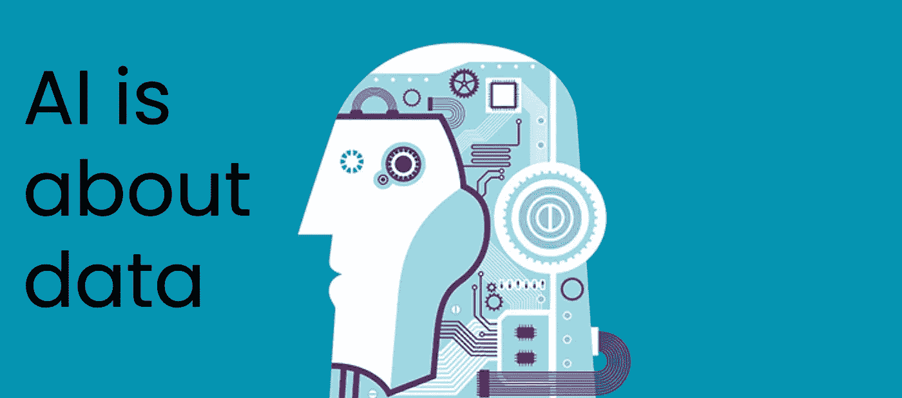
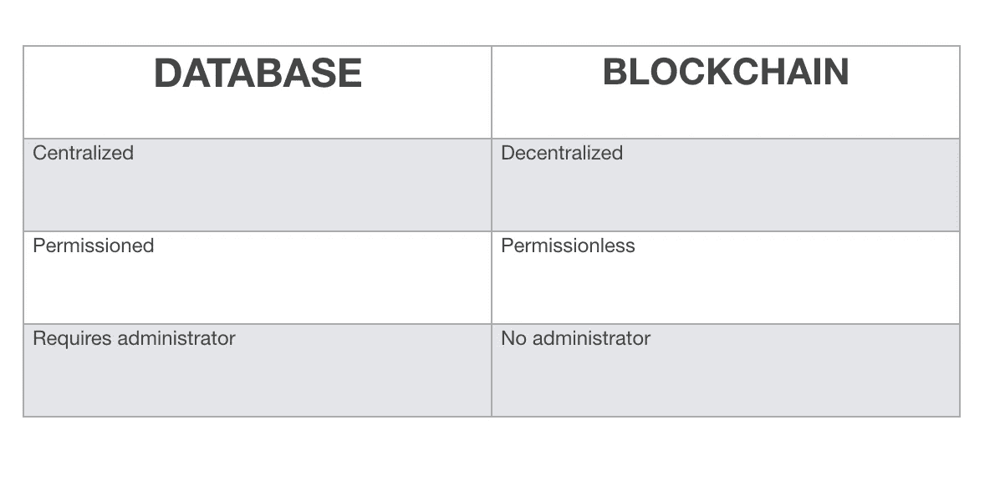
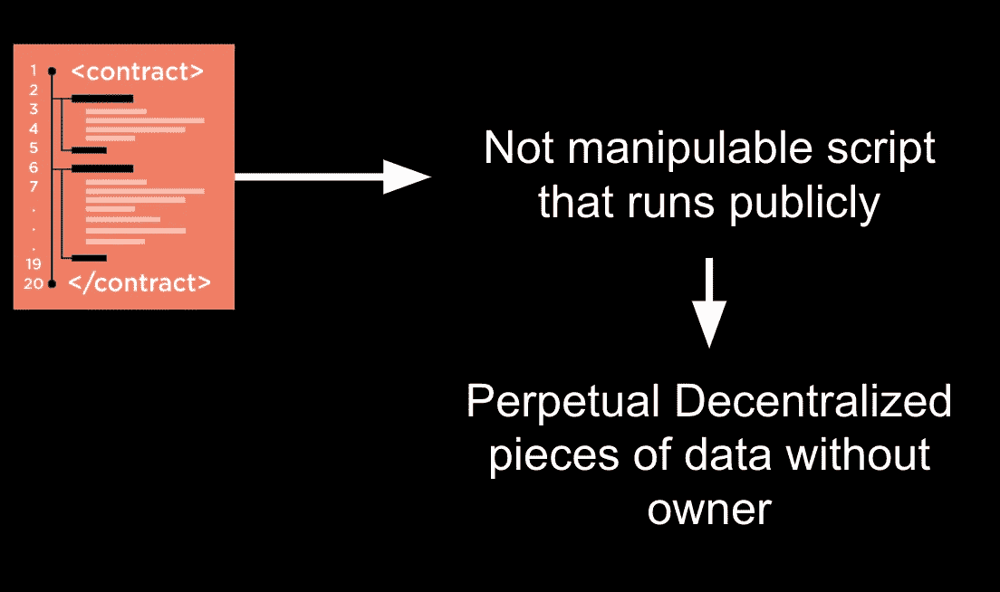
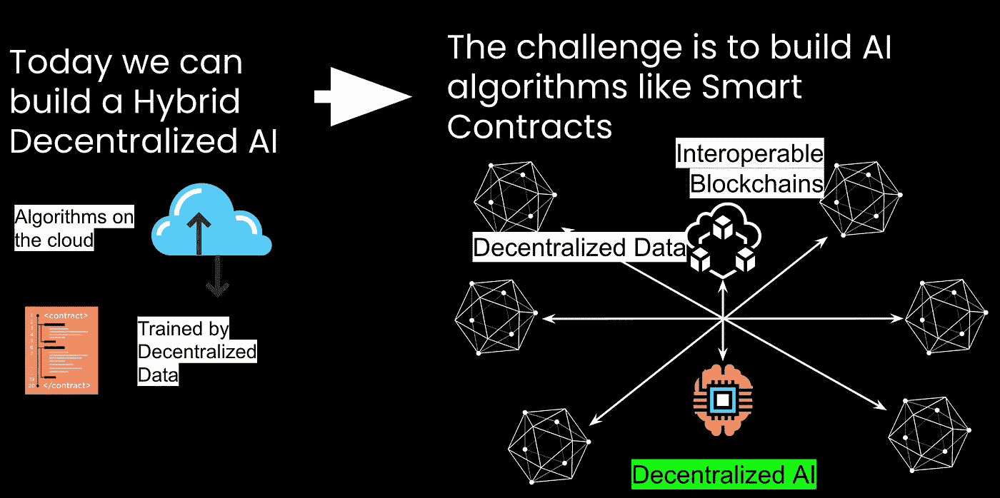

# 理解区块链如何让人工智能更安全、更智能

> 原文：<https://medium.com/hackernoon/understanding-how-artificial-intelligence-can-make-blockchain-safer-and-smarter-d8d4c1f4d343>

## 在人工智能领域，你可以建立智能机器学习算法或令人印象深刻的神经网络，但这项强大的技术可能是可信的，或者可以根据你训练它时使用的数据生成智能响应。

正如我在文章中所写的: [**了解区块链和去中心化 AI**](https://hackernoon.com/understanding-the-gold-rush-of-scalable-and-validated-data-powered-by-blockchain-and-decentralized-ee05db6b6a68) 为 [Hackernoon](http://hackernoon.com) 提供动力的可扩展和验证数据的淘金热:

> 人工智能领域的最佳成果是在封闭和**定义良好的生态系统**，如视频游戏，其中人工智能算法击败了每一个世界冠军，甚至在被认为是业内最复杂的视频游戏之一的 DOTA 2 中……在社交媒体或大数据等开放环境中，人工智能的算法表现较差，或者有时人工智能的结果是危险的错误。

## 等等，但是为什么？

在视频游戏这样的脚本化环境中，你可以根据有限数量的预定义动作训练一个人工智能，读取游戏的代码，在这种环境中，机器学习算法可以根据这些动作做出决定。

在开放和非脚本环境中，事情稍微复杂一些。例如，在社交媒体中，人工智能必须处理假新闻、自报数据、机器人等等。你可以创建足够智能的算法来识别其中的一些，但是，请记住，在这种情况下，你需要很多，我的意思是“很多”计算能力来运行每个计算，所以最终这是非常昂贵的，同时也有很大比例的错误。

通常，开放环境中最有用的人工智能是由拥有该平台的同一家公司制造的，因为他们可以在用户每次做出特定动作时读取他们自己的服务器正在运行的脚本，了解数据的质量以及如何使用它。

正如托马斯·c·莱德曼在他为《哈佛商业评论》撰写的文章 [**“如果你的数据不好，你的机器学习工具就没用了”**](https://hbr.org/2018/04/if-your-data-is-bad-your-machine-learning-tools-are-useless) :

> 糟糕的数据质量是机器学习广泛、有益使用的头号敌人。虽然刻薄的观察“垃圾输入，垃圾输出”已经困扰了几代人的分析和决策，但它对机器学习提出了特别的警告。

除此之外，还有其他一些隐藏的问题使得信任人工智能很危险。

让我们从这个假设开始讨论吧:

> “信任一个由集中数据训练的 AI，是有史以来最危险的事情！”

让我们试着弄清楚为什么这是一个需要考虑的实际问题，如果你信任一个人工智能，你就信任用来训练它的数据集。你可以部署更智能的人工智能算法，但如果你用假新闻或可操纵的数据进行训练，结果将令人失望。

正如杰里米·爱泼斯坦(Jeremy Epstein)在 Venture Beat [**的一篇文章中所写的那样，“为什么你想要基于区块链的人工智能，即使你还不知道”**](https://venturebeat.com/2017/12/23/why-you-want-blockchain-based-ai-even-if-you-dont-know-it-yet/) **:**

> “如果你打算将你的决策信任给一个集中的人工智能来源，你需要对以下方面有 100%的信心:1-数据的完整性和安全性(输入是否准确可靠，是否可以被操纵或窃取？)2-通知 AI 的机器学习算法(它们是否容易出现过度的错误或偏差，是否可以检查？)3-人工智能的接口(它是否可靠地表示人工智能的输出并有效地捕捉新数据？)
> 
> 在一个集中、封闭的人工智能模型中，你被要求在不知道幕后发生了什么的情况下，对每一层都保持绝对的信任。"

如果你是一家公司或者你正在管理一个国家，或者即使你是一个临时用户，在信任一个人工智能并使用它来做决定或者开始基于人工智能的自动决策之前，你必须问自己:

## 如果数据集因为某种原因可以被操纵，那会怎么样？

我们如何信任人工智能算法，如果我们用一个可操作的数据库训练这些算法，在黑客或所有者可以出于任何原因编辑数据的环境中。

正如 Maria Korolov 在她的文章 [**“人工智能最大的风险因素:数据出错”**](https://www.cio.com/article/3254693/artificial-intelligence/ais-biggest-risk-factor-data-gone-wrong.html) 中为 CIO 杂志采访不同的人工智能工程师所争论的那样

> “算法简单有趣，因为它们是干净、简单和离散的问题，”他说。“收集、分类和标记用于训练算法的数据集是困难的繁重工作，尤其是足够全面以反映现实世界的数据集。即使你有数据，你仍然会遇到数据质量的问题，以及隐藏在你的训练集中的偏见。这些类型的内在偏差可能很难识别，但至少它们不涉及数据源主动试图搞乱结果。以假新闻在社交媒体上的传播为例，这个问题越来越严重。”

## 谁拥有数据将统治一切？

如果你是数据集的所有者，有人根据你的数据库做决定，从技术上来说，你是在统治他，因为你可以操纵数据，从而操纵其他人的选择。例如，今天我们信任大型科技公司和他们的数据集，因为他们是好的，他们没有任何操纵信息的经济动机。但公司是由人统治的，未来这些公司的董事会可能会发生变化，不管是好是坏。

正如 Caroline Sofiatti 在旧金山人工智能大会上的演讲**[**中解释的那样，一个分散的数据市场在人工智能**](https://conferences.oreilly.com/artificial-intelligence/ai-ca-2018/public/schedule/detail/72064)**的未来中的作用:****

> ****“一旦你将数据委托给一个常规的数据库，你也就变得依赖于数据库所在的人类组织。你不是掌控一切的人。”****

********

****理解这个问题重要性的有力引语是来自麻省理工学院科技评论 **:** 出版的 [**彼得·泰尔**](https://www.technologyreview.com/the-download/610268/crypto-is-decentralizing-ai-is-centralizing-or-if-you-want-to-frame-it-more/)****

> ****“加密是去中心化的，人工智能是集中化的。或者，如果你想从意识形态的角度出发，crypto 是自由主义者，AI 是共产主义者。”****

## ****如果我们不能阅读生成数据的脚本，我们如何理解数据的质量？****

****如果你想建立一个智能的人工智能，它需要能够理解什么是可信的或不可信的，为了做到这一点，你需要读取用户在做动作和创建信息时运行的脚本。****

****web 2.0 的问题是，如果你不是网络的所有者，你就不能通过脚本读取用户的交互，而只能读取脚本提供的数据，因为脚本是 100%私有的，它们运行在所有者的服务器上。****

****用人工智能的术语来说，你可以通过复杂的程序和大量的计算能力来理解哪些数据是可信的，哪些是不可信的。这种方法还没有产生高性能和可靠的结果。****

## ****为什么区块链技术是构建可信 AI 的关键？****

****如果我们分析区块链网络的基本特征，例如比特币，用户的每一个动作都是为了生成永久的、没有所有者的不可操纵的数据，这是构建可信人工智能的惊人起点。****

********

****正如 Salih Sarikaya 在他的文章“ [**区块链将如何颠覆数据科学:大数据中的 5 个区块链用例**](https://towardsdatascience.com/how-blockchain-will-disrupt-data-science-5-blockchain-use-cases-in-big-data-e2e254e3e0ab)**”**at 迈向数据科学:****

> ****Janexter 的 Maria Weinberger 说，如果说数量大，那么区块链就是质量。这遵循了这样一种理解，即区块链专注于验证数据，而数据科学或大数据涉及从大量数据中做出预测。”****

****区块链技术中最令人惊叹的杀手级应用是“智能合约”，它为构建智能和可信的人工智能带来了前所未有的机遇，自以太坊(Ethereum)等第二代区块链发明以来，这种应用就一直存在。在 2014 年和以太坊背后的概念之前，区块链技术只能以不可信的方式跟踪金融交易的数据。****

****如果我们分析智能合约的结构，它是一个永久的、分散的脚本，公开运行。****

****正如我在 [Hackernoon](http://hackernoon.com) 的文章[中所写的“去中心化数据:【为什么区块链毫无意义，不可信就是一切】](https://hackernoon.com/decentralized-data-why-blockchain-is-meaningless-and-trustless-is-everything-318fd14d3827):****

> ****随着智能合约技术的基本引入，与以太坊网络交互的开发者不得不分散他的功能。用户每次与去中心化功能交互时，都要进行以太坊交易。在以太坊交易期间，网络在块内验证被调用的函数、请求和结果。这三个方面是以完全不可信的方式交付分散数据的基础。****

## ****为什么这对 AI 来说是最惊人的消息？****

****智能合约最终可以编写分散的数据，存储脚本本身、请求和结果，没有任何操纵的可能性，也没有所有者。****

****如果我们在此基础上训练人工智能，这可能是一个巨大的进步，因为有了这项技术，我们可以肯定地知道在不信任实体的情况下生成数据的脚本和请求。****

********

****如果我们开始收集大量干净和分散的数据，我们将在人工智能的信任方面向前迈出一大步，我们将能够开始将它用于商业选择，确保未来尽可能远离依赖于统治大公司的人的“1984 年情景”。****

****但是使用这项技术的真正下一步将归功于智能合同的去中心化和公开运行特性。在本文的开始，我讨论了为什么在脚本环境中人工智能算法比在开放环境中工作得更好。在开放环境中，挑战在于理解生成信息片段的私有且不可读的脚本的目的，以便理解数据的质量。****

****有了智能合约，就有机会创造像封闭和脚本化的开放环境，尽可能将复杂性转化为代码。这种新的架构将克服理解和清理数据集方面的许多数据科学问题，可以实现理解数据质量所需的更少的计算能力，并最终可以帮助人工智能提高结果和预测的精度。****

****今天，我们可以建立混合的分散式人工智能，基本上是在云上私下运行人工智能算法，但训练它只信任基于区块链的分散数据。****

****这是一个巨大的进步，但未来十年实现去中心化人工智能的挑战将取决于我们如何成功地建立区块链网络，能够以我们今天在智能合同中运行脚本的相同无信任方式运行 AIs 算法。****

********