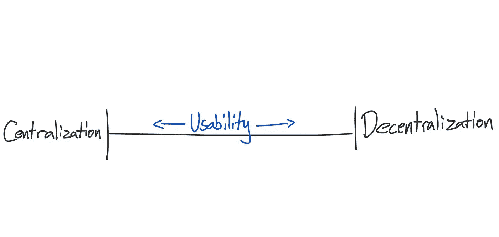
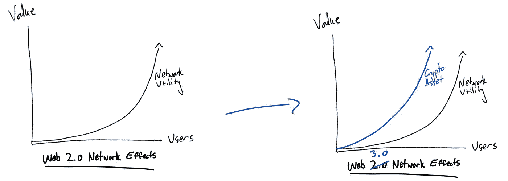
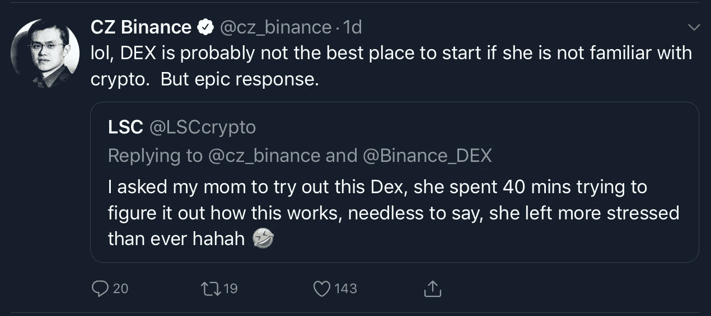

# 理解权衡:去中心化与可用性

> 原文：<https://medium.com/hackernoon/understanding-tradeoffs-decentralization-vs-usability-c537ba612a5e>

随着不可信计算的出现，区块链为计算打开了一个新的设计空间。在一个日益集权化(比如四大)、日益控制和剥削(比如脸书)以及日益审查(比如国家)的世界里。一个去中心化、自我主权、抵制审查的协议正是这个世界想要/需要的。你只需要看看 ICO 热潮，它在 18 个月的时间里播种了 2000 多个新项目，就可以看到人们渴望建立一个新的互联网，摆脱我们今天面临的系统性挑战。

**进入 Web 3.0:** 去中心化运动三大支柱的交汇点，也是构建下一个创新时代的基础。除此之外，即使有数千亿的既定价值——以及一些最聪明的头脑致力于构建堆栈的职业生涯——也没有人使用它。

我认为主流采用的限制因素正是开启这个新范式的东西: ***去中心化。***

如果去中心化互联网的愿景能够实现，我们需要认识到去中心化是一个范围，基本的权衡是可用性。一个优化到什么程度，另一个就要牺牲掉；然而，有一种方法可以让我们鱼和熊掌兼得——因为这个光谱不是静态的，而是动态的。

这个频谱是协议竞争的战场。我相信最终会出现 1-2 个大赢家。这些赢家最终会在去中心化上汇聚到一个共同点:可用性范围。我不知道这一点在哪里(随着第 1 层和第 2 层解决方案的改进，它可能会继续发展)，但我相信，实现这一点的最佳方法是开始优化可用性，并在去中心化方面做出权衡。

该领域的许多发展都过度关注分散化，关注最低可行可用性(MVU)，或者对于那些试图混淆证券监管的人来说，这是另一个版本的 MVU(最低可行效用)。

我们近期应该优化的变量是最小可行分权(MVD)。也就是说，根据不同的用例，MVD 可能看起来非常不同。微交易经济，如 WAX 或 BAT，将有不同于价值存储用例(如 BTC)的阈值。

分散光谱也不是二维光谱；需要考虑不同的因素，这些因素都会影响网络的完整性和用户体验。例如，许可的区块链比无许可的区块链提供更高的吞吐量，在无许可的中，吞吐量随着节点的增加而降低，但网络的安全性会增加。当与一个无许可的网络交互时，比如说比特币，在 onramp/offramp 体验和存储中有集中和分散的选项，即集中和分散的交换和钱包。

在每个向量上，考虑到网络效应的复合价值，应该优化的变量是用户采用率。在加密中，这些网络效应仅在给定具有固定供应的基础加密资产的性质的情况下被加强。在像 Twitter、脸书或 Reddit 这样的 Web 2.0 平台中，用户越来越多的采用带来的价值是网络效用的增加(即更多的内容)，但平台的财务价值也随之增加。在加密网络中，用户也是利益相关者(意味着他们拥有底层加密资产的稀缺供应的一部分)，用户实现了网络效用的增加以及随着采用的增加而带来的财务收益。随着网络应用的增加，对底层资产的需求也在增加。

我们看到这些战斗在整个加密生态系统中实时展开——无论是在底层协议中，还是在镐和铲业务中。前者是我们在争夺平台主导权的战斗中看到的，即以太坊对 EOS，后者是我们在交易所的战斗中看到的，即比特币基地对币安对德克斯。

## 平台战

以太坊是平台竞赛中的现任者。第一个图灵完全区块链(行业术语，指具有合理逻辑的协议，即可编程货币)使 dapp 能够建立在以太坊网络之上，使用本地货币 ETH，或使用 ERC20(可替代)或 ERC721(不可替代)标准的 app coin。值得注意的是，以太坊运行的是一个无许可共识协议，这意味着任何人都可以运行一个节点，而无需请求个人授权。今天以太坊网络上有 40k+节点。这为网络完整性带来了更高的信心，同时也牺牲了吞吐量和延迟。这是主流用户采用的一个关键限制因素。

相比之下，EOS 运行一个由 21 个节点组成的许可网络。这在分散化上有所折衷，但是对网络的吞吐量和延迟有实质性影响。根据[block activity . info](https://blocktivity.info/)的说法，EOS 网络正在处理 40 倍的交易数量——这使得他们的 dApp 生态系统的规模超过了以太坊的生态系统，尽管以太坊目前处于主导地位。据 stateofthedApps.com 的[报道，EOS 拥有 70k+活跃 dApp 用户到以太坊的 15k。](https://www.stateofthedapps.com/)

## 交换战

在这场交易所争夺战中，有两个因素值得注意。第一个是集中式与分散式交易所(CEX/DEX ),第二个是平台上提供的令牌的广度——两者都是优化采用和后续网络效应的战略决策。

在 CEX 与 DEX 的对比中，我们看到集中式交易所窃取了早期的市场份额。比特币基地采取了消费者第一的方法来构建他们的产品——他们让用户通过获得银行许可来轻松进入加密生态系统，以便能够托管用户的资金。这是高度集中的指标，但即使是不精通技术的人(比如我母亲)也可以很容易地点击几下就注册一个比特币基地账户。比过去的本地比特币流程简单多了。这一集中流程并像银行一样运营的决定(与比特币白皮书中的 cypherpunk 运动相反)使比特币基地达到了巨大的规模(超过 2000 万个钱包)，相比之下，领先的 dex 的钱包数以万计。

竞争的另一个载体是代币的广度。[币安 Multicoin Capital 最近的一份报告](https://www.dropbox.com/s/7k5fjsnakjkug5y/Binance%20Coin%20Analysis%20and%20Valuation.pdf?dl=0)阐明了币安上市大量代币(200 多个)的策略，相比之下，比特币基地上市的 7 个代币(其中 4 个是最近新增的)使他们获得了 80%以上的每日加密交易量。值得注意的是，币安交易所也是一个集中的交易所，尽管直到最近才推出菲亚特 onramp。

比特币基地和币安都认识到权力下放的活力，正在着手将交流经验的更多组成部分下放。比特币基地收购 Paradex，币安推出币安 dex。

币安似乎更看好币安经验的去中心化，但也足够务实地认识到，在一开始优化去中心化会有局限性——参见 CZ 最近的一条推文:

CZ 在用户体验中表现出对实用主义的强烈偏好。在周期性的创新浪潮中，为了达到目的而过度优化手段是一个普遍现象。我们已经在 crypto 中看到太多的团队挥舞着锤子寻找钉子。；首先致力于解决复杂的技术问题，然后找到他们可以应用的消费者问题，而不是使用技术来解决离散的消费者问题。

## 密码能从它试图破坏的现有者那里学到什么

在加密的上下文中，集中化带有亵渎的意味，然而，在某些领域，集中化程度是有利的。比特币展示了强大激励结构的力量——未知行为者围绕一个共同协议进行协调。然而，我们也看到了分散治理结构的弱点，在这种结构中几乎不可能做出决策。即使在像以太坊这样逻辑集中的社区中，迭代的速度仍然是进步的障碍。

网络内部的部落主义和内讧一直是围绕基本升级进行协调的无许可协议的阻碍因素——其中许多都是琐碎的决定，可以通过决策权的重新集中非常快地做出；甚至对社区中最坚定的反对者来说也可能是一个积极的消息。

最好的软件公司已经通过在紧密的反馈循环中的灵活性奠定了他们的领导地位。我们今天使用的软件与六个月前相比看起来有很大的不同。这是短开发周期和不断迭代的产物，只有通过集中决策的结构才有可能。不一定是独裁，而是一个由一小群决策者组成的协调系统，可以达成最终结果。

这是一场比赛。赢家将是那些能够对新出现的变数做出反应并灵活机动的人。在开源环境中，有许多开放的模块可以添加到可分叉的基础设施中，赢家将是那些保持最大灵活性的人。

## 公开/透明并不取决于权力下放

集中用户体验和治理的组件并不排除更广泛的社区的透明度。开放式网络设计是任何人在该领域进行建设的重要支柱。如果消费者不同意网络的方向，他们总是可以自行选择退出。这是一种健康的紧张关系，它使那些在分权上做出权衡的项目动机一致。

赢家会找到正确的平衡。我们今天所处的 Web 2.0 时代过于集中，需要被颠覆。这篇文章并不是反对权力下放，而是支持我们在整个过程中采取务实的渐进主义方法。我们需要找到一种方法，让消费者踏上旅程，而不是跑在前面，希望他们能赶上。有人将达到逃逸速度，我的假设是，将是那些指向可用性而不是去中心化的人。