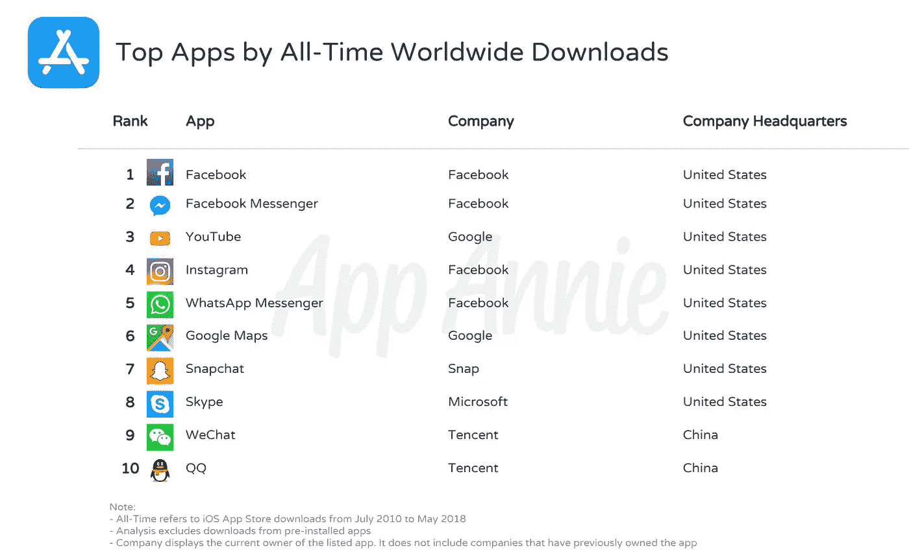
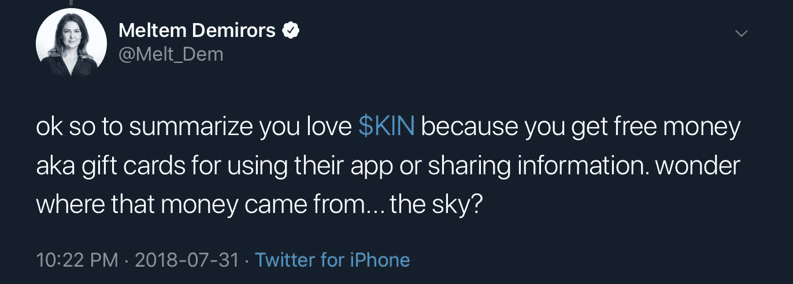

# 理解权衡(pt。2):打破利他主义与资本主义的二分法

> 原文：<https://medium.com/hackernoon/understanding-tradeoffs-pt-2-breaking-the-altruism-vs-capitalism-dichotomy-a03767fb1433>

我最近写了一篇关于去中心化的权衡的文章。这是一篇实用的文章，专门揭示了分散式基础设施对消费者体验的客观衡量标准(即 UI/UX)的影响。它没有做的是打开交易空间的另一面；在这种情况下，去中心化消除了整体消费者体验中的隐含权衡(即，访问、激励、渗透性等。)

第一篇文章关注的是我们在微观的产品层面上做了什么样的权衡；这篇文章将关注在宏观的社会经济层面上抽象出什么样的权衡。

## **当今世界状况**

人们花在网上的时间越来越多**【1】**。在线体验已经从单人模式发展到多人模式，在单人模式下，在线的核心价值支柱是获取信息(因此谷歌的开创性使命是“组织世界的信息”)，在多人模式下，价值支柱是连接。社交图谱的基础上出现了新的业务。如今，下载量最高的前十个应用中有九个是多人平台。

人类是天生的社交动物，所以使用最多的应用程序本质上是社交的，这是有道理的。在线体验已经从数字游牧民在搜索引擎中输入查询发展到数字公民跨社区连接。硬件和软件的发展壮大了一个新的创造者阶层。不仅仅是开发人员——任何拥有智能手机和互联网连接的人都有机会在数字世界创造价值，不管他们出生在哪里，也不管他们的社会经济地位如何。

我们，作为人类，本质上也是享乐主义的。构建最受欢迎的平台的人认识到了这一点，并开发产品来利用这一点，通过社交反馈循环(过滤器、喜欢、评论)和旨在让用户在短暂肯定的跑步机上跑步的算法来构建让用户沉迷于他们平台的产品。

社会资本是货币，脸书是中央银行。

如果我们重新审视下载量最大的应用程序列表，你会注意到顶端现有权力的巩固。下载量最高的五个应用程序中有四个都是脸书所有的(FB、Messenger、Instagram 和 WhatsApp)。推而广之，通过向 Instagram 和 Facebook.com 这样的收入机器提供资金，脸书能够在 WhatsApp 这样的免费公共事业领域建立一个定义明确的护城河。这使得 Snapchat 这样的应用程序试图在出色的产品体验和运营盈利业务的需求之间找到平衡——当你的竞争对手得到母舰的资金支持时，这不是一件容易的事情。

问题不仅仅在于这些公司本身，问题在于游戏是如何设置的。在一个集中化公司争夺有限用户时间和注意力的世界里，这是一个零和游戏。这些在位者已经达到了一定的规模水平，他们(1)从网络效应中锁定了消费者，以及(2)以免费服务(G Suite)的形式存在护城河，由现金牛(谷歌搜索)资助。这使得这些垄断企业不再为用户制造产品，而是开始将用户视为产品——找到让用户沉迷于他们的服务的方法，并利用这种沉迷来货币化他们的时间、注意力和数据。这是对用户的榨取，并使其他开发者越来越难以竞争。

在这个游戏中，存在两个基本的权衡:( 1)什么对我更好，什么对我的用户更好，以及(2)什么对我更好，什么对其他开发者更好。

开发者面临着一系列利他主义与资本主义的对抗。这些传统上一直处于紧张状态，但是 crypto 开启了一个新范例，在这个范例中，这两个维度不再冲突，它们相互加强。你越无私，经济回报就越高。

## **今天的游戏(无密码)是一场无拘无束的巷战**

鉴于消费科技的现状。每个开发者都面临着同样的挑战:(1)找到一种新颖的消费者体验，(2)取得一些成功，(3)击退所有其他争夺用户注意力的新进入者，以及(4)如果你成功做到了这三点(不太可能)——完成你向山顶的攀登，以面对根深蒂固的现有者。这就像一个真人快打的传奇，脸书是最后的老板。

这是一场一次又一次上演的游戏。我们正在目睹这场最新战斗的最后一击，挑战者(埃文·斯皮格尔)在一两次财报电话会议上就能听到邵·卡恩(马克·扎克伯格)不祥的“干掉他”。

但是，如果你不想玩这个游戏，还有一个办法！你可以提前出卖你的灵魂，跳过第 1、2、3 步，加入奥林匹斯山山顶的众神(四巨头)。这是一个我们已经看过很多次的剧本:为一个现有的平台建立一个新颖的体验，并利用他们的分布；双赢，对吧？这对每个人来说都是积极的。除了问 Zynga 故事结局如何。当垄断者为他们忠诚的臣民保留你的产品时，你会被从山上踢下来。

## **狗转过来又吃它所吐的，照样，愚昧人重复他的愚昧——箴言 26:11**

我们玩这些不可能的游戏，因为这是你唯一能玩的游戏。激励机制的设置使得任何理性的行动者都遵循同样的剧本，即使每个人都知道它的结局。

从逻辑上讲，我们知道打造繁荣之路的唯一途径是通过合作。问题在于，在当前的体系中，激励机制是错位的。外生环境迫使挑战者进入博弈论竞争，在两个领域进行内生权衡:

## 竞技场 1:最适合我与最适合我的用户

开发者的任务是优化(1)用户体验或(2)盈利。考虑到今天开发者可用的货币化手段，这些从根本上来说是相互矛盾的，因此可以作为权衡的变量。

## 竞技场 2:最适合我还是最适合其他开发者

开发人员的任务要么是(1)与其他开发人员协作，要么是(2)各自为战，与其他开发人员竞争。除了正在拼凑整体端到端用户体验的现任者之外，今天正在构建的应用程序是数字体验更大图景中的辐条。

## **“欢迎来到真实的沙漠”——莫斐斯**

还有一个办法。Crypto 打开了一个新的领域，摆脱了我们今天玩的零和游戏的限制。

密码经济学的一个关键属性是其固有的稀缺性。通过用一种供应有限的共同货币支撑消费者应用，利益相关者的激励被联合起来，共同努力增加对货币的需求，进而增加货币的价值。

凯恩斯主义经济理论认为，健康的经济是经历适度通胀以保持相对稳定的购买力(随着时间的推移略有贬值)的经济。这是通过动态的货币基础实现的，在这种基础上，央行参与量化宽松等活动。对于生产者来说，这是一个零和游戏。由于没有办法直接影响货币的*升值*——假定外部力量将重新稳定——理性的行动者总是会通过优化增量*积累来最大化他们的预期收益。*

加密经济学引入了一个新的维度，即在货币基础缺乏稳定机制的情况下，生产者*可以*影响基础货币的价值。预期收益方程中引入了一个新的变量:升值。生产者现在可以选择优化增值或积累。这就把零和博弈变成了正和博弈。假设某种程度的现有积累(没有完全破产)，如果货币的预期增量升值超过不合作带来的预期增量积累，理性行为者将会合作。

这一关键属性改变了上述两个领域的动态。这个游戏不再是收集和提取，而是收集和授权。因此，“最适合我**或**最适合他们”变成了“最适合我**和**最适合他们”的竞技场

## **新游戏开启新结局**

对于开发者来说，所有的路都通向三种结果之一:(1) IPO，(2)被收购，或者(3)死亡。

大多数都死了。这不是英勇的，迅速的死亡——这是迷失在甜点中，紧紧抓住生命，意识到没有人记得你的存在，并来拯救你，死亡。对于少数幸存下来的人来说，其他的选择并不像看起来那么性感。收购更少——尖峰时刻，两个有趣、迷人的代理人合作，一起踢屁股——更多的是出去，疯狂的白人女孩和她的家人洗脑，劫持善意的主角的身体。就像连姆·尼森是唯一有能力扮演复仇父亲的演员一样，马克·扎克伯格也是扮演疯狂的白人女孩的角色。这样我们就只有 IPO 了。从表面上看，这似乎很棒:在舞台上，敲响纽约证券交易所的钟声；媒体，金钱，名声。除非钟声一停止回响，你的新股东就变成了一个缺乏安全感的男女朋友，你必须在每次收益电话和新闻发布会上向他们保证你们的“共同未来”。

所有这些听起来都很可怕。在沙漠中游荡，被遗忘和虚弱听起来是个不错的选择！问题是，在加密之前，没有办法激励所有的沙漠流浪者一起工作，建立自己的村庄。互联网的整合已经演变为赢家通吃的垂直整合竞赛。竞争的唯一方式是垂直整合(并最终上市)，或者希望你融入别人的垂直发展(并被收购)

但是 crypto 独一无二地使沙漠人能够持续地、合作地横向融合。没有人能控制也没有人能更好地利用这种通用货币——开发人员有动力一起工作，而没有被去平台化或降级的风险。遵循 Peter Drucker 的原则:这允许开发人员依靠他们的优势，而不是试图成为所有问题的解决方案。现在不仅有合作的动机，而且合作符合每个人的最佳利益。

囚徒困境表明，功利主义的结果是合作，但如果一个参与者的行为符合自身利益，而另一个不符合，那么自利的一方会比合作有更好的结果。有了 crypto，纯粹出于自身利益的行动会产生最高的功利结果。每个人都朝着同一个目标前进:扩大需求。

值得注意的是，这并没有消除游戏，它增加了游戏中的选项。竞争是好事。竞争激励了最优的生产者产出，这对整个经济是积极的。生产者会制造产品，目的是积累并与同类产品竞争。这确实是创造了与补充服务合作的动机。在当前阻碍协作的模式下，这是不可能的，因为今天的货币化等式是:#用户 x 花在应用上的时间=广告上的眼睛=广告美元。用户流失到另一项服务的威胁是资产负债表上的借方。但是有了这种新的范式，互补服务有了一种协同工作的方式，打破了孤立用户的围墙花园。

例如，视频流媒体服务将竞争成为最好的视频流媒体服务，这将产生最佳的用户体验。但是，与其面临日益垂直整合、进一步孤立用户的压力，视频流媒体领域的一个类别领导者可以将他们的用户发送给消息领域的类别领导者，如果他们的用户可以在那里获得最佳体验，并最终增加对视频服务所拥有的货币的需求。

通过在货币化选项树上开辟一个新的选项，变得更加垂直整合的压力得到缓解。开发者不再局限于通过花在应用上的时间来优化广告的眼球。有了 crypto，rational actor 将优化用户体验，并与一个补充服务共享用户。生产者激励在各种服务中保持一致，以增加对人民币的需求。

## 但是消费者激励措施呢？

好问题！货币理论家和央行行长都是聪明人。他们设定通胀目标是有原因的，那就是维持消费者支出活动。如果消费者持有的货币价值一直在上升，那么支出的机会成本也会跟着上升。这对发展繁荣的经济提出了挑战。如果每个人都在支出上陷入僵局——对货币的需求就变得具有内在的投机性(这是当今大多数加密货币的现状)。

消费品开发商可以从经济学家那里学到很多东西，但反过来，经济学家也可以从开发商那里学到很多东西。让消费者花一种通货紧缩的货币首先是一种心理学练习，最好的产品经理是心理学大师。

如今，crypto 面临的最大挑战不是经济挑战，甚至不是技术挑战，而是产品挑战。你如何让消费者消费一种波动的货币？任何一个好的产品经理都会告诉你，为了取代现有的产品，你的产品需要提高 10 倍，而不是边际改进。如果我们看看加密，有很多方法有边际改进和一些(无银行账户，对审查敏感，等等。)这是一个巨大的进步，但对世界上大多数国家来说，美元运转得相当好——因此，在我们目前的日常习惯中取代美元是一项艰巨的任务。

然而，有一种新的经济正在出现，它没有一种处于主导地位的货币——数字经济，正如我们之前所说，它目前运行在弱势的社会货币上。这提供了一个建立新世界的机会。没有既定价值的流通货币，波动性在消费者的心目中是无关紧要的。数字货币相对于实物货币的相对价值没有锚定效应，因此机会成本为零。

在 Kik，我们进行了一项为期两年的实验，看看我们能否在这个前提下建立一个数字经济。答案是:是的。数以百万计的消费者每天都在挣钱和消费——[点击这里了解更多。](https://link.medium.com/Al1QJ2L1UU)

下一步是分散化，不仅仅是 Kik。检查。2017 年 Kin 推出，如今用户在 iOS 和 Android 上的 40 个应用中赚取和消费**【2】**。

## **“给我看看钱！”——杰里·马奎尔**

这听起来很棒。开发者协作，用户获取他们创造的价值，死星(脸书)爆炸。全面获胜。但真正的价值从何而来？

Meltem Demirors 说得好:

她说得对，不可能是从天上掉下来的。为了让货币变得有价值，需要有一个真正需求的来源，也就是说，需要有人去购买。而且买是为了用，不是为了炒。

一个明显的来源是网络用户。在空投似乎是常态的环境中，购买使用几乎看起来是逆向的，但事实上，我们今天在非加密社区中一直看到这种情况。游戏社区有望在明年购买 320 亿美元的游戏内货币。但更有趣的是(在我看来),我们看到社交社区出现在像 Musical.ly(现在的抖音)这样的数字原生平台上，用户购买应用内货币的唯一目的是奖励网络上的创作者。

另一个是重新想象品牌和广告商如何与这些网络互动。广告不需要成为一个脏字。如今，广告是对用户体验的一种征税(例如，在看这个视频之前先看这些广告)——开发者从交易中抽取分成。没有人是真正快乐的:用户用他们的时间付了税，广告商强迫向可能感兴趣或不感兴趣的消费者提供内容，而开发者正在稀释用户的体验。有了 crypto，一个应用开发者被激励去*促进*而不是提取——广告模式可以被颠覆。现在，开发商不需要提成，他们的动机是增加对货币的需求，因此他们可以专注于连接用户和广告商，用户因他们的时间和注意力而获得报酬。这对用户来说是一个胜利，因为它将传统上的收费转化为收入来源，对让用户选择参与而不是被迫参与的广告商来说更好。基于这一前提，我们在 Kik 进行了一项为期两年的实验，每天都有数百万消费者参与其中，并且乐此不疲。

## ***“如果你建造了它，他们就会来”——雷·金塞拉***

尽管凯文·科斯特纳的演讲令人信服，但这并不像建造它那么简单。

对于开发者来说，这是一种全新的组织和竞争方式。对于消费者来说，这是一种摆脱工程社会资本跑步机的方式。前者是一个挑战，因为开发者已经习惯了竞争；后者更具挑战性，因为我们今天使用的平台比可卡因更容易上瘾(尽管可卡因可能对你的健康更好)。

对于两个利益相关者群体来说，挑战在于异步反馈循环。合作增加稀缺资产的价值将获得最长期的利益，但信号不像竞争舞台那样抛物线，能提供即时反馈(好的和坏的)。对于消费者来说，交换真正的价值会让他们立刻感觉良好，但这也意味着他们可以选择他们已经习惯的东西。

但是，我们看到越来越多的开发者和消费者认识到他们需要另一种方式。作为开发商，竞争变得越来越困难，而作为消费者，保持理智变得越来越困难。

创新来自需求，而不是观察。这个世界需要这一点，越来越多的人开始意识到这一点。

## 来源

[1][https://www . statista . com/statistics/736727/world wide-teen-average-online-time-devices/](https://www.statista.com/statistics/736727/worldwide-teen-average-online-time-devices/)
【2】kin.org
【3】[https://www . statista . com/statistics/558952/in-game-consumer-spending-world wide/](https://www.statista.com/statistics/558952/in-game-consumer-spending-worldwide/)