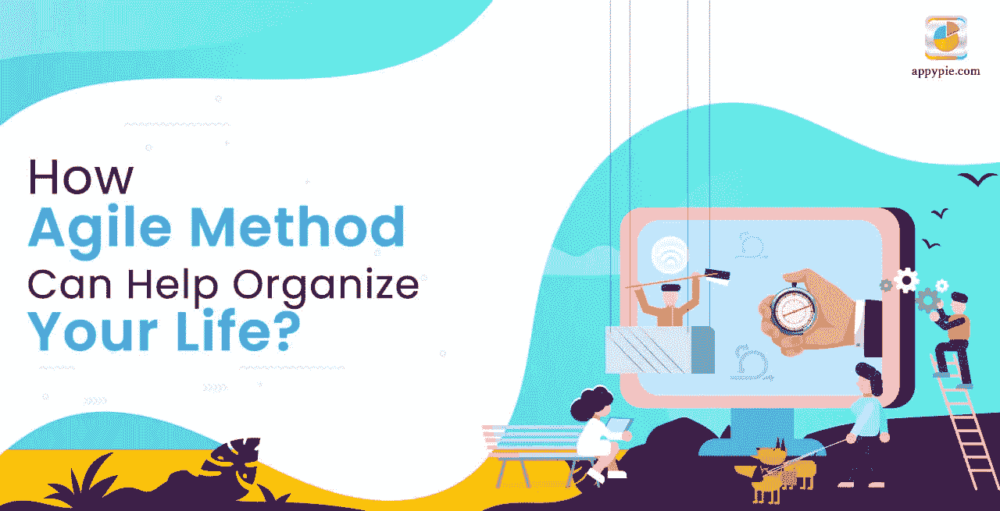
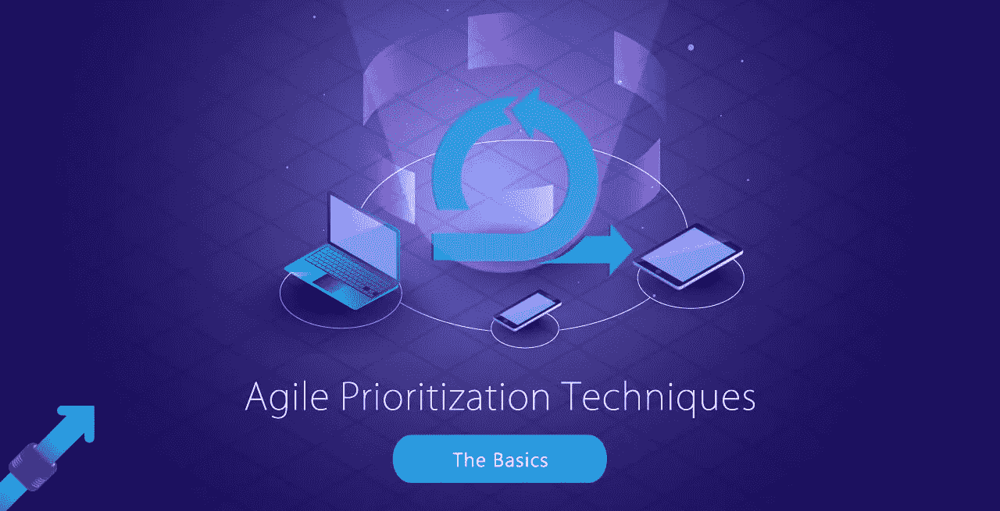
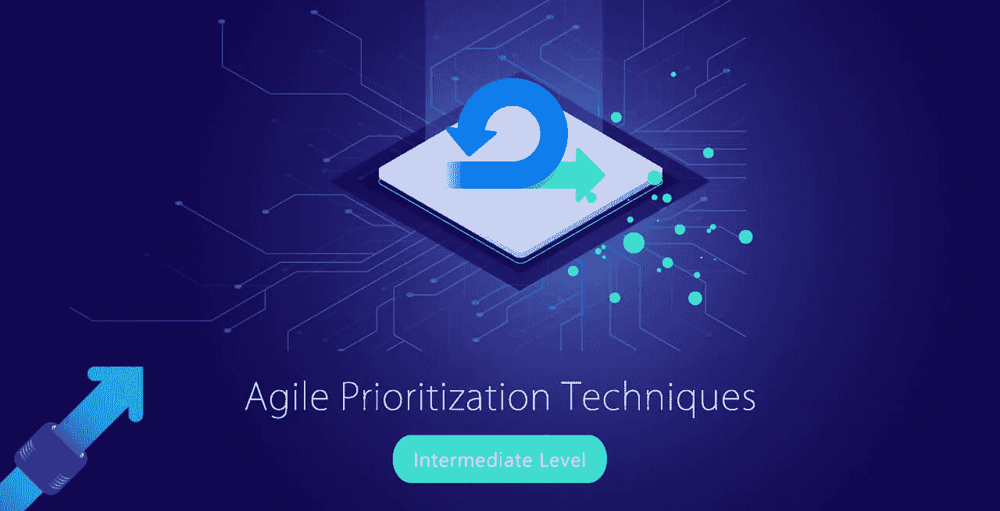
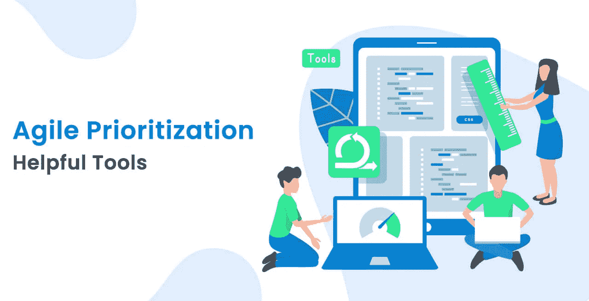

# 使用敏捷方法来破解你的待办事项列表

> 原文：<https://medium.com/hackernoon/use-agile-methodology-to-hack-your-to-do-list-2e686a8aa53f>

当然，每个人都可以列一张待办事项清单。但是当涉及到实际完成任务，这是一个全新的球赛。

决定你应该先做哪些任务可能是一个相当大的挑战。从较小的任务开始是很有诱惑力的，因为你从检查清单上的事情中得到的快感会让你兴奋不已。但是当你的待办事项清单越来越长时，会发生什么呢？你被这份清单吓到了，以至于你甚至不知道如何检查那些小任务。

你可能是那种待办事项清单不起作用的人。这就是你应该尝试敏捷优先级技术的地方。这项技术确保你先完成最重要的事情。

这里的基本思想是将任务分解成更小的、可管理的子任务，然后按重要性排序。

## 什么是敏捷，它与瀑布模型有什么不同？

当涉及到完成所有的项目需求时，软件开发人员经常与时间和预算作斗争。

为了面对和处理这个问题，一群软件开发人员在 2001 年提出了敏捷。

在敏捷出现之前，世界各地的开发团队都遵循瀑布模型。在这里，开发团队被给予了一个长而复杂的需求集，并且期望所有的请求应该在分配的时间框架和预算内完成。

在瀑布模型中，时间、范围和预算都是固定的。然而，在敏捷的做事方式中，建议至少有一个组件保持不变。

一般来说，这个灵活的元素就是——范围。在这里，公司与开发团队一起工作，以量化项目的范围，该项目可以在固定的时间表和固定的预算内交付。

这意味着，即使公司可能有 100 个需求，开发人员在项目的时间和预算限制下可能只能完成其中的 10 个。这样，公司或业务代表将选择 10 个最重要的需求，并对它们进行优先级排序，以便至少一个 MVP 可以在时间表内发布。

# 敏捷优先化技术——基础

不管你的项目是什么，建立一个大型网站或计划一个单身女郎，它必然会包含多个任务，它们有自己的时间框架和预算。按照敏捷的说法，对付他们的最好方法是创建一个优先级列表。

# 敏捷中的优先级是什么？

这意味着，如果你有一个 10 项任务的列表，它们将从 1 到 10 排列。这个想法是，你不能给两个不同的任务分配相同的数字或优先级，或者换句话说，没有两个任务的优先级是 1，其中一个必须排在 2。

给每一项任务赋予最高的重要性是一种普遍的趋势，然而当你尝试和实践相对优先化时，你会被迫将每一项任务与所有其他任务进行比较。这最终会让你决定它们中每一个的重要性。

假设您正在构建一个按需移动应用程序，并且项目中只剩下两个任务。但你只有一项任务的预算和时间表，这意味着你可以建立一个购物车来接受付款或创建一个博客。这两项任务对项目来说都很重要，但当然购物车功能的优先级更高，而不仅仅是博客。

如果你没有练习比较优先顺序，你可能会在做这个决定时遇到一些困难。这两个决定可能看起来都很重要，你可以把它们放在同样的优先位置。然而，当你被迫在两者之间做出选择时，你必然会轻松地做出决定。

这也不总是万无一失的。也许到了某个时候，你将不得不在接受 Visa 还是 Mastercard 支付之间做出选择。选择只使用一个会带来糟糕的用户体验。

这种情况要求为优先任务分配一个重要级别。

# 敏捷优先化技术——中级

那么，当我们谈论临界水平时，我们指的是什么？

让我们回头来谈谈 Visa 和 Mastercard 支付。现在，我们知道我们不能分配相同的优先级，但是我们能做的是给它们分配一个重要级别，以表明这两个任务都需要被完成，以便有一个值得发布的产品。

# 敏捷中的关键程度

这里有四个清晰的层次:

*   **危急**
*   **高**
*   **中等**
*   **低电平**

使相对优先级和关键程度最有效的方法是一起使用它们。在制定敏捷列表时，关键任务位于优先级列表的顶部，因为它们必须被完成，而排名帮助您决定必须完成它们的顺序。

接下来是重要程度高的任务，然后是中等重要程度的任务，最后是标记为低重要程度的任务。

这里举一个简单的真实世界的例子。假设你正在计划一场婚礼，你的待办事项清单会是什么样的？

对于被列为高、中或低关键程度的任务，相对优先级变得非常重要。

如果在关键任务完成后的任何时间点，您的时间或预算用完了，会发生什么？

在这种情况下，第一个高优先级的任务是你最想完成的任务。

# 敏捷优先化技术—高级水平

充分利用敏捷优先排序方法的最佳方式是将待办事项中列出的每项任务分解成尽可能小的任务。

你知道这有什么帮助吗？

一个大任务可能由 7 个小任务组成，但并不是所有的 7 个任务都同等重要！当你把大任务分解成小任务时，你可以决定它们需要完成的顺序。

让我们来谈谈例子:

*   我喜欢回到关于按需交付网站中的支付功能的例子。这是一个大任务“接收付款”的很好的例子，这个大任务可以很容易地进一步分解成更小的任务，比如“接收信用卡付款”、“接收电子钱包付款”，或者任何数量的这种“更小”的任务
*   甚至当你在婚礼计划列表中查看你的待办事项时。“建立菜单”这个大任务可以分解成许多小任务，比如“品尝菜肴”、“了解食物偏好”、“选择主题”等等。

所以回到婚礼待办清单，我想谈谈寻找合适的衣服的任务。为整个婚礼派对穿衣服是一件大事，但它包括许多不同重要程度的小任务。

你需要考虑的事情有很多，从找到合适的婚纱，到让它以最好的方式适合新娘，为新郎、伴郎、新娘的父亲找到晚礼服，然后还有找到伴娘礼服的问题。

因为这看起来很难，而且很可能不是所有的小任务都同样重要，所以我可以帮你把它分解成更小的任务。

把整个任务看成一个整体可能会导致很多恐惧和焦虑，但是当它被分解成更小的任务时，就会变得容易处理得多。

这是你把一个大任务分成几个小任务后，你要做的事情清单:

婚纱当然是重中之重，因为，让我们面对现实吧，婚礼都是关于新娘的！因此，为新娘找到合适的婚纱是最重要的任务，现在这已经不重要了，因为你也可以穿着运动服结婚！但是，嘿，你为什么要这么做？

现在参加体能测试是中等优先级。这意味着，虽然你想这样做，看看你最好的，但这是一个较低的优先级比让我们说，发出邀请给朋友和家人或找到合适的婚礼场地。

男傧相和女傧相的体能测试的关键程度很低，因为这些可以被授权。

正如你所看到的，通过分解大量的任务，实际的关键任务是一个非常小的任务，可以很容易地管理。

在下一阶段，我将向您展示如何为每项任务添加时间估计。无论是个人项目还是工作中的项目，总有一个时间框架附在上面。这意味着在计划项目时，必须注意计算出在分配的时间内可以完成什么。

此外，设定时间估计也有助于设定优先级。这意味着如果你在婚礼前只有两周的时间，而“寻找合适的礼服”将花费你整整一周的时间，你需要给你的优先事项一次机会！你愿意放弃像音乐和食物这样的东西，只是为了让婚礼派对穿得无可挑剔吗？

对婚礼待办事项清单上的所有任务都这样做，会让关键的和高优先级的任务变得更容易管理。

这张表告诉你，你只能在 13 天内完成你的关键任务和高优先级任务，要完成上面列出的所有任务，你总共需要 23 天。

这样，当你把每项任务分解成更小的任务时，你会看到关键的和高优先级任务的累计时间进一步减少。

# 敏捷优先化技术在工作和个人项目中的应用

敏捷优先化技术可以帮助你在时间和预算的限制下完成更多的工作，不管是什么行业和工作，事实上，它甚至在你的个人生活中也能很好地工作。

让我们找一些好的例子来证明我刚刚提出的主张:

*   **设计营销策略**
*   **购买你梦想中的房子**
*   **计划培训课程**
*   **规划房屋改造**
*   **实现年度业务目标**
*   **规划你的假期行程**

# 敏捷优先排序—有用的工具

当涉及到任务管理和优先排序时，手写的待办事项清单确实很有效，但是在你最终确定了要采用的方法后，有一些更简单的方法来管理项目。

如果你只是在寻找基本的功能，那么你可以使用 [Google Sheets](https://www.google.com/sheets/about/) 、 [Excel Online](https://office.live.com/start/Excel.aspx) 或 [Airtable](https://airtable.com/) 。这些工具可以让你免费创建电子表格，并拥有与手写待办事项列表相同的功能。这些工具比手写列表有优势，因为你可以在需要时轻松地剪切、粘贴或添加行。

看板和[特雷罗](https://trello.com/)稍微高级一点，因为它们提供了一些很棒的特性。

看板允许您执行以下操作:

*   拖放任务，并根据需要对其进行优先级排序
*   根据分配给每个任务的重要程度，用颜色对任务进行编码
*   包括到期日期
*   与所有利益相关者共享列表
*   当任务分配给新用户时自动发送通知

当你去寻找更复杂的东西，想要创建积压工作，区分优先级，计划发布和冲刺，添加估计，甚至记录任务的时间时，你可能会发现[约迪兹](https://www.yodiz.com/)或[吉拉](https://www.atlassian.com/software/jira)适合你。

然而，如果你只是计划和家人一起度假，传统的便利贴也很有用！在这里，你基本上把所有的任务都写在便利贴上，贴在墙上或图表上，这样你就可以和每个人分享优先级和待办事项。

如果您正在使用一堆其他应用程序，需要与其他应用程序和您选择的工具进行同步，您可以简单地进入 [Appy Pie 的 Connect](https://www.appypie.com/connect/) 并自动执行您的操作！这真的很简单，完全不需要编码，并且可以节省你花在“效率不高”的任务上的大量时间。

# 包装它

太长的待办事项清单会让你不知所措，压力重重！因此，重要的是花些时间，用敏捷的优先级技术使它更易于管理。这样，你就可以只专注于真正重要的任务，而把不太重要的任务放在一边。

*原载于 2019 年 4 月 19 日*[*https://www.appypie.com*](https://www.appypie.com/agile-method-prioritization)*。*