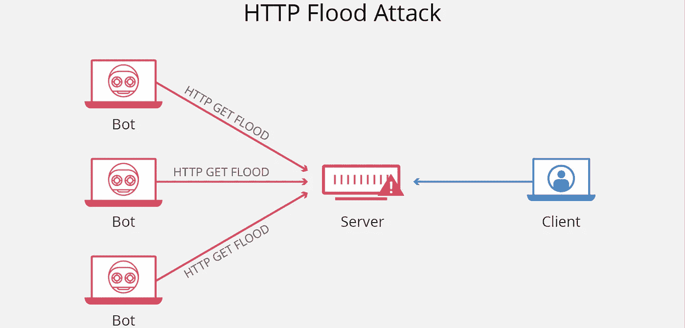

# ML 和 AI 在黑帽黑客攻击中的使用。

> 原文：<https://medium.com/hackernoon/use-of-ml-and-ai-in-blackhat-hacking-737a621e4694>

## 算法、攻击媒介、可能性和咖啡因。


Source: SophosNews.

## 解除人工智能简报。

计算机只是足够聪明去执行任何被编程的任务。与其他机器相比，量子计算机或万亿次浮点运算计算机等可扩展计算能力要快得多，但它们仍然是一样的。它们进行更快的计算，它们按照编程的方式进行数百万次排列。与普通人的大脑使用相比，它的速度相当快。据说只有 10%的人脑用于我们的日常生活，但像 Azure 或 IBM Watson 这样的系统可以更流畅、更快速地进行更精确的计算。人工智能只是一个复杂的数学级数，有太多的 If/Else 语句，加上一些异常和处理。整个关键概念是进行处理的人工神经网络和进行学习的遗传算法。在这里，这种人工智能被定义为一种能力，可以被明确地编程。

## 网络安全的肤浅学习。

在网络安全联盟中，人工智能、机器学习、深度学习和此类算法被广泛用于模拟对生态系统的攻击，可能有助于分析师检查、攻击、防御和保护漏洞，而无需物理头脑风暴。从简单的恶意软件分析到最复杂的漏洞分析，人工智能正被用于改善保护，执行重复的分析扫描和生成日志报告。

> “这仍是一个新兴领域，但显然是未来的发展方向。人工智能和机器学习将极大地改变安全工作的方式，”J.Gold Associates 总裁兼首席分析师杰克·高德最近在接受 CSO Online 采访时说。

机器学习已经成为防御网络攻击的第一步。或者，您可以拥有一个用于 web 应用程序的漏洞扫描工具。它的一个模块是测试文件的未授权访问。这些测试能够改变现有的文件名来识别新的文件名。如果爬虫程序检测到一个名为“index.php”的文件，最好通过尝试类似 index_1.php、index1.php、index.php.2017 的名称来检查任何备份的存在或测试其副本。AI 和 ML 预测、检测、预防、响应和监控。


Source: ChemistryWorld.

## 超级酷的苦药丸。

人工智能或人工智能，因为它们被编程为在网络安全方面具有良好的意识，它们也可以被编程为执行网络攻击而永远不会被抓住，可以复制成集群，并且可能无法检测。对于网络小混混来说，开发自己的 AI 和发动攻击是一样的。随着数据和应用的快速爆炸，攻击终端的方式真的多种多样。一些糟糕的情况，人工智能是为了防御目的而构建的，可能会被黑客利用他们的恶意知识，人工智能也可能被用作攻击媒介。

> 随着网络犯罪分子开始探索人工智能增强的恶意软件的可能性，“网络防御者必须了解恶意使用人工智能的机制和影响，以便领先于这些威胁并部署适当的防御措施。”

制造人工智能的都是算法和语句，到目前为止，我们还没有人工智能。算法是对数据的假设。有很多算法。TensorFlow、AWS、Torch 致力于算法集合。在 2017 年 [DEFCON](https://www.defcon.org/html/defcon-25/dc-25-index.html) 大会上，安全公司 **Endgame** 披露了它如何使用**埃隆马斯克的 OpenAI** 框架创建定制的恶意软件，以创建安全引擎无法检测的恶意软件。与此同时，其他研究人员预测，机器学习最终可能被用于“根据实验室中检测到的方式和内容即时修改代码”，这是多态恶意软件的一种扩展。

## 基于智能和物联网的僵尸网络

Fortinet 解决了智能僵尸网络、基于集群的攻击、群集僵尸，即通过使它们成为物联网设备来使它们变得智能，使它们能够通信、决策和发起基于集群的更强大的攻击。这些可能会立刻大规模地攻击系统。没有僵尸网络的指导，每个僵尸通过本地知识共享变得更加聪明。



Source: Cloudflare

这些蜂群技术使用蜂巢网，促进从过去的行为中学习。据说，群体技术是分散和自组织系统的集体行为，创造了物联网僵尸网络。

> 尽管是未来派小说，但一些人可以从黑镜的《全国憎恨》中的群体技术的犯罪可能性中得出结论，在那里成千上万的自动化蜜蜂受到监视和物理攻击。— CSOonline。

**社交工程/网络钓鱼攻击。**

人工智能更明确的用途之一是利用文本到语音、语音识别和自然语言处理(NLP)等计算来实现更出色的社会工程技术。总的来说，通过重复的神经系统，它已经能够训练这样的编程算法，在网络钓鱼的联盟中，消息可能会变得越来越精炼和可接受。准确地说，经过特别编程的神经网络可以完成这项任务，一次大规模地攻击高调的目标。该系统可以被训练以保持真实性的主要敏锐度，同时具有说服力。


Source: PCMag.

随后，该系统非常有效。在涉及 90 名用户的测试中，该框架的成功率在 30%至 60%之间，与手动鱼叉式网络钓鱼和批量网络钓鱼结果相比有了相当大的改进。

## AI vs AI / ML vs ML。

随着 AI 现在成为尖端程序员工具箱的一部分，安全措施正在考虑保护框架的新方法。幸运的是，安全专家有某种强大而清晰的对策，特别是人造智能本身。不便之处在于，这无疑会引发他们之间的武器竞赛。任何一方都没有真正做出决定，因为对抗另一方的最佳方式是逐步依赖编程框架。

> “对于安全专家来说，这是一个大数据问题——我们正在处理大量数据——超过一个人可能产生的数据量，”华莱士说。“一旦你开始对付一个对手，你别无选择，只能自己使用武器化的人工智能。”— Gizmodo

因此，我们勇敢的人工智能黑客新世界正在等待着我们，犯罪分子越来越有能力瞄准易受攻击的用户和系统。计算机安全公司将同样依靠人工智能，以永无止境的努力跟上时代。最终，这些工具将脱离人类的理解和控制，在新兴的数字生态系统中以闪电般的速度工作。黑客和信息安全专业人员都别无选择，只能按下各自系统上的“开始”按钮，只能期待最好的结果。人工智能的一个后果是，人类越来越多地被排除在外。

```
Sources: Gizmodo, CSOOnline, Various Google Searches, and My Research.
```