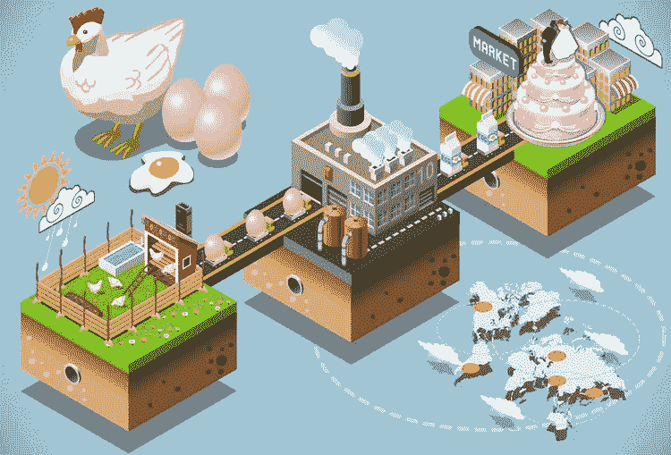

# 利用区块链创新重建食品行业的信任

> 原文：<https://medium.com/hackernoon/using-blockchain-innovation-to-rebuild-trust-in-the-food-industry-b0d752aca45>

Using Blockchain Innovation to Rebuild Trust in the Food Industry

消费者信任是当今食品行业面临的最大障碍之一。最近的一项 [**食品与健康调查**](https://www.foodbusinessnews.net/articles/12058-consumers-continue-to-mistrust-food-and-beverage-manufacturers) 揭露了消费者与食品制造商和供应商之间严重的信任赤字，我们不用看多远就能明白为什么。

2018 年 10 月，J&J 休闲食品 [**从阿尔迪门店召回**](https://www.foodsafetynews.com/2018/10/fit-active-sandwiches-recalled-from-aldi-stores-for-bacteria-risk/) 其 Fit &活性三明治，原因是可能受到单核细胞增生李斯特菌和沙门氏菌的污染。不到一个月后，在美国疾病控制和预防中心将大范围的大肠杆菌感染与食用长叶莴苣联系起来后，全国的杂货店迅速将长叶莴苣下架。那也不是罗曼那年第一次感染大肠杆菌。在三月和六月之间，由于受到污染的莴苣，美国经历了十多年来最大的大肠杆菌爆发。

食源性疾病构成了严重的健康威胁，然而大多数污染物直到被污染的产品出现在消费者的餐桌上很久之后才被发现和追踪。一个典型的例子是:在疾控中心追踪 3 月至 6 月大肠杆菌爆发源头的两个月时间里，[**36 个州的 210 人**](https://www.cdc.gov/ecoli/2018/o157h7-04-18/index.html) 被感染，5 人死亡。

难怪消费者对食品公司持怀疑态度。在这样的大规模疫情爆发后重新获得他们的信任并不容易，但公司可以通过将区块链技术嵌入当前的供应链来为消费者创造知名度。

# 将区块链带到桌面上

我们许多人都是在比特币等加密货币的背景下理解区块链的，但这项技术的使用案例远远不止数字硬币。区块链是一个分布式账本:每次成员执行交易时，它都会创建该交易的数字化记录，无法操纵。

在区块链技术中有一个唯一的真理来源，它对食品行业至关重要。

通过区块链，消费者可以追踪哪个农场收获了他们的鳄梨，托运人可以在安排送货前查看承运人是否满员。当涉及到预防、监控和解决食品污染时，公司可以查询数字账本，以立即追踪源头并确定哪些商家受到了影响。

沃尔玛是一家押注区块链保护其顾客并建立信任的机构。沃尔玛建立了一个食品安全区块链解决方案，即时跟踪各种产品的来源，从 [**猪肉到**](https://www-01.ibm.com/events/wwe/grp/grp308.nsf/vLookupPDFs/6%20Using%20Blockchain%20for%20Food%20Safe%202/$file/6%20Using%20Blockchain%20for%20Food%20Safe%202.pdf) 芒果。沃尔玛已经要求所有绿叶蔬菜供应商在 2019 年 9 月 8 日之前将其数据上传到区块链。

# **一起利用物联网、人工智能和区块链**

**[**物联网**](https://en.wikipedia.org/wiki/Internet_of_things) 和人工智能在过去几年里已经达到了时髦的状态，但它们是在食品行业推广区块链技术的关键组成部分**。物联网设备可以自动收集准确的数据，区块链技术可以保护不可变账本中的大量数据，人工智能工具可以梳理这些数据，获得见解，然后公司可以公布这些见解，以实现消费者的透明预期。****

****举例来说，假设公司 A 使用物联网设备来检测种植绿叶蔬菜时使用了哪些农药。然后，该设备会将数据直接存储在区块链数据库中。然后，公司 A 可以利用人工智能将数据组织成对注重健康的消费者的细微见解。当消费者知道这些信息在区块链上得到证实时，他们会认为该公司更加诚实。****

# ****消除人为错误****

****当人类完全拥有和运营供应链时，很容易错过或忽视最终危及消费者健康的危险信号。将物联网传感器和人工智能结合使用，公司可以预测维护、制冷和其他机器驱动的制造过程中的问题。自动化系统可以检测设备故障等异常情况，并立即做出决策。****

****公司还可以使用这些技术来识别和解决潜在的问题，即在问题发生之前发现问题。例如，公司 A 可以在其区块链网络中建立一个智能合同，如果杀虫剂使用量超过限制，导致产品不安全，则自动发出警报。****

****虽然人类可能会错过重要的警报或决定为了利润而交付变质的产品，但基于区块链的自动化-结合人工智能和物联网-可以为消费者提供更高水平的安全。****

# ****创造安全文化****

****透明度越高，责任越大。在整个供应链中实施区块链将使消费者在购买前更容易检查产品质量，这将使食品公司承担更多责任。因此，在实施区块链时，公司领导还必须优先培养员工的食品安全文化。****

****[**Chipotle**](https://www.cnbc.com/2017/12/20/chipotle-shares-sink-on-yet-another-report-of-possible-food-safety-issues.html) 在几年前遭受多起食品安全事件的攻击后，吸取了这个教训。美国和加拿大的消费者在食用 Chipotle 后报告了食源性疾病病例，最终导致了 [**集体诉讼**](https://www.nrn.com/chipotle/chipotle-sued-over-alleged-misleading-food-safety-statements) 和 [**利润损失**](https://money.cnn.com/2016/02/02/investing/chipotle-earnings-e-coli/index.html) 。最后，公司领导亲自制定计划，对员工进行食品安全最佳实践方面的再培训。****

## ****结论****

****区块链有望改变食品行业——但首先，公司需要接受这一创新技术。通过将关键技术与区块链结合使用，自动检查和平衡，并在员工中灌输强烈的责任文化，领导者可以实现重建消费者对食品行业信任所需的透明度。****