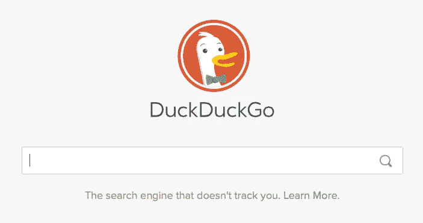
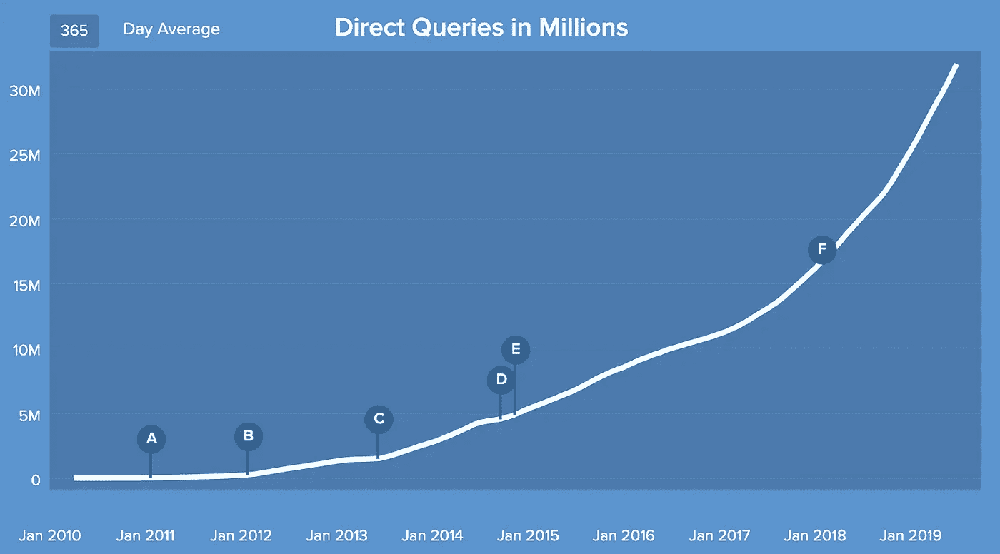
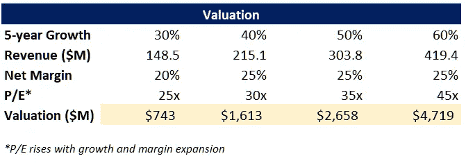

# 评估下一个十亿美元的搜索引擎——duck duck go

> 原文：<https://medium.com/hackernoon/valuing-the-next-billion-dollar-search-engine-duckduckgo-d4a3cfa51ac5>

## 风险资本

请记住，以下所有内容都是基于有限的公开信息。

论点:尽管谷歌在搜索领域占据主导地位，但 duck duck go(“DDG”)()的估值至少将达到 1B 美元。它的上一次估值是在 2018 年末，为 1.6 亿美元。

我预计，在 2018 年末，其 1.6 亿美元的传言估值基础上，至少会有**5 倍的增长，以及高达 30 倍的增长**。**我想强调的是，DDG 不必成为下一个谷歌**——这项投资适合 B 轮或 C 轮投资，以获得良好的风险调整回报。

DDG 是一家专注于用户隐私的搜索引擎，成立于 2008 年。

1.  在过去的十年里，DDG 的搜索量以每年 60%的速度增长。

Source: [https://duckduckgo.com/traffic](https://duckduckgo.com/traffic)

**2。已经盈利了。** DDG 从 2014 年开始盈利。收入来自用户可以选择退出的广告，以及与亚马逊等网站的非跟踪联盟伙伴关系。这意味着当用户点击亚马逊搜索结果时，来自亚马逊的收入，以及来自搜索结果中点击的广告的收入。因此，我们可以假设收入与搜索量成线性增长。

**3。巨大的增长空间:DDG 的全球市场份额为 0.18%，而谷歌为 77%。相对于谷歌来说，DDG 是如此之小，以至于它可以保持目前的增长速度，对谷歌来说不会是一个亮点。人们自然会将谷歌视为竞争对手，但 DDG 重视隐私的个人核心用户群太小，谷歌不愿费心改变他们的商业模式。此外，谷歌的商业模式是基于使用人们的数据，这使得他们很难复制 DDG 的隐私功能。即使谷歌真的进入了这个市场，用户也不会信任谷歌品牌的隐私导向产品。关心隐私的人都知道，谷歌的隐姓埋名浏览一点都不隐私([为什么我要用 DuckDuckGo 而隐姓埋名的谷歌做同样的事情？](https://www.quora.com/Why-should-I-use-DuckDuckGo-while-Google-in-incognito-mode-does-the-same-thing))。**

**4。关注隐私的行业趋势。脸书向用户隐私的转变显示出这是一个多么重要的问题。**

**5。有着良好记录的强势 CEO。** 首席执行官 Gabriel Weinberg 在麻省理工学院读物理学本科时创办了他的第一家公司。毕业后，他编程并建立了自己的第一个盈利创业公司 Names Database，该公司以 1000 万美元的现金出售给了联合在线(United Online)。用他新获得的财富，他创办了 DDG，并在过去的十年里以指数增长的速度经营着它。他理解构建搜索引擎的技术架构，他自己已经构建了最初的 MVP。

他也理解经营一家初创公司的商业方面。他写了一本书，名为[牵引:任何创业公司如何经历爆炸性的客户增长](https://www.amazon.com/Traction-Startup-Achieve-Explosive-Customer/dp/1591848369)。他的论点是，在创业的每个阶段，都有一种牵引方法胜过所有其他方法。随着创业公司获得用户，移动针头的牵引主动性是不同的。温伯格经历了 20 多种不同的牵引方法(电子邮件营销、搜索引擎优化、活动、合作伙伴关系等)，以及一个关于如何在公司发展的每个阶段快速测试和确定最佳牵引方法的框架。人们只需看看他在 DDG 成长的 10 年记录，就能看出他在成长方面的专长。

# 信封背面估价

**未来五年以每年 30%的速度增长(目前增长率的一半)将会带来约 1 . 5 亿美元的收入。据报道，DDG 每天有 2400 万次搜索，年收入达 2500 万美元。如今，他们每天收到 4000 万次搜索。假设收入随着搜索量线性增长，这是基于 DDG 商业模式的合理假设，以 30%的年增长率计算，它将在五年内达到 1 . 5 亿美元的收入。**

**假设保守的 30%增长率，20%的利润率和 25 倍的市盈率，五年后的估值为 7.4 亿美元。** 更乐观的情况是保持历史上 50%的增长率，25%的利润率，利润扩张到 35 倍的市盈率，这相当于 26 亿美元的估值。请记住，今天的平均市盈率是 20-25 倍。即使考虑到私人公司的折价，对于一家增长 50%-60%的公司来说，35 倍的市盈率也是非常保守的。

# 增长的驱动力

**更快的搜索，更好的功能** 在电脑时代成长起来的千禧一代和年轻人对互联网上的隐私更加精明。因为搜索引擎仍然服务于非常小众的人群，*他们的大部分增长还没有到来。我预见到这种情况会发生，因为他们会使用快速浏览工具，如 NBA 比分、天气、地图等。以及 2)搜索速度变得更快。*

另外，考虑一下雅虎和必应在北美搜索市场各占 5-6%的份额，与谷歌相比没有任何产品优势。它们的市场份额主要来自于预装在设备上。未来几十年，随着世界人口结构向更懂技术的人群转变，普通成年人会知道转向更好的搜索引擎，而不像今天。这对谷歌和 DDG 来说都是顺风。在谷歌在北美的竞争对手中， **DDG 是唯一一个拥有谷歌无法复制的差异化产品的搜索引擎。谷歌和 DDG 都将从雅虎和必应手中夺取市场份额。**

Source: [http://gs.statcounter.com/search-engine-market-share/all/north-america](http://gs.statcounter.com/search-engine-market-share/all/north-america)

# 风险

1.  人们不太在乎隐私
2.  **产品不如谷歌**
3.  **现任者将复制隐私功能**

**风险#1:** 这是一个可以接受的风险，因为我们不需要那么多人关心隐私，DDG 仍然可以达到很高的估值。即使估值达到 10 亿美元，DDG 也只有谷歌的 0.15%。到那时，它仍然只有大约 3%的北美搜索市场份额，允许必应和雅虎继续保持 3-4%的市场份额，即使 DDG 所有的搜索收益都直接来自这两家公司。

换句话说，所有这些都可以与 DDG 仍然达到 10 亿美元的估值共存。

**风险#2:** 我听到的关于该产品最常见的抱怨是:1)它比谷歌慢，2)它不能显示各种搜索的即时汇总数据，例如 NBA 结果或天气。这些是我在使用 DDG 时遇到的问题，也是我无法在所有设备中将它作为默认搜索引擎的原因。我相信这是 DDG 团队正在努力的事情。**根据我对这位首席执行官及其应对增长的方法的了解，我猜测他会优先考虑与隐私相关的最重要的功能。**

如前所述，对于像谷歌这样的在位者来说，复制 DDG 的隐私功能有很多障碍。重申一下，1)这是一个谷歌不在乎的小市场，2)谷歌不会改变其依赖于拥有用户数据的整套产品和商业模式，3)熟悉隐私的用户将很难在这方面信任谷歌。

有人可能会说，如果像苹果这样的公司复制它，并利用其庞大的分销网络来击败 DDG，会怎么样？这没有抓住创业公司的重点。Y-Combinator 的山姆·奥特曼表示，初创公司在三个方面优于大型现有公司，其中之一是在平台转移上全力以赴的能力。以隐私为导向的搜索是一个新平台，此外，苹果并不从事创建搜索引擎的业务。

# 提供资金

DDG 获得了 1300 万美元的风险投资，2011 年从 Union Square Ventures 获得了 300 万美元的种子融资，2018 年底获得了 1000 万美元的融资。假设投资者持有 5%至 20%的股权，这将导致 5000 万至 2 亿美元的投资后估值。Pitchbook 数据显示有 1.6 亿美元的后期资金。

# 结论

DDG 是一个伟大的搜索引擎，用户界面简洁，已经开始盈利。更重要的是，其 10 年来 60%的年化搜索量增长不言自明。尽管有这样的增长，但在更加了解互联网隐私的人口结构变化的支持下，仍有大量市场份额要从现有的雅虎和必应手中夺取。这将在未来几十年慢慢显现出来，让 DDG 有空间成长到更高的估值，而不必与谷歌竞争。最后，首席执行官在公司建设方面有着良好的记录。鉴于其增长、利润和市场，我认为该公司应该达到$1B+的估值。鉴于大型科技公司对隐私的关注正在转移，如果它还没有收到收购要约，我会感到惊讶。