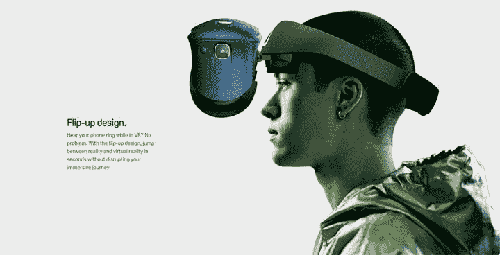

# 虚拟现实:在膨胀的期望的顶峰

> 原文：<https://medium.com/hackernoon/virtual-reality-at-the-peak-of-inflated-expectations-d6fb6d9541f3>

## 哪里出了问题？

Still from Jamiroquai’s “Virtual Insanity” from [MusicLifeWord.org](http://musiclifeword.org/virtuality/)

在这篇文章中，我将谈论我如何看待主流消费者观众拒绝了虚拟现实，并提出它的孩子，增强现实，可能是说服我们购买的启蒙斜坡(T2 高德纳炒作周期的斜坡)。虽然这些只是我的观点，但在文章的结尾，我从世界各地从事 AR 和 VR 工作的软件开发人员那里挖掘了一些数据。即使你不在乎我的观点，你也可能会觉得他们要说的很有趣。此外，如果你想表达自己的想法，我还提供了一个[链接](https://survey.developereconomics.com/surveys/de16?utm_source=owned-community&utm_medium=owned&utm_campaign=AR_VR_article)，链接到一项正在进行的调查，调查结果将有助于该行业的关键人物在 2019 年得出自己的结论。

From [Wikipedia](https://en.wikipedia.org/wiki/Hype_cycle): The **hype cycle** is a branded graphical presentation developed and used by the American research, advisory and information technology firm Gartner to represent the maturity, adoption, and social application of specific technologies. The hype cycle provides a graphical and conceptual presentation of the maturity of emerging technologies through five phases. Image by Jeremykemp at English Wikipedia [GFDL ([http://www.gnu.org/copyleft/fdl.html](http://www.gnu.org/copyleft/fdl.html)) or CC BY-SA 3.0 ([https://creativecommons.org/licenses/by-sa/3.0](https://creativecommons.org/licenses/by-sa/3.0))]

# 明天的世界，今天

在智能手机行业成熟之前，我就在这个行业工作。在像摩托罗拉 RAZR 这样的简单功能手机是必备通信设备的时代，我们的使命是“每个口袋里都有一部智能手机”。在我们早期项目的几年内，竞争对手苹果公司推出了 iPhone。剩下的就是历史了。应用商店开门了，星星排成了一行，科技梦想实现了，智能手机开始统治世界。

我成长在一个变革的时代。在我十岁之前，我们有一台英国广播公司的微型计算机。十几岁的时候，我随着磁带随身听，以及后来的移动 CD 播放器和迷你光盘，尽情享受 80 年代的音乐。然后是 Napster，现在是 Spotify。改变。技术进化的节奏是一种快速的心跳，由互联网、手机和一个成熟的软件开发行业发出，我热情地加入了这个行业。

也许我只是习惯了不切实际的变化速度？但是虚拟现实(VR)到底怎么了？它的心跳似乎停止了。自“虚拟现实年”(选择你的年份，我们有过几年)以来，这些年没有什么变化，事实证明也没什么变化。当我看着我几年前的手机，或者我 2004 年开发的网站时，我觉得与今天可能的时尚外形和执行相比，它们看起来是多么笨拙和古雅。但是当我看着过去和现在的 VR 头戴设备并比较它们提供的功能时？没有那么多。

看看这个传统 VR 硬件的[幻灯片](https://www.techrepublic.com/pictures/8-historic-virtual-reality-headsets/)。当然，自 Sensorama 以来，我们已经取得了一些进展，但 1993 年的世嘉 VR 并不比今天的 HTC Vive Cosmos 更傻，不是吗？

*世嘉 VR 和 HTC Vive Cosmos 设备中的 Dweebs，难以置信地相隔 25 年*

[Image from TechRepublic](https://www.techrepublic.com/pictures/8-historic-virtual-reality-headsets/6/)

[Image from YugaTech](https://www.yugatech.com/news/htc-announces-vive-cosmos-pc-vr-system/#sthash.VFM16KOD.dpbs#Jz0TzWdf1MHhYmHc.97)

有没有人真的想带上一个沉重、乏味的耳机，让你在使用几分钟后就晕车，把你拴在电脑上，让你对耳机外的真实世界麻木，让你被家具绊倒？

当然，昂贵而闪亮的下一代虚拟现实设备即将到来。但许多可用的硬件与两年或两年多前上市时相比没有变化，这意味着核心早期用户不会再次购买。虽然面向普通用户的价格更低廉的硬件的可用性有所增加，例如 Oculus Go，但这些手机仍然足够昂贵，足以让主流消费者犹豫不决，并且通常会在质量方面做出妥协，这意味着 VR 体验存在一些缺陷。

# 让人们相信你会改变他们的生活

在消费者世界，对虚拟现实的期望很早就被提高了，但不幸的是，随着人们越来越清楚地认识到，在现有技术条件下，这种雄心远远超出了可能的范围，这导致了失望。由于承诺过多，虚拟现实失去了主流观众的关注，因为它根本无法交付。部分原因是硬件的[问题，比如笨重的耳机、不合适的处理器、糟糕的显示和微弱的音频。还有第二个原因:没有“必备”的杀手级应用能让足够多的人相信你会改变他们的生活。](https://www.redsharknews.com/vr_and_ar/item/5484-why-isn-t-vr-more-popular)

这两个问题是密切相关的(“鸡和蛋”的情况),因为如果技术不充分，内容创作者就没有理由在虚拟现实上大量投资。反过来，这意味着没有足够的买家和收入来证明改进技术的投资是合理的。(值得指出的是，虚拟现实的第二种用途，如工业、教育、医疗保健，有着非常不同的吸收/内容模型，因此，我在这里只考虑主流)。

因此，娱乐内容是说服消费者 VR 设备是必需品的关键。像 3D 电视一样，VR 迄今为止未能提供足够令人信服的体验，让人们涌向商店购买硬件，尽管其成本和局限性很大。

此外，虚拟现实内容的发展速度也不如过去。好莱坞将它用于营销，例如推广 2016 年的电影《神奇动物在哪里》和电视剧《T2》《权力的游戏》。但随着消费者的接受度和满意度被发现可以忽略不计，这一比例已经回落。

SuperData 表示，消费者虚拟现实软件公司的风险投资今年可能会下降一半以上，从一年前的 5.76 亿美元降至 2.65 亿美元。这并不奇怪。根据硅谷的说法。自 Q2 2017 年以来，VR 耳机销量下降了近 34%。即使是坚定的硬件制造商也显示出了放慢脚步的迹象。三星是最早推出 Gear VR 移动耳机的公司之一，它在今年的 CES 上发布的主要公告中没有提到 VR。

# AR 是走出绝望低谷的方法吗？

专家预测，新上市的儿童、智能手机上的增强现实(AR)和混合现实(MR)耳机，如微软的 HoloLens。会接 VR 未能服务的观众。就炒作周期而言，AR 和 MR——VR 的孩子——看起来是启蒙的斜坡。

AR 可以通过已经在你口袋里的硬件来交付。它不需要 VR 所要求的分辨率或处理器能力。AR 也远没有 VR 笨重，可以在旅途中使用，因为它不需要完全沉浸在体验中。该软件引入了一个虚拟元素，但没有失去现实世界。

当然，分析师报告称，增强现实和混合现实的采用正在上升，预计收入将来自移动 AR 应用程序，特别是游戏。谷歌和苹果通过 ARCore 和 ARKit 强烈拥抱了这一市场，使开发者能够在今天超过 5 亿台设备上访问 AR 服务。苹果和谷歌都设想将使用 AR 的第三方应用和服务作为其应用商店的有价值的补充。成功的应用程序增加了数十亿美元的收入(苹果公司预计将在两年内从迄今为止最知名的 AR 游戏 Pokémon Go 的应用内购买中获得 30 亿美元的收入)，高调的 AR 应用程序也加强了两家公司的生态系统，促进了其他收入来源。

精明的投资者现在正转向从事增强现实技术的公司，苹果先生有一个传闻中的研究项目要制造一款明年上市的耳机。根据 SuperData 的数据，今年对从事 MR 工作的公司的投资预计将增长近 50%，MR 头戴设备的销售预计将大幅增长，并且在未来两年内[将超过 VR 头戴设备](https://www.superdataresearch.com/market-data/virtual-reality-industry-report/)的收入。

以上纯粹是我的观点，基于多年来对科技行业的观察和对过高预期的适度怀疑。然而，这是由采煤工作面的经验决定的。那么，与 AR 和 VR 合作的软件开发人员有什么要说的呢？

# 从事 VR 和 AR 工作的软件开发人员告诉我们…

在 SlashData，我们定期对世界各地的软件开发人员进行调查，以揭示那些在移动、桌面、物联网、云、web、游戏、AR/VR、数据科学和机器学习领域工作的人的宝贵见解。

在我们的[开发者经济第 14 版报告](https://www.slashdata.co/free-resources?id=developer-economics-state-of-the-developer-nation-14th-edition&section=showcases_details)中，该报告基于 2017 年 11 月至 12 月期间为期八周的大规模在线开发者调查，我们接触了 169 个国家的 21，700 多名受访者。我们研究了在 AR/VR 工作的开发人员返回的数据，发现了以下情况:

*   25%的专业游戏开发者表示，他们的目标是 AR 和/或 VR。在所有被调查的开发人员中，这一数字略降至 19%。
*   专用的虚拟现实硬件，如 Oculus Rift，对游戏开发者很有吸引力(61%的人报告使用它)，但在所有从事虚拟现实项目的开发者中，我们看到的接受率要低得多(33%)，这反映了它在游戏以外的领域的早期采用者地位。
*   在所有从事虚拟现实项目的开发人员中，32%的人使用谷歌的 Cardboard 开发智能手机硬件，19%的人使用内置于安卓牛轧糖等产品的 Daydream View，这反映出开发人员和消费者仍在现有硬件上试验该技术。
*   ar 也出现了类似的情况，在所有以 ar 为目标的开发者中，Android 和 iOS 在最受欢迎的 AR 平台中处于领先地位。
*   在可用的专用 AR 硬件中，微软 HoloLens 领先，谷歌眼镜正在工作，MagicLeap 在 2017 年底的调查中落后。

我们目前正在进行另一项调查，我们非常重视您的意见。如果你是一名在 AR 或 VR 领域工作的软件开发人员，或者正在考虑这样做，请[考虑回答问题](https://survey.developereconomics.com/surveys/de16?utm_source=owned-community&utm_medium=owned&utm_campaign=AR_VR_article)。如果你不是开发者，但是在 AR/VR 领域工作，把[链接](https://survey.developereconomics.com/surveys/de16?utm_source=owned-community&utm_medium=owned&utm_campaign=AR_VR_article)传给你的开发者朋友和同事。

完成的每个调查都有机会赢得 Oculus Rift +Touch 虚拟现实系统以测试您的创作(或简单地玩玩)，三星 S9 PLus，200 美元用于您选择的软件订阅，或价值 12，000 美元的奖金池中的其他奖品。另外，如果您推荐其他开发人员参加调查，您可能会赢得高达 1000 美元的现金。请不要忘记在参加调查前注册，以便我们知道您希望参与抽奖。

你说什么，你加入吗？