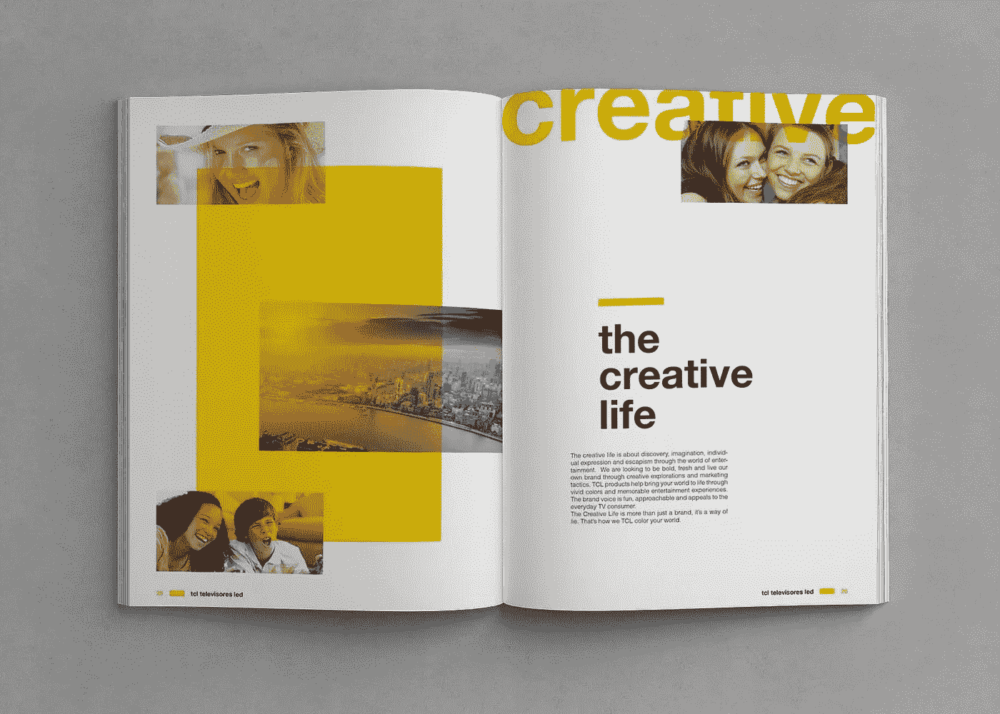

# 视觉设计师 vs 平面设计师——谁做什么，为什么(信息图)

> 原文：<https://medium.com/hackernoon/visual-designers-vs-graphic-designers-who-does-what-and-why-infographic-9da921f3fe3c>

从表面上看，视觉设计和平面设计听起来是一回事，有时被用作可互换的术语，尤其是在设计行业之外。

虽然视觉设计师和平面设计师有很多相似之处，但他们之间也有明显的差异。

# 什么是视觉设计？

视觉设计诞生于图形设计和用户界面设计的混合。它专注于网站或任何其他类型的数字设计的美学。成品好看吗？这就是[视觉设计师](https://www.toptal.com/designers/visual)想要回答的问题。

尽管它们不是完全一样的东西，视觉设计有时可以和视觉传达互换使用。视觉传达作为一个术语，通常包含的不仅仅是数字设计，它关注的是视觉信息的传达。虽然视觉设计特别关注外观和感觉，但视觉传达却不太关注美学，而是更关注学科的传达方面。

Website and web app designs fit the definition of visual design. (by [Nextpage](http://nextpage.agency/portfolio/argyle/))

另一个常见的困惑是视觉设计和一般的网页设计。它们是一回事吗？是也不是。

有些网页设计师绝对可以被归类为视觉设计师。但是一个关键的区别在于，大多数网页设计者都被期望至少知道一些编码——至少是 HTML 和 CSS。视觉设计工作不包括编码。

视觉设计师通常比网页设计师承担更大的设计项目。当网页设计师设计网站时，视觉设计师的任务可能包括为品牌或产品创造完整的视觉语言。它超越了单一终端产品(网站、app、宣传册等)的范畴。)，并涵盖了整个组织处理设计项目的方式。

# 什么是平面设计？

平面设计作为一种职业比视觉设计存在的时间要长得多。“平面设计”一词最早出现在威廉·艾迪森·德威金斯 1922 年的一篇文章中， [*新型印刷呼唤新设计*](http://www.paulshawletterdesign.com/2018/01/the-definitive-dwiggins-no-56-new-kind-of-printing-needs-new-design/) ，但实际上，这种做法可以追溯到人类创造的最早艺术品。

平面设计师开始为印刷出版物设计:书籍、杂志、报纸、小册子、目录等等。平面设计师的职责包括创建页面布局，广告，营销材料，有时更专业的产品，如字体。

Magazine and other print layouts fit the definition of graphic design. (by [Marisa Passos](https://www.behance.net/gallery/18725297/Quality-Corporativo-Catalog))

20 世纪 90 年代，随着网页设计成为一种可能的交流方式，平面设计师开始将他们的产品扩展到网页设计领域。这是有意义的，因为许多[的基本设计原则](https://www.toptal.com/designers/visual/infographic-gestalt-principles-of-design)无论是印刷还是数字设计都保持不变。只要在技术方面和限制方面多一点训练，平面设计师就完全有能力创建一个网站。

许多平面设计机构将网页设计添加到他们的产品中，进一步确立了平面设计师可以在印刷和数字空间工作。许多平面设计师现在创作数字产品的频率至少和他们创作印刷设计的频率一样高。

随着我们的工作和个人生活越来越多地使用印刷形式的数字通信手段，平面设计师不得不适应保持相关。这些数字交流也大大模糊了视觉设计和平面设计之间的界限。

# 视觉设计与平面设计:两个学科之间模糊的界限

因为平面设计和视觉设计都侧重于美学，这两个学科之间的界限往往是模糊的，尤其是在涉及数字设计时。网站和 web 应用程序设计可以由视觉设计师或平面设计师来创建。那么为什么有人会称自己为一个东西而不是另一个呢？

如果一个设计师所做的所有工作都可以被归类为视觉设计或平面设计，那么设计师自称哪一个又有什么关系呢？实际上，是的。这两个学科之间的工资差距很大。平面设计师的年薪一般在 65，000 美元左右，而视觉设计师的年薪可能超过[90，000 美元](https://generalassemb.ly/blog/what-type-of-design-is-right-for-you/)。视觉设计被认为是一门更前沿的学科可能与这种差异有很大关系。平面设计通常被认为是设计学科中的恐龙。

虽然这两种工作有重叠之处，但也有明显的不同。最大的挑战是每一类设计师创造的最终产品。例如，如果一名设计师从事印刷设计，那么“视觉设计师”就不是一个准确的职位。下面的信息图中概述了这两个学科之间的其他差异和相似之处。

下载该信息图的 PDF 版本。

视觉设计师关注网站、网络应用或其他数字设计的美感。其他的视觉设计定义包括对用户体验的关注，特别是当它与那些美学相关时。

视觉设计诞生于图形设计和用户界面设计的混合。它专注于网站或其他数字设计的美学。

平面设计师开始为印刷设计，创建页面布局，广告，包装设计，营销材料，有时更专业的产品，如字体。随着网络越来越受欢迎，一些平面设计师将网页设计添加到他们的产品中。

几乎每个行业都需要平面设计师，他们的职位包括平面艺术家、创意总监、艺术总监、标志设计师和品牌设计师。

视觉设计的原则包括对齐、平衡、对比、接近、重复和空间，以及格式塔设计原则。

*最初发表于*[T5【www.toptal.com】](https://www.toptal.com/designers/visual/visual-designer-vs-graphic-designer)*。*