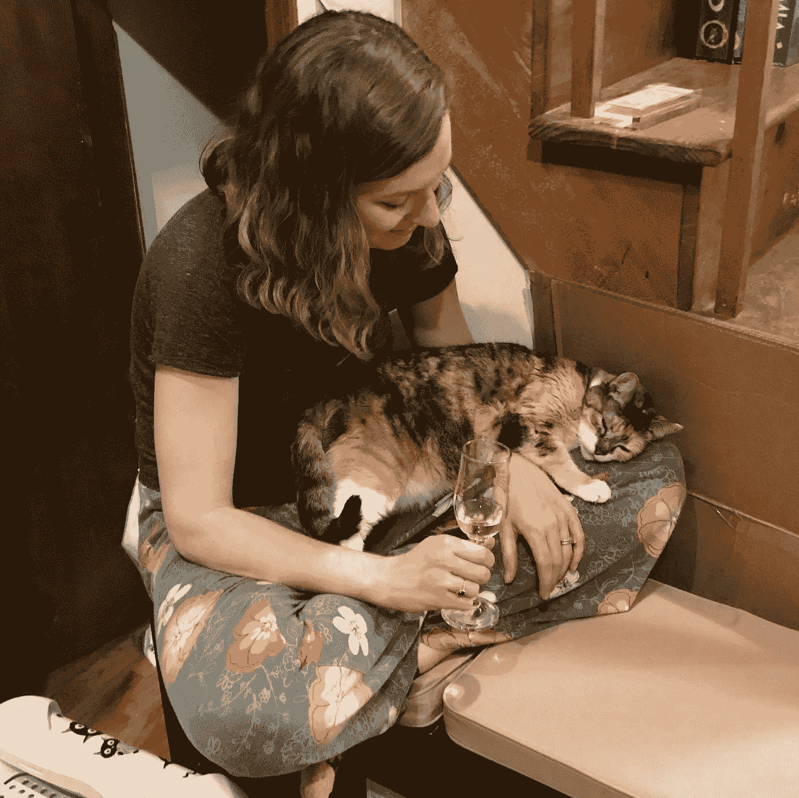

# 想把榜样变成导师？冷静点。

> 原文：<https://medium.com/hackernoon/want-to-turn-a-role-model-into-a-mentor-just-be-cool-bbf6e5272e30>

这是我关于导师系列的第二部分，几个月前我在这里开始了这个系列，发布了 [*“想要一个导师？别再要了。”*](https://hackernoon.com/want-a-mentor-stop-asking-for-one-cc4b12d8287a)

几个月前，我写了一篇文章，谈到在你的生活中寻求成年人的指导时，死亡之吻往往就是*寻求指导者*的行为。此外，我指出(并且仍然相信)这种围绕导师的误解有点被夸大了。说到底，我们大多数人不需要每隔几周就有人和我们见面，并指导我们职业生涯中的每一个行动。很有可能，你现在只是在寻找一些好的建议——也许几个月后又会是这样。

我分享了很多策略，告诉你如何与你想学习的人进行初次咖啡会面或电话交谈。在这篇文章中，我想谈论一些更微妙的东西——如何与那个人保持联系，而又不让人讨厌。

# **升温关系**

我的猫就是这样认识新朋友的:

1.  新人走进房子。猫很好奇，来到门口。新人觉得这个很可爱。
2.  新人坐在沙发上。猫慢慢靠近，开始闻他们的鞋子。也许在他们的鞋子上蹭她的脸。新人觉得这个*可爱*。他们感到受宠若惊，被爱着。他们伸出他们的手说，“这里，这里，小猫。”猫喜出望外。
3.  猫跳到新来的人的大腿上，并积极地用她的脸蹭他们的脸，直到他们对猫过敏。猫在膝盖上打滚的次数太多了，以至于它们在裤子上堆积了足够装满一台吸尘器的猫毛。最糟糕的是，如果这位客人要过夜，猫会整晚强迫自己趴在他们脸上，直到他们厌倦了把她推到一边。他们几乎睡不着觉。最后，饱受战争摧残和疲惫的我们的朋友离开了，说着类似这样的话，“嗯，你的猫很可爱。但该死的是，她是一个咄咄逼人的拥抱者。”他们不再要求留在这里。

当然，她做错了。我试着告诉她。你不可能在 30 秒内从认识一个新人变成“永远最好的猫-人类朋友”。不管有人多么喜欢猫和拥抱，他们可能仍然不愿意放弃一个晚上的好睡眠，只是为了让你能趴在他们脸上睡觉。

这也是我在寻找导师的人中看到的问题。现实点吧:没有人会在一夜之间从一次咖啡约会变成全职导师。

即使你*认为*你们有过最棒、最精彩的对话——即使你们两人因为许多相关的个人问题联系在一起，或者你们长大时碰巧来自同一个小镇——*即使他们离开会议并对你说，“我真的很开心，让我们再来一次。”* —但这并不意味着你可以像我的猫一样。

我曾经遇到过这样一个人，她在一次社交活动中见过我一次，一周后给我发了一封长达一页的[电子邮件](https://hackernoon.com/tagged/email)，宣称她选择我作为她的 10 大“人生导师”之一，我是多么“幸运”她写道，我选择了你，因为我觉得在我的人生道路上，你比任何人都更能帮助我。我所要求的是你和我一起回顾我的年度目标，大约每个月见一次面，并让我对我所追求的职业目标负责。请回复你这个月是否有空，这样我们可以一起安排我们的第一次会议。这不是很有趣吗？？

那是我最接近把我的电脑扔过房间的时候。

请不要这样做。当谈到与你钦佩的人发展长期关系时，你必须保持冷静。这里有一些你可以尝试的技巧。

# 1.根据你的谈话定期发送文章或链接。

随着时间的推移，这可能是与某人保持联系的最简单的方式。例如，如果你就你的团队使用的工程工具进行了一次很好的谈话，那么下次你尝试一个你喜欢的新工具时——不管是 1-3 个月后——给他们写一封短信。*“嘿，我只是想让你知道，在过去的几周里，我和我的工程团队一直在使用 Code Climate，它似乎真的对透明度和内部速度有所帮助。只是想传递一下链接，以防你也有兴趣看看。希望一切都好！”*

写这样一封短信最棒的地方是:不需要他们的回应。你没有要求任何东西。你不是想卖给他们什么东西。你只是在传递一个你认为他们可能会喜欢的有用的小消息。

***过线:*** *请不要每周都这样。在你意识到之前，你会很快打破“定期帮助”的感觉，进入“彻底讨厌”的状态。在这里使用你最好的判断。问这样一个问题:“我有多希望一个新人给我发邮件？”以此为指导方针。*

# **2。想办法帮助他们。**

这并不常见，但是如果你在第一次咖啡会议上发现你的未来导师在他们的生活中有一个当前的痛点，你也许可以通过各种方式帮助他们，那就开始吧！请记住，因为这个人可能比你级别高，所以他们不太可能直接说出困扰他们或让他们感到压力的事情。所以请注意寻找线索。这里有一些需要注意的地方:

*   **你听到:** *“我们今年的员工人数增加了很多，所以我的日程安排有点疯狂。”*
    **你可能会提供:** *“你在找什么角色？我想知道我的朋友/同事中是否有合适的人选。”*
*   你听到了: *“我为我的新书《组织设计》做了很多研究。”* **你可能会提议:** *“哦！你可能已经读过这篇文章了，但你有没有看到《哈佛商业评论》上一篇文章中的那篇很棒的文章，那篇文章说，在全公司范围内进行重组，会引发一种类似于人们像玛丽·近藤(Marie Kondo)那样打扫自己的家园的感觉？”*
*   你会听到:“我们正在为今年秋天去东京的家庭旅行做准备。”
    **你可能会提议:** *“哦耶？当我在那里的时候，我参观了世界上最好的拉面店。你喜欢拉面吗？我会把信息电邮给你。”*

这些例子的伟大之处在于，它们都是非常小的、具体的例子，在这些例子中，你可以展示小的附加值，也可以在你们走出咖啡店后找到继续谈话的理由。

***越线:*** *不要为了炫耀而去寻找发送后续邮件的理由。很有可能，这个和你交流的人足够聪明，能够知道你什么时候在钓鱼。我并不是建议你作为“救援突击队员”去解决他们自己的每一个问题。这个选项最好只在特殊情况下使用，在这种情况下你可能真的有一些有价值的贡献。如果没有，那么你最好跳过它。*

# **3。寻找在一个项目上合作的方法。**

这大概是我在书中最喜欢的一招。如果我遇到一个非常棒的人，我会在我们早期的会面中绞尽脑汁，试图找到一个借口让我们以某种方式一起工作——任何方式。当然，这需要一些快速的思考和一个双方都可以获得的明确的互利或机会。这也需要你做最多的工作。但是如果你做对了，你不仅会有一个潜在的有趣的合作机会，还会有一个美妙的个人学习和成长经历值得期待。

以下是我最近建立的合作关系或项目的几个例子:

*   与一家优秀的管理培训公司合作，为 USV 网络的新经理共同设计一个项目
*   订阅一个新的软件，定期打电话互相分享反馈和产品路线图更新
*   邀请他们领域的资深人士在我们为投资组合网络中的公司举办的活动上发言

这些都是外部的例子，如果你能做到这一点，那就太好了，但我也处于一个幸运的位置，因为我有自己可以支配的资源——比如，创业公司的人际网络，举办活动的空间，以及购买软件的预算。然而，我也喜欢在内部使用这个技巧。如果你想和一个团队更紧密地合作，或者想向一个人学习，想办法变得有创造性，找到一个他们热衷的项目，在那里你可以加入你的专业知识。

***过线:*** *这种东西不能勉强。请记住，这里的风险最高。所以不要提供你的专业知识或合作伙伴，除非你愿意致力于你这方面的工作。毕竟，如果你说服了某人与你合作一个项目，但却没能完成你的交易，你可能已经烧掉了一座桥，而不是加固它。*

# **将所有这些整合在一起**

不幸的是，没有什么神奇的公式可以帮助你将生活中的榜样转变为导师。事实上，有无数种方法可以促进和推动这段关系。这只是对我有用的三个。也许他们也会为你工作。也许不是。

但在我们结束之前，我确实想留下一些在与想成为导师的人继续交往时要避免的事情:

1.  **写过分奉承的便条**(说些好话是可以的，但是如果你说得太多，你可能会破坏他们把你当成同事的机会)
2.  **发太多邮件**(当你被允许多长时间给一个人发一封邮件时，有一个隐含的时效法规。顺便说一句，如果他们没有回复你最近的 2-3 封邮件，你可能需要冷静一下。)
3.  请他们在冗长的电子邮件中给出明智的人生建议(我犯过不止一次这样的错误，但是你必须抑制住通过电子邮件说出每个个人细节的冲动。很少有人有时间阅读和回答一系列杂乱无章的问题。)
4.  **期待有规律的会议节奏**(依靠他们来帮助你设定对你有意义的时间表或节奏。也许在现实中，他们的日历上一年只有一两次有时间给你。用这个。这仍然是一个胜利。)
5.  **在你的任何对话中使用“导师”这个词**(说真的。只是……保持冷静。)

My cat just needs to learn how to be more chill.

*想要更多吗？见本系列第一部分，* [*“想要导师？别再要了。”*](https://hackernoon.com/want-a-mentor-stop-asking-for-one-cc4b12d8287a)

*最初发表于* [*干擦*](http://bethanycrystal.com/blog/2019/01/25/want-to-turn-a-role-model-into-a-mentor-just-be-cool/) *。*