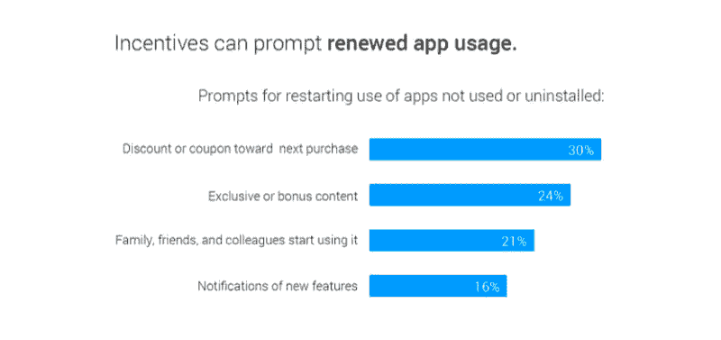
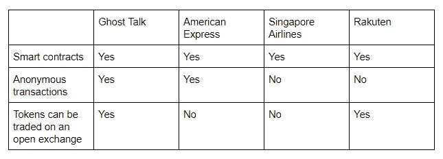

# 我们不需要更多的应用内优惠券，我们需要现金！

> 原文：<https://medium.com/hackernoon/we-dont-need-more-in-app-coupons-we-need-cash-cfce4c201ee1>

[https://www.freepik.com/free-vector/online-shopping-landing-page_3947106.htm](https://www.freepik.com/free-vector/online-shopping-landing-page_3947106.htm)

从优惠券到奖励卡，再到返现和应用内奖励，如今用户与应用的交互方式在不断变化。奖励计划已成功引入电子商务、餐馆和航空公司，但内容创作者从未享受过这种好处，即使(对于大多数社交应用)他们是推动整个环境的人。

[https://xkcd.com/](https://xkcd.com/)

奖励计划并不新鲜，但区块链科技在这里重新发明了用户访问这些交易的方式。在这篇文章中，我们将讨论为什么今天的应用内奖励生态系统对用户弊大于利，以及 [Ghost Talk](https://www.ghost-talk.io/) 、[美国运通](https://www.americanexpress.com/)和[新航](https://www.singaporeair.com/)如何在保护用户数据的同时，为参与的用户提供区块链式奖励。

# 你的优惠券是什么样的？

我们大多数人几乎不记得剪下父母放在钱包里的优惠券。也许他们并不是储蓄的主要焦点，但是慢慢地，随着每一个杂货账单的出现，他们开始积极地参与其中。很快，这种耗时的“剪裁”(或者更准确地说，纸张浪费)变得不可持续；反正大部分都是在垃圾桶[里结束](https://www.moneyunder30.com/extreme-couponing)。

[https://www.makeuseof.com/tag/save-with-coupons/](https://www.makeuseof.com/tag/save-with-coupons/)

但是这个模型保持不变，这个过程只是变得数字化了。塑料奖励卡只是将问题从纸张转移到了塑料垃圾上。真正的颠覆发生在它们被你智能手机上的应用程序取代的时候。返现和应用内奖励是今天的优惠券。

各种公司已经看到了这种转变，并理解企业、小型企业和推广者的需求，即直接补偿和奖励用户在其平台内的每一个行为。

# 为什么要奖励？

奖励通常等于应用内积分。它们被用作用户和有形回报之间的垫脚石。为什么？每个企业都希望保持较高的保留率。他们希望有忠诚、活跃的用户使用他们的服务。基于关注客户忠诚度的[研究](https://cmr.berkeley.edu/documents/sample_articles/2006_49_1_5427.pdf):

*   奖励计划可以增加 5-10%的收入
*   应用内会员比非会员多花费 5-20%
*   应用内会员的购买频率比非会员高 5-20%

这些统计数据显示了对用户保持率的直接影响。实际上，仅仅增加 5%的客户保持率就可以增加 25%到 95%的利润，根据贝恩咨询公司的说法！

# 奖励计划能达到市场饱和吗？

当我说奖励计划没有什么新意时，我是认真的。这些系统无处不在，可能看起来一模一样。实现这些特性的人倾向于寻找一个成功的模型，而不是试图理解是什么驱动了他们用户的兴趣。

普通家庭参与[超过九个奖励计划](http://prloyaltymarketing.com/customer-loyalty/academic-observations-about-customer-loyalty-and-reward-programs/)曾经是一个成功的模式，如今奖励计划正在失去竞争优势。目前只有 [5%的应用程序用户](https://www.appsflyer.com/pr/new-report-global-app-spending-habits-finds-asian-consumers-spend-40-apps-rest-world/)会在应用内购买上花钱。鉴于应用内购买收入是移动应用收入的头号来源，占总收入的 48.2%，这是一个惊人的数字。

[https://www.thinkwithgoogle.com/consumer-insights/mobile-app-marketing-insights/](https://www.thinkwithgoogle.com/consumer-insights/mobile-app-marketing-insights/)

从 Google Play 商店下载的应用程序中有一半是免费增值应用程序，这使得应用程序的收入掌握在用户手中。世界上哪里的人最有可能在一个应用上花费最多？在亚洲，手机消费者每月支付的费用比全球其他地方高出 40%。

# 智能硬币创造智能未来？

鉴于其重要性，为了使奖励计划在今天的环境中取得成功，所提供的奖励应该是可实现的、相关的、符合市场趋势的、对用户有吸引力的。当应用程序所有者决定让其用户难以声称其赢得的积分的真正价值时，所有这些特征都被忽略了。这就是为什么我们正在寻找一种不同的方法，这意味着通过使用区块链技术来实现奖励计划的下一步发展。

[Ghost Talk 的社交媒体消息应用](https://www.ghost-talk.io/)使用分散式支付平台，通过用户自己的智能硬币令牌和智能合约来奖励用户。这意味着消息应用程序中的任何活动都会产生智能硬币奖励。这些都是虚拟积分，自动给予各种形式的参与，如创造新的，创新的内容或分享他人的创作。这些点数与任何其他应用内点数的主要区别在于，它们是以加密货币的形式出现的。智能硬币代币可以在上市的公开交易所交易。

[美国运通](https://www.americanexpress.com/)，金融服务巨头[宣布](https://www.coindesk.com/american-express-upgrades-rewards-program-hyperledger-blockchain/)利用 Hyperledger 使零售商能够提供定制会员奖励。美国数字零售商 Boxed 是第一家为顾客每次购物提供比以前多五倍的会员奖励积分的零售商。这就是使用区块链降低了多少成本，以及在此过程中保持客户数据的匿名性。智能合同将通过私人区块链渠道自动将匿名信息传递给美国运通。

新航是在忠诚度计划中采用区块链技术的最大公司之一。他们现有的会员计划，对现有会员来说被称为 KrisFlyer，现在将在一个位于区块链的支付系统上运行，该系统允许客户使用航空公司积累的航空里程在选定的零售商处付款。

如果上述公司还不能令人信服地认为基于奖励的系统的未来在区块链，日本电子商务巨头乐天已经为同样的目的开发了自己的加密货币。他们已经通过数字优惠券发放了 91 亿美元的忠诚度积分，现在所有这些奖励都将通过乐天币进行分配。

虽然加密货币或区块链技术的使用似乎只有那些精通技术的人才能使用，但在这种情况下，你不需要任何技术知识就能受益于它的技术优势。根据一项研究，奖励计划面临的最大挑战是确保用户意识到并理解该计划的效用。

# 结论

作为一家希望回报用户的企业或简单的服务提供商，回报可能是一种有利可图的忠诚关系的纽带，因为双方都试图找到解决当前有缺陷的系统的方法。对于像本文中讨论的公司这样的倡议，他们正在开发基于分散技术的工具，这种工具重视用户而不是中间人，“天下没有免费的午餐”这句话可能会在这个内容创作生态系统中过时。