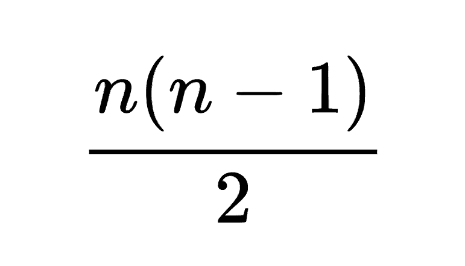

# 财富:经济学的新时代——自由主义

> 原文：<https://medium.com/hackernoon/wealth-a-new-era-of-economics-ce8acd785441>

资本主义和社会主义在气候上不和。为什么？因为他们快死了。不相信我？让我挑战你的假设，向你介绍未来。我给你讲几个故事吧。

我有资本主义的朋友，他们每天喝西雅图最好的咖啡，仅仅是因为他们想反抗星巴克的垄断。他们不知道，星巴克拥有 T2 最好的 T3，所以他们的利润等于星巴克的利润。

这就是为什么我的社会主义朋友讨厌资本主义，他们知道公司会假装竞争，以推动更多的销售。最终，品牌忠诚度并不重要——当然，除了政府，我的社会党朋友说。

我们称之为*虚假叙述*，这是为了转移你对真实故事的注意力。这是非常有效的，例如，2016 年美国政治选举充斥着他们。但是它们是如何工作的，为什么工作呢？

二分法使人们感到不舒服，因为它产生了逆反心理。更多的分裂创造了更多的意识形态的忠实追随者，并增加了回音室。回音室消除了思想开放和理性的讨论，当讨论结束时，只剩下情绪化的决策。

情感决定总是自我选择一个人的忠诚——他们的家庭，他们的部落，他们的群体。盲目的，慷慨激昂的忠诚，无论是政治还是产品。

# 黑格尔辩证法

想法的进化，或者说*模因*(不是照片类型)，有一个已知的过程。一些想法被认为是一个*命题*，并且受到一个对立面*对立面*的挑战。这两个想法之间的紧张会产生压力，当压力被打破时，就会产生*合成*，或者想法的分解和组合。

资本主义和社会主义之间的激烈冲突表明我们正处于转折点。那么这两个系统的合成会是什么呢？

要预测未来，我们必须了解过去。我给你讲个故事吧。

# 财富的演变

狩猎采集者的财富在他们的捕获物中。但是过了一段时间，一些聪明的家伙意识到他们可以驯养他们的猎物，而不是杀死它们。因此游牧社会诞生了，拥有最大牧群的族长被尊为最富有的人。但是后来事情发生了变化。

一些更聪明的人意识到，他们可以利用土地，而不是破坏动物吃草的土地，这是一个持续的自我放逐的过程。如果动物是财富，它们以土地为食，那么土地一定是比动物更丰富的财富来源。

只需要一个技术火花，农业革命就诞生了。不管是好是坏，这个新的财富时代带来了真正文明的最初根源，但它也孕育了土地纠纷引发的暴力战争。

没过多久，一些有远见的人出现了，他们意识到，通过向国王的军队和封建农民提供征服和耕种土地的工具，他们可以超越国王的财富。挤在几英亩土地上的一家制造厂可以生产产品，这些产品可以在土地上从一个人传到另一个人。他们不需要拥有土地，他们需要拥有的只是你手中想要的东西。

工业革命打破了所有之前对财富存在的预期。富足泛滥，使得普通百姓也能享受任何国王都梦寐以求却无法想象的奢华生活。但是制造工厂靠什么为生呢？是什么推动了工业革命？

一个简单的概念:模具，一个产品的蓝图。一旦由专家制造出来，它就可以被用来以低廉的原材料成本不断地将想法复制成现实。但蓝图只是一些信息。那有什么价值？一些抽象的、无形的想法怎么可能有价值呢？

互联网引发了信息时代，一个将想法的想法发挥到极致的新经济时代。迷因(照片类)像病毒一样传播，关于一个人的简单数据可以被无限转售*直到它操纵了大众。黑客、泄密和丑闻主宰了新闻，激流推翻了媒体垄断。信息变得免费。*

# 资本主义作为一种强制功能

如果星巴克足够聪明，能骗你进入竞争的幻觉，为什么资本主义和社会主义不会骗你进入一个错误的二分法？迷因想要生存，就像有机体和企业一样。让社会回到黑暗时代，让人类重新发现亚当·斯密和马克思，比让一个新时代取代他们更符合他们的利益。

[我们现在所处的地方](https://hackernoon.com/a-new-kind-of-social-network-emotional-intelligence-e45dcddb1bdb#f4e3)是一个动荡的向未来的转变。我们的现代货币被困在一个假定经济商品、产品等的遗留系统中。是由需要资本密集型劳动来创造或复制的物质材料组成的。当然，我们世界经济的很大一部分是由这些东西组成的，但不是全部。例如，复制数据的成本可以忽略不计。

要预测经济财富的宣泄未来，我们所要做的就是考虑思想依赖于什么。就像动物以土地为食，思想以人为食。不，不要担心，未来不是一个反乌托邦的吸脑浆的僵尸矩阵，它是一个更加乌托邦和微妙的东西。

具体来说，从黑格尔的角度来看，最好的想法往往是许多人之间紧张关系的综合。并不是任何一个围绕它建立一个完整的制造工厂的想法都是成熟的。成熟的想法是那些被最无情的头脑无休止地审视过的想法，并且经历了无数次进化张力的迭代。能够模拟这些想法的未来的头脑是那些在任何缺陷出现之前就能纠正它们的人。

用非抽象的术语来说，想法来源于人们的网络。你可以在增长最快的经济领域看到这一点，比如硅谷。在全球薪酬最高的公司中，员工大约每两年或不到两年就会换一次工作。风险资本家利用他们的关系网将顶尖人才投入到有前途的初创企业中。一旦被执行，仅仅一个小团队就可以将一个想法自动化为现实，然后数十亿人依赖它。

为什么？因为合适的狭窄的人际网络可以产生一种想法，这种想法是信息套利的模型，当它被设定在适当的位置时，可以以超过经济本身的规模制造数字或实物商品。无论你是否喜欢无人驾驶汽车，不可否认的是，只有少数公司正在将交通运输重塑为一个[十万亿](https://www.theverge.com/2017/6/1/15725516/intel-7-trillion-dollar-self-driving-autonomous-cars)美元的行业。在这一过程中，许多工作岗位将会流失，但自动化系统最终将比以往任何时候都更高效地运送更多的人，从而带来更大的市值。

# 社会主义是一座充满爱心的大教堂

但这正是我们的社会主义朋友的用武之地，那么广泛而非深入的网络呢？由于受到少数人的利润和剥削，他们大声疾呼，“我们需要阻止日益扩大的阶级分化”！对大多数人来说，科技公司带着财富离开，却无所事事，这似乎并不公平。不管你的观点如何，它正在发生的事实表明，信息中的金钱比以前想象的要多。

然而，金钱并不等同于道德上的善良。因此，“政府必须是我们的救世主，拥有规章制度、更高的累进税和免费福利”——或者是这样的想法。但是，与其试图掩盖症状，我们为什么不修复系统的机制呢？也就是说，如果我们真的让金钱代表道德上的善呢？尽管看起来很傻。

如果资本家是贪婪的，那么他们也是愚蠢而盲目地遵循政府对任意印刷钞票的定义——嗯，除了那些幸运的秘密自由主义者。如果你想改变行为，就像比特币告诉我们的那样，你需要做的就是用不同的激励措施改变游戏。这里有一个简单的类比:想象一下，如果我们让钱在股票市场上表现得像股票一样。让我们复习一些例子。

你的美元不会被用来换一支铅笔，相反，你会得到公司的股票，等于铅笔的成本加上购买的利润。然后，成本部分自动得到赎回铅笔，你保留利润中的细价股部分。随着时间的推移，如果公司的股票上涨，你剩余的那部分也会升值。然而，如果在任何时候，公众对公司失去了信任，他们都可以出售，使公司陷入困境，并有可能消除多年的利润。

一个社会主义者所需要做的，就是改变金钱的意义，公司会因为贪婪而自我调节。此外，提供福利服务的公司得到利润补贴，将赢得公众的最大信任。这将推动市场竞争，提供比政府更好的保护性护理，并消除所有可能的浪费。不再是无形的，取而代之的，只是一只*透明的手*对所有人的帮助。一个既深又广的网络。

# 财富的新时代:自由主义

如果社会主义被定义为*由公共整体*控制的商品生产和分配，资本主义被定义为*由私人灵魂*控制的商品生产和分配，那么我们可以将**自由主义**定义为 ***由算法*** 激励的商品生产和分配。确切地说，我的目标是 ***自由的人民，自由的产品，为了一个繁荣的星球*** 。

现在，需要问的问题是，谁的算法？如果是苹果的，亚马逊的，ACME 的，或者任何人的，那我们还不如骑士一个暴君，骑进噩梦。这就是为什么它是一个类似于互联网或万维网的**去中心化算法是很重要的。这种算法不受任何人控制，但可以被任何人使用，形成一个网络。**

自由主义的关键因素在于，它将财富的定义从*“某人囤积了多少”*改为*“*[*某人捐出了多少*](https://hackernoon.com/behavioral-cryptoeconomics-the-secret-of-digital-currencies-ac6e9b04fcb6) *”。这符合每个人的利益——富人之所以富，是因为他们已经开始规模化经营。这让他们可以最大限度地提高制造和零售流程，而不必用枪指着任何人购买储存的商品，穷人也可以获得多余的商品。每个人都会变得更富有。*

目前在美国，空房子比街上无家可归的人还多。当前经济模式的缺陷在于，如果这些住房被分发出去，将会刺激人们为了获得免费住房而变得无家可归，而免费住房是一种利润损失。在自由主义中，这是相反的，对一件商品来说，分配比囤积更有利可图，而且这样做不需要从富人那里偷窃或征收累进税。

在我们讨论发行版如何工作之前，我们需要对什么是网络有一个细微的讨论。这将更彻底地解释为什么分配算法需要去中心化，但也将让我们看到网络中存在的巨大价值。能够测量它对经济学来说是必要的，事实证明有一个简单的公式可以做到这一点。

在谷歌、亚马逊或脸书的例子中，有很多人在他们的网络上。他们拥有、控制和集中运营 it。与优步或 AirBnB 甚至比特币或 AT & T 相比，有很多人*在*他们的网络中，但他们无法控制。这种微妙的区别在于如何访问资源。例如，如果有人想在威瑞森聊天，T 会联系我，如果有人想用我的空房间，AirBnB 会通知我。

*你*搜索谷歌，但优步搜索你。如果你在正确的时间出现在正确的地方，有空座位，那么你可能会被选为彩票中奖者。你在脸书发了帖子，但比特币可能会奖励你一整块。为什么这种差异很重要？因为当你在一个网络上时，价值就会被吸走。当你在一个网络中时，机会就会被推给你。

因此，网络算法可以释放以前未开发的价值。*很多*(对外面的数学家来说可能是 NP 难的)。这足以对经济理论的基础造成灾难性的破坏，这也是为什么自由主义应该被归为一类。因为一个算法可以做出如此大量的可能的经济资源分配，自由主义应该被认为是它自己的科学分支去探索和研究。

一个网络的经济价值是由它使一个[完全图](http://mathworld.wolfram.com/CompleteGraph.html)饱和来限定的，这个完全图被称为一个[全连接网络](https://en.wikipedia.org/wiki/Network_topology#Fully_connected_network)。对于计算机来说，这不是最佳的，但对于一个参加“快速约会”鸡尾酒会的商人来说，这是他们可以交换的名片的理想数量——被称为 [**握手问题**](http://mathworld.wolfram.com/HandshakeProblem.html) :

现在很容易计算一个完全饱和的网络的潜在价值。指定你认为任何两个人之间的关系信息的法定货币值，并乘以握手数，其中 *n* 是该网络中的人数。

**例如**，假设一个广告商愿意支付 0.01 美元的 1%给脸书，以获得关于你和你妈妈之间关系的所有信息。然后，假设他们(如果他们有无限的预算)对脸书 20 亿用户的每一个关系都这样做，并假设他们可以无限期地访问信息，那么他们将被收费:

> ***【0.0001 美元*(2B(2B-1))/2)= 1.99 亿美元***

惊讶吗？大约 200 万亿美元，是整个世界 GDP 的 2 倍，是美国国债的 10 倍。这就是网络算法的力量，其价值的丰富性将重塑财富本身的定义。

# 自由主义的财富:提供普遍的基本服务

资本主义中最富有的人已经知道如何以规模经济的方式制造商品，然后以最优的价格卖给最多的顾客。

社会主义并没有太大的不同，它只是希望这些商品从最富有的人手中重新分配给处于风险中的少数人，以最低的价格(如果不是免费的话)，然后通过分层定价由高于最低价格的每个阶层补贴。

一种方法是找出单一的中间价格，而另一种方法是将它分布在一个范围内。关键是两个系统都是 0 和。他们都是有赢有输的。这就是我们所说的**必然野蛮的制度**。

黑格尔的解决方案很简单——激励生产*和*分配作为财富的定义，而不是交易的结果。资本家认为生产很容易，但分配却很难。社会主义者认为分配很容易，但生产却很难。这是双方彼此的不满，下面是解决的方法。

工业革命给了我们一件礼物，那就是可以大量生产商品的机器。信息时代给了我们过度传播知识的礼物。当在一个完全饱和的网络中结合在一起时，存在一个最优算法，该算法知道什么剩余商品可以在本地赠送给谁，**和**知道谁应该因为这样的好行为而获得信贷。没有交换，只有双赢。

如果你从双方的观点来看，这是一个完美的组合。对于一个社会主义者来说，资本家拥有的太多了，所以让他们付出一点点不应该很容易吗？对于一个资本家来说，如果社会主义者想要这么多，为什么不使用自由市场而不是低效的政府呢？一派主张放松市场管制，以降低向大众分销产品的成本，另一派主张监管市场，以防止价格合谋。

最后，他们都想要同样的东西，他们本质上都是自由主义者。

为了解决这个问题，双方都提出了普遍基本收入。但是，任何必须“平衡”交换的经济体系都不可避免地会失败——无论是从富人那里拿东西给穷人，还是富人从中产阶级那里拿东西只是为了让富人更富。当双方都依赖于零和基线时，他们不可能通过免费提供东西来取得进展。这样的社会将看不到增长，因为交易必须在某个时候被纠正，以保持系统的有效性。

因此，这两种体系都认为免费赠送的东西是没有价值的(除非它的分发存在排他性)。这意味着我们可以预测，通用基本收入将会自动调整，将每月 1，000 美元视为新的 0 美元。但在自由主义中，我们可以分发房屋，让所有相关方获利，因为分配比交易更有回报。

# 从经济角度衡量纯附加值

经济学的*理论*是两个人都带着比他们开始时更多的价值离开——你有鸡，我现在有一头牛。但问题是，除了相对于通货膨胀的增量基线调整外，没有一个经济体系完全*解释这种价值的增加。最接近附加值的是股票市场或信用卡奖励计划。*

不过，网络算法可以跟踪这一点，而且许多人已经这样做了。给予 T7 的运算比跟踪 T8 的加法和 T10 的减法更容易。例如，比特币需要消耗整个国家的能源来计算交易。原因是一个经常被遗忘的小学事实，减法是不可交换的——其运算顺序产生不同的结果。然而，没有人希望他们的钱有争议，因此每年银行都要花费数万亿美元来维持这些交易背后的复杂性。

因此，切换到一个只加和的系统，基础设施会立即增加，因为加法是完全可交换的。运营起来会便宜很多。事实上，系统中的货币将变得越来越无缝可用。让我们举几个例子来说明这种货币是如何运作的。

但首先，我们需要了解任何经济体系都可能有的一些基本变量。在我们目前的研究中，有三个主要问题需要考虑——货币是否是零和的，货币是否使用比率或单位，以及货币是对商品还是对关系起作用。有很多不好的配置。但我们要探索的是一种只有加法的、基于比率的货币，对网络中的联系进行建模。

以“购买”一杯咖啡为例。在传统系统中，你输了，他们在一杯咖啡中获得单位的硬币或美元。在这个版本的自由主义中，给你一杯咖啡，你评价你从给你咖啡的组织那里得到的每日价值百分比。举个简单的例子，咖啡可能占你一天中叫醒你的时间的 2%，住房占 55%，交通占 18%，食物占 12%，等等。

这个系统的一个直接有趣的属性是，不同的人可能对某样东西有不同的评价。咖啡对一个人来说可能是 1%，对另一个人来说可能是 5%，而不是 2 美元的固定价格。另一个重要因素是要记住，被评价的不是咖啡本身，而是你和公司之间的互动。如果那天是咖啡并不重要，可能是蓝莓松饼或香蕉奶昔。

这也意味着你可以成为赞助人。你可以说“星巴克为我提供了我一个月价值的 4%”，而不是每天喝咖啡时拿出你的添加剂积分。现在你只要上去拿你的咖啡，不用排队等机器做不可交换的数学运算，用它们的零件打印出树，然后把零钱洒出来。每月一次，点击“续订”。

第三点，如果还不清楚的话，是顾客设定价值，而不是给予者。那么，是什么阻止了人们说某样东西毫无价值呢？给予者有什么好处？经济学的一个重要部分是，给予者不必给予。他们永远不会被迫交出资源，他们可以随时拒绝服务。咖啡实际上是一种后稀缺资源，但跑车和时尚不是。这些就是我们所说的奢侈品。

奢侈品由主人决定是否赠送。同样地，一个人可以评价他们每天从给予者那里获得的价值百分比，任何主人都可以看到你回馈社会的价值。并且在任何竞争体系中，只能有一个顶级给予者。最大的捐赠人，所有的捐赠人，都是互相排名的。因此，一些时装设计师可能只给社会经济地位最高的 1000 名富人设计服装。为什么？

因为如果你被视为提供了有价值的服务，而这个人客观上为其他人提供了最大的价值，那么你就分享了那部分财富。但是请记住，他们设定了“价格”，处于这种地位的人可以获得优质服务。人们必须认真考虑他们时间的价值。

那么，主人会给任何人任何仍然稀缺的商品，比如汽车吗？大概不会。根据目前的数据，一个美国经销商将为大约 90%的美国家庭提供一辆汽车。因此，那些没有帮助他人创造价值的底层 10%的人将不会拥有自己的汽车。让我们现实一点，这会造成比现在更严重的贫困吗？号码

在美国，住房和食品是后稀缺品，甚至交通也是，只是汽车不是。在传统经济学中，传统上是较富裕的人有能力不拥有汽车，因为他们可以支付司机的服务费用，而拥有汽车的普通人在出城时必须租用汽车，而穷人则根本买不起任何东西。在自由主义中，搭顺风车不需要任何成本，而且这样做会让车主变得更富有，因此富人有一种通过帮助穷人来“剥削”穷人的天然动机。

在一个没有损失的经济中，*是*失去了比同龄人更快爬上社会经济阶梯的机会。每个人都想变得更富有，不是吗？更富有意味着付出更多，如果你付出的比别人多，那么也许你今晚就可以兑换酒店的顶楼套房。没有人*需要*顶层公寓，即使是有钱人也不需要，但是*他们*买得起吗？是的，按照人们的标准，只要他们帮助了足够多的人。然后他们免费得到它，作为对他们为社会所做贡献的感谢。这才公平。

自由主义并没有像马克思希望的那样消灭私有财产，但它要求拥有这种资本的人为了更大的利益而最大限度地利用这种资本，以便获利。这种激励将导致分配效率和自动化的提高，直到握手问题饱和，没有浪费的空间——资源是给予的，而不是囤积的。目前，等待交换造成了资本主义分配上的摩擦。

我们再看几个边缘案例。是什么阻止了两个人串通一气，给对方尽可能多的分数？这就是基于*单位的*、仅加性的关系货币会失败的地方。这些分数会继续膨胀这个系统，或者给他们一个暂时的不公平的优势。但在基于比率的系统中，这是不正确的，他们能做的最好的事情是改变他们的每日百分比值——他们可以在一天内多次这样做，但它只会更新排名值——没有新的交易。

那么如果他们每天都给对方 100%的日常价值呢？嗯，这将禁止他们对其他人进行排名，这将使他们在其他捐赠者和主人中不受欢迎，给他们自己一个有资格和忘恩负义的名声。或者任何过高或过低估计的每日值都可以自动进行百分比调整。例如，如果你在一天之内说食物价值是 100%，住房价值是 100%，那么两者实际上都将被计算为 50%和 50%。数学可以随时或多次重新计算，因为运算是可交换的。

最大的攻击载体是创建数以千计的假身份，但这里没有重复花费的硬币。唯一“花掉”的是你与之互动的身份，但你与他们互动得越多，你就越容易将自己与一个虚假的网络联系在一起，这让你在审计时更容易受到谴责，从而导致奢侈的主人在给予时更随意。

从技术角度来说，审计可以出奇地便宜且容易执行，尽管可能会在后台被连续索引。最糟糕的情况是，它会像在信任网上求图交集一样慢，计算时间应该不到半天。然而，一旦开始，我们目前工作的编码原型能够在全球范围内以亚秒的速度进行审计和更新，完全点对点和密码安全——无需信任中间人机构。

这个系统出奇的简单。它只需要不到十分之一的现有金融基础设施就能运行，这可能会激怒许多精英人士，因为他们没有必要隐藏过高的价格。它需要较少的思考来使用，这可能会激怒许多知识分子，因为他们不会有任何学术优势来发表意见。最后，它不需要任何人参与一个必然野蛮的系统，这可能会激怒许多有权有势的人，因为他们将没有人可以压迫，以满足他们的自尊问题。这个系统的简单性是它的优点，也是它能够工作的原因。

马后炮显而易见。如果我们想要一个能准确计算经济价值的经济系统，那么很明显，这个系统应该试图通过系统中的经济行为者来衡量价值。资本主义和社会主义试图通过债务来代表这一变量，但这从根本上意味着价值不能被重新创造——它必须“来自”或平衡于其他地方。这种假设是因为这些系统的基本要素无法对其建模，它们采用零总和交换、单位货币和项目会计，而不是网络中的连接。

# 跨越财富时代:从这里到那里

在自由主义中，价值可以来自其他地方，但它也可以模拟和解释以前的系统无法想象的后稀缺商品，如数字信息。因此，它能够包容资本主义和社会主义，就像爱因斯坦物理学对牛顿模型所做的那样，同时还能驱动新的行为。这是系统的一个关键属性，因为它使系统在进化上可行。

后稀缺被定义为数量大于可供使用的人类数量的任何物品。没有什么能阻止人们为稀缺商品买单，只是他们觉得这不合理。但是这种支付并不减损或突然使该物品变得不可获得——它并不改变该物品的性质或经济属性。

这允许人们在同一“交易”中接受两种形式的货币，而不会影响市场经济。这对于比特币来说是不可能的，因为比特币和美元都很稀缺，所以人们不会想要双重支付。但人们已经习惯了为他们的优步司机付费和评级。你可以得到现金和每日百分比价值。

拥有这样的评级本身就很有价值，因为它们可以用来将你与各种社区中其他慷慨的主人相匹配。他们有一个自然的动机为你提供补贴或免费的服务，如交通、住房、数字商品或其他东西，以便得到其他知名主持人的更高评价。这加强了你的网络，让你发现新的关系，释放以前未开发的价值，同时对更大的交易人群共享服务越来越有竞争力。

一个简单的博弈论规则是，在两个人已经拥有该系统的情况下，他们将相应地对彼此进行评级，以获得网络效应，而不管是否使用现金。在任何人被允许使用评级系统的情况下，为了保护他们的现金，他们都会这样做。在只接受现金而没有竞争的地方，人们可能会试图说服店主加入，或者回到现金。但是在有竞争的商店或服务的地方，人们会被激励去选择一个接受评级的，或者保存现金或者获得网络优势。

总之，这意味着新的经济模式将最终超越旧的，成为主导模式。它可以在以不冲突的方式与旧模型集成的同时做到这一点，但仍然可以增加任何交互的总附加值，即使它尚未被视为一种货币。

最后，由于货币只是附加的，网络效应只会增加，所以人们有一种自然的动机尽早加入，因为他们的财富平均增长会比其他人多得多，这增加了他们获得奢侈品的几率——他们的努力没有成本或损失。

# 结论

对自由主义最大的威慑可能是解释自由主义。资本主义和社会主义嵌入了它们宿主的大脑，描述任何其他或竞争系统都会在它们的受害者中引发一波部落对抗。再多的词语或更好的词语安排也无法说服任何人。纯粹是那些已经足够开放的人可能理解这个系统的含义，不是因为在这里读到的任何东西，而仅仅是因为他们已经在他们的思维中得到锻炼。

思考自由主义也很可能是徒劳的——所以从这个意义上说，作者写这个是浪费时间。唯一有成效的方向是实现它，让人们把它当作游戏或玩具来使用。不能认真对待它，因为这将暴露它与现状有多么不同。但是当作为一种选择时，人们会选择其他的。这将是衡量其成功和确定其经济效益的最佳方式。

如果你喜欢这篇文章，请在 [Twitter](https://twitter.com/marknadal) 上关注我，并查看[我们迈向](https://github.com/amark/gun)实施时代的工作。ERA 是本文描述的经济资源分配算法，带来自由主义。