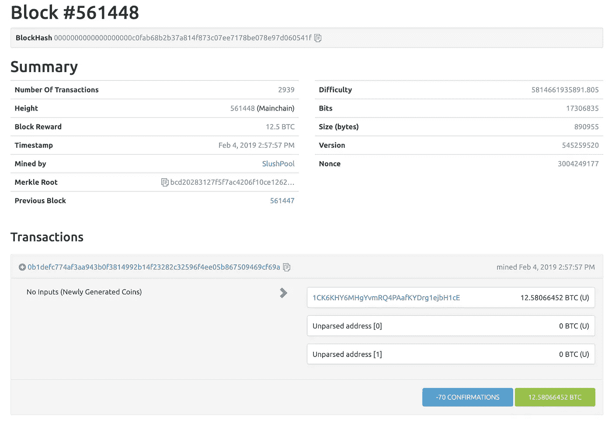
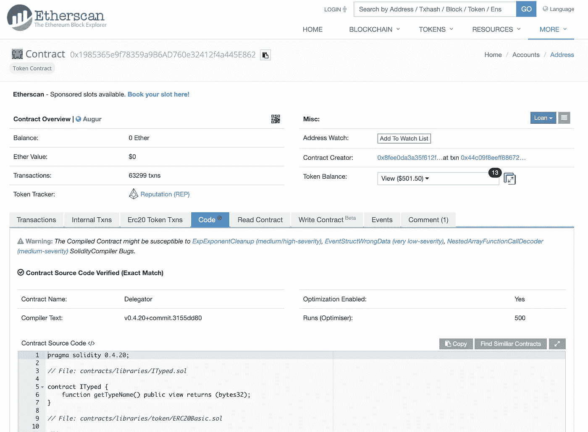
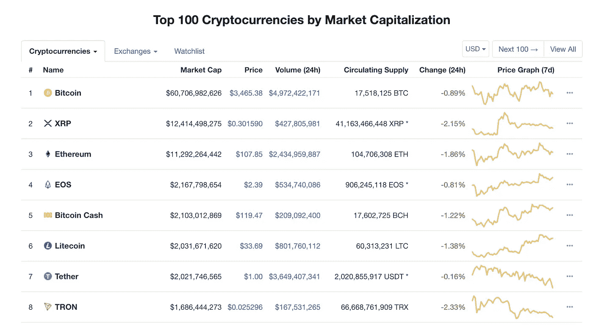
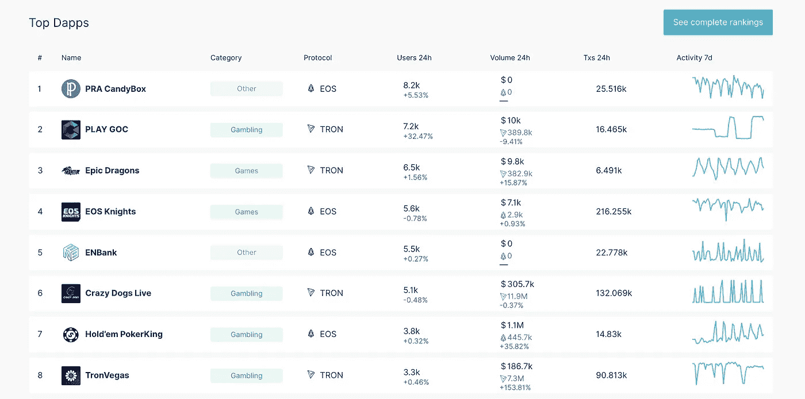

# 欢迎来到加密。你只能靠自己了。

> 原文：<https://medium.com/hackernoon/welcome-to-crypto-youre-on-your-own-46f3f287561d>

Photo by [Stephane Lacasa](https://www.stephanelacasaphotography.com/)

*为用户和开发者揭开行业发展的神秘面纱* *。*

去年，我决定一头扎进加密领域。

这个空间就像十几岁的时候一样喧闹**——全都是粉刺&——而且成长得一样快。我很好奇。我很警惕。**

**自从网络时代以来，我就一直从事网络应用程序的工作，想要一个新的挑战。引领稳定币(一种与现实世界资产挂钩的加密货币)的技术愿景，似乎是一头扎进去的好方法。😳**

**我在这个领域看到的大部分都是自我标榜为“空想家”的膨胀自我，以及每个竖起耳朵背后的美元符号。我遇到的每个人都在推销他们全新的基础设施/平台，这令人疲惫不堪。更糟糕的是，在活动中使用的行话太多了，你可以用刀子切开它。在国外，参加会议的一天感觉像是一周。我被隔离在酒店的舞厅和仓库里，躲避阳光，被单向度的推销员追求，他们说着一种我(也可以说是他们)几乎不懂的语言。**

**很难接通任何真正的信号。**

**但是，从我读到的东西到与我信任其见解的人的讨论，我确信这个领域正在发生一些需要关注的事情。坦率地说，即使仅仅是它发展的速度也令人生畏。不沉浸于加密似乎是一个巨大的机会成本。**

**所以，我开始学习它。要理解它的形状，揭开它的结构的神秘面纱，思考它的含义。**

## **先验知识**

**像大多数技术读者一样——我读了很多书，并学到了一些基础知识。**

**我知道，实际上，区块链是一个动作的集合，相同的副本在世界各地的大量计算机上运行(数量越大、分布越广越好)。我知道其中的信息对每个人都是公开的，链中任何先前的行为，一旦被添加，就永远不能被修改或删除——只能添加更多。**

**从这些关键特征中，出版物和专家们推断出了最适合该技术的领域，我倾向于同意这一观点。即存储重要的公共领域信息的服务，如人口普查数据、公共支出、研究统计数据等。这对全世界的政府、科学和组织来说都是一个福音。**

**然而，我也非常不看好比特币(BTC)和以太网(ETH)等加密货币作为法定货币(政府支持的货币)的替代品。这种波动是不可控的——在商品和服务开始以加密方式定价之前，菲亚特不会被取代，这似乎——现在仍然如此——像是一个遥远的白日梦。也就是说，仍然有很多真正的信徒。**

## ****Cómo se dice？****

**当我开始四处寻找时，很明显没有任何关于加密的指南。没有一个自上而下的解释能让我一点一点地深入一个章节；当我阅读文章、听演讲和阅读白皮书时，我最好习惯于自上而下和自下而上的混合理解。我也接受了大量的“黑箱”学习[1]——我用这个术语来指学习，同时承认理解中有很大的漏洞，需要以后填补。**

**[1]不要与黑盒机器学习混淆。**

**当我小心翼翼地穿过这个生态系统时，我对我经常打交道的领域中糟糕的用户体验越来越失望。在我看来，在区块链上创建应用程序的开发人员并不知道他们假设了多少知识；他们的界面假定他们的用户分享他们对交易细微差别的理解。**

**这种假设的情境远远超出了用户界面——它出现在我的每一篇博客、新闻文章和对话中。我被激怒了。我知道我需要适当的背景，但我还是喝了消防水管里的水，很快就淹死了。**

**我厌倦了没有一个好的精神模式来适应一切。所以，我向自己承诺，一旦我解开了空间的神秘性，能够把它教给其他人，我会写一个指南来做到这一点。**

**我很快意识到至少有两个不同的角度来解决这个问题——一个用户和一个开发者——如果我试图将它们结合起来，我会对两者都不利。因此，我开始记下我在这个过程中发现的经验和教训，并着手为区块链的用户和在区块链创作的人创建一个指南——因此有了这篇博客。**

**然而，为了说明该领域中的一些关键经验，这些经验需要在它们出现的背景下呈现。为此，我们需要历史和视角。**

**在我们开始之前，有一点需要注意:我不打算深入挖掘工作原理或区块链背后的密码学。如果你是一个自下而上的学习者，或者不喜欢黑箱方法，我建议你查找你感兴趣的帖子。虽然要注意，采矿和加密虽然相似，但在区块链之间的工作方式不同——即使是比特币和以太坊。**

## **早熟的孩子**

**锁链是从近 11 年前全球金融危机期间发布的优雅简单的比特币演变而来的。比特币被称为第一代区块链，即区块链 1.0。令人困惑的是*比特币*(全部小写)指的是加密货币(BTC 是其股票代码)，而*比特币*指的是支持它的软件。**

**本质上，比特币是金融交易的账本——在钱包之间(或者更确切地说，在地址之间)流动的比特币。那些保持网络运行和增长的人——矿工——以网络的本地加密货币作为奖励获得报酬。**

**这凸显了加密行业的第一个也是最重要的见解:**

> **第一课:加密货币的工作原理是**从经济上激励**参与者按照你希望的方式行事**

**这似乎是显而易见的，但其含义是巨大的。事实上，这一概念几乎支撑了今天所有成功的区块链应用程序。**

**多么高明的技术——通过向维护系统的人支付嵌入货币来支持系统(不过首先假设你能确保系统有价值)。为运行比特币软件的电脑支付电费和带宽账单的人(从而维护了比特币网络)——矿工——从显性采矿奖励(一定数量的缓慢递减的比特币)和交易者(你和我)支付的费用中获得回报。作为矿工的一部分，每个人都将免费向其他人广播区块链的状况。**

**这意味着，任何人，任何地方，都可以随时随地阅读区块链的状态[2]。而且，当你和我想要交易时，我们必须支付区块链交易费。**

**[2]我忽略了二等兵区块链，因为坦率地说，他们与我们的讨论无关。**

**

A [block in Bitcoin](https://blockexplorer.com/block/0000000000000000000c0fab68b2b37a814f873c07ee7178be078e97d060541f) on blockexplorer.com. After the summary section (showing the current block reward of 12.5BTC) you can see the collection of transactions mined in the block. Each transaction shows bitcoin (BTC) flowing in (and often out of) wallets.** 

**这引出了下一个观点:**

> **第二课:区块链的**可以免费阅读**，但是**要花钱写****

**这种成本自然反映了这样一个事实，即读取是廉价的——没有改变的数据可以被缓存以方便访问——但写入是昂贵的，它需要处理能力和存储。**

**因此，这个系统的工作原理是，人们(矿工)在经济上受到激励，让他们的电脑保持开机状态，与互联网连接，让所有人都能看到区块链的最新情况，疯狂地竞争，通过把你的交易记录在其中来附加到状态中。很漂亮，对吧？**

**[3]他们竞争并就谁赢达成一致的方式是 [*共识*算法](https://hackernoon.com/a-hitchhikers-guide-to-consensus-algorithms-d81aae3eb0e3)的一部分——一个有趣的兔子洞，但对我们接下来的讨论没有必要。**

**因此，比特币是一个高度可用的系统，它通过向维护和支持它的人分配价值来支持自己。想想其他免费提供信息的系统——由税收资助的公共图书馆，由捐款资助的维基百科和由广告资助的社交媒体。相比之下，加密资金系统是直接和简单的。**

**B itcoin 的成功最终导致了以太坊的发展，迎来了“区块链 2.0”和智能合约革命。以太坊背后的团队，最著名的是[维塔利克·布特林](https://en.wikipedia.org/wiki/Vitalik_Buterin)，明白比特币是有限的。比特币区块链仅仅存储金融交易[4]——如果它可以存储任何任意数据，如果有一种方法可以在交易中对这些数据进行计算和逻辑运算，会怎么样？**

**[4]好吧，所以从技术上来说,[比特币可以作为交易的一部分运行脚本](https://en.bitcoin.it/wiki/Script),但它们的功能有限。**

**这种洞察力导致了*智能契约*——可以在任何事务中运行的实际代码——并且可以访问当前块中区块链的状态。它可以读取和写入区块链。**

**存储的数据可以是任何编码基元(把它们想象成积木)——从单个区块链地址、时间戳、任意数字或字符串。从这些构件中，可以形成更复杂的数据结构。**

**为了工作，每一个以太坊矿工都必须在他们自己的机器上执行代码——为了真正去中心化(这个词我们会回来说)，每个节点都必须验证代码本身，而不是信任其他人的内容。[不要相信，验证](https://cryptoinsider.21mil.com/sec-chairman-on-altcoins-cryptocurrencies-and-icos-dont-trust-verify/)——密码纯粹主义者的核心信条之一。**

> **第 3 课:智能合同和以太坊相关数据的引入开创了区块链发展的新时代——链上应用**

**智能契约革命创造了区块链应用的概念——其整个状态和计算都在链上运行。最常见的区块链应用之一是定制令牌，它本身就是 ico 和众筹的前身。**

**你可以在以太坊上写一个简单的智能合同，包含地址到数字余额的映射以及它们之间的转移方式，而不是分叉比特币，将其作为新的区块链和令牌推出，并说服大量矿工支持你的新链。一旦您部署了它，您就可以使用该契约的部署地址作为您的“令牌”。 [Tokenomics](https://www.coindesk.com/three-definitions-tokenomics) 诞生了。**

**

On the Ethereum block explorer Etherscan we can inspect the [code that backs the REP token](https://etherscan.io/address/0x1985365e9f78359a9B6AD760e32412f4a445E862#code) from the prediction market protocol [Augur](https://www.augur.net/).** 

> **第四课:通过利用以太坊，任何人都可以轻松地推出自己的令牌。这导致了代币经济学 **—** 的出现，利用定制代币从经济上激励用户以特定方式行为**

**这代表了一个深刻的转变:直到最近，创业公司会创造免费服务——搜索、电子邮件、社交网络、文件共享——希望吸引新用户；也许他们甚至会提供新功能的早期访问，作为对传播消息的用户的激励。然而，有了定制代币，一旦创建并估价**，**加密初创公司就有了价值，可以用它来奖励用户的行为。他们可以利用财务激励措施，而不必经历开办自己连锁店的所有麻烦。这些代币将如何估价？通过发行固定供应并在 ICO 中筹集其他密码(通常是比特币和以太)，或其他一些筹资机制**。****

**例如，您是否有多余的 [CPU 周期](https://golem.network/)或[磁盘空间](https://filecoin.io/)来共享？你可以为你的麻烦赚取代币。**

**此外，一旦这些基于代币的创业公司启动，他们可以利用代币供应，而不是利用股权来筹集资金或吸引新员工。你可以看到为什么它迅速成为初创公司的首选投资工具——一种在不放弃任何所有权的情况下分配价值的方式。尽管你可能知道，这种筹款方式有自己的公开免责声明。**

> **第五课:自定义令牌所有权成为一种机制，公司可以通过这种机制筹集资金和吸引员工，而无需放弃股权**

**现在，虽然以太坊支持基于区块链的应用程序的能力被许多人([但不是所有人](https://www.investopedia.com/terms/b/bitcoin-maximalism.asp))誉为区块链的未来，但它有一个主要缺点——交易速度慢。以太坊[上的收藏游戏 CryptoKitties 的流行显示了网络对拥塞的敏感性](https://bitsonline.com/cryptokitties-wrecking-ethereum/)。对于试图扩大规模的初创公司来说，拥堵是一件令人讨厌的事情。**

**所以现在，以太坊发布几年后，我们有了打着“[区块链 3.0](/snowball-money/blockchain-3-0-a-natural-evolution-cfa5487254c6) ”旗号的第三代竞争对手。不要与 Web 3.0 混淆，区块链 3.0 指的是那些也管理真实规模的区块链 2.0 平台——每秒能够处理数百甚至数千笔交易(因此[与 Visa 网络](https://altcointoday.com/bitcoin-ethereum-vs-visa-paypal-transactions-per-second/)竞争——因为打倒臃肿和老化的现任者是加密货币的圣杯)。声称拥有这个头衔的是 EOS，Cardano，Zilliqa，即将推出的以太坊 2.0 版本(名为 Serenity)和一些值得尊敬的对手。**

**现在重要的是要注意，虽然我们现在有这个所谓的“第三代”区块链，他们的祖先仍然非常活跃。前面提到的那些 3.0 新贵正在努力挑战以太坊，与以太(ETH)相比，以太坊的原生令牌市值仍然很低，以太坊本身的市值仍然远远低于其前身(见下图)。比特币没有消失的迹象。相反，作为一种加密货币，它的寿命最长，波动性最小(除了 [stablecoins](https://coinjournal.net/the-rise-of-stablecoins/) )。此外，为了不被炙手可热的新区块链的交易速度所超越，比特币正在以[闪电网络](https://lightning.network/)的形式得到“第二层”解决方案的补充(即，不改变核心协议，而是增加一个软件层)。**

**

The [top 8 cryptocurrencies](https://coinmarketcap.com/) by market cap on Feb 4, 2019.** 

## **没有我的数据不行**

**从简单的金融交易到更成熟的“全球计算机”的转变，如 Vitalik 提到的以太坊，结合对所有人的开放访问，以及强制禁止每个行为对不可变的交易负责，意味着区块链 2.0 的*开放数据*未来非常真实的可能性。**

> **教训 6:通过提供区块链的任意数据，智能合约进一步开启了一场[开放数据](https://en.wikipedia.org/wiki/Open_data)革命的可能性。像开源一样，开放数据存在于公共领域，每个人都可以轻易获得**

**多年来，像《经济学人》和智库[这样的出版物一直在哀叹](https://www.economist.com/leaders/2017/05/06/the-worlds-most-valuable-resource-is-no-longer-oil-but-data)我们是多么迅速地将我们的数据交给了今天的科技帝国。脸书、谷歌、推特等都通过我们的在线活动赚钱。我们承认他们提供服务的价值。然而，正如我们在 2018 年看到的那样，随着[披露脸书的数据共享](https://www.vox.com/technology/2018/12/21/18149099/delete-facebook-scandals-2018-cambridge-analytica)，对谷歌 Chrome 的[锁定批评，以及](https://www.gizmodo.com.au/2018/09/google-chrome-is-now-quietly-forcing-you-to-log-in-heres-what-to-do-about-it/) [GDPR](https://en.wikipedia.org/wiki/General_Data_Protection_Regulation) 的推出，全球各地都感受到了，很明显，我们许多人都低估了这些数据的价值。**

**以太坊为在公共领域创建和管理数据铺平了道路。一些数据——如匿名研究或投票记录——是显而易见的候选数据。但即使是消费技术也有应用。想象一下这样一个社交网络:用户在社区中团结起来，通过分享给出价最高的人来赚钱？或者，如果你的数字身份证生活在一个区块链上，最终承诺成为 OpenID 一直想要成为的一切，那会怎么样？**

**正是这个确切的概念导致了 [Web 3.0](https://www.forbes.com/sites/juttasteiner/2018/10/26/what-the-heck-is-web-3-0-anyway/#5b6c23666614) 的产生——这个时代，我们作为用户收回对我们数据的权利——并用脚投票决定我们使用哪些服务。更好的是，由于区块链的点对点性质，这种运动有真正的潜力实现真正的共享经济，而无需企业中间人。**

## **分散或破产**

**随着我对密码世界的深入研究，很明显还有其他力量——和意识形态——在起作用。“去中心化”、**、**、【抵制审查】、[、【无政府状态】、**、**等词汇和短语不时出现。这些术语——以及使用它们的人所拥护的自我主权观点——似乎与加密人群中更肮脏、更贪婪的一面格格不入。](https://www.firstorderhistorians.com/2018/07/08/crypto-anarchy-what-is-a-cypher-punk-is/)**

**特别是一个词——“去中心化”——在区块链应用程序世界中不断出现。事实上，基于区块链的应用程序被称为分散式应用程序——简称为 *dApps* ,这种情况非常普遍。**

**以太坊上的智能合约，一旦部署，总是可以读取，但不能更改或删除[5]。契约的代码及其相关状态(即应用程序)存在于区块链的每个节点上。因此，应用程序本身通常被称为*去中心化*【6】。它由整个区块链托管和维护，用户可以根据自己的判断进行检查或交易。区块链的节点数量越多，在地理上越分散和自治，它就越分散。**

**[5] [有一些变通办法](https://blog.indorse.io/ethereum-upgradeable-smart-contract-strategies-456350d0557c)，但是现在让我们忽略它们。**

**[6]从技术上来说，如果没有一个可以随心所欲地改变事物的单一实体(比如个人或公司)，并且项目是由某种社区治理模型管理的，那么项目就是分散的。也就是说，位于区块链上但正在走向开放治理模式的项目被视为部分或正在走向完全去中心化——甚至以太坊链本身也在朝着更好的治理努力。比特币最大化主义者认为以太坊并没有完全去中心化，因为以太坊基金会能够说服整个矿工社区将他们的软件升级到最新的官方版本，但这完全是另一回事。**

> **第 7 课:区块链应用——dapp——包含去中心化的承诺。也就是说，没有一个机构能够控制您的数据**

**

The list of dApps ranked by users in the last 24hrs from Feb 4, 2019\. At under 10K daily active users, even the best dApps are far from the threatening the likes of Instagram and Facebook.** 

**从本质上讲，分权背后的理念是没有一个中央权力机构在控制。一旦事务被提交到区块链，没有人可以更改或重写它，也没有人可以在不限制用户访问整个区块链的情况下轻易地删除用户对该数据的访问(由于其分布式特性，这是非常困难的)。**

**因此，这些分散的应用程序，就其本质而言，是不会被审查的。这意味着任何政府或民族国家都很难或几乎不可能阻止用户与高度分布式区块链上的应用程序(如比特币或以太坊)进行交互。**

> **第八课:高度分布式的区块链应用程序的内在本质意味着它们不会轻易被国家限制或阻止——因此它们是抵制审查的**

**这一思想导致了去中心化的意识形态方面，事实上也导致了秘密无政府状态的前沿:作为自我主权的个人，我们不需要(也不应该希望)政府控制我们对在线系统——甚至是货币系统——的访问。理论上，这样的系统可以是真正民主的，它可以由每个人拥有和控制。**

**然而，在抛弃这种意识形态之前，有一些负面因素需要考虑。没有一个中央机构负责会有一些意想不到的后果。例如，你的加密货币钱包仅仅是由你保持安全的另一串字符生成的一串字符——你的*私钥*。如果任何人得到了你的私人钥匙，他们就可以用你的资金做任何你能做的事情——而且没有政府或公司在那里帮助你。**

**[7]最有可能的是，在你意识到之前，他们会把你所有的加密资产转移到他们控制的钱包里。**

> **教训 9:分散化的一个缺点是缺少灾难恢复选项。如果你丢失了——或者有人偷了——你的私人密钥，没有人能挽回你的资金损失**

**这可能看起来没什么大不了的，但它为绑架和武装抢劫等可怕的可能性打开了大门——警察部队除了跟踪作为赎金的资金的书面线索之外几乎无能为力。直到资金不可避免地被犯罪分子转换成更加不透明的加密货币。**

**万一意外死亡呢？如果一个心爱的人拥有加密资产，并且在去世时没有将他们的私钥在线提供给家人或写在遗嘱中，那么这种价值就永远失去了。**

**就此而言，缺乏审查阻力对任何自由民主都有负面影响。仇恨言论、诽谤和儿童色情只是可能出现在区块链上的几件事，一旦出现，就很难——如果不是不可能的话——消除。**

## **外卖食品**

1.  **加密货币的工作原理是**从经济上激励**参与者按照你希望的方式行事**
2.  **区块链**可以免费读**，但是**要花钱写****
3.  **以太坊的**智能合约**和**关联数据**的引入开启了区块链开发的新时代——链上应用**
4.  **通过利用以太坊，任何人都可以轻松地推出自己的令牌。这导致了**令牌经济学** **—** 的产生，利用定制令牌从经济上激励用户以特定方式行为**
5.  **定制代币所有权成为一种机制，通过这种机制，公司可以在不放弃股权的情况下筹集资金，吸引员工**
6.  **通过提供区块链的任意数据，智能合约进一步开启了一场**开放数据**革命的可能性**
7.  **基于区块链的应用——dapp——被认为是**去中心化的**,因为它们的所有数据和活动都发生在链上**
8.  **高度分散的区块链应用程序的内在本质意味着它们不会轻易被国家限制或封锁——因此它们是抵制审查的**
9.  **分散化的一个缺点是缺乏灾难恢复选项。如果你丢失了——或者有人偷了——你的私人密钥，没有人能挽回你的资金或代币的损失**

## **现在去哪里？**

**简而言之，这就是区块链进化的历史。比特币向我们展示了不受美联储支持的公共账本和货币的市场。以太坊通过以智能合约的形式引入计算和状态，可以说是对这一模型的改进。现在，一场既能支持分散式应用程序，又能及时处理数量不断增长的事务的区块链竞赛正在展开。**

**我们已经看到区块链是如何通过奖励那些维护网络的人来养活自己的。我们已经看到，以太坊和其他地方的区块链应用程序已经利用定制令牌学习了这一概念——允许它们激励用户、吸引员工和筹集资金。这些应用程序，当完全托管在链上时，正在挑战传统的网络服务，如脸书和谷歌，提供了去中心化的承诺——将权力放回用户手中。**

**接下来呢？嗯，我正在做下面的指南，这取决于你对区块链的下一步计划。我用三个主要区块链的例子来写它们:比特币、以太坊和 EOS，每一个都代表了区块链三个主要世代中的一个。**

*   **冒险家的秘密
    想潜水去体验一下吗？本指南涵盖了获取和交易区块链的实际意义，简单来说是如何工作的，以及如何保护自己的安全。
    [第一部分:接入](https://hackernoon.com/crypto-for-adventurers-part-1-access-243f0ba4365c)。
    第二部分:收购*【即将推出】***
*   *****【即将推出】*想开始在区块链上创建一些应用程序吗？对整个 Web 3.0 行业感到好奇吗？本指南涵盖了区块链 2+应用程序的含义和回报，以及许多日常工作中可能遇到的问题和标准功能。我建议在解决这个问题之前先阅读上面的冒险者指南。****

*****感谢阅读。如果您觉得这篇文章有帮助，请告诉我，并关注我的更新。*****