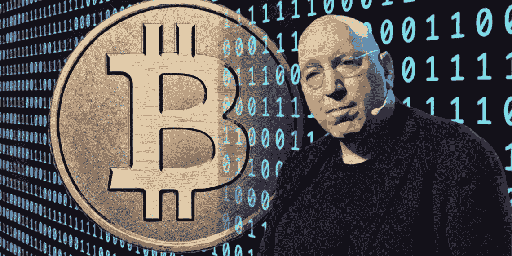

# 嗯，还没到“冬天”呢！

> 原文：<https://medium.com/hackernoon/well-its-still-not-winter-yet-fe673253e942>

## 供稿:杰弗里·韦尼克[凯文·刘](https://www.linkedin.com/in/kevin-liu-bumo/)

上周，我把我关于代币经济学的文章([这里是链接](https://hackernoon.com/token-economics-1-why-do-we-need-token-economics-2c0006098aea))分享给了杰弗里·韦尼克(是的，就是那个杰弗里，比特币的早期投资者和铁杆信徒，也是优步和 Airbnb 的早期投资者)，他回复说他有很多评论，所以我们就在刚才接到了一个电话。

Jeffrey 似乎对我为加密和区块链行业描述的“冬天”这个词不太满意，由于他的坦率，以下是我们谈话的一些要点。

1.杰弗里曾评论说，实际上这只是秋天，而不是六个月前的冬天，那里仍然有这么多狗屎硬币，更严重的还在后面。

2.项目不应该指责市场条件是独立于它们的外生事件。正是屎币的泛滥，以及有意制造的炒作和虚假的预期，制造了泡沫。以及相对于预期的表现不足，这让人们感到压抑，并造成了萧条。当前的市场是对太多废话的承认。

3.因为所有这些所谓的效用令牌，他们实际上与他们的业务无关，没有任何效用从其中发挥出来或应用于他们的业务，其社区充满了投机者，而不是实际用户。生态系统回报的唯一效用是象征性的投机和象征性价格的快速升值，这是不可持续和脆弱的。以这种方式建立市场是可怕的。

4.对于这些 shitcoin 项目，Jeffrey 建议，他们应该停止搞乱他们的资金，停止支付做市商，并归还他们剩下的任何东西，而不是花一次又一次的劣币，或者他们应该纯粹地投资他们的项目，专注于他们的平台和产品，取得一些真正的进展，以向人们展示他们真的在朝着他们的承诺努力。交易所应该更积极地让屎币退市。

5.在美国的大萧条时期，也就是 20 世纪 20 年代末到二战期间，生产力有了很大的提高。生意越做越好，效率越来越高。没有关于熊市的借口。

6.代币经济学真的可以帮助一个项目。Jeffrey 提到了一个游戏项目，他帮助设计了它的经济模型，结果在第一天就吸引了超过 10 万用户。但是我们没有看到很多项目有明确的经济设计或计划。

嗯，我完全同意他的观点，实际上，如果一个项目希望避免成为一个狗屎项目，他们首先应该考虑的是象征经济学。我们的目标是系统地整理出一个项目的框架，并思考在设计一个令人信服的经济模型时他们应该注意什么。当然，关键是实用令牌应该在 DApps 中有一些真正的“用途”。基于我们的大生态系统设计，如果代币能够为 DApps 及其用户提供实际价值，其内在价值将为代币在交易所的价格提供支撑，并推动正价值循环。

代币经济学，实际上不是一个新的想法，也不是那么花哨，但它可能是一个项目中最复杂和最有价值的部分，它结合了金融建模，制度经济学，博弈论的知识和实践，以及最重要的，对人性的考虑。我们希望作为一个总部设在区块链的组织——分散自治公司(DAC ),利用来自多学科背景和专业知识的人进行合作，就像圣达菲研究所的工作方式一样。现在我们有来自中国(代币经济实践联盟)、日本、加拿大和美国的贡献者。

最后但同样重要的是，这是一个快速变化的行业，保持学习和专注！