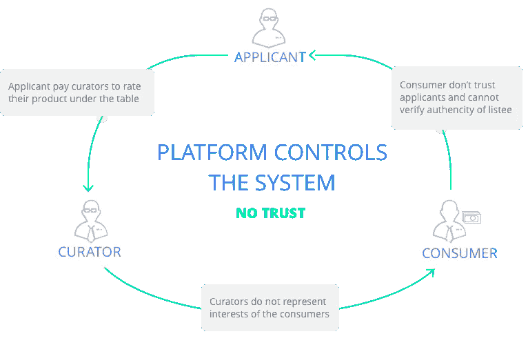

# 什么是令牌管理的注册中心和分散列表？

> 原文：<https://medium.com/hackernoon/what-are-token-curated-registries-and-decentralized-lists-d33fa42ba167>

2017 年，德威治的小屋在短短几个月内成为猫途鹰在伦敦的顶级餐厅。

有趣的是，这家餐馆从未真正存在过，直到它成为第一家。

发生了什么事？

Courtesy of Vice

Shed 的创始人 Oobah Butler 设法在 6 个月内将他的假餐厅的排名从#18，000 提高到#1，所有这些[没有提供任何一道菜](https://www.vice.com/en_in/article/434gqw/i-made-my-shed-the-top-rated-restaurant-on-tripadvisor)。

德威治的小屋是如何骗过猫途鹰的？

**付费的虚假评论和在线存在。**

因为猫途鹰根据社区评论对餐厅进行排名，Oobah 付钱给虚假用户来对平台上的棚子进行评级，同时不断拒绝潜在客户的预订。

最精彩的是，他给自己的右脚拍了照，把它伪装成火腿肉，并在开幕当晚为客户提供冷冻晚餐，包括一杯汤和微波炉烤宽面条。

Ham Hock by the Shed at Dulwich

这个故事既令人难以置信又令人捧腹，很好地指出了在线策划名单的问题。但是虚假评论的问题并不仅限于酒店行业:它在整个互联网上都很普遍。

# 猫途鹰是一个集中的列表

在线列表是有缺陷的。

虽然 Oobah Butler 的实验很搞笑，但它将互联网上被操纵的列表、声誉和排名系统置于聚光灯下。

在 Booking.com、Yelp 甚至谷歌地图这样的评论网站上，名单上的消费者——那些依靠第三方用户评论来做出明智决定的人——没有办法证明评论是否真实。

它引入了一系列问题:

> 点评人是餐厅付钱留率的吗？
> 
> 餐厅付费给平台是为了增加排名吗？
> 
> 平台是不是把一家正品餐厅从排名中去掉了？
> 
> 平台有没有编辑或删除用户评论？
> 
> 费率是怎么定的？它反映了我的兴趣吗？

在集中式平台下，消费者永远无法真正了解策展是否反映了现实世界的体验，或者策展有多大程度的偏差。

# 集中式列表的问题是

如果我们解构一个集中的列表，例如，一个餐馆的排名，在监管过程中有四个利益相关者:

*   **消费者**，他想要访问高质量的策划列表，并希望根据该列表做出明智的决定。
*   **想要加入名单的餐馆或申请人**。
*   **餐厅评论者，或馆长**，希望分享他的知识，并从他的评论中获得社会或金融资本。
*   **平台**设计、维护和执行策划列表及其排名机制。

Platforms have authority over a list

在集中式方案中，该平台控制整个生态系统，因为它可以通过各种方式决定固化过程的结果:

*   排名机制的调整，
*   对餐馆实施“高收费”计划
*   审查用户生成的评论和评级
*   删除或添加餐馆

更糟糕的是，由于平台运营商是一个单点故障，一个协调良好的黑客可以检索关键的用户信息，包括他们的身份或现实世界的行为。

分散列表的目的是在这四个利益相关方之间建立更公平、更平衡的关系，以便生成一个每个人都可以放心访问的高质量列表。

# 我们如何分散一个列表？

说到去中心化，区块链已经成为热门和被炒作的技术。随着比特币和以太坊在某种程度上分散了资金和应用，许多代币模型正在试图重新洗牌我们彼此之间以及与互联网之间的交互方式。

就分散名单而言，挑战在于减少名单所有人的权力和影响，并更好地利用对利益攸关方的经济激励。

**首先**，因为这样的列表托管在区块链上，代码库仍然是开源的，这意味着任何人都可以仔细检查应用程序。退出监管过程中的不透明性，因为分散列表允许任何人理解选择和排名过程。

**第二**，策展人通过投票系统集体决定名单成员是否应该进入或留在名单中。在这里，策展人必须持有该名单独有的数字令牌，并将它们标在名单成员的背后。例如，策展人可以用代币支持他/她喜欢并希望在名单上看到的餐馆。

**最后**，策展人在一个游戏中的皮肤系统中运作，既降低了恶意评论的风险，又增加了它们的价值。因此，当策展人对名单申请进行投票时，他们会对名单成员投赞成票或反对票，赢的一方会得到输的一方的一大部分股份。

与集中列表不同，策展人在这个过程中有得有失。

> "集中化的名单由社会资本管理，分散化的名单由社会和金融资本管理."

我们是愿意去一家有十个免费发表的五星评论的餐厅，还是愿意去十个有金钱赌注支持的五星评论的餐厅？

# 什么是令牌管理的注册中心？

令牌管理的注册表(TCR)是一个输出分散列表的加密系统。由 Mike Goldin 在 2017 年的 [TCR 白皮书 1.0](/@ilovebagels/token-curated-registries-1-0-61a232f8dac7) 中首次介绍，TCR 仍处于起步阶段，只有少数项目在开发它们。

它们利用 TCR 独有的固有数字令牌，根据持有和下注的令牌数量，向令牌持有者分配监管和治理权限。

“令牌管理的注册中心是分散管理的列表，具有内在的经济激励，让令牌持有者明智地管理列表的内容。”迈克·戈尔丁

与集中式列表类似，TCR 召集四个利益相关方来管理一个列表:

*   **消费者**，他们希望获得高质量、公平的名单
*   **申请人**，谁想成为名单的一部分
*   **策展人**，他们希望代币升值
*   **开发者**，他们想要创建一个分散的平台并从中获利

监管过程只涉及前三个用户，因为开发人员参与加密网络的创建是一个有争议的挑战，这不仅适用于令牌监管的注册中心，而且适用于作为一个整体的每个分布式应用程序。

前三个利益相关者之间的激励游戏，如果设计得好，会让每个人都围绕高质量列表的监管。

我们已经知道，消费者想要精选的列表，而列表用户想要加入这些列表来激发消费者的兴趣。

管理员管理列表，因为他们是令牌持有者，所以处于 TCR 系统的中心。因此，策展人寻求财务增长，这是由代币需求的增加引发的。然而，如果需求疲软，代币持有者将不会有动力继续管理。他们可以通过确保申请不断流入并引发成为策展人或增加个人策展治理影响力的兴趣来加强令牌的需求。

换句话说，如果列表质量很高:

1.  消费者将根据这份名单做出决定
2.  吸引了被列入名单的人来申请，也吸引了管理者来增加他们的投票权，
3.  这最终推高了代币的价值。

由于代币持有者在管理名单方面做得更好，这直接影响了他们的财务状况。

# TCR 应用和挑战

在二进制 TCR 中，只有两个选项:上市或不上市。到目前为止，有两个主要的 TCR 功能:一个是“申请”,用于将参与者列在 TCR 上，另一个是“质询”,用于将列表从 TCR 中删除。

在申请过程中，被列名者必须向 TCR smart contract 支付统一的申请费，以启动投票流程。

一旦收到申请(费用以 TCR 代币支付)，策展人投票并以代币决定申请人是否能进入名单。

*   如果*申请被接受*，被列表人进入列表。获胜一方的策展人将获得一大笔申请费，其余费用将被存入奖金池，奖励给未来成功的挑战者。
*   如果*申请被拒绝*，被列表人不进入列表。一部分费用退还给申请人，剩余部分分配给胜诉方(拒绝申请的一方)的策展人

馆长可以随时挑战名单上的申请人，方法是下注与申请人的奖金池(如果在名单上)或申请费(如果申请在名单上)相同数量的代币。

*   如果*挑战成功*，被列表者将被移除。获胜一方的挑战者和策展人将获得被聆听者的奖金。
*   如果*挑战被拒绝*，被列表者将保留在列表中。挑战者输给了获胜的一方。

要深入了解 TCR 的功能和参数，没有比 Mike Goldin 发布的原始 TCR 白皮书更好的起点了。

# TCR 设计和创新

TCR 本质上不必是二进制的。围绕更复杂的 TCRs 设计模式已经有了多个概念验证。

## 有序 TCR

有序 TCR 在列表中创建一个索引，该索引可用于对列表进行排序。与其让列表对象处于同一级别，不如对它们进行排序，这样可以帮助消费者区分列表对象，并最终做出更明智的决定。

好餐馆的列表变成了最佳餐馆的排名。

## 分层 TCR

向 TCR 添加层向分散列表引入了联盟的概念。参与者必须在多个列表中申请并获得批准，才能访问最后一个最具选择性的 TCR。与体育联盟类似，根据策展市场对申请的判断，被列入名单的人会被移到更高或更低的联盟。

*好餐厅列表变成好、非常好、优秀餐厅列表。*

## 嵌套 TCR

构建 TCR 的 TCR 使用户能够在主 TCR 中生成自己的 TCR。一旦被收录者访问了第一级 TCR，他们就可以访问第二级 TCR。嵌套式 TCR 在生态系统中引入了二级(甚至更高级)监管市场。

*一个好餐馆列表变成了一个嵌套列表的好餐馆列表，比如好的日本餐馆或者南美的好的街头小吃摊。*

## 可投资 TCR

如果 TCR 持有构成基金投资组合的资产列表，引入第二个令牌(除了治理令牌之外)可以使用户获得投资池，该池由 TCR 自动重新平衡。

*一个好餐馆列表变成了一个好餐馆列表，所有餐馆的令牌化权益捆绑在单个投资令牌中。*

如需更多资源，请查看 Matt Lockyer 的 [TCR 设计模式](https://hackernoon.com/token-curated-registry-tcr-design-patterns-4de6d18efa15)

# 一些 TCR 项目

由于 TCR 尚未侵入互联网，在时机到来之前，如果这项技术看起来有吸引力，下面是一些令人兴奋的项目:

## [**AdToken**](https://metax.io/en/adtoken/)

在 TCR 先锋的带领下，广告链专注于为数字广告生态系统带来透明度。该注册表列出了最适合在线广告的值得信赖的域名，并打击了在线广告活动中的欺诈行为。

## [**医学学分**](https://medcredits.io/)

登记处汇编医生的证书，以确保他们适合执业。除了规范医疗从业者行业，Medcredit 还促进了全球市场的发展，在这个市场中，患者可以直接与医生联系

## [**信任**](https://www.trustory.io/)

数字媒体一直受到假新闻泛滥的困扰，TruStory 通过专注于索赔验证的社交网络和监管市场解决了这一问题。该注册机构识别准确的信息，驳斥不准确的故事，以解决互联网上最令人紧张的问题之一。最激动人心的案例研究之一。

## [**Tropyc**](http://tropyc.co)

*免责声明:自我宣传。*加密货币初级市场受到欺诈项目的困扰，因为任何人都可以在几个小时内建立一个令牌并将其商业化。加上缺乏适当的法规执行，tropyc 打算在一级市场和其他市场策划诚信的象征性项目。

# 包扎

TCR 是由金融激励的市场而非单一实体策划的。从理论上讲，这一结果比集中列表更有价值，因为集中列表容易被篡改和审查。

尽管这一概念在 2017 年首次推出，[固化市场仍处于试验阶段](/@simondlr/desire-paths-markets-for-recommendation-e701aa835013)，因为开发和引导简单的二元 TCR 仍然非常复杂。

在我们的日常生活中，清单无处不在:从购物清单到资产组合，甚至是音乐播放列表。用例是无限的、灵活的，绝对令人兴奋。我们刚刚发现了冰山一角！

我在推特上！