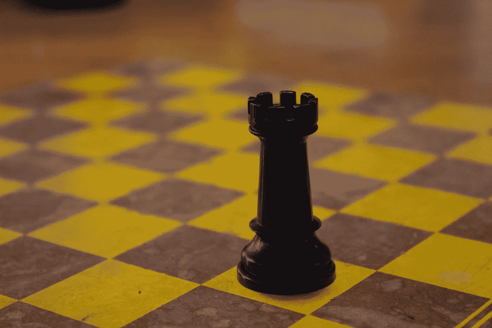

# 你在优化什么？机器学习的一课

> 原文：<https://medium.com/hackernoon/what-are-you-optimizing-for-a-lesson-from-machine-learning-2070cc33dca>

Photo by [Benjamin Smith](https://unsplash.com/photos/IpWzUTLvOzQ?utm_source=unsplash&utm_medium=referral&utm_content=creditCopyText) on [Unsplash](https://unsplash.com/search/photos/chess?utm_source=unsplash&utm_medium=referral&utm_content=creditCopyText)

关于机器学习，我只学到了很少的东西；只够在引擎盖下建造一些非常基本的东西。当我学习一些基本的概念和方法时，一些事情真的引起了我大脑的共鸣——它们是如何适用于，嗯，一切。

当你把一个问题转化成代码时，你就不得不明确地表达一些你本来可能不会表达的东西。具体来说，你必须明确你希望优化什么。与初创公司合作本质上是一个你试图优化什么的问题。作为投资者，这包括投资组合的构建和分配。作为一名创始人，这包括管理你的产品，你如何衡量成功，以及你在与客户打交道时必须面对的所有无休止的权衡。

# 培训目标

在围棋上击败职业人类被认为是人工智能的一个里程碑，因为与国际象棋等游戏相比，围棋有许多可能性来评估给定的棋步。但在 2016 年，AlphaGo(由谷歌开发)战胜了 18 次世界冠军李·塞多尔(Lee Sedol)，赢得了五局中的四局。有趣的是，AlphaGo 做出了在大多数人类棋手看来是错误的棋步。在 2017 年与排名第一的选手的一场比赛中，AlphaGo 有一步棋尤其被批评为错误，当时计算机放弃了看似明显的优势，而这一优势可能会导致大幅度的胜利。曾花时间研究 AlphaGo 的人工智能研究员安德烈·卡帕西(Andrej Karpathy)后来对这场比赛发表了评论:

这说明了一个临界点。并不是桌子周围的每个人都一直在为同样的结果而优化。我在紧张的董事会讨论中，这一事实变得非常突出。我试图从消化这一点中吸取的教训是问自己，“我在优化什么？”一旦我对这个问题有了一个合适的、连贯的答案，继续问“我周围的人在优化什么？”

在某种程度上，这是任何人类心理学书籍都会推荐的常识(例如，你必须了解你的客户需要什么)。但那些安德烈·卡帕西的推文继续浮现在我的脑海中——尤其是在我发现其行为令人困惑的人周围，或者当我对投资组合公司发生的事情有特别强烈的直觉反应时。

需要注意的一点是:这些不同的结果不一定是对立的，也不完全一致。这些可能是最难调试的。例如，想象两个联合创始人使用不同的标准来衡量成功。两位创始人可能都在试图建立一家公司，但如果一个人认为用户增长是最重要的指标，而另一个人认为 ACV 是最重要的，那么他们在采用什么策略上就会有不同的意见。

通常，令人尴尬的是，我意识到我在为我的自我优化。当我在自己身上注意到这一点时，我也开始在别人身上注意到这一点。不言而喻，这是不好看的。所以，当我感觉情况变得不协调时，我努力找出原因… *我在优化什么？这里的其他人在优化什么呢？*