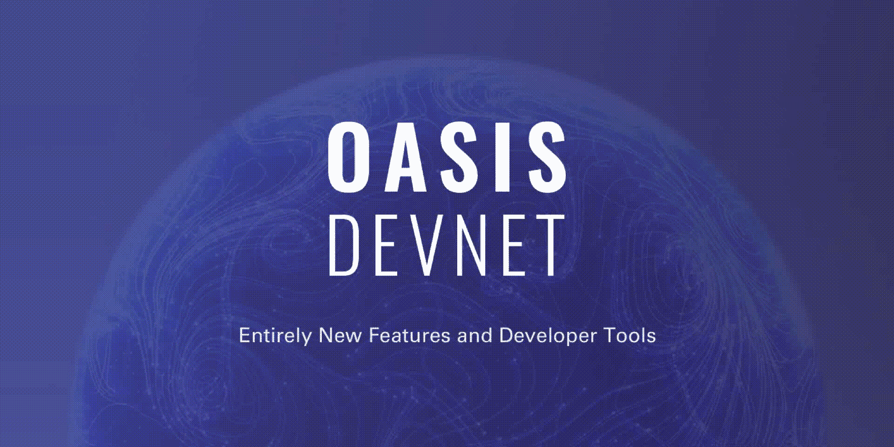

# 数据隐私对区块链的未来意味着什么

> 原文：<https://medium.com/hackernoon/what-data-privacy-means-for-the-future-of-blockchain-c0212cd16680>


# 数据分析和区块链

数据分析和机器学习具有巨大的价值，可以提供见解并推动包括物联网、医疗保健和金融服务在内的许多行业的进步。

> 今天的区块链平台不能直接支持计算敏感数据的应用程序。

不幸的是，推动这些进步的数据往往高度敏感。例如，医学研究需要访问敏感的患者数据。在许多情况下，由于隐私问题，这些数据不能被访问或共享。这导致了数据孤岛，其中的数据没有充分发挥其潜在价值。

区块链可以帮助解决这个问题，尽管仍然存在几个挑战。例如，人们希望使用智能合同来允许研究人员对敏感数据运行机器学习，而不会将数据透露给研究人员。这是许多令人兴奋的新区块链应用背后的前提，包括数据市场和分散式对冲基金。

不幸的是，今天的区块链平台不能直接支持计算敏感数据的应用。正如我们在[之前的博客文章](/oasislabs/demystifying-the-security-of-blockchains-7e9d8981a87)中所讨论的，现有的区块链如以太坊公开存储所有数据和状态，这可能允许网络的任何用户窃取数据。

Oasis 平台通过使用[安全飞地](/oasislabs/towards-an-open-source-secure-enclave-659ac27b871a)和加密技术为智能合同执行提供保密性。简而言之，机密性可以确保当智能合同在数据上运行时，敏感数据不会被查看或窃取。

保密性是保护隐私的一项基本要求，这在当今的智能合约平台中是缺失的。然而，仅仅保护计算过程是不够的:必须额外小心以确保计算的*输出*不会泄漏敏感信息。

# 数据分析的隐私风险

数据分析和机器学习的结果通常会透露比预期更多的信息，这可能导致隐私侵犯。例如，假设一家公司每月发布其员工的平均工资。

```
**Month     Average Salary**
January   $73,568
February  $74,872
```

我们的直觉可能会告诉我们，统计结果(如平均值)并不能揭示个人的信息。这是不正确的。假设您知道该公司在 1 月份有 58 名员工，并且该公司在 1 月和 2 月之间的唯一人事变动是雇用了您的朋友 Bob。根据综合信息，我们可以确定 Bob 的确切工资:150，504 美元。

这个简单的例子演示了任何敏感数据统计查询所固有的一个问题:这种查询的结果通常会泄露敏感信息——即使该信息没有直接包含在输出中(例如 Bob 的工资)。这可能是偶然发生的，通常以非直觉的方式发生，并且不需要研究人员有意试图了解私人信息。

最近的工作表明，机器学习模型也可能泄露信息。例如，Oasis 团队成员合著的一篇[近期论文](https://arxiv.org/abs/1802.08232)演示了如何从基于用户数据训练的深度学习模型中提取信用卡号码等私人信息。更令人担忧的是，这种泄漏发生在许多不同类型的模型、参数和训练策略中。

# 匿名化不是解决方案

保护个人隐私最常见的方法是在发布数据之前*匿名化*数据。这种方法基于这样的假设:如果数据不包含关于个人的识别信息(姓名、地址等)。)放生应该是安全的。

> 保护隐私的传统方法是不够的。

不幸的是，使用所谓的*重新识别攻击*，个人经常可以在匿名化的数据集中被识别。例如，2009 年，网飞发布了一个匿名客户电影评论数据集，用于训练更好的推荐算法的比赛。研究人员[展示了](https://ieeexplore.ieee.org/document/4531148/)如何将匿名评论与互联网电影数据库中的数据联系起来，并能够重新识别大量网飞客户。基于这一结果，网飞被联邦贸易委员会禁止发起第二轮竞争。

还有许多其他匿名数据被用来识别特定个人的例子，包括[搜索日志](https://en.wikipedia.org/wiki/AOL_search_data_leak)和[出租车行程](https://tech.vijayp.ca/of-taxis-and-rainbows-f6bc289679a1)。事实上，最近的一项研究发现，美国 87%的人口可以通过他们的邮政编码、性别和出生日期被唯一地识别出来。

这些结果表明，保护隐私的传统方法是不够的。我们需要一种全新的方法来抵御这些和其他攻击。

# 差异隐私:一种正式的隐私保证

[差分隐私](https://link.springer.com/chapter/10.1007/11681878_14)是隐私的正式定义。非正式地说，它规定无论分析中是否包括任何个人，计算的结果必须是相似的。换句话说，差分隐私保证了查看输出时*无法确定*是否有任何个人出现在数据中——更不用说了解他们的实际信息了。

差分隐私有几个可取的属性。首先，它没有对可用的辅助信息做出任何假设，因此它对上述所有攻击都是免疫的。此外，虽然该定义阻止了关于个体的信息被学习，但它仍然允许关于数据中的群体的许多学习，这正是大多数数据分析和机器学习问题的目标。

不幸的是，差别隐私仅仅是*隐私含义的一个定义；它没有告诉我们*如何*实现这个属性。过去几年来，我们研究的一个主要目标是开发算法和工具，以针对数据分析和机器学习等现实世界的问题实施差异隐私(和其他隐私保护技术)。*

[](http://docs.oasiscloud.io)

在之前的工作中，我们开发了 [Chorus](https://arxiv.org/abs/1809.07750) ，这是一个用于隐私保护数据分析的模块化框架。Chorus 通过几种最先进的算法，自动实施通用数据分析的差分隐私。Chorus 已经开源发布，目前[部署在优步](/uber-security-privacy/differential-privacy-open-source-7892c82c42b6)为其分析师提供隐私保护分析。此外，我们正在与 Winton Group 的数据分析师进行试点，使用 Chorus 从位置和购物数据中[预测市场趋势](https://www.winton.com/research/using-differential-privacy-to-protect-personal-data)，同时保护个人隐私。

我们的研究还专注于保护隐私的机器学习，我们的工作已经产生了实用的新解决方案，以加强机器学习任务的差异隐私。我们将在顶级安全会议 IEEE Security & Privacy 2019 上展示这些技术之一，[近似最小值扰动](https://www.computer.org/csdl/proceedings/sp/2019/6660/00/666000a001.pdf)。

我们将在未来的博客文章中分享这项工作的更多技术细节。

# Oasis 中智能合约的隐私原语

在绿洲实验室，我们正在区块链建立一个隐私第一的云计算新平台。我们的使命是开创安全计算的下一个时代，并实现新一波隐私优先的应用。这需要一个自顶向下的解决方案:除了在平台级别提供数据机密性，Oasis 还将在应用程序级别提供内置的隐私原语。

我们目前正在开发一套库，以使开发人员能够建立隐私优先的智能合同，包括数据分析和机器学习。这些库是根据我们在这一领域的丰富经验构建的，将包括上述隐私保护技术以及许多新技术。

这些库将为开发人员提供一系列保护隐私的构建模块，如差分隐私。开发人员可以使用这些构建模块来开发设计为保护隐私的智能合约，而不需要开发人员是安全专家。这使得编写以安全方式访问敏感数据的应用程序变得容易，同时向用户保证他们的数据不会被滥用。



我们期待着很快分享更多关于这项工作的公告。如果您对使用这些库构建应用程序感兴趣，我们鼓励您申请查看 [Oasis Devnet](http://docs.oasiscloud.io) 。

## 资源:

*   [绿洲发展网](https://docs.oasiscloud.io/)
*   [非技术入门](https://www.oasislabs.com/primer/)
*   [视频教程](https://www.youtube.com/channel/UC35UFPcZ2F1wjPxhPrSsESQ)
*   [关于 Rust 智能合同的 Oasis 文档](https://docs.oasiscloud.io/en/latest/rust-contract-tutorial/)

*有关 Oasis Labs 的更多信息，请联系我们 info@oasislabs.com 分公司。*