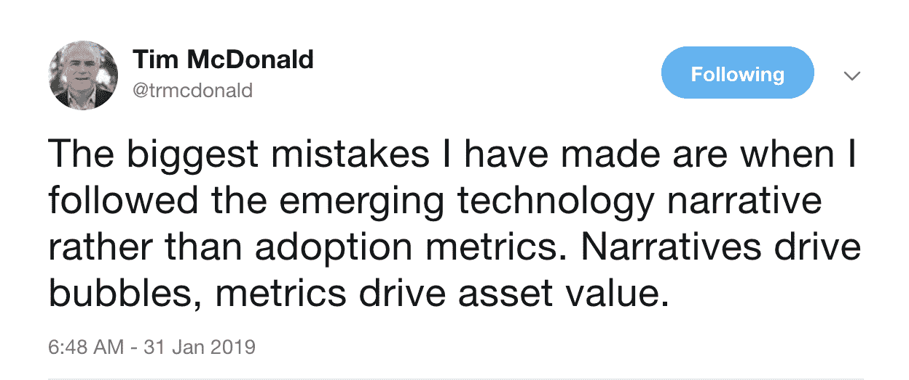

# 本周密码市场发生了什么？

> 原文：<https://medium.com/hackernoon/what-happened-this-week-in-the-crypto-markets-2dfdfba177fd>

## **“这是我们的两只小智”——一位温和的美联储强化了比特币的价值主张**

## 美联储眨眼了

在经历了 87 年来最糟糕的 12 月后，股市在 1 月份以惊人的方式反弹，标准普尔 500 指数上周上涨 2.0%，1 月份收盘时比年末收盘水平高出 8%。自从 12 月 24 日的低点以来，在[姆努钦打电话给银行](https://www.zerohedge.com/news/2019-01-30/eod)以迫使他们安心之后，股市现在已经上涨了 16%。过去我们已经多次强调了股票市场和加密市场之间缺乏相关性，因此股票回报本身对于加密作为一种资产类别并不重要。重要的是 ***为什么会出现*** 这种反弹。美联储彻底改变了政策，忽略了通常推动动机的强劲就业数据和通胀数据，而是纯粹关注股市回报和情绪。正如我们在 Ikigai 的朋友上周所说，“现在的鸽派美联储非常适合风险资产，并证实了央行不负责任的观点，从而强化了比特币的原始价值主张。”我们再次提醒所有投资者，即使是那些认为数字资产无关紧要的投资者，也要记住[为什么比特币和其他加密货币会首先存在](/@omid.malekan/the-original-crypto-bull-thesis-revisited-reinvigorated-76ac83c44ad9)。你只能把某样东西推到最后破裂为止。

**股票市场如此脆弱，那么加密呢？**

与此同时，加密市场上周基本没有变化，但 1 月份仍连续第六个月表现为负，这是有史以来最长的一次。

比特币最大的提款

来源:[方舟投资](https://twitter.com/TuurDemeester/status/1091311464244305920)

虽然从历史上看，2 月份是加密价格非常好的月份，但似乎没有足够的有形数据来让这个市场大幅上涨或下跌。[上周，我们甚至强调了](/arca/thats-our-two-satoshis-when-bad-news-is-already-priced-in-d36e36610320)crypto 即将发布的所有积极消息，但事实是，这些事件今天都没有真正发生。所有的积极因素都很重要，但仍具有高度的猜测性和前瞻性。除非我们看到一些实际的东西来支持所有伟大的公告和基础设施投资，否则这个市场不太可能大幅上涨。即使某些协议和项目带来了积极的结果或成果，代币价格的上涨也往往是短暂的，因为估值的上升无法持续。作为长期[技术](https://hackernoon.com/tagged/technology)投资者，蒂姆·麦克唐纳[本周](https://twitter.com/trmcdonald/status/1090970119898128385)明智地声明:

秘密叙事仍然很强，但采用仍然很弱。

## 泡沫与采用

所以这让我们陷入了僵局。我们拥有一项毫无疑问很有前途的技术，加上对整个生态系统的重大投资，强化了数字总账技术(DLT)在金融服务及其他领域的未来作用。然而，今天的数字资产价格并不一定反映这种未来。很明显，投资者现在要求这些基础设施投资在资产类别进一步增长之前开始结出果实。这需要时间。丹尼尔·海曼(Daniel Heyman)，一位在 Consensys 从事以太坊项目的开发人员，[说得好](https://hackernoon.com/why-blockchain-differs-from-traditional-technology-life-cycles-95f0deabdf85)(转述):

*在许多方面，安装阶段的狂热所产生的泡沫使新技术有可能取得成功。泡沫催生了对新技术基础设施(铁路、运河、光缆等)的(过度)投资。).这种基础设施使技术在泡沫破裂后成功部署成为可能。这些泡沫还鼓励了大量新商业模式和新技术的实验，让未来的企业家能够遵循成熟的路径，避免常见的陷阱。虽然泡沫造成了大量的财务损失和经济痛苦，但它对新技术的采用至关重要。*

*【in crypto】泡沫来得早，因为***技术在其生命周期中更早地实现了流动性。更多的泡沫可能会出现。**

**虽然没有“好泡沫”，但泡沫可以有好的副作用。在运河热和铁路热期间，运河和铁路的修建几乎没有盈利的希望。投资者亏了钱，但泡沫过后，这些运河和铁路还在。这种新的基础设施使得未来的努力更加便宜和容易。2001 年互联网泡沫破裂后，光缆的售价很低。投资者做得很糟糕，但光纤基础设施为消费者创造了价值，并使下一代公司的建立成为可能。这种对基础设施的过度投资通常是成功部署新技术所必需的。**

*这一分析表明，短期内加密的最佳情况可能是更具投机性的泡沫，最终将像以往所有泡沫一样崩溃。在此期间，许多投资最终将化为乌有，但创建的每个构件最终将为那些在后续阶段仍然相关的公司/项目/协议/用户增加价值。不同的投资策略将以不同的方式利用这一点……量化基金将利用波动性上升的优势，风险投资基金将耐心等待周期结束，而流动性策略将适应最有利可图的情况。这是为什么积极管理在今天和未来对加密很重要的一个关键理由，因为基金经理提供了在这些泡沫和崩溃中导航的能力，以发现价值最终将在哪里积累。*

# *著名的行动者和震撼者*

*动荡的一周让大多数代币周环比基本保持不变。那些跑赢大盘的通常是由未来通过增强来增加采用的消息引起的，这些增强即使不是几年也是几个月以后的事情。*

*   *NEM (XEM)托肯在 NEM 基金会裁员后，上周股价下跌了 26%。据基金会称，该组织濒临破产，正在做最后的努力，出售一些代币以维持运营。*
*   *auger(REP)仍能感受到两周前推出的 Veil 的积极影响，周环比上涨 11%。用户体验是主流加密采用的主要障碍之一，Veil 试图为 Augur、0x 和其他以太坊 dapps 解决这个问题。*
*   *Ripple (XRP)周四公布了 14%的隔夜涨幅，此前国际货币基金组织总裁克里斯蒂娜·拉加德的视频片段在网上疯传，她提到 Ripple 是“将真正改变中介行为方式的新技术”之一。虽然是推测性的，但来自国际货币基金组织等组织对区块链技术的积极支持对这个狭小的加密世界来说是巨大的。*
*   *Litecoin (LTC)在本周早些时候与市场的大多数股票一起抛售后，本周上涨了 1%。[创始人查理·李的推文](https://twitter.com/SatoshiLite/status/1089935081337085952)、[即将推出的大宗交易减半](https://www.newsbtc.com/2019/02/02/analyst-upcoming-litecoin-halving-could-ultimately-send-ltc-surging/)以及[看涨的技术分析](https://ambcrypto.com/litecoin-ltc-technical-analysis-bullish-momentum-stall-as-token-recovers-slowly/)都促成了代币强劲的一周。*

# *我们这周在读什么*

*[为什么加密需要机构](https://hackernoon.com/why-crypto-needs-institutions-f089410e2506)*

*亚稳态加密基金的 Haseeb Qureshi 写了这篇文章，谈到了加密领域的一个核心辩论:机构的作用。在一个为去中心化和将大玩家赶下台而敲打桌子的空间里，我们忘记了集中式机构的兴起推动了人类历史的大部分进步，也忘记了这些新创建的去中心化机构是加密的基础。*

*[Kik 公开反对 SEC 可能的执法行动](https://www.coindesk.com/chat-app-kik-says-it-will-fight-sec-over-possible-ico-action)*

*上周，即时通讯应用 Kik 公开表示，他们将反对美国证券交易委员会对他们 2017 年 ICO 采取的任何执法行动，当时他们筹集了超过 1 亿美元。Kik 上个月收到了威尔斯的通知，他们公开回应了这个通知。虽然 Kik 寻求在法庭上为自己辩护而不是和解是件好事，但发表他们的反驳是邀请世界批评你的辩护的一种简单方式。我们自己的首席法律官 Phil Liu 认为 Kik 不太可能获胜，因为对 Kin(他们的令牌)不是证券的每一个论点都有反驳。*

**

*[密码的反基本情况](https://caspian.tech/blog/why-high-frequency-traders-are-turning-to-crypto/)*

*根据交易平台里海，下一波密码交易者将是高频交易者(HFT)。加密的碎片化和不稳定性为高频交易提供了利用市场上常见的价格差异的机会。此外，交易所已经开始为这些 HFT 策略提供工具。尽管 algo 策略有可能在密码领域取得巨大成功，但随着市场的发展、利差的收紧和交易所的整合，这种策略可能会昙花一现。*

*[在集中式实体中建立信任](https://www.coindesk.com/crypto-startup-wants-you-to-trade-on-exchanges-without-trusting-them)*

*波士顿的一家加密初创公司阿尔温本周发布了一个阿尔温协议测试网。该协议旨在允许集中交易所的交易者在不提供交易所访问其私钥的情况下进行交易，本质上是让交易者保管他们的令牌。首先，该协议将通过库币交易所提供测试版，预计将在 Q2 推出。阿尔温是我们在加密领域看到的众多优秀解决方案中的一个例子，这些解决方案是对现有基础设施的补充。*

*[当银行家痛击比特币](https://www.investmentweek.co.uk/investment-week/news/3070124/allianz-gi-ceo-cryptoassets-more-suited-to-criminal-underworld-than-investors)*

*安联全球投资公司(Allianz Global Investors)首席执行官安德烈亚斯·乌特曼(Andreas Utermann)本周发表的评论可能激怒了一些人，包括加密货币“完全不适合投资”，而且“看起来像是犯罪黑社会虚构出来的、最有用的东西”。抛开这些评论的动机(crypto 和区块链毕竟准备颠覆像安联这样的企业)，乌特曼声称他的意图是指出加密货币需要比目前应用的更多的监管。*

*[斯威夫特与瑞波的比赛](https://cointelegraph.com/news/swift-ceo-reveals-plans-to-integrate-blockchain-consortium-r3s-corda-tech?utm)*

*SWIFT 首席执行官本周透露，该集团正与 Corda 区块链背后的公司 R3 合作，将他们的全球支付创新(GPI)链接网关集成到 Corda，用于支付转账和结算。随着 Ripple 等企业在跨境支付领域取得长足进展，SWIFT 在过去一年里做出了巨大努力，以进军区块链领域。尽管去年年底有传言称 SWIFT 与 Ripple 合作，但现在很明显这两家巨头将直接竞争。*

*[Crypto 之外的区块链进展](https://www.bloomberg.com/news/articles/2019-01-29/jpmorgan-says-blockchain-is-making-progress-outside-of-crypto)*

*摩根大通全球研究主席 Joyce Change 上周评论说，尽管加密货币的表现有所下降，但区块链技术取得成功的潜力正在不断增加。Chang 认为，采用将是缓慢的，主要集中在贸易融资领域，估计未来三到五年的实际影响。*

# *媒体和街头的阿卡*

*   *[《彭博》援引 Arca 的投资组合经理杰夫·多尔曼(Jeff Dorman](https://www.bloomberg.com/news/articles/2019-01-30/crypto-funds-morph-into-venture-capitalists-shunned-in-ico-boom) )本周对加密对冲基金如何“改变策略以利用当前市场条件”的报道。这个故事也被 [CoinTelegraph](https://cointelegraph.com/news/bloomberg-amid-bear-market-crypto-venture-fund-strategy-wins-out-over-hedge-fund-model) 和 [Finder](https://www.finder.com.au/cryptocurrency-is-down-so-why-are-sophisticated-investors-buying) 转载。*
*   *Arca 的分销主管大卫内奇(David Nage)上周在《论坛报街区》发表了一篇文章，讨论加密投资如何复兴了直到 2017 年还被认为已经死亡的基金的基金模式。*
*   *[上周，Enterprise Radio 主持了 Arca 首席执行官 Rayne Steinberg 的播客](https://enterprisepodcastnetwork.com/digital-finance-for-21st-century-investors/)，他在播客中讨论了传统金融和加密的未来，以及 Arca 如何弥合这些群体之间的差距。*
*   *首席执行官 Rayne Steinberg 也[发表了一篇关于全球趋势的文章](/arca/whats-truth-worth-7b93fc3cb34a)以及加密/区块链是这些趋势的解药。*
*   *如果你在旧金山湾区，就可以在 2 月 26 日由 Sheppard Mullin 主办的活动上见到 Arca 在区块链投资公司的 Jeff Dorman。*

****那是我们的两只聪！****

*感谢大家的阅读！问题或意见，请告诉我们。*

***Arca 投资组合管理团队***

*杰夫·多尔曼——投资组合经理*

*凯蒂·塔拉蒂——研究部主管*

*Hassan Bassiri —初级项目经理/分析师*

****免责声明:*** *本评论仅作为一般信息提供，绝不作为投资建议、投资研究、研究报告或建议。对本评论中讨论的证券进行投资或采取任何其他行动的任何决定可能涉及本文未讨论的风险，此类决定不应仅基于本文包含的信息。**

**本沟通中的陈述可能包括前瞻性信息和/或可能基于各种假设。此处表达的前瞻性陈述和其他观点或意见是在本出版物发布之日做出的。实际的未来结果或事件可能与预期的有很大不同，并且不能保证任何特定的结果会发生。本文中的陈述可能会随时更改。Arca Funds 不承担更新或修改此处表达的任何声明或观点的任何义务。**

**在考虑本注释中包含的任何绩效信息时，应注意过去的绩效并不能保证将来的结果，也不能保证将来的结果会实现。此处提供的部分或全部信息可能是或基于观点陈述。此外，此处提供的某些信息可能基于第三方来源，这些信息虽然被认为是准确的，但尚未经过独立验证。Arca 基金和/或其某些分支机构和/或客户持有并且将来可能持有与本评论中讨论的证券相同或基本相似的证券的财务权益。对于此类金融权益的盈利能力，无论是现在、过去还是将来，都不做任何声明，Arca 基金和/或其客户可以随时出售此类金融权益。此处提供的信息无意也不应被解释为出售或购买任何证券的要约。本注释未经任何监管机构审核或批准，且在编制时未考虑可能收到本注释的个人的财务状况或目标。特定投资或策略的适当性将取决于投资者的个人情况和目标。**