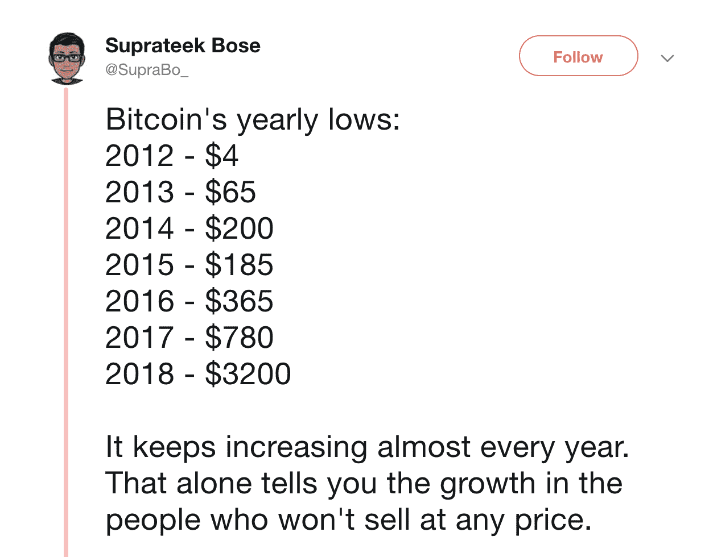

# “这是我们的两个聪”——以太坊的战斗口号

> 原文：<https://medium.com/hackernoon/what-happened-this-week-in-the-crypto-markets-fe9582500816>

# 本周密码市场发生了什么？

## 地狱 2018 再见— crypto 迎来了 2019 年的火热开局！

欢迎从长假中归来！距离我们上两次的 Satoshis 文章已经过去 3 周了，考虑到这些市场波动的速度和剧烈程度，这是一个永恒的秘密。作为参考，许多加密资产的价格自 12 月 14 日低点以来上涨了近 100%。如果你没有注意到这次上涨，我们原谅你，因为过去一个月异常的股票、信贷和大宗商品波动可能吸引了你的大部分注意力。但是这种相关性的缺乏正是每个人都需要关注 crypto 的原因。加密资产类别不会消失，尽管 2018 年结束时又是一个月的负回报(连续 5 个月)，但加密市场在年末反弹，这一反弹一直持续到 1 月份的第一周(上周上涨 9%)。

当我们不在假期写作的时候，我们当然在积极地管理我们的基金，建立我们的公司，睡觉/吃饭/呼吸所有秘密的东西。因此，在我们深入了解过去一周发生的事情之前，下面是过去几周的一些随机想法:

*   ***锲而不舍的加密投资者——***几乎所有与你交谈过的人都认为股票和信贷市场将继续走低。但是，绝大多数人/投资者要么不得不在他们的投资组合中持有股票和债务，要么就是没有足够谨慎地积极管理它们，以保证转向其他东西，即使预期回报不会很高。与此同时，绝对没有人必须拥有加密资产，然而新的投资者继续进入市场，尽管有大量的提款。这应该告诉你一些事情。
*   ***24/7 交易是净正吗？—*** 许多人称赞加密市场全天候开放和流动。但这真的是一件好事吗？让我们以平安夜为例。股票市场在半个交易日内下跌了 3%，如果它们继续开放，鉴于连续 4 天大幅下跌后的糟糕情绪，它们似乎会下跌 10%。但休市几天后，市场重新启动，当两天后重新开盘时，市场上涨了 5%，引发了持续到年底的反弹。与此同时，crypto 从未喘过气来(这对我们的家庭不利)，这可能会导致价格的大幅波动，这种波动往往会持续几天。没有“重置”能力，24/7 交易可能弊大于利。
*   ***风险资产还是避风港？—*** 尽管我们在过去的一年里详细讨论了加密和其他资产类别之间缺乏相关性的问题，但对于加密是一种风险资产，还是一种避风港(依我看，可能两者都是)，仍然没有定论。作为一种风险资产，加密技术 80%的市场跌幅是否预示着传统市场最近(以及即将)的低迷？或者，加密抛售仅仅是因为市场不成熟，我们可以期待它在衰退期间表现得更具防御性(像黄金一样)？我们来自 Ikigai 的朋友 Travis Kling】做了一个敏锐的观察:

## 那么为什么 crypto 会重整旗鼓，这种情况会持续下去吗？

毫无疑问，加密估值仍然很难确定。在对估值达成共识，并有足够长的历史来验证价格何时“便宜”或“昂贵”之前，crypto 将继续基于情绪、情感和大型潜在主题进行交易。这些潜在的主题之一是以太坊社区的战斗口号。虽然以太坊仍然是第二大代币，也可以说是除了比特币之外最知名的代币，但 2018 年的抛售在很大程度上可以归因于基于以太坊的结构不良和不明智的 ico，以及基础协议的可扩展性、速度和效率的整体缺乏。也就是说，以太坊仍然拥有最大的、资金最充足的领导者和开发者社区……他们终于受够了以太坊的抨击。

在过去的 4 周里，以太坊的支持者们站出来捍卫他们心爱的协议。这导致[之前看空的分析师们变得略微乐观](https://twitter.com/kylesamani/status/1071929542024015873?s=21)，像乔·卢宾[这样的以太坊领袖称底部](https://twitter.com/ethereumjoseph/status/1076171152526110721?lang=en)，更重要的是，[真实的硬数据](https://cryptodesknews.com/ethereum/makerdao/ethereum-eth-is-not-dying-consensys-reveals-numbers-behind-ethereum/)不仅抵消了死亡螺旋，还鼓励了投资。结果，ETH 从 85 美元左右的低点反弹至目前的 155 美元。虽然价格可能会继续波动，甚至可能在某个时候重新测试低点，但我们怀疑这种“协调防御”可能是未来成功的公式。其他公司/项目注意到了这一点，并在最近几周采取了攻势。我们看到了 Tron (TRX)、Waves(浪潮)、Neo (NEO)和许多其他公司发布的一系列协调一致、适时的新闻稿，这些新闻稿专门用来推高代币价格(也是最有效的)。在 2018 年的大屠杀之后，这种反应是可以预期的，因为许多这些公司和项目现在必须更加透明和积极，以培养对其令牌的兴趣。

正如我们在前几周指出的，crypto 正处于困境之中。这意味着，价格并不重要，损益百分比也不重要。重要的是决定哪些代币将在几年后存在，以及使用量的增长是否最终会增加代币的价值。对于那些符合这种描述的人来说，代币可能是 12 月 14 日低点的买入，它们可能仍然是从这里向上 100%的买入，即使我们重新测试低点，也可能是买入。

我们仍然处于早期，对于那些幸存下来的人来说，趋势几乎肯定会更高。

## 反思比特币十周年

因此，随着 2018 年的过去(以及随之而来的可怕的-75%至 85%的回报率)，让我们花一点时间来思考一下为什么我们首先要谈论加密。比特币上周满 10 岁了！虽然加密市场已经并将继续发展，不仅仅是比特币，但第一个比特币创世纪的周年纪念提醒我们[比特币不仅仅是“新钱”](https://twitter.com/hugohanoi/status/1081571741288132609?s=21)。事实上，[比特币事关自由](http://time.com/5486673/bitcoin-venezuela-authoritarian/)。

# 著名的行动者和震撼者

加密市场上周上涨了近 10%，虽然令牌之间的相关性仍然很高，但在真正的催化剂和公告之后，一些令牌的涨幅明显高于其他令牌，这是一个健康的迹象。

*   以太坊(ETH)继续领涨，在即将推出的 forks 和 Constantipole 升级之前，该股又上涨了 14%。比特币(BTC)的涨幅落后于这一走势，直到本周晚些时候，比特币突破 4000 美元，本周收涨 6%。
*   ChainLink(链接)上周上涨了 34%。虽然以美元计算，这种代币仍比历史高点低 70%，但它现在正在测试相对于比特币的历史高点。
*   Zilliqa (ZIL)上涨了 12%,在 1 月 31 日 mainnet 发布之前，从低点上涨了 70%。
*   同样，Tron (TRX)上周在即将召开的会议之前又上涨了 17%，紧随其[宣布的 BitTorrent token](https://ethereumworldnews.com/bittorrent-launches-its-groundbreaking-btt-token-on-the-tron-trx-network/) 。

# 我们这周在读什么

【2018 年最佳评论——涵盖所有资产类别

Pension Partners 的查理·比列洛(Charlie Bilello)用大量图表展示了所有资产类别的大屠杀，结束了 2018 年。

[当希拉·布莱尔谈论密码…](https://www.coindesk.com/romper-room-to-white-linen-saying-goodbye-to-cryptos-infant-anarchy)

….我们倾听。

[回忆之旅——1994 年的互联网](https://www.nytimes.com/1994/08/12/business/attention-shoppers-internet-is-open.html)

你经常听到 crypto 是“1994 年的互联网”。为了进一步说明这一点，让我们回到 1994 年，这篇文章讨论了互联网上消费者商务的先驱，你自己也可以看到相似之处。

[令牌化世界](https://www.coindesk.com/nasdaq-powered-security-token-exchange-will-launch-next-week)

你现在可以通过代表股票的数字令牌购买 10 只纳斯达克证券，包括 AAPL 和 AMZN。这预示着未来将会发生什么，并使全球投资者无需拥有经纪账户或银行账户就能投资美国股票。

[比特币的状态](https://www.delphidigital.io/bitcoin)

不是轻松阅读，但这是开始你 2019 年加密之旅的一个好地方——了解比特币的来源和未来。

[为什么 crypto 没有为黄金时段做好准备](https://www.coindesk.com/two-year-false-start)

我们的朋友 David Nage 发表了一篇很棒的 2018 年评论，列举了为什么 crypto 还没有为黄金时间做好准备…但它还没有死。

[比特币基地 80 亿美元的估值告诉了你什么关于 crypto](/altcoin-magazine/what-an-8-billion-dollar-coinbase-valuation-can-tell-us-about-cryptocurrency-markets-c3ce0ba1c155)

当服务提供商的价值增长速度远远快于他们服务的对象时，会发生什么？这篇文章详细阐述了为什么加密资产被低估，引用了美国股票交易所相对于股价的历史估值。

熊案

尽管目前市场情绪积极，但这是新年的开始，随之而来的是怀疑和预测。我们欣赏[对区块链](https://www.forbes.com/sites/bernardmarr/2018/12/10/is-this-the-end-of-blockchain/#157d09775cf3)的适度怀疑，以及关于 [crypto 如何变得相关](https://www.forbes.com/sites/yayafanusie/2018/12/18/the-crypto-space-is-a-void/#7d11d2c870ad)的想法。也许最有趣的是麦肯锡诚实的分析[到目前为止区块链实际上解决的问题是多么少](https://www.mckinsey.com/industries/financial-services/our-insights/blockchains-occam-problem)，暗示一个简单的解决方案可能是它最好的用例。

# 媒体和街头的阿卡

*   Arca 首席执行官 Rayne Steinberg [是 CEO Money](https://wfn1.com/wfn1-tv/video-interviews/arca-is-creating-a-new-financial-standard-combining-the-best-of-traditional-centralized-finance-with-blockchain-technology/) 的嘉宾，讨论 Arca 如何通过将传统集中金融的精华与区块链技术相结合来创建新的金融标准。
*   Steinberg 和 Arca 投资组合经理 Jeff Dorman[与 Proactive Investors](https://www.proactiveinvestors.com/companies/stocktube/11681/arca-funds--cautiously-optimistic--sec-will-soon-approve-its-stablecoin-11681.html) 的 Christine Corrado 坐下来讨论最近提交的 Arca 美国财政部代币，并讨论[加密货币](https://hackernoon.com/tagged/cryptocurrency)市场。
*   Arca 联合创始人兼首席法律官 Phil Liu[与来自 Security Token Academy](https://www.securitytokenacademy.com/info/-why-tokenization-is-key-for-investors-2112/) 的 Amy Wan 讨论了美国的现行法规，以及他认为这些法规已经足够的原因。在这次专家访谈中，您还会听到资产的令牌化，以及为什么安全令牌可以提高流动性等等。另外，听听他对 2019 年安全令牌行业的预测。

***那是我们的两只聪！***

*感谢阅读的大家！问题或意见，请告诉我们。*

**Arca 投资组合管理团队**

杰夫·多尔曼——投资组合经理

凯蒂·塔拉蒂——研究部主管

Hassan Bassiri —初级项目经理/分析师

***免责声明:*** *本评论仅作为一般信息提供，绝不作为投资建议、投资研究、研究报告或建议。对本评论中讨论的证券进行投资或采取任何其他行动的任何决定可能涉及本文未讨论的风险，此类决定不应仅基于本文包含的信息。*

*本沟通中的陈述可能包括前瞻性信息和/或可能基于各种假设。此处表达的前瞻性陈述和其他观点或意见是在本出版物发布之日做出的。实际的未来结果或事件可能与预期的有很大不同，并且不能保证任何特定的结果会发生。本文中的陈述可能会随时更改。Arca Funds 不承担更新或修改此处表达的任何声明或观点的任何义务。*

*在考虑本注释中包含的任何绩效信息时，应注意过去的绩效并不能保证将来的结果，也不能保证将来的结果会实现。此处提供的部分或全部信息可能是或基于观点陈述。此外，此处提供的某些信息可能基于第三方来源，这些信息虽然被认为是准确的，但尚未经过独立验证。Arca 基金和/或其某些分支机构和/或客户持有并且将来可能持有与本评论中讨论的证券相同或基本相似的证券的财务权益。对于此类金融权益的盈利能力，无论是现在、过去还是将来，都不做任何声明，Arca 基金和/或其客户可以随时出售此类金融权益。此处提供的信息无意也不应被解释为出售或购买任何证券的要约。本注释未经任何监管机构审核或批准，且在编制时未考虑可能收到本注释的个人的财务状况或目标。特定投资或策略的适当性将取决于投资者的个人情况和目标。*