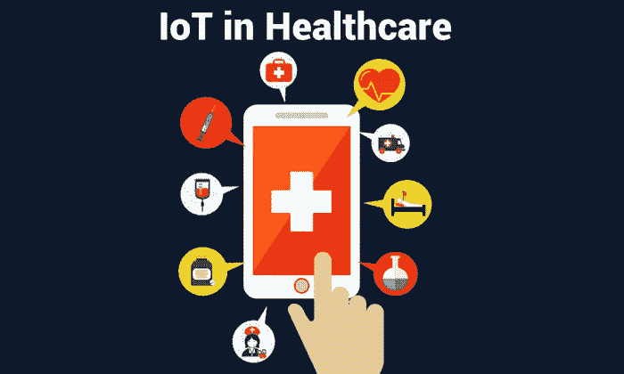
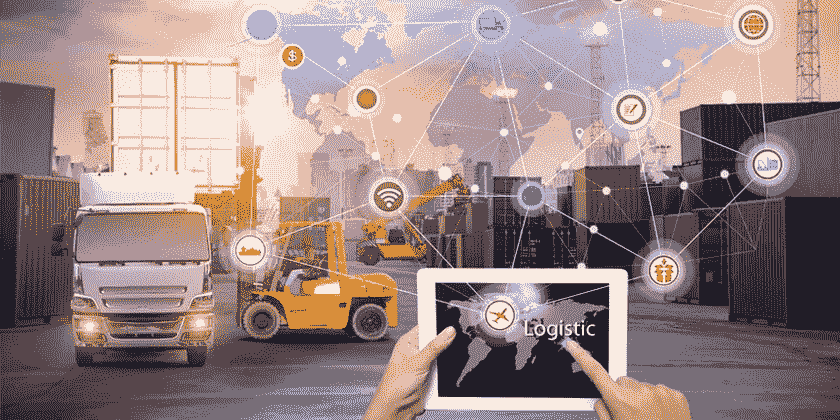

# 哪些行业大量利用人工智能应用程序开发？

> 原文：<https://medium.com/hackernoon/what-industries-are-heavily-leveraging-ai-app-development-53b111adef41>

现在，不难发现各行各业的企业应用人工智能和人工智能技术来简化他们的运营，并为做出更好的决策提供信息。有了合适的人工智能专家和合适的人工智能应用开发，几乎每个行业都可以从这项技术中获益。以下是即将被人工智能彻底改变的 10 个行业。

**1。制造**

人工智能和机器学习给制造业带来了无限可能。现在，这些技术有能力帮助企业实施预防性维护，以及时维护机器和设备，并避免任何突发故障或故障。除此之外，人工智能可以提高工作效率，减少出错几率，同时保持最高的质量标准。

**2。施工**

建筑业很少使用信息技术。即使是开发现代基础设施的公司也没有充分利用技术和软件。也许，典型的计算没有提供预期的好处。但现在许多建筑公司正在学习如何应用人工智能解决方案来推进他们的发展。借助人工智能和人工智能的能力，该领域的企业可以使各种流程更快、更安全、更具成本效益。此外，人为造成的错误将会减少，数据将为每个决策提供依据。一旦我们有了正确的人工智能解决方案，我们可能不会期望出错。

**3。医疗保健**

世界各地的医疗保健提供商都非常重视人工智能技术。例如，人工智能驱动的 X 射线可以帮助医生确定疾病。人工智能支持的神经语言编程(NLP)展示了其在药物安全方面的用途。ML 驱动的数据收集技术从每一个可能的来源收集信息，并利用这些信息来改善人类生活。人工智能的子集深度学习(DL)可以用于为个体基因组定制药物，以获得更好的结果。因此，人工智能及其子集，如 ML 和 DL，正在医疗保健行业中以多种方式使用。到目前为止，有限的医院或医疗保健提供商已经应用了人工智能、人工智能和数字图书馆，但正如预期的那样，由于这些技术的实际价值，更多的医院或医疗保健提供商将加入这一行列，为患者带来突破

**4。高级护理**

在一个年龄，老年人需要很多照顾。感谢上帝，这项技术也考虑到了这种情况。有些解决方案为独居老人提供支持和信心。当然，就目前而言，人工智能无法理解老年人的文化、身体和情感需求，但它可以实时更新信息。

**5。心理健康诊断和治疗**

如今，年轻人心理健康状况不佳越来越普遍。导致病例增加的常见因素是设备成瘾、脱离现实世界以及开始在网上孤立。当这种情况持续很长时间时，它可能会导致人们社会凝聚力的崩溃。人工智能可以识别出有抑郁或绝望风险的人，并在他们出现这些精神状况之前为他们推荐合适的治疗方法。

**6。教育**

几代人以来，基础教育的提供方式没有多大变化。但是很明显，改变是必要的；然而，也很难说应该有什么样的变化，以及学校或大学如何实现这些变化。对于教育，人工智能可以被用来为任何给定的学科建立定制的、动态的和有效的学习方法。

**7。零售**

受人工智能影响最大的一个行业是零售业；不管是线上还是线下。据 BusinessWire 的一份[报告](https://www.businesswire.com/news/home/20180131005068/en/Juniper-Research-Retailer-Spending-AI-Grow-Fourfold)显示，到 2020 年，全球零售业的支出预计将超过每年 74 亿美元。许多零售商已经开始使用人工智能技术，将它与 AR 和 VR 等其他先进技术相结合，并推出互动和动态广告方法。在网上零售中，人工智能、增强现实、虚拟现实和物联网的结合可以在顾客购买之前提供产品的可视化。此外，到 2020 年，基于人工智能和人工智能技术的聊天机器人将处理 85%的客户服务交流互动。

**8。网络安全**

企业受到网络攻击的重创。私人数据和信息的泄露会危及人们的生命。毫无疑问，组织会尽最大努力来保护他们的服务器，但是典型的方法可能会失败，特别是当攻击者使用高级入侵策略时。许多组织甚至无法衡量正确的安全措施。但人工智能具有复杂推理和自学能力，可以在很大程度上提高网络安全。

**9。商业智能**

事实证明，组织很难处理客户使用和经历的工具和流程所产生的大量数据。传统的商业智能已经显示出它的低效。但人工智能可以更好地照顾商业智能，帮助企业智能地管理数据，并及时获得其优势。人工智能可以用于设计探索数据、寻找见解和提出建议的工具。这些数据见解和建议最大限度地减少了员工对他人决策的依赖。有了人工智能，事情可以自动发生。

10。供应链管理

人工智能可以比人类更好地处理供应链相关因素和复杂的非线性和相关数据依赖性。人工智能可以通过对风险的充分评估，甚至在不对称的成本情况下，毫无偏见地预测未来。[面向供应链行业的人工智能解决方案](http://www.rapidsofttechnologies.com/artificial-intelligence.php)可以智能地管理运营并改善每一项决策

Sofia 是 Rapidsoft Technologies 的数字营销专家，Rapidsoft Technologies 是一家领先的 it 咨询公司，提供全方位的 IT 服务，包括物联网应用开发、 [ERP 软件开发](http://www.rapidsofttechnologies.com/enterprise-resource-planning-app-development.php)、人工智能应用开发和大数据应用开发解决方案。分享就是关爱！