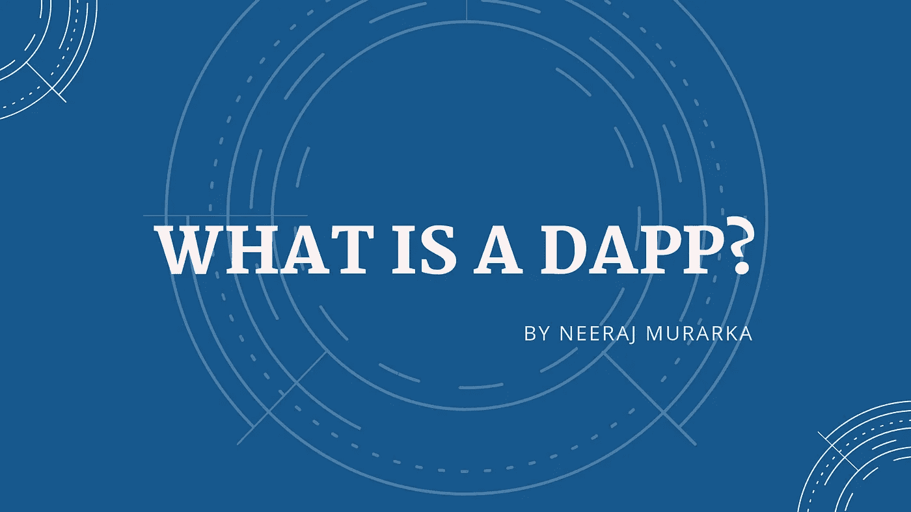
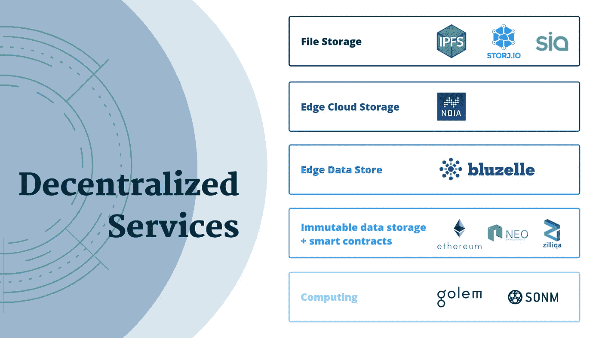

# 什么是 dApp？

> 原文：<https://medium.com/hackernoon/what-is-a-dapp-5e3d41eceac2>

对于“dApp”是什么，人们普遍缺乏明确的定义，尤其是随着近年来从比特币区块链开始的一系列技术的出现。

一些人认为 dApp 是一个运行在以太坊等区块链上的智能合约。特别是，随着 2016-2018 年 ICO 的流行，这已经成为一个被广泛接受的定义。有一种假设认为 dApp 运行在区块链上或者要求区块链运行，无论是为了智能合同、支付还是其他目的。

## **分散服务**

dApp，也称为“分散式应用”，是建立在一个或多个分散式服务上的应用。区块链是这些分散服务之一，但还有许多其他服务。那么，什么是分散式服务呢？

> **简单来说，它是一个对等网络，可以相互通信，以 P2P(对等)方式共同提供某种服务，其中没有控制网络的集中式服务器。**

P2P 网络中的每个参与服务器在网络中的“控制”和重要性方面实际上是平等的，就像一群羊或一群蜜蜂(没有女王)。通常，这样的 P2P 网络被称为集群。

**dApp 的后端逻辑可以使用以下分散服务的任意组合:**

*   文件存储( [IPFS](https://medium.com/u/30a067dbeb93?source=post_page-----5e3d41eceac2--------------------------------) 、 [Storj Labs](https://medium.com/u/31bb19d6e641?source=post_page-----5e3d41eceac2--------------------------------) 、 [Sia Tech](https://medium.com/u/96ebf78ad335?source=post_page-----5e3d41eceac2--------------------------------) 等)
*   边缘云存储( [NOIA](https://noia.network/) 等)
*   边缘数据存储器( [Bluzelle](https://medium.com/u/1ebc95e9d994?source=post_page-----5e3d41eceac2--------------------------------) 等)
*   不可变数据存储+智能合约([以太坊](https://medium.com/u/d626b3859bc9?source=post_page-----5e3d41eceac2--------------------------------)、 [NEO](https://medium.com/u/95d056302ecb?source=post_page-----5e3d41eceac2--------------------------------) 、 [Zilliqa](https://medium.com/u/6804ea3b5fcf?source=post_page-----5e3d41eceac2--------------------------------) 等)
*   计算([假人项目](https://medium.com/u/8b0d088e8160?source=post_page-----5e3d41eceac2--------------------------------)、 [SONM](https://medium.com/u/e3aa487333b3?source=post_page-----5e3d41eceac2--------------------------------) 等)

这些只是例子，并不是一个全面的清单。典型的 dApp 将被设计为对其后端使用正确的分散式服务组合。

dApp 的前端可以在手机、浏览器、信息亭等设备上运行。支持应用程序的后端决定了它是否是分散的。

## **前区块链 dApps**

在 2009 年随着比特币区块链的广泛发行，区块链被“发明”之前，去中心化应用就已经存在了。例如，在 2001 年， [Torrent 协议](https://en.wikipedia.org/wiki/BitTorrent)被创建，并导致了 P2P 客户端的发布，使得文件共享成为可能。这个版本的 Torrent 不是完全分散的，因为它仍然需要跟踪器，这是一个集中的服务器，跟踪谁拥有文件或文件的一部分。但在 2005 年，Torrent 的无轨道版本问世，该系统现在完全去中心化。Torrent 是广泛使用的应用程序的最好例子，这种应用程序是去中心化的，不使用任何区块链技术。这是早期 dApp 的最好例子。

## **集中式互联网**

实际上，dApps 仍然需要利用互联网的许多方面，这些方面仍然是集中的。这些技术包括 DNS(由中央根服务器支持)、IP 网络(由电信公司支持)和其他基础设施技术。在对 dApps 的讨论中，我们需要采取实际的立场，即这些为 dApps 所需的基本互联网服务提供动力的基础技术中的一些暂时仍将是相对集中的。我们采取的方法是，我们在互联网上使用的服务决定了我们的应用程序是否是分散的。

## **部分分权**

此外，有些应用程序只是部分分散的。例如，一些游戏可能通过 Steam 或苹果或安卓上的 AppStore 等平台提供。他们可能会被绑定到 Paypal 这样的支付网络来接受支付，尽管事实上他们将所有数据存储在分散的服务上。在许多情况下，称这些为部分分散的应用程序是可以接受的。分散式服务栈还没有完成，因此部分分散化暂时将成为现实。

## **结论**

最后，我希望这篇文章能澄清什么是 dApp，什么不是。这个定义比大多数人想象的要宽泛得多。dApp 是一种应用程序，其后端基础设施由 P2P 参与者驱动，没有集中的控制形式。