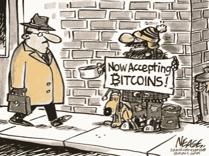
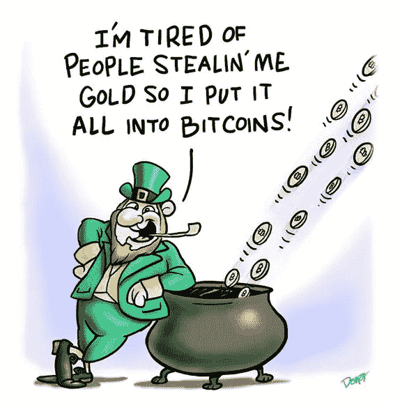
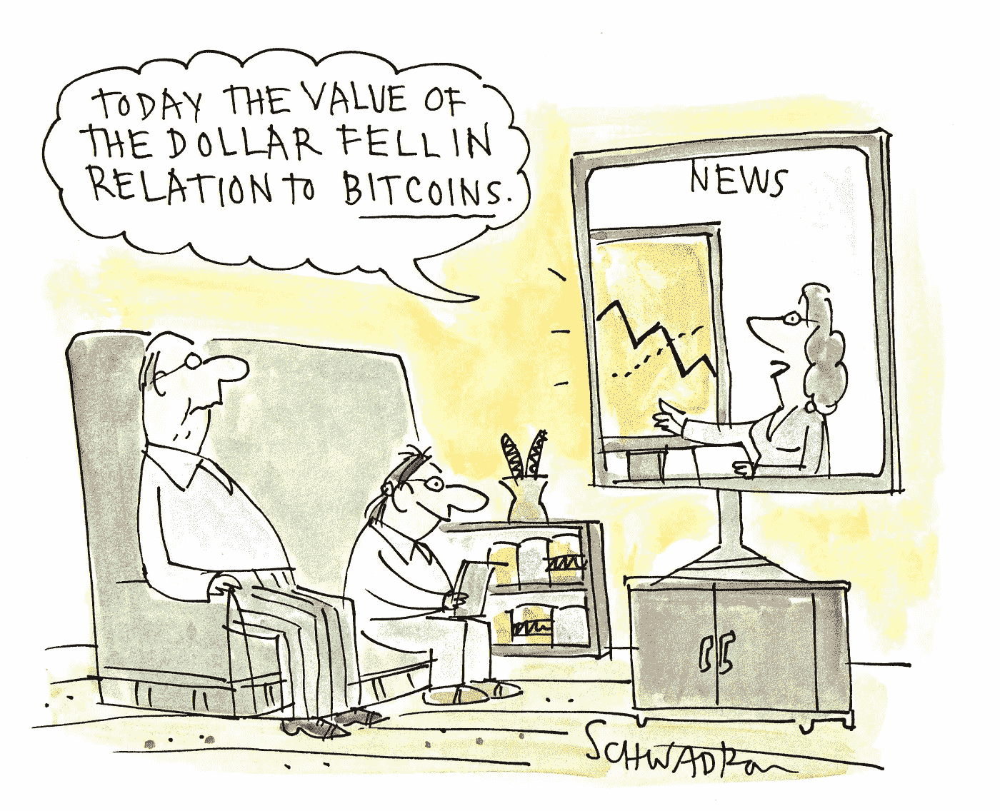

# 比特币是什么？第二部分

> 原文：<https://medium.com/hackernoon/what-is-bitcoin-part-2-e22f6184002c>

在上一篇文章中，我们确定比特币是分散的、数字稀缺的，不受任何一方控制，在一定程度上是自然的，因为任何人都可以未经许可挖掘、转移和/或存储比特币。这与集中稀缺形成了鲜明的对比，集中稀缺是受控制的和人为的，因为你需要许可来做一些或所有你可能想用稀缺物品做的活动。

在本文中，我们将把比特币的属性视为去中心化的、自然的、不受控制的货币，特别是它们与过去去中心化货币的比较。

# 货币的可取属性

赚钱的理想货币属性[方便、有用、值得持有](/@vijayboyapati/the-bullish-case-for-bitcoin-6ecc8bdecc1)。赋予货币显著便利性和有用性的属性是可分性、安全性、可识别性、便携性、持久性和可替代性。这些特性中的每一个都使货币交易更加容易，并减少摩擦。让我们看看每个属性，定义什么是好的，什么是坏的，看看比特币是如何累积的。

## 可除性

可分割的货币允许交易中的精确性。不太容易分割的钱是不方便的，因为交易的一方最终会价值稍低。因此，货币具有良好的可分性是一个主要的优势。

不太容易分割的东西就像昂贵的棒球卡。一张卡的各个部分的交易比例不同，因此用它交易很不方便。非常容易分割的东西是美元，当使用实物现金时，它仍然可以被分割到一分钱。

比特币可以被分割成 1/100，000，000 个比特币，或者大约 0.000035 美元，作为链上的最小单位。闪电通道允许更精细的分割，精确到 1/1000 或 0.000000035 美元，亚当·贝克指出，大约是一粒[沙子](https://twitter.com/adam3us/status/1077024497939685376)的成本。这是美元环比可分性的 300 倍，是美元闪电通道可分性的 300，000 倍。

## 安全性

安全意味着钱很难被其他人占有。好钱应该比较难拿走或者没收。实物黄金很难被没收，因为实物黄金必须被找到并被取走，但美国银行账户中的钱并不难取走。事实上，政府一直在没收银行账户中的美元，以此来阻止他们认为的不良行为。

一般来说，任何依赖于第三方的东西比不记名票据更容易被没收。比特币是一种不记名工具(也就是说，占有实际上意味着所有权，而不是一些第三方登记处所说的)，因此不太容易被没收。

此外，因为比特币可以通过脚本来保护，所以比特币可以通过多种方式来保护，包括 m-of-n multisig、timelocks 等等。相比黄金等实物资产，保护比特币的选择要多得多。

注意，尽管其他智能契约语言可能提供更多关于实际锁定机制的选项，但是如果没有真正的去中心化，这种能力是没有用的。以太坊上的 DAO 以多种方式进行保护，但是当一个聪明的合同律师想出一种以特定方式获取 ETH 的方法时，整个链都被改变了，从而使该交易无效。这是第三方决定某人是否拥有这笔钱，这与美国银行账户没有什么不同。

此外，安全性必须是可证明的。这是 DAO 的另一个问题，因为它的复杂性是压倒性的，而且契约很容易以一种创造者不希望的方式执行。由于复杂性而容易丢失的钱根本不安全。

## 可识别性

可识别性意味着货币易于识别，难以伪造。黄金相对容易识别，因为有很好的化学测试来验证它是不是黄金。众所周知，像音乐会门票这样的东西很难核实，也很容易伪造。

可识别性与生产商品的成本密切相关。如果货币的生产成本很高，试图伪造通常是不经济的。如果货币的生产成本很低，就有试图伪造货币的经济动机。因此，非常难以生产的黄金通常具有良好的可识别性。音乐会门票是纸片，这使得伪造非常容易，从而妨碍识别。

也就是说，即使是大金条，也有办法让金条看起来像黄金，但[不是 100%黄金](https://www.businessinsider.com/tungsten-filled-gold-bars-found-in-new-york-2012-9)。比特币没有这个问题，因为可识别性是基于工作证明的。

比特币很难生产，因为很难找到工作证明。伪造比特币意味着隔离一个节点，并给它提供与主链不同的昂贵的工作证明。由于各种原因，这是一种非常难以实现的攻击，并且通常不经济，这就指出了比特币是如何被识别的:通过查看任何块浏览器或完整节点来识别比特币。由于工作证明非常昂贵，伪造这些数据非常困难，因此比特币很容易被识别。

## 轻便

可携带性意味着钱易于运输。例如，香料曾经具有很高的价值密度，因此在贸易中非常有用。这意味着香料有很好的便携性。另一方面，土地很难运输或缺乏便携性，因此是一笔可怕的钱。

便携性与高价值密度相关。这往往与物理项目的可分性相反。黄金具有很高的价值密度，但这也使得它不太容易分割，至少在识别上是如此。

极端的数量会妨碍便携性，即使某些东西价值非常高。即使是像 100 美元钞票(大约重 1 克)这样价值高的东西也会很快失控。100 美元钞票中的 500 万美元重达 100 多磅！对于数十亿的巨量来说，没有机器的帮助，任何人都不可能合理地希望搬运这些东西。

比特币本质上具有无限的价值密度，因为比特币没有重量。即使使用类似物理硬件钱包的东西，价值和重量也没有关联，因为任何私钥都可以包含任意数量的比特币。事实上，比特币可以以数字方式发送，这也意味着不需要物理传输私钥。比特币可以以电子邮件的速度发送到世界各地，优于其他任何无记名工具。

## 持久性

持久性是货币媒介不退化的能力。黄金具有很强的耐用性，因为它不会与任何其他化学物质发生反应。另一方面，像鲭鱼这样的东西(自从禁止吸烟以来就在监狱里使用)，一段时间后就会变坏，因此不太耐用。

耐用性在传统上意味着物理上的耐用性，当然，这也是金银作为货币的优势所在。不幸的是，随着时间的推移，即使是金条的重量也会随着黄金的剥落而下降。

在比特币中，耐久性不是物理耐久性本身，而是账本的耐久性。由于比特币不是中央控制的，比特币的持久性近乎无限。对于集中控制的总账来说，硬币不能说是那么耐用。毕竟，中央第三方可以随时删除或者[窃取你的币。只要比特币保持去中心化，它就是耐用的。](https://www.reddit.com/r/Bitcoin/comments/7jj5pc/wow_new_garzik_bitcoin_fork_set_up_to_steal/)

## 可替代性

可替代性是指两个项目本质上不可区分的能力。美元和黄金是可以互换的，而钻石并不是因为每种宝石都是独一无二的。

完美的可替代性极其困难，因为人类对几乎所有事物都有偏好。即使在黄金的例子中，1 盎司和 1 盎司在任何地方都应该是一样的，也有细微的差别。纯度为 99%的酒吧交易价格会比纯度为 99.99%的酒吧稍低。这种溢价甚至存在于每一个金原子的基础上。表面上的原因是很难获得金条形式的 99.99%的纯金，因此这种金条更为罕见。

即使是美钞，崭新、干净的 100 美元钞票也会比旧的皱巴巴的钞票溢价交易。这是因为在许多第三世界国家，这些钞票被用作礼物，如果可能的话，人们希望将更好、更脆的钞票作为礼物。

对于比特币来说，有某些类似 coinbase 输出的比特币是首选的，交易溢价。可能与犯罪活动有关的其他产出可能会折价交易。协议本身并不区分硬币，但人们可以区分，除非每个硬币都完全隐藏了隐私，否则完美的可替代性是不可能的。

也就是说，比特币具有合理的可替代性，而且到目前为止，市场上还没有太多比特币因为来源而受到歧视的例子。

# 结论

比特币优于过去的其他货币形式有很多原因。坚如磐石的货币政策、可分割性、安全性、可识别性、可携带性、持久性和可替代性与以前存在的任何其他货币形式不相上下，甚至更好。

此外，这些都不是替代硬币自动拥有的属性。在有集中开发团队的硬币上，安全性和耐用性尤其令人怀疑，因为两者都需要信任第三方。比特币是真正更好的分散货币，而所有其他觊觎王位的人都不是。