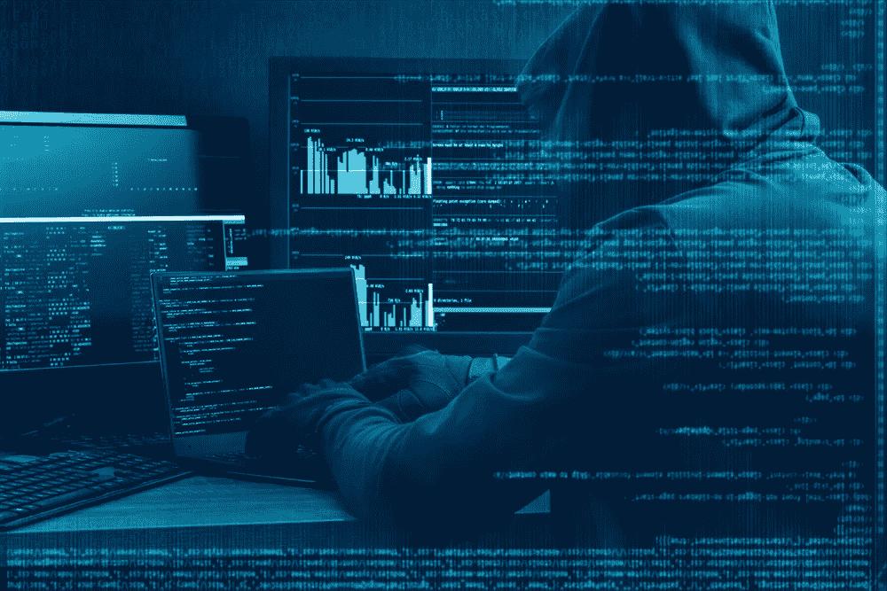

# 什么是黑客？常见目标、类型以及如何防范

> 原文：<https://medium.com/hackernoon/what-is-hacking-common-objectives-types-and-how-to-guard-against-it-ab99897ff00b>

黑客攻击是未经授权进入计算机系统或一组计算机系统的过程。这是通过破解进入系统的密码和代码来实现的。破解是一个术语，指的是获取密码或代码的方法。从事黑客活动的人被称为黑客。黑客可以攻击单个系统、一组系统、整个局域网、网站、社交媒体网站或电子邮件帐户。黑客通过密码破解算法程序获得对密码的访问。

不言而喻，大多数个人以及商业协会使用电脑和笔记本电脑来满足他们的日常需求。特别是对于(任何形式的)组织来说，拥有一个计算机网络、域或网站、广域网( [WAN](https://www.techopedia.com/definition/5409/wide-area-network-wan) )来实现信息和业务应用的无缝流动是必不可少的。因此，这些网络面临外部世界黑客攻击的高风险。

# **黑客攻击的目标**

通常情况下，黑客的意图大多是恶意的，即犯罪或恶意的意图，要么实施一些欺诈，要么对被黑客攻击的个人、团体或实体造成一些财务或名誉损害。这是通过[窃取机密数据](https://digitalguardian.com/blog/what-insider-data-theft-data-theft-definition-statistics-and-prevention-tips)或盗用资金或其他货币资源**、**造成业务中断、传播不正确和恶意的谣言、其他对社会有害的误导信息来实现的。很多时候，黑客也被定义为一种可依法惩处的网络犯罪。

然而，黑客攻击的另一面是由认证机构和政府法律机构在专业水平上进行的。这是为了对抗黑客的错误意图或防止对个人、团体或协会造成任何伤害。这也是为了公民和整个社会的安全和保护。

# **黑客的类型**

为了详细说明上述黑客攻击的目标，有必要了解网络部门中有哪些类型的黑客，以便区分角色和目标。

## **裂解器**

也被称为黑帽，这些类型的黑客总是怀有恶意，他们以未经授权的方式访问计算机网络和网站。其目的是通过窃取机密组织数据、从在线银行账户中窃取资金、侵犯隐私权以使犯罪组织受益等方式谋取私利。在今天的情况下，大多数黑客都属于这一类，并以不正当的方式进行他们的活动。

## **道德黑客**

也被称为白帽，他们是公认的和官方盖章的黑客谁进入系统，以评估，以确定和消除可疑的弱点。其他职责包括漏洞评估，破解非法或[反社会设置的代码](https://en.wikipedia.org/wiki/Anti-social_behaviour)，检索安全所需的关键数据。这些都是训练有素，认证和支付专业人员。

## **灰色帽子**

他们介于上述类型的黑客之间，即他们采取未经授权访问系统的手段，但没有任何欺诈意图。目标是揭示系统利益相关者的弱点和缺陷。

## **黑客行动主义者**

这些黑客专注于黑客网站，并在这些网站上留下有争议的信息。这是为了传播政治、社会和宗教信息。这也可以采取针对其他国家的形式。

# **黑客攻击的类型**

黑客攻击最常见的威胁之一是网站面临的威胁。常见的情况是，某个特定的网站或在线帐户被黑客利用未经授权的访问故意打开，其内容被更改或公开。政治或社会组织的网站经常成为反对他们的团体或个人的目标。政府或国家信息网站被黑客攻击也并不少见。[网站黑客](https://hackernoon.com/how-i-hacked-40-websites-in-7-minutes-5b4c28bc8824)中一些众所周知的方法有:

## **网络钓鱼**

这意味着复制原始网站，使不知情的用户输入信息，如帐户密码，信用卡细节，黑客抓住和滥用。银行网站经常成为攻击目标。

## **病毒**

一旦黑客进入网站，它们就会被发布到网站的文件中。目的是破坏网站上的信息或资源。

## **UI 补救**

在这种方法中，黑客创建了一个虚假的用户界面，当用户点击某个网站时，他们会被直接带到另一个网站。

## **饼干失窃**

黑客使用恶意代码访问网站，窃取包含机密信息、登录密码等的 cookies。

## **DNS 欺骗**

这基本上使用了用户可能已经忘记的网站或域的缓存数据。然后，它将数据定向到另一个恶意网站。

# **如何防范黑客攻击？**

黑客攻击是一种持续的威胁，影响着一个国家及其公民的安全。在个人层面上，它有时会抹去一个人辛辛苦苦挣来的全部积蓄，从而造成数不清的经济损失。在组织层面，它导致了数据失窃，从而导致重大的财务损失和长期影响。当务之急是在适当的时候在各级采取保障措施，以封锁这一邪恶的威胁。

[虚拟专用网络(VPN)](https://www.techopedia.com/definition/4806/virtual-private-network-vpn) 是一种协议，通过这种协议，企业网络可以通过点对点隧道连接到异地和远程位置。VPN [资源](https://vpnpro.com/vpn-reviews/expressvpn-review/)如 ExpressVPN，安全覆盖发送和接收 IP 地址，从而防止任何黑客进行任何未经授权的入侵。此外，通过该隧道的任何数据传输都受到非常高级别的加密，从而防止任何种类的泄漏。通常，安全防火墙位于网络的多个级别，安全策略在最高级别定义，导致接近 100 %的安全覆盖。

VPN 也可以由互联网安全提供商(ISP)通过公共云上的私有隧道提供。这用于企业组织的多点和多位置连接。