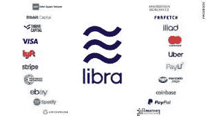

# 天秤座是什么&不是什么

> 原文：<https://medium.com/hackernoon/what-is-libra-what-it-is-not-f21441cfd019>

天秤座是:

*   旨在成为全球消费者和零售商的交流媒介
*   由会员控制的私人区块链
*   由一篮子其他资产支持的资产

天秤座不是:

*   抵制审查
*   免受央行货币政策的影响

从天秤座 ***是什么*** 开始，我将重点介绍它作为可交易资产的特征。(迄今为止，大部分评论都集中在脸书试图抓住全球数十亿消费者交易的大胆尝试上，也有很多关于缺乏去中心化的文章。我承认，我非常担心他们收集这么多权力和个人数据，我也看到了 Libra 财团对使用硬币的交易的潜在控制问题。也就是说，我将把这些问题留给其他人来讨论，但是，相反，我将关注其设计中潜在的监管和交易问题。)

要理解我为何认为 Libra 能否逃脱美国的监管问题还远未明朗，不妨想想 Libra 是如何运作的。它是一种可交换资产，在许多方面很像一篮子货币的交易所交易基金(ETF)，只是 Libra 不会在受监管的交易所交易。它有一个创建或赎回 Libra 令牌单位的机制，与 ETF“授权参与者”(APs)的做法非常相似。Libra 还将在(加密)交易所交易，依靠做市商(通常是 AP)和套利者来保持交易价格与其基础价值一致，这与 ETF 相同。事实上，它非常像一只 ETF，如果美国证交会不打算至少声明自己对 Libra tokens 市场拥有管辖权，我会感到震惊。

反对 SEC 管辖权的主要论点是，由于它可能主要由美元支持，因此很难证明美国投资者会为了“利润预期”而交易 Libra。坦率地说，这种说法听起来有些空洞，因为它不会 100%由美元支持，而且有许多交易所交易基金是由一篮子货币支持的。尽管如此，无论证交会是否干预，Libra 的交易机制在目前的情况下都存在潜在问题。

目前的主要问题是，与 ETF 不同，虽然 Libra 声称他们希望有一个交易所“网络”来交易硬币，但这种交易所合作只是以有限的形式存在，通过 CoinRoutes 等专用网络。如今，即使在流动性最强的加密资产中，不同交易所的价格之间也经常存在巨大的价格差异。因此，投资者通常会承受巨大的成本，因为许多人一次在一个加密交易所进行买卖。

因此，虽然该项目有很大的前景，但交易成本(以投资者自己的货币进行)往往会受到 Libra 偏离“公平”价值的影响，这在分散的市场中很常见。(这是交易所费用和买卖差价之外的费用。)应该说明的是，创建 CoinRoutes 是为了帮助投资者解决这一系列问题，但在我写这篇文章时，我们还不是 Libra 财团的成员…

至于天秤座是什么 ***不是*** ，它不是一个非主权价值储存库。事实上，它明确地将其价值与主权货币挂钩。因此，从积极的一面来看，那些对本国货币缺乏信心的地区的人们可能会对天秤座的保值能力更有信心。然而，硬币的所有用户仍将受到外汇波动的影响。

也许更重要的是，Libra 项目并没有减少比特币作为唯一一种不能基于主权实体的突发奇想而印刷的货币的宏观案例。(当然，除非比特币被加入“篮子”，并增长到相当大的份额……)

对 Libra 来说，更恰当的比喻不是比特币的替代品，而是它是一种私人市场的全球货币，与国际货币基金组织(IMF)创造的特别提款权(SDR)没有什么不同。特别提款权也由一篮子主权货币支持，由国际货币基金组织及其成员国使用。

然而，与 SDR 不同的是，Libra 是一个私有的解决方案，具有潜在的更高的利用率。因此，这可能预示着货币权力从央行转移，因为 Libra 基金会(及其下属机构)可能有很大的权力通过改变货币在篮子中的权重来让货币贬值。我怀疑这种力量会引起这些中央银行和每个国家的国家监管机构的注意，但只有时间能证明一切。

最后，这个故事还远没有结束。这是迈向商业和资本市场不可避免的数字化的众多步骤之一，我很高兴看到它将走向何方。